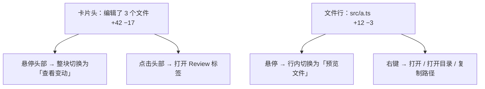
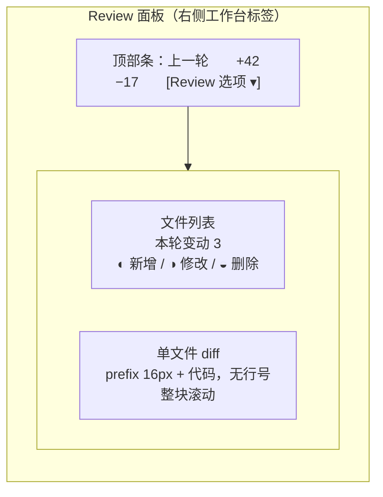

# 审阅 UI 对齐 NewMax —— 设计稿

> 状态：**已确认并实施**（2026-09-08）。用户裁定：两处确认；去掉目录分组；**保留行号**；超大文件按 NewMax（无分页）。
> 目标：把 SYNC-THINK 的「审阅文件」入口与 Review 面板，按 NewMax 的真实实现重做。

## 0. 结论摘要

用户反馈两处「很难看」：

1. 对话流里的**文件变动卡片 + 「审阅文件」按钮**
2. 点进去之后的**右侧 Review 面板**

根因（代码层已核实）：

| 症状 | 现状实现 | 与 NewMax 的差距 |
|---|---|---|
| 入口笨重 | 卡片右上角常驻绿色药丸按钮「审阅文件」 | NewMax 无独立按钮，**悬停标题区**切换为「查看变动」 |
| 多一步点击 | `DeferredFileDiff` 必须点「读取差异」才出内容 | NewMax **直接展示行级 diff** |
| 翻页 | 每 80 行一页，「上一页 / 下一页 / 文件开头」按钮堆叠 | NewMax **无分页概念**，整体滚动 |
| 三态切换 | 「差异 / 修改前 / 修改后」按钮组 | NewMax 是**单文件 diff 模式**，无此切换 |
| 行号占宽 | 双列行号（old/new）+ 前缀 + 代码 | NewMax **只有 16px 前缀列，无行号** |
| 缺显示选项 | 无 | NewMax 顶部「Review 选项」：自动换行 / 单词级差异 / 显示空白字符 |

---

## 1. 事实基线（证据来源）

> 以下均为**从 NewMax 实际产物中提取**，非推测。

### 1.1 入口：文件变动卡片

来源：NewMax 内置帮助文档「操作步骤：查看 AI 修改的文件」原文。

- 回复下方显示「**编辑了 N 个文件**」卡片
- 标题下方汇总本轮**绿色新增行数和红色删除行数**；**悬停标题时切换为「查看变动」**
- 每个文件行显示各自增删量；普通文件悬停时切换为「**预览文件**」，HTML/HTM 切换为「在浏览器中打开」
- 点击**卡片标题区域**或「审阅文件」→ 右侧工作台打开独立 Review 标签
- 同一条回复重复打开同一 Review 会**回到原标签**，不重复创建
- 本轮**只有图片/二进制**时，标题下方按格式显示摘要，**不显示「审阅文件」**
- **只有一个文件**时，标题和对应打开操作可直接打开；**多个文件**时头部只提示选择文件，需点具体文件行

### 1.2 Review 面板

来源：同上帮助文档第 4–7 条。

- **单文件 diff 模式**：顶部显示「**上一轮**」和本轮总增删行数
- 右侧复用文件列表组件，标题固定为「**本轮变动 N**」，只使用该轮**精确快照**，用**状态图标**区分新增 / 修改 / 删除
- 点击侧栏文件 → 切换该文件的**行级 diff**；文件名悬停提示显示完整路径
- Review 与普通文件管理器**分别保存状态**
- 顶部「更多」菜单 = **Review 选项**，三项显示设置：
  - **自动换行**（默认开启）
  - **单词级差异**（突出同一行内具体变化的词）
  - **显示空白字符**（空格 / Tab 显式标记）
  - 勾选表示已开启；**关闭自动换行后**用底部横向滚动条查看超宽长行
- 提供「撤销 / 还原」，整轮安全撤销（磁盘内容变化时停止，不覆盖新改动）
- Review 工作区内**不重复显示撤销入口**（卡片里有）

### 1.3 diff 视觉规格（NewMax 真实 CSS 原文）

来源：`app.asar` → `out/renderer/assets/globals-SVOa807H.css`，`.newmax-diff-*` 规则原文照录。

```css
.newmax-diff-view {
  font-family: ui-monospace, SFMono-Regular, Menlo, Monaco, Consolas, "Liberation Mono", "Courier New", monospace;
  font-size: 0.75rem;        /* 12px */
  line-height: 1.5;
  max-height: 300px;
  overflow-y: auto;
  overflow-x: auto;
  padding: 8px 0;
  background: var(--ds-on-surface);        /* rgba(55,61,58,0.06) */
  border-radius: var(--ds-radius-md);      /* 12px */
}
.newmax-diff-line { display: flex; white-space: pre-wrap; word-break: break-all; }
.newmax-diff-prefix {
  flex-shrink: 0; width: 16px; text-align: center; user-select: none;
  color: var(--ds-text-secondary);
}
.newmax-diff-text { flex: 1; min-width: 0; }
.newmax-diff-equal  { color: var(--ds-text-secondary); }
.newmax-diff-delete { background: var(--ds-danger-bg); }   /* danger 8% 混 surface */
.newmax-diff-delete .newmax-diff-prefix,
.newmax-diff-delete .newmax-diff-text { color: var(--ds-danger); }
.newmax-diff-insert { background: var(--ds-success-bg); }  /* success 8% 混 surface */
.newmax-diff-insert .newmax-diff-prefix,
.newmax-diff-insert .newmax-diff-text { color: var(--ds-success); }
.newmax-diff-separator {
  text-align: center; font-style: italic; color: var(--ds-text-secondary);
  font-size: 11px; padding: 4px 0; margin: 4px 0;
  border-top: 1px dashed var(--ds-on-surface);
  border-bottom: 1px dashed var(--ds-on-surface);
}
```

**关键事实：NewMax 的 diff 没有行号列。** 已在打包代码中确认无 `lineNumber` / `oldLine` / `newLine` 标识符；行结构只有 `prefix`(16px) + `text`。

### 1.4 设计 token 对照（NewMax light 主题实测值）

| 用途 | NewMax `--ds-*` | SYNC-THINK `--color-*` | 是否一致 |
|---|---|---|---|
| 正文 | `#181b19` | `--color-text: #181b19` | ✅ 完全相同 |
| 次要文字 | `rgba(24,27,25,.64)` | `--color-text-secondary: #666763` | ≈ 近似 |
| 弱化文字 | `rgba(24,27,25,.48)` | `--color-text-faint: #8c8c87` | ≈ 近似 |
| 品牌主色 | `#2d4739` | `--color-accent: #2f9b5b` | ❌ 不同（NewMax 更深） |
| 危险 | `#b64a34` | 需核对 `--color-danger` | 待对齐 |
| 成功 | `#287d46` | `--color-success: #2f9b5b` | ❌ 不同 |
| 表面 100/200 | `#ffffff` / `#faf9f5` | `--color-surface: #faf9f5` | ✅ 部分一致 |
| 叠加层 | `rgba(55,61,58,.06)` | — | 需新增 |
| 圆角 | sm 8 / md 12 / lg 18 / xl 24 / pill 64 | 14px 硬编码在卡片上 | 需改用 token |
| 动效 | fast 180ms / base 240ms；`cubic-bezier(0.22,1,0.36,1)` | — | 需统一 |

---

## 2. 现状差距（SYNC-THINK 代码位置）

| 文件 | 现状 |
|---|---|
| `apps/desktop/src/renderer/shell/ExecutionProcessBlock.tsx:640-652` | 卡片头：「已更改 N 个文件」+ 行数 + 常驻药丸按钮「审阅文件」 |
| `apps/desktop/src/renderer/shell/RightDock.tsx:637+` | Review 面板：`shell-review-list`（按目录分组）+ `shell-review-empty` |
| `apps/desktop/src/renderer/shell/DeferredFileDiff.tsx` | 三态按钮 + 「读取差异」+ 分页导航 + 双行号 diff |
| `apps/desktop/src/renderer/shell/shell.css:17895+` | `.shell-changes-card` 系列（border 1px + 14px 圆角 + 绿色药丸） |
| `apps/desktop/src/renderer/shell/shell.css:31330+` | `.shell-review-panel` / `.shell-review-list` 系列 |

---

## 3. 设计方案

### 3.1 变动卡片（入口）——严格对齐 NewMax



改动点：

1. 文案「已更改 N 个文件」→ **「编辑了 N 个文件」**
2. **删除常驻药丸按钮**，改为**悬停卡片头时整块显示「查看变动」**
3. 行数用 NewMax 语义：`+N` 用 `--ds-success`，`−M` 用 `--ds-danger`，等宽数字
4. 文件行悬停时右侧切换为「预览文件」（HTML/HTM → 「在浏览器中打开」）
5. 卡片头整体可点击（`role="button"`），不再依赖小按钮
6. 仅图片/二进制时**不渲染**该入口，改显示类型摘要
7. 单文件时头部即直接打开，不显示文件行

### 3.2 Review 面板——严格对齐 NewMax



改动点：

1. 顶部条固定显示「**上一轮**」+ 本轮总 `+N −M`；右侧「**Review 选项**」菜单
2. 「Review 选项」菜单三项：**自动换行**（默认开）/ **单词级差异** / **显示空白字符**
3. 文件列表标题「**本轮变动 N**」+ **状态图标**区分新增/修改/删除
4. 点击文件 → **直接渲染该文件行级 diff**，移除「读取差异」按钮与分页导航
5. diff 行结构改为 **`prefix(16px) + text`，去掉双行号列**
6. 移除「差异 / 修改前 / 修改后」三态按钮（NewMax 无此模式）
7. 保留 SYNC-THINK 已有且 NewMax 也有的：**撤销 / 还原**、会话级审阅（`conversationReview`）
8. 超大文件：**自动**懒加载后续内容（滚动到底部续读），**不暴露「读取差异」按钮**

### 3.3 交互规格

| 交互 | 行为 |
|---|---|
| 卡片头悬停 | 标题区整块换成「查看变动」，指针 `cursor: pointer` |
| 卡片头点击 | 打开 / 聚焦右侧 Review 标签（同轮重复点击回原标签） |
| 文件行悬停 | 右侧换成「预览文件」/「在浏览器中打开」 |
| 文件行点击 | 打开文件预览（不是打开 Review） |
| Review 列表点击 | 切换该文件 diff，**无加载按钮** |
| 自动换行关闭 | diff 区底部出现横向滚动条 |
| 撤销冲突 | 沿用现有「磁盘内容已变化，停止撤销」文案 |

---

## 4. 视觉规格（落地用）

```css
/* 对齐 NewMax --ds-* 的本地映射（建议加到 tokens.css） */
--review-diff-font: ui-monospace, SFMono-Regular, Menlo, Monaco, Consolas, monospace;
--review-diff-size: 12px;          /* 0.75rem */
--review-diff-line-height: 1.5;
--review-diff-pad: 8px 0;
--review-diff-radius: 12px;        /* --ds-radius-md */
--review-diff-bg: rgba(55,61,58,0.06);   /* --ds-on-surface */
--review-diff-prefix-w: 16px;
--review-diff-danger-bg: color-mix(in srgb, #b64a34 8%, var(--color-surface));
--review-diff-success-bg: color-mix(in srgb, #287d46 8%, var(--color-surface));
--review-diff-danger-fg: #b64a34;
--review-diff-success-fg: #287d46;
--review-motion: 240ms cubic-bezier(0.22, 1, 0.36, 1);
```

尺寸速查：

| 元素 | 值 |
|---|---|
| diff 字号 / 行高 | 12px / 1.5 |
| prefix 列宽 | 16px，居中，不可选中 |
| diff 区内边距 | 8px 0 |
| diff 圆角 | 12px |
| 分隔行（"… N more lines"） | 11px 斜体、虚线上下边 |
| 卡片圆角 | 12px（原 14px） |

---

## 5. 实施清单

| # | 任务 | 文件 |
|---|---|---|
| 1 | 卡片头文案与悬停切换「查看变动」 | `ExecutionProcessBlock.tsx` |
| 2 | 移除常驻药丸按钮，头部整体可点 | `ExecutionProcessBlock.tsx` |
| 3 | 文件行悬停切换「预览文件 / 在浏览器中打开」 | `ExecutionProcessBlock.tsx` |
| 4 | 仅二进制时不渲染入口，改类型摘要 | `ExecutionProcessBlock.tsx` |
| 5 | Review 顶部条：「上一轮」+ 总增删 + Review 选项菜单 | `RightDock.tsx` |
| 6 | 三项显示设置（自动换行 / 单词级差异 / 显示空白字符） | `RightDock.tsx` + `review-view.ts` |
| 7 | diff 改为 prefix+text 无行号结构 | `DeferredFileDiff.tsx` |
| 8 | 移除三态按钮与「读取差异」按钮，改为自动加载 | `DeferredFileDiff.tsx` |
| 9 | 列表状态图标（新增/修改/删除） | `RightDock.tsx` |
| 10 | token 落地 + 样式重写 | `tokens.css` + `shell.css` |
| 11 | 更新对应测试断言 | `*.test.tsx` |

---

## 6. 待确认项 → 裁定结果

1. **截图内容**：✅ 确认就是这两处。
2. **文件列表分组**：✅ 去掉目录分组，改为平铺 + 状态图标。
3. **行号取舍**：✅ 保留行号；实现为「Review 选项」里的开关，默认开启。
4. **超大文件**：✅ 按 NewMax——移除分页，改为滚动到底自动续读。
5. **品牌色**：未统一（本次不动 `--color-accent`）。

## 7. 实施结果（2026-09-08）

| # | 实施项 | 落点 | 状态 |
|---|---|---|---|
| 1 | 卡片头文案「编辑了 N 个文件」+ 悬停切换「查看变动」 | `ExecutionProcessBlock.tsx` | ✅ |
| 2 | 移除常驻药丸按钮，头部整体可点 | `ExecutionProcessBlock.tsx` | ✅ |
| 3 | 文件行悬停切换「预览文件」 | `ExecutionProcessBlock.tsx` | ✅（HTML 的「在浏览器中打开」未做，缺 IPC） |
| 4 | 仅二进制时不渲染入口 | — | ⛔ 协议无二进制标记，未做 |
| 5 | Review 顶部条「上一轮」+ 总增删 + 选项菜单 | `RightDock.tsx` | ✅（已有，保留） |
| 6 | 显示设置：自动换行 / 单词级差异 / 显示空白字符 / 显示行号 | `RightDock.tsx` + `word-diff.tsx` | ✅（多一项行号开关） |
| 7 | diff 行结构 prefix + text | `DeferredFileDiff.tsx` | ✅（按用户要求保留行号列） |
| 8 | 移除三态与「读取差异」按钮，自动加载 + 滚动续读 | `DeferredFileDiff.tsx` | ✅ |
| 9 | 列表状态图标（新增/修改/删除） | `RightDock.tsx` | ✅ |
| 10 | 样式对齐 NewMax `.newmax-diff-*` 规格 | `shell.css`（末尾追加段） | ✅ |
| 11 | 更新测试断言 | 4 个测试文件 | ✅ 49 passed |

**单词级差异**：新增 `word-diff.tsx`，按 token（标识符/数字/空白/标点）做 LCS，配对 del/add 行后只高亮变化片段；开启时该行改用纯文本渲染（避免与 hljs 冲突）。
