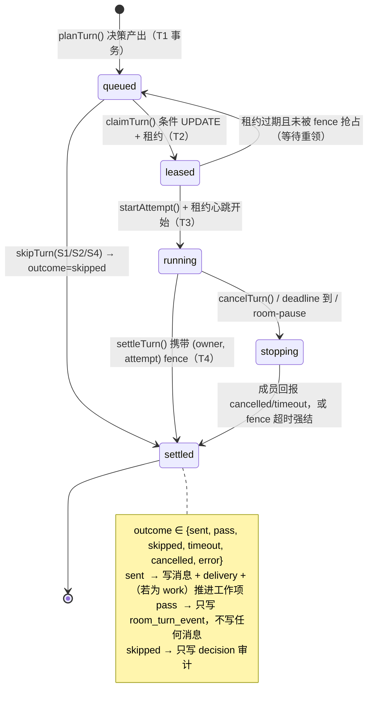

# OV3｜Turn 编排重构方案（SYNC-THINK 本地优先版）

- 范围：把现有「coordinator 派工」执行模型，改造成 Grok Bot 式的**逐成员 turn 编排**模型。
- 硬前提：SYNC-THINK 是**本地优先桌面应用**（单机 + SQLite + daemon 常驻 + 人在环），**没有云端 Temporal**。本方案必须给出**本地等价物**，并逐条说明与 Grok Bot 服务端的等价性与差异。
- 复用资产（不得推翻）：`docs/adr/0004-task-room-execution.md` 定义的消息 / 工作项 / attempt / checkpoint / artifact / receipt / 幂等收据模型。
- Grok Bot 参考（只读引用）：`docs/research/grok-bot/01-communication-and-groupchat.md`（协议字段级）、`04-dynamic-membership.md`、`07-verification-report.md`。
- 本文只做**设计**；不改任何代码。写入范围：本文件 + `.tmp-grok-bot/scripts/`。

**证据说明**：本文对**现状**的一切断言均来自对仓库现有代码的只读检查，逐条带 `文件:行`；对**目标**的描述是设计提案，不是既有实现。凡属推测处显式标注"未证实/推断"。评审时请优先核对 §8.5 的文件清单与 §9 的用例是否与现状断言一致。

---

## 0. 一句话结论

现状之所以"很差劲"，根因不是缺功能，而是**没有一层"谁该说话"的持久化编排实体**：`CollaborationChatService.send()` 在内存快照里把"谁被地址到"直接翻译成"给谁建一个 task+attempt"（`collaboration-chat-service.ts:219-233`），兜底永远是 coordinator（`:1037`），而"不说话"这件事在协议里**无法表达**——于是每次派工都必然产生一次生成、一次唤醒、一次汇报，房间只能靠消息计数（`withinLoopBudget`，`:1051`）勉强刹车。

本方案新增一层**持久化 turn 编排**：SQLite 表 `room_turn`（+ `room_turn_decision` / `room_turn_event` / `room_quota`）作为 turn 的**持久工作流实体**，由 daemon 内的 `RoomTurnScheduler` 单写者驱动，用**租约 + fencing + nonce + 幂等键**替代 Temporal 的"持久执行 + 活动重试"，并复用现有 `step` 表已经在用的那套租约形态（`schema/orchestration.ts:106-117`、`orchestration/scheduler.ts:76,896`）。派发决策是一个**纯函数**，优先级链固定为 `@ > 回复继承 > 当前负责人 > 触发条件 > 不派`；`PASS` 与 `SKIPPED` 成为一等结果，**产生零条聊天消息、零次唤醒**。收敛由四道闸（hop / 预算 / 期限 / 静默期）在**持久计数器**上强制，`wind-down` 是一等字段而不是超时。

**最大不兼容点（一句话）**：现状的默认结局是"一定派给 coordinator"，新模型的默认结局是"**不派**"，且"派了但对方弃权（PASS）"与"没派"必须在数据上可区分、在 UI 上可解释、在预算上可计数。所有 `queueRoomFollowups` / `queueSummaries` 式的"必然唤醒"都必须删除。

---

## 1. 目标模型：谁发起一个 turn

### 1.1 候选方案与选择

| 方案 | 为什么不选 |
|---|---|
| A. **渲染进程 scheduler** | 窗口可关；`use-collaboration-chat.ts` 只是显示层；把编排放客户端会与 daemon 的"唯一调度者"约定冲突（`runtime.ts:18941-18957`）。 |
| B. **服务端** | 无云；且 ADR 0004 明确本地优先、离网可用。 |
| C. **模型自选发言人** | ADR 0004 §73 明确把 "model-based free-form speaker selection" 列为 out of scope；Grok Bot 服务端也不是模型在选（`docs/research/grok-bot/01` §4.1）。 |
| **D. daemon 内的 `RoomTurnScheduler`（采用）** | 与 Grok Bot 的服务端编排**同构**：都是一个确定性调度器决定 `member_agent_id`；只是把"服务端 + Temporal"换成"本机 daemon + SQLite 状态机 + 租约"。 |

### 1.2 本地 Temporal 等价物：`RoomTurnScheduler`

Grok Bot 用 Temporal 承担 5 件事；本方案逐条给出本地映射：

| Temporal 职责（Grok Bot） | 本地等价物（SYNC-THINK） | 依据 |
|---|---|---|
| 持久工作流实例 | `room_turn` 一行 = 一个 turn 实例；`room_turn.id` 即协议里的 `workflow_id` | 新增表，见 §2.1 |
| 活动（activity）执行 + 重试 | `room_turn.state` 状态机 + `execution_attempt` + `lease_expires_at` | 复用 `step` 的租约形态（`schema/orchestration.ts:107-109`） |
| 定时器（`deadline_ms`） | 调度循环的 SQL 查询：`state IN ('leased','running') AND deadline_at <= now` | 不引入外部定时器；与 `getNextLeaseExpiry`（`scheduler.ts:398`）同思路 |
| 信号（signal） | `room_turn_event` 追加日志（成员汇报、取消、心跳） | 新增表 |
| 工作流 id 去重 / 幂等 | `room_turn.nonce` UNIQUE + 决策 memo 哈希（**同一决策重放必得同一 nonce**） | 见 §5.1 |
| "同一工作流只有一个 worker" | `execution_owner_id` + `execution_attempt` 双值 fencing；条件 UPDATE = CAS | 复用 `scheduler.ts:465-482` 的 fence 检查语义 |
| 崩溃后恢复 | 租约过期 → 标记 `settled(interrupted)`，**绝不重放副作用**；房间转 `paused` 待人工 | 对齐 ADR 0004 §37 |

**单写者约定（沿用现状，不新增机制）**：`runtime.ts:18941` 的 `probeDaemonAndStartScheduler()` 已经实现"daemon 活着 → runtime 关掉自己的 tick"。`RoomTurnScheduler` 挂在这条既有约定下：**只有 daemon 进程内的实例会 tick**；runtime 进程只做只读投影与命令落库。

### 1.3 与 Grok Bot 服务端的等价性与差异

| 维度 | Grok Bot 服务端 | 本方案 | 等价性 |
|---|---|---|---|
| 谁决定 `member_agent_id` | 服务端 turn 编排（Temporal） | daemon `RoomTurnScheduler`（决定论纯函数） | **等价**（都是确定性编排器，都不是模型自选） |
| 持久化 | Temporal 工作流历史 | SQLite `room_turn*` | 等价（可重放的状态机 + 追加事件） |
| 派发入口 | `RequestGrokBotRoomMemberTurn`（由持有新消息的 host 调用） | `decideTurn(trigger)` → `planTurn()`（由 daemon 在消息提交/结果结算后调用） | 等价（都是"我看到有新消息，请编排"） |
| `nonce` 幂等 | 服务端记 nonce → `DUPLICATE` | `room_turn.nonce` UNIQUE + memo 哈希 | 等价 |
| 结果回收 | `DeliverGrokBotRoomMemberTurnResult` → `Intake` | `settleTurn(...)` → `accepted/unknown_nonce/lease_lost` | 等价（第三值改名，见 §4.3） |
| 取消 | `CancelGrokBotRoomMemberTurn` → 只回 `delivered`，真正中止靠成员回报 `CANCELLED` | `cancelTurn()` 写 `stopping` 事件 → 成员回报 `cancelled` | **等价**（同样只承诺"信号已投递"） |
| 多租户/多 host | 服务端可能把 turn 派给不同 host；`HOST_UNAVAILABLE` = 收件 host 不在 | 单机单 daemon：owner 恒为本机 installId | **差异**：本地没有 host 迁移问题；`HOST_UNAVAILABLE` 的本地等价物是**租约被抢占**（`lease_lost`），语义不同、名字不复用 |
| Temporal 可用性 | `TEMPORAL_UNAVAILABLE` / `NOT_TEMPORAL` 是真实的失败原因 | 本地没有外部工作流引擎可挂 | **差异**：本地**不实现**这两个取值；`Dispatch.NOT_TEMPORAL` 无对应物（调度器就是进程内代码） |
| harness 约束 | 只有 Temporal harness 的成员能收 turn | 本地所有成员都是同一执行栈 | **差异**（本地更简单） |
| `posts[].message_json` 富文本 | JSON 字符串 | `collaboration_message.blocks: MessageBlock[]` | **本地更强**（结构化而非字符串） |
| `is_self` 逐成员投影 | 服务端按成员投影 `new_messages[]` | 本地**不落库副本**，在 claim 时现算（§2.3） | 等价（同一效果，不同实现成本） |
| `peers[]` 名册 | 每次请求携带其他成员 `{id,name,description}` | 本地不携带，投影时从 `collaboration_member` + agent 定义现算 | 等价（本地无网络边界，没必要复制 payload） |

---

## 2. 数据模型

### 2.1 新增表（迁移 `0065_room_turn`）

> 现有迁移号到 `0064_agent_default_kernel` 为止（`packages/storage/src/scripts/migrate.ts`）。新增迁移由既有 runner 执行，DDL 放 `packages/storage/src/scripts/room-turn-ddl.ts`，与 `collaboration-chat-ddl.ts` 同风格。

```sql
-- turn 的持久工作流实体。一行 = 一次"请某个成员就某条触发说话"。
CREATE TABLE room_turn (
  id                   TEXT PRIMARY KEY,           -- = Grok workflow_id
  conversation_id      TEXT NOT NULL REFERENCES collaboration_conversation(id) ON DELETE CASCADE,
  room_revision        INTEGER NOT NULL,           -- 决策所依据的快照 revision（乐观并发）
  nonce                TEXT NOT NULL,              -- = Grok nonce（幂等令牌）
  member_agent_id      TEXT NOT NULL,              -- = Grok member_agent_id
  trigger_kind         TEXT NOT NULL CHECK (trigger_kind IN
                         ('mention','reply_inherit','current_owner',
                          'work_intent','coordinator_review','consult_join','wind_down','resume')),
  trigger_message_id   TEXT,                       -- 触发消息（对应 new_messages 的来源）
  trigger_turn_id      TEXT REFERENCES room_turn(id) ON DELETE SET NULL,  -- = parent_request_id
  root_turn_id         TEXT NOT NULL,              -- = root_parent_request_id
  hop_count            INTEGER NOT NULL CHECK (hop_count >= 0),
  budget_remaining     INTEGER NOT NULL CHECK (budget_remaining >= 0),
  deadline_at          TEXT NOT NULL,              -- = deadline_ms（本地用 ISO，与 step.lease_expires_at 一致）
  is_winding_down      INTEGER NOT NULL DEFAULT 0 CHECK (is_winding_down IN (0,1)),
  state                TEXT NOT NULL CHECK (state IN ('queued','leased','running','stopping','settled')),
  outcome              TEXT CHECK (outcome IS NULL OR outcome IN
                         ('sent','pass','skipped','timeout','cancelled','error')),
  pass_reason          TEXT,                       -- 仅 outcome='pass'；封闭枚举，见 §3.4
  skip_reason          TEXT,                       -- 仅 outcome='skipped'
  error_class          TEXT,                       -- 仅 outcome='error'；与 FailureClass 同词表
  -- 租约 / fencing：与 step 表同语义（executionOwnerId / leaseExpiresAt / executionAttempt）
  execution_owner_id   TEXT,
  execution_attempt    INTEGER NOT NULL DEFAULT 0 CHECK (execution_attempt >= 0),
  lease_expires_at     TEXT,
  idempotency_key      TEXT NOT NULL,              -- claim 时生成；外部副作用按此去重
  -- 结果
  attempt_id           TEXT,                       -- 关联 collaboration_attempt（SENT/ERROR 时才有）
  message_ids_json     TEXT NOT NULL DEFAULT '[]' CHECK (json_valid(message_ids_json)),
  artifact_ids_json    TEXT NOT NULL DEFAULT '[]' CHECK (json_valid(artifact_ids_json)),
  decision_json        TEXT NOT NULL CHECK (json_valid(decision_json)),
  created_at           TEXT NOT NULL,
  updated_at           TEXT NOT NULL,
  CHECK (outcome IS NULL OR outcome <> 'pass' OR pass_reason IS NOT NULL),
  CHECK (outcome IS NULL OR outcome <> 'skipped' OR skip_reason IS NOT NULL)
);
CREATE UNIQUE INDEX room_turn_nonce_uidx ON room_turn(nonce);
-- 同一房间同一成员同一时刻最多一个活 turn（per-member 1 slot 的硬保证）
CREATE UNIQUE INDEX room_turn_live_member_uidx
  ON room_turn(conversation_id, member_agent_id)
  WHERE state IN ('queued','leased','running','stopping');
CREATE INDEX room_turn_lease_idx    ON room_turn(state, lease_expires_at);
CREATE INDEX room_turn_deadline_idx ON room_turn(state, deadline_at);
CREATE INDEX room_turn_chain_idx    ON room_turn(conversation_id, root_turn_id, hop_count);

-- 每次"派了 / 没派 / 挂起 / 熔断"的决策审计。可重放、可 diff、可回归测试。
CREATE TABLE room_turn_decision (
  id                TEXT PRIMARY KEY,
  conversation_id   TEXT NOT NULL REFERENCES collaboration_conversation(id) ON DELETE CASCADE,
  room_revision     INTEGER NOT NULL,
  trigger_key       TEXT NOT NULL,                 -- 'kind:triggerId'
  result            TEXT NOT NULL CHECK (result IN ('dispatched','no_dispatch','held','breaker')),
  reason            TEXT NOT NULL,                 -- ReasonCode，见 §3.2
  candidate_json    TEXT NOT NULL CHECK (json_valid(candidate_json)),  -- 候选 + 排序键 + 被拒原因
  memo              TEXT NOT NULL,                 -- 决策指纹（nonce 由它派生）
  turn_ids_json     TEXT NOT NULL DEFAULT '[]' CHECK (json_valid(turn_ids_json)),
  decided_at        TEXT NOT NULL,
  UNIQUE (conversation_id, trigger_key)            -- 同一触发只决策一次
);

-- turn 状态机的追加事件日志（崩溃取证 + 测试断言 + 静默期计算）
CREATE TABLE room_turn_event (
  id           TEXT PRIMARY KEY,
  turn_id      TEXT NOT NULL REFERENCES room_turn(id) ON DELETE CASCADE,
  seq          INTEGER NOT NULL,
  kind         TEXT NOT NULL CHECK (kind IN
                 ('created','leased','started','progress','signalled','settled')),
  payload_json TEXT NOT NULL CHECK (json_valid(payload_json)),
  created_at   TEXT NOT NULL,
  UNIQUE (turn_id, seq)
);

-- 每房间的收敛计数器（四闸的持久载体）+ 负责人
CREATE TABLE room_quota (
  conversation_id   TEXT PRIMARY KEY REFERENCES collaboration_conversation(id) ON DELETE CASCADE,
  epoch             INTEGER NOT NULL DEFAULT 1 CHECK (epoch >= 1),  -- 人类显式继续 → +1（重置所有计数）
  hop_cap           INTEGER NOT NULL,
  budget_cap        INTEGER NOT NULL,
  budget_used       INTEGER NOT NULL DEFAULT 0 CHECK (budget_used >= 0),
  auto_run_started_at TEXT,                        -- 本轮自动推进的起点（期限闸）
  last_sent_at      TEXT,                          -- 最近一次"有内容"的 turn 结算时间（静默期闸）
  winding_down      INTEGER NOT NULL DEFAULT 0 CHECK (winding_down IN (0,1)),
  breaker_reason    TEXT,
  owner_member_id   TEXT,                          -- "当前负责人"（§3.2 第 3 级）
  owner_since_seq   INTEGER NOT NULL DEFAULT 0,
  updated_at        TEXT NOT NULL
);
```

### 2.2 复用与取舍

| 资产 | 处理 | 理由 |
|---|---|---|
| `collaboration_message` | **保留，且仍是消息的唯一副本** | ADR 0004 要求消息按对话 id 作用域；投影在读取时计算，不新增副本表 |
| `collaboration_delivery` | **保留**，语义升级为"turn 结果的投递" | 已有 `UNIQUE(conversation_id,message_id,recipient_member_id)`（`collaboration-chat-ddl.ts:46`）天然防重复投递 |
| `collaboration_task` / `collaboration_attempt` | **保留**，但角色降级为"turn 的产物" | turn 先产生；`outcome='pass'` 的 turn **不产生任何 task/attempt**，这是 PASS 与"派了但失败"在数据上的分界 |
| `collaboration_receipt` | **保留**，继续做命令级幂等 | turn 级幂等由 `room_turn.nonce` 承担；两者层次不同（命令 vs 编排） |
| `run` / `step` / `step_dependency` | **保留不动**，继续服务"冻结 Team DAG"平面 | 见 §7.3 双平面说明；64 节点上限仍归它 |
| `TaskRoom`（`shared/types/collaboration-chat.ts:46`） | **扩展两个字段**，不改语义 | 加 `engine: 'coordinator' \| 'turn'` 与 `ownerMemberId?`，服务迁移与负责人 |

### 2.3 投影而非复制：一条消息、按成员渲染

**只存一份**：`collaboration_message` 每行一条，不按成员复制。

成员侧的 turn 上下文在 **claim 时**由纯函数 `projectTurnContext(turn, snapshot)` 现算，输出形状对齐 Grok 的 `new_messages[]`：

```ts
export interface TurnMessageView {
  speakerKind: 'human' | 'agent';
  speakerName: string;
  isSelf: boolean;                    // senderMemberId === turn.memberAgentId
  text: string;
  replyTo?: { speakerKind: 'human' | 'agent'; speakerName: string; isSelf: boolean; quote: string };
}
export function projectTurnContext(
  turn: Readonly<RoomTurn>,
  snapshot: Readonly<CollaborationSnapshot>,
  options: { quoteMaxChars: number; windowMaxMessages: number },
): { messages: readonly TurnMessageView[]; omitted: number; sourceSequence: number };
```

规则：
1. **增量窗口**：取 `sequence > attempt.contextSequence` 的消息（对齐 Grok 的 `new_messages[]` 是增量不是全量）。
2. `isSelf` 由 `turn.member_agent_id` 现算——同一条消息对不同成员得到不同的 `isSelf`，**无需任何存储**。
3. `quote` 是父消息正文的**内容快照**（有界截断，默认 2000 字符）。模型侧看到的是自包含引用，不必回查。
4. **成员可见性不做新 ACL**：房间内所有 `active` 成员可见全部消息（现状如此）。**明确声明**这是有意的简化，不是遗漏。

**保留 `message_id` 的取舍（与 Grok 的 `ReplyTarget` 无 id 不同）**：

| 维度 | 保留 id（我们的选择） | 放弃 id（Grok 形态） |
|---|---|---|
| 收益 | `receipts` / `contextRefs` / `originMessageId` / `replyToMessageId` / `collaboration_read_context` 分页全部依赖 id，已是 ADR 0004 的合同；可调试、可把 UI 行链回 turn/attempt | 上下文完全自包含，杜绝"模型拿着 id 去把整屋历史读一遍" |
| 代价 | 模型可能用 id 反向拉全量历史，撑爆上下文预算 | 无法做持久引用/幂等/审计 |
| **缓解** | **模型侧投影默认不携带 id**（`TurnMessageView` 无 id 字段）；id 只能通过显式的分页工具 `collaboration_read_context` 获取，而该工具的返回受 `roomContextSelection`（`task-room.ts:26`）的有界预算约束 | — |

即：**DB 保留 id，模型面契约保持 Grok 式无 id**。这样两个目标同时成立。

---

## 3. 确定性派发算法

### 3.1 触发源

```ts
export type TurnTrigger =
  | { kind: 'mention';           messageId: MessageId; targets: MemberId[] }
  | { kind: 'reply_inherit';     messageId: MessageId }
  | { kind: 'current_owner';     sourceTurnId: TurnId }
  | { kind: 'work_intent';       messageId: MessageId }
  | { kind: 'coordinator_review'; rootTaskId: TaskId }
  | { kind: 'consult_join';      memberId: MemberId; attemptId: AttemptId }
  | { kind: 'wind_down';         sourceTurnId: TurnId }
  | { kind: 'resume';            memberId: MemberId };
```

触发器只有三个来源：**人类命令**（`send` / `room-resume` / `start-workflow`）、**turn 结算**（`settleTurn`）、**定时器**（静默期 / 期限）。没有任何模型可调用的"派工"入口——`collaboration_dispatch_tasks` 的语义被收窄为"**提出工作项**"，而不是"指定谁说话"（§8.5）。

### 3.2 优先级链（`@ > 回复继承 > 当前负责人 > 触发条件 > 不派`）

```ts
export type ReasonCode =
  | 'paused' | 'winding_down' | 'breaker'
  | 'mention' | 'reply_inherit' | 'current_owner'
  | 'work_intent' | 'coordinator_review' | 'consult_join' | 'wind_down' | 'resume'
  | 'ambiguous_owner' | 'no_candidate' | 'budget_exhausted' | 'hop_exceeded'
  | 'duplicate_trigger' | 'owner_inactive';

export interface TurnDecision {
  result: 'dispatched' | 'no_dispatch' | 'held' | 'breaker';
  reason: ReasonCode;
  plans: readonly { memberAgentId: MemberId; triggerKind: TurnTrigger['kind']; hopCount: number }[];
  candidates: readonly { memberId: MemberId; rank: number; rejectedBy?: ReasonCode }[];
  memo: string;                                  // 决策指纹
}

export function decideTurn(input: Readonly<{
  trigger: TurnTrigger;
  snapshot: Readonly<CollaborationSnapshot>;      // 冻结快照
  quota: Readonly<RoomQuotaRow>;
  now: string;
}>): TurnDecision;
```

**第 0 级：门禁（不是"不派"，是不决策）**

```text
room.state ∈ {paused, pausing, completed}                        -> { result:'held',    reason:'paused' }
quota.breaker_reason ≠ null                                      -> { result:'breaker', reason:'breaker' }
quota.winding_down = 1 ∧ trigger.kind ∉ {mention, wind_down, resume}
                                                                 -> { result:'held',    reason:'winding_down' }
```

- `held` **不消耗预算、不推进 cursor**（房间暂停期间的消息在恢复后重新评估）。
- **三个豁免**（`mention` / `wind_down` / `resume`）是必需的，否则 `winding_down` 会把自己也锁死，§6 的收尾复核与熔断永远无法发生。
- `breaker` 是终态，只能由人类显式继续（`room-resume`）清除。

**第 1 级：`@`（人类显式地址，最高优先级，可覆盖 wind-down）**

```text
targets = message.recipientMemberIds ∪ message.mentions.map(m => m.memberId)
targets = targets.filter(active ∧ kind ≠ 'user')
targets = dedupeByAgentId(targets)                 // 同一 agent 多成员身份只派一次（沿用现状 :217-218）
if targets ≠ ∅ -> dispatched(targets, 'mention')
```

**第 2 级：回复继承**

```text
if trigger.messageId 有 replyToMessageId:
    parent = message(replyToMessageId)
    if parent.senderMemberId ≠ 当前发送者 ∧ active ∧ kind ≠ 'user':
        -> dispatched([parent.senderMemberId], 'reply_inherit')
    // 父消息是 human ⇒ 第 2 级不适用，落到第 3 级（人类不需要 turn）
```

**第 3 级：当前负责人（唯一负责人优先）**

```text
owners = distinct { assigneeMemberId of open work items }
         .filter(active ∧ ≠ trigger 发送者)
if |owners| = 1 -> dispatched([owner], 'current_owner')
if |owners| > 1 -> {
     if quota.owner_member_id ∈ owners -> dispatched([quota.owner_member_id], 'current_owner')
     else -> no_dispatch('ambiguous_owner')      // 明确不猜；写审计 + 静默期兜底
}
```

> 这一级**替换**现状的 `routed = targets ?? replyTarget ?? (pending.length===1 ? pending : undefined)`（`collaboration-chat-service.ts:169`）+ 兜底 coordinator（`:1037`）。区别在于：**多个负责人时不再默认丢给 coordinator**。

**第 4 级：触发条件**（有序白名单，全部是可判定的谓词，无模型参与）

| 序 | 条件 | 派给 | ReasonCode |
|---|---|---|---|
| 4a | 人类消息 `intent='work'` 且房间 `goal` 刚被提交 | coordinator | `work_intent` |
| 4b | 某 root 下**所有** turn 已终态，且该 root 仍有 `purpose='work'` 的未完成/待验收工作项 | 该 root 的 coordinator | `coordinator_review` |
| 4c | 某 attempt `waitReason='peer_reply'` 且 `awaitingPeerTaskIds` 全部终态 | 该 attempt 的负责人 | `consult_join` |
| 4d | 四闸中任一闸触发收尾（§6） | 当前负责人 | `wind_down` |
| 4e | 人类显式 `room-resume` 且存在 `waiting` 工作项 | 该工作项负责人 | `resume` |
| — | 以上皆不满足 | 无人 | `no_candidate` |

**第 5 级：不派** —— `{ result:'no_dispatch', reason:'no_candidate' }`；写 `room_turn_decision`；**不唤醒任何人**；**必须**同时确认静默期定时器已武装（见 §6 不变量 I-4）。

**确定性保证**（可测试）：
1. 决策是 `(trigger, snapshot, quota, now)` 的纯函数；`now` 只影响 `deadline_at` 与闸判定，不影响"派给谁"。
2. 平级排序按 `memberId` 字典序（`localeCompare` 在测试里固定 locale）。
3. `memo = sha256(canonicalJson({conversationId, roomRevision, triggerKey, rankedCandidates, gateStates}))`，`nonce = memo.slice(0,32)`。同一决策重放 → 同一 nonce → 命中唯一索引。
4. 决策**不读** `now - created_at` 之类的浮点时间做分支（只在闸里用固定阈值比较），避免抖动。

### 3.3 `PASS` / `SKIPPED` 的合法条件

**`SENT`**：`outcome='sent'` 需要 `messages[]` 非空 **或** 至少提交一个 artifact。

**`PASS`（成员自决"我不说"）** —— 合法当且仅当**全部**满足：

| # | 条件 |
|---|---|
| P1 | `pass_reason ∈ {not-my-lane, peer-covered, no-new-information, blocked-readonly, out-of-scope, awaiting-artifact}`（封闭枚举；自由文本另存 `payload_json.note`，不参与自动化） |
| P2 | turn 的 `trigger_kind ≠ 'mention'` **或** 该 mention 来自 agent 而非人类 |
| P3 | turn 未提交任何 artifact，且没有未结算的 `deliverable` 合同 |
| P4 | `hop_count ≥ 1`（链路首跳不得 PASS —— 见下） |

**违规即拒**：`settleTurn` 收到不满足 P1–P4 的 `pass` 时返回 `rejected: 'illegal_pass'`，并把 turn 结算为 `error`（`error_class='protocol'`）。理由：**弃权必须是可审计的确定行为，不能变成"任务静默消失"的通道。**

**`SKIPPED`（调度器决定不执行已计划的 turn）**：在 claim 之前由 `RoomTurnScheduler` 写入，合法条件恰好四个：

| # | 条件 | `skip_reason` |
|---|---|---|
| S1 | 成员在 claim 前变为 `active=false` | `member_removed` |
| S2 | 房间进入 `paused/pausing/completed` | `room_paused` |
| S3 | 已存在同 `(room, member)` 的活 turn（唯一索引阻止） | `duplicate_live` |
| S4 | 闸在 admission 时判定预算/hop 不足 | `budget_exhausted` / `hop_exceeded` |

**三者的可观测差异（必须在 UI 与预算上区分）**：

| | 谁做出 | 产生聊天消息 | 消耗自动预算 | 唤醒他人 | 失败语义 |
|---|---|---|---|---|---|
| `PASS` | 成员 | **否** | **是**（它占了一个 turn 额度） | **否** | 不是错误 |
| `SKIPPED` | 调度器 | 否 | 否（若在 admission 前跳） | 仅 `member_removed` 唤醒一次 | 不是错误 |
| `no_dispatch` | 决策函数 | 否 | 否 | 否 | 不是错误（但必须有静默期兜底） |
| `TIMEOUT` / `ERROR` | 执行栈 | 是（系统提示行） | 是 | 是（一次） | 是错误 |

> 这一条直接回应 Grok Bot 最重要的协议设计（`docs/research/grok-bot/01-communication-and-groupchat.md` §9.4「`PASS` 写成协议一等公民」，行 778-780）：**把弃权写成正式取值，而不是靠空消息/超时**。现状的问题正是：`PASS` 无处表达，于是"某人没话说"只能表现为"生成一句废话"或"超时"。

---

## 4. Turn 状态机与字段级映射

### 4.1 状态机



不变量：

- **I-1** 任何时刻，`(conversation_id, member_agent_id)` 至多一个 `state ∈ {queued,leased,running,stopping}` 的 turn（部分唯一索引）。
- **I-2** `settled` 是不可逆终态；`outcome` 一经写入不可更改（重复结算 → `unknown_nonce`/`lease_lost`，不覆盖）。
- **I-3** 一切对 turn 的写都携带 `(execution_owner_id, execution_attempt)`；不匹配即丢弃（fencing）。
- **I-4** 任何 `no_dispatch` **或** `held('winding_down')` 决策都必须伴随一个已武装的静默期定时器（否则视为缺陷）。**这是防止"静默死锁"的唯一保证**，也是熔断闸④唯一的入口。
- **I-5** `hop_count` 沿 `root_turn_id` 单调 +1；人类触发的链 `hop_count = 0`。

### 4.2 与 `RequestGrokBotRoomMemberTurn` 的字段级映射

| Grok Bot 字段（`proto.cjs off=980612`） | SYNC-THINK 载体 | 映射方式 |
|---|---|---|
| `1 nonce` (string) | `room_turn.nonce` (UNIQUE) | 1:1；由 `memo` 派生，重放必同值 |
| `2 room{id,name,description}` | `collaboration_conversation.id` + `TaskRoom.goal` | 不复制结构体；取用时不跨房 |
| `3 member_agent_id` | `room_turn.member_agent_id` | 1:1（由 `decideTurn` 决定） |
| `4 peers[]{id,name,description}` | `collaboration_member` ∪ agent 定义 | **不落库**；投影时现算（本地无网络边界） |
| `5 new_messages[]`（含 `speaker_kind/speaker_name/is_self/text/reply_to.quote`） | `collaboration_message` 增量 + `projectTurnContext()` | **不落第二份**；`is_self` 按 `turn.member_agent_id` 现算 |
| `6 is_winding_down` (bool) | `room_turn.is_winding_down` ← `room_quota.winding_down` | 1:1（派发时刻快照到行上） |
| `7 deadline_ms` (int64) | `room_turn.deadline_at` (TEXT ISO) | 语义 1:1；本地用 ISO 文本与 `step.lease_expires_at` 同构（便于 SQL 比较与既有工具链） |
| `8 parent_request_id?` | `room_turn.trigger_turn_id` | 1:1（nullable 同义：人类直触发时为空） |
| `9 root_parent_request_id?` | `room_turn.root_turn_id` | 1:1（本地 NOT NULL，因为本地总是知道根；比协议更严） |
| `Response.dispatch` (enum) | `room_turn.state` + `room_turn_decision.result` | 见下表 |
| `Response.member_agent_id` | `room_turn.member_agent_id` | 1:1 |
| `Response.workflow_id?` | `room_turn.id` | 1:1 |

`GrokBotRoomMemberTurnDispatch` → 本地状态映射：

| Grok Dispatch | 本地 | 说明 |
|---|---|---|
| `ACCEPTED=1` | `room_turn.state='queued'` 且 `decision.result='dispatched'` | 对应"工作流已启动" |
| `DUPLICATE=2` | `room_turn_decisions` 唯一约束冲突或 `nonce` 已存在 | 幂等丢弃，不报错 |
| `NOT_TEMPORAL=3` | **无对应物**（本地调度器就是进程内代码，不存在 harness 门槛） | 明确不实现 |
| `TARGET_NOT_FOUND=4` | `member_agent_id` 不在 `collaboration_member` 或 `active=0` | 决策阶段即筛掉 → `no_candidate` / `owner_inactive` |
| `TEMPORAL_UNAVAILABLE=5` | **本地等价：`scheduler_unavailable`**（daemon 未运行 / 本进程非唯一调度者） | 名字不复用；语义是"编排器不在"，不是"外部工作流引擎挂了" |

### 4.3 与 `Deliver` / `Cancel` 的映射

| Grok | SYNC-THINK | 签名 |
|---|---|---|
| `DeliverGrokBotRoomMemberTurnResultRequest{room_id,nonce,member_agent_id,outcome,messages[],error,posts[]}` | `RoomTurnScheduler.settleTurn(input)` | 见下 |
| `posts[]{text,message_json}` | `collaboration_message.blocks: MessageBlock[]` | 结构化存储，比 JSON 串更强 |
| `DeliverResponse.intake` | `settleTurn` 返回 `TurnIntake` | |

```ts
export type TurnIntake = 'accepted' | 'unknown_nonce' | 'lease_lost' | 'illegal_pass' | 'already_settled';

export interface SettleTurnInput {
  conversationId: string;
  nonce: string;
  memberAgentId: string;
  ownerId: string;                 // fencing
  executionAttempt: number;        // fencing
  outcome: 'sent' | 'pass' | 'error';
  messages?: readonly Omit<CollaborationMessage, 'id'|'conversationId'|'sequence'|'createdAt'>[];
  passReason?: PassReason;
  errorClass?: FailureClass;
  error?: string;
  artifactIds?: readonly string[];
}
settleTurn(input: SettleTurnInput): { intake: TurnIntake; turn?: RoomTurn };
```

| Grok `Intake` | 本地 | 触发条件 |
|---|---|---|
| `ACCEPTED=1` | `accepted` | `(nonce, owner, attempt)` 匹配且行仍非终态 |
| `UNKNOWN_NONCE=2` | `unknown_nonce` | nonce 找不到（重复上报 / 已被清理） |
| `HOST_UNAVAILABLE=3` | `lease_lost` | 行存在但 `(owner, attempt)` 不匹配（租约已被抢占或已被回收）——**语义差异已在此显式标注** |
| — | `illegal_pass` | `pass` 不满足 P1–P4（§3.3） |
| — | `already_settled` | 已终态（`I-2`） |

| Grok `CancelGrokBotRoomMemberTurn{nonce,member_agent_id,reason}` → `{delivered}` | `cancelTurn(input): Promise<{ delivered: boolean }>` |
|---|---|
| 语义 | `delivered=true` 仅承诺"已写入 `stopping` 事件并触发 abort 信号"；真正中止由成员回报 `outcome='cancelled'`（与 Grok 的协作式取消完全一致） |

`Outcome` 映射（1:1，仅大小写）：

| Grok `GrokBotRoomMemberTurnOutcome` | `room_turn.outcome` |
|---|---|
| `SENT=1` | `sent` |
| `PASS=2` | `pass` |
| `SKIPPED=3` | `skipped` |
| `TIMEOUT=4` | `timeout` |
| `CANCELLED=5` | `cancelled` |
| `ERROR=6` | `error` |

---

## 5. 幂等、去重与"崩溃不重复副作用"

### 5.1 nonce：可重放的确定性幂等令牌

```ts
function turnMemo(d: Omit<TurnDecision,'memo'>, memberAgentId: MemberId, ordinal: number): string {
  return createHash('sha256').update(canonicalJson({
     conversationId: d.conversationId, roomRevision: d.roomRevision,
     triggerKey: d.triggerKey, reason: d.reason, memberAgentId, ordinal,
  })).digest('hex');
}
const nonce = memo.slice(0, 32);
```

要点：nonce **不是随机 UUID**，而是决策内容的哈希。收益：
- 同一决策函数重放（例如 daemon 崩溃后从同一 revision 重新评估）→ 同一 nonce → `room_turn_nonce_uidx` 冲突 → 被识别为 `DUPLICATE`，**不会起第二个 turn**。
- `room_turn_decision(conversation_id, trigger_key)` 唯一约束在更外层挡住"同一触发被决策两次"。
- 一个 trigger 需要派 N 个成员时，用 `ordinal` 区分（`0..N-1`），保证集合级幂等。

### 5.2 租约 + fencing（照搬 `step` 已被验证的三件套）

| 机制 | `step` 表（已有，生产验证） | `room_turn`（新增，同语义） |
|---|---|---|
| 所有者 | `execution_owner_id`（`schema/orchestration.ts:107`） | `execution_owner_id` |
| 租约到期 | `lease_expires_at`（`:108`，索引 `step_execution_lease_idx`） | `lease_expires_at`（索引 `room_turn_lease_idx`） |
| 尝试序号 | `execution_attempt`（`:109`） | `execution_attempt` |
| 幂等键 | `idempotency_key`（`:106`，部分唯一索引 `:119-121`） | `idempotency_key` |
| 心跳 | `maintainLease()` 每 `lease/3` 刷一次（`scheduler.ts:896-929`） | `maintainTurnLease()`，同节奏 |
| 判定 | `refreshStepLease` 返回 false → `StepLeaseHeartbeatError` → abort（`:920-927`） | `refreshTurnLease` 返回 false → abort + turn → `stopping` |
| 写栅栏 | `completeStep/failStep` 带 `(ownerId, executionAttempt)`，不匹配即 `isStepFenceMismatchError`（`:857`） | `settleTurn` 带同两值，不匹配即 `lease_lost` |

参数（沿用已验证值，只为 turn 增加一项）：
- `DEFAULT_LEASE_DURATION_MS = 30_000`（`scheduler.ts:76`，直接复用）
- `heartbeatIntervalMs = leaseDurationMs / 3 = 10_000`（`scheduler.ts:260`，复用）
- `turnDeadlineSeconds` 默认取 `policy.taskTimeoutSeconds`（现默认 7200，`shared/types/collaboration-chat.ts:34`）

> **不发明第二套租约实现**：把 `Scheduler` 里的 `maintainLease` / fence 检查抽到 `apps/runtime/src/orchestration/lease.ts`，两个平面共用，避免第 3 份实现漂移。

### 5.3 事务边界（四段，全部单事务）

| 段 | 函数 | 事务内容 | 幂等保证 |
|---|---|---|---|
| **T1 plan** | `RoomTurnScheduler.planTurn(decision)` | 写 `room_turn_decision` + 插入 N 行 `room_turn(state='queued')` + `room_turn_event(created)` + 扣 `room_quota.budget_used` | `UNIQUE(conversation_id, trigger_key)` + `nonce` 唯一 |
| **T2 claim** | `claimTurn(turnId, ownerId, leaseMs)` | 条件 UPDATE `state='queued' → 'leased'`，写 `owner/attempt=attempt+1/lease_expires_at`；**同一事务内**做三层槽位核算（§7.2）；写 `leased` 事件 | 条件 UPDATE 天然 CAS；`changes()=0` 即认输 |
| **T3 start** | `startTurn(turnId, fence)` | `leased → running`；创建/复用 `collaboration_attempt`，其 `idempotency_key = turn.idempotency_key`；写 `started` 事件 | attempt 由 `(task, number)` 唯一约束 + 幂等键双重保护 |
| **T4 settle** | `settleTurn(input)` | 条件 UPDATE `WHERE id=? AND execution_owner_id=? AND execution_attempt=? AND state≠'settled'`；写 `outcome/pass_reason/error_class`；`sent` 时插入消息 + `collaboration_delivery` + 推进工作项；写 `settled` 事件；更新 `room_quota.last_sent_at` | `changes()=0` ⇒ `lease_lost`；消息插入由 `UNIQUE(conversation_id,sequence)` + delivery 唯一约束兜底 |

**关键设计**：`sent` 的**消息写入与 turn 结算在同一事务**。这样"消息存在但 turn 未结算"或反之都不可能，重复投递只能表现为 `unknown_nonce`/`already_settled`，**永远不会产生第二条消息**。

### 5.4 崩溃场景矩阵

| 崩溃点 | 磁盘状态 | 重启动作 | 是否重复副作用 |
|---|---|---|---|
| 决策前 | 无 | 重新决策（同 revision 同 trigger ⇒ 同 memo） | 否 |
| T1 中 | 事务回滚 | 重新决策 | 否 |
| T1 后、T2 前 | `queued` | 正常领取 | 否 |
| T2 后、T3 前 | `leased` + 租约 | 租约到期 → 重新领取（`execution_attempt+1`） | 否（尚未执行） |
| T3 后、副作用前 | `running` + attempt | 租约到期 → 标 `settled(timeout)`/`interrupted`，**不重领** | 否 |
| 副作用执行中 | `running` | 同上；房间 → `paused` 待人工（ADR 0004 §37） | **不保证**（ADR §35 已声明"already performed effects are not rolled back"）；靠 `idempotency_key` 由 executor 侧去重（`step-executor.ts:60` 同一合同） |
| 副作用后、T4 前 | `running` | 租约到期 → `settled(timeout)`；结果丢失，人工可从 run 轨迹恢复 | 否（不会二次落消息） |
| T4 中 | 事务回滚 | 同上 | 否 |
| T4 后 | `settled` | 后续结果一律 `already_settled` | 否 |
| 两个 daemon 同时启动 | `leased` by A | B 的 claim 条件 UPDATE 失败（`state != 'queued'`） | 否；B 只能等 A 的租约过期 |

---

## 6. 收敛熔断：四道闸

### 6.1 定义与阈值建议

| 闸 | 度量 | 载体 | 建议默认 | 可配置范围 | 触发动作 |
|---|---|---|---|---|---|
| **① hop（链长）** | 同一 `root_turn_id` 链上自动 turn 的最大跳数 | `room_turn.hop_count`（持久，随行） | **6** | `[1, 20]`（见下方"两个区间"说明） | 达到 cap → 下一跳强制 `is_winding_down=1`；再超 → `no_dispatch('hop_exceeded')` + 审计 |
| **② 预算（自动 turn 数）** | 本 epoch 内自动 turn 总数 | `room_quota.budget_used / budget_cap` | **12** | `[1, 100]`（见下方"两个区间"说明） | 耗尽 → `winding_down=1`，只允许已排队 turn 收尾；继续需人类 `room-resume`（`epoch+1` 重置） |
| **③ 期限（墙钟）** | 自本轮自动推进起点起的连续时长 | `room_quota.auto_run_started_at` | **30 分钟**（新常量 `roomAutoRunSeconds = 1800`） | `[300, 86400]` | 到点 → `winding_down=1` 并进入收尾复核（**不直接开 breaker**；能否熔断交给闸④判定） |
| **④ 静默期** | 距最近一次"有内容"结算（`outcome='sent'` 且消息非空）的时长 | `room_quota.last_sent_at` | **5 分钟**（新常量 `quietPeriodSeconds = 300`） | `[60, 3600]` | 静默期到 ∧ 有 open work ∧ 无 running turn → 派 **1 个** `coordinator_review` turn；该 turn 若 `PASS` → **breaker 打开**，房间 → `review` |

**四闸的关系（必须说清，避免叠加成"什么都干不了"）**：

- ①② 是**硬收敛**（必定封顶），③④ 是**软收敛**（先收口，收不住才熔断）。
- ①②③ 任一触发 ⇒ 本次决策置 `is_winding_down=1`；④ 是**唯一**能在"没人说话"时把房间从静默中拉出来的机制，因此它是 `no_dispatch` 的**合法性前提**（不变量 I-4）。
- 四条闸全部在**持久计数**上判定，因此**跨重启有效**——这是相对现状最大的改进。

**"两个区间"必须交代清楚**（现状已有不一致，本方案沿用其上限、不做静默改动）：同一批 `CollaborationPolicy` 字段存在**两套不同的校验范围**：

| 字段 | 协议/IPC 边界 `isCollaborationPolicy`（`packages/protocol/src/collaboration-chat.ts:15`） | 服务内部 `validatePolicy`（`collaboration-chat-service.ts:1099-1101`） | 默认值（`shared/types/collaboration-chat.ts:32-35`） |
|---|---|---|---|
| `maxConcurrent` | `[1, 16]` | **`[1, 3]`** | 3 |
| `maxMessageHops` | `[1, 20]` | **`[1, 6]`** | 6 |
| `maxAutoMessages` | `[1, 100]` | **`[1, 12]`** | 12 |
| `taskTimeoutSeconds` | `[60, 7200]` | `[1, 86400]` | 7200 |
| `statusTimeoutSeconds` | `[15, 900]` | `[1, 3600]` | 120 |

⇒ **绑定约束是服务内部那一套**（更窄），协议边界允许的值传进服务会被 `collaboration.invalid_policy` 拒绝。本文的闸①②沿用它（6 / 12），闸③④是**新字段**（不受既有校验约束），因此给出独立区间。

### 6.2 与现有 `withinLoopBudget` 和 64 节点上限的关系

现状（`collaboration-chat-service.ts:1051-1064`）：

```ts
const automaticCount = draft.messages.filter(item =>
  item.sequence > (room?.autoContinueAfterSequence ?? 0) &&
  item.correlationId === message.correlationId &&
  item.kind !== 'task_assignment' && item.kind !== 'task_result' &&
  sender.kind !== 'user').length;
return message.hopCount <= Math.min(6, policy.maxMessageHops) &&
       automaticCount + additional <= Math.min(12, policy.maxAutoMessages);
```

三个结构性缺陷，正是要替换它的理由：

1. **它数的是消息，不是 turn**。`PASS`/`SKIPPED` 不产生消息 ⇒ **对预算完全隐形**。一个全员弃权的房间可以无限"派 → 弃权 → 再派"，永远撞不到 12 的上限。新模型数 turn（`room_quota.budget_used`），PASS 也计数。
2. **它是内存快照上的重算**，不是持久计数器。重启/回放后计数可能回退或跳变（取决于快照与 `autoContinueAfterSequence`）。
3. **它把 hop 与 budget 混在一个布尔里**，无法区分"链太长"与"说得太多"，因而无法做差异化收尾。

对应关系表：

| 现状 | 新归属 | 处置 |
|---|---|---|
| `message.hopCount <= min(6, maxMessageHops)` | **闸①**，改为 `room_turn.hop_count`（沿 root 链持久计数） | 语义保留，载体换掉 |
| `automaticCount <= min(12, maxAutoMessages)` | **闸②**，改为 `room_quota.budget_used`（计 turn 而非消息） | 语义**变更**（这是有意的行为变更，需在 release note 明示） |
| （无） | **闸③** 期限 | 新增 |
| （无） | **闸④** 静默期 | 新增 |
| `enforceLoopBudget()`（`:1066-1068`，抛 `collaboration.loop_limit`） | 删除；由 `planTurn()` 的 admission 检查取代 | 保留一个 release 的 deprecated 包装（转调新闸）以免旧测试全红 |
| `queueRoomFollowups()`（`:366-393`，"成员本轮结束就唤醒负责人"） | **删除**，由第 4b 级触发条件 + 闸④ 取代 | 这是"必然唤醒"的根源 |
| `queueSummaries()`（`:899-937`，"一组任务结束就唤醒汇总"） | **保留但收窄**：只在第 4b 级判定为真时派 `coordinator_review` | 从"总是"变"按条件" |

**64 节点自动工作上限**（`collaboration-chat-service.ts:257` `collaboration.workflow_too_large`、`collaboration-chat-host.ts:295` `task_room.automatic_work_limit`、`collaboration-team-participants.ts:54`）——**保留，但重新划定作用域**：

| 上限 | 作用域（新） | 值 | 理由 |
|---|---|---|---|
| 64 自动节点 | **冻结 Team DAG 平面**（`step`/`step_dependency`，即 `run` 内的批量派发） | 64（不变） | ADR 0004 §16 的"per root/continuation allowance"原文针对的就是自动展开的节点；与 turn 无关 |
| 32 工作项/epoch | **turn 平面**：一个 room epoch 内由 turn 产生的 `collaboration_task` 数 | 32（新常量 `roomWorkItemsPerEpoch`） | turn 天然按成员串行/有限并行（每成员 1 个活 turn），不需要 64 的余量；32 足以覆盖"4 成员 × 4 跳 × 2"的极端 |
| 32 任务/次派发 | `collaboration_dispatch_tasks` 单次调用（`chat-tools.ts:433` `maxItems: 32`） | 32（不变） | 输入侧边界，与编排无关 |

### 6.3 `wind-down` 实现

```ts
// planTurn() 内的收尾判定（纯函数）。
// 注意：闸①（hop）是"链级"的，由 decideTurn 在计算候选时单独判定并体现在
// plan.hopCount 上，因此这里只返回房间级的 budget / deadline 两种原因。
function windingDownState(quota: RoomQuotaRow, now: string, policy: RoomPolicy): {
  winding: boolean; reason?: 'budget' | 'deadline';
} {
  if (quota.budget_used >= quota.budget_cap) return { winding: true, reason: 'budget' };
  if (quota.auto_run_started_at &&
      Date.parse(now) - Date.parse(quota.auto_run_started_at) >= policy.roomAutoRunSeconds * 1000)
    return { winding: true, reason: 'deadline' };
  return { winding: false };
}
```

行为（**必须按顺序读，否则会出现"winding_down 把自己锁死、熔断永不触发"的死角**）：

1. 闸①②③ 任一触发 ⇒ 本次派发的 turn 全部带 `is_winding_down=1`（快照到行上，与 Grok 的请求字段 6 同义），并置 `room_quota.winding_down=1`。
2. 收到 `is_winding_down=1` 的成员：**允许 SENT 一句收口**、**允许 PASS**；**不允许再发起新的 `expectsResponse` 咨询**（工具层拒绝，`collaboration.consultation_winding_down`）。
3. 收尾 turn 全部结算后：房间 → `review`，写 checkpoint（复用 `checkpointRoom()`，`task-room.ts:11`）。`winding_down` **保持为 1**（阻止新的自动发散），但 `wind_down` / `mention` / `resume` 三类 trigger 在第 0 级豁免门禁，因此收尾复核仍然可以发生。
4. 进入 `review` 时**武装静默期定时器**。静默期到点 ∧ 仍有 open work ∧ 无 `running` turn ⇒ 派 **1 个** `wind_down` turn（第 4d 级触发条件）。
5. 该 `wind_down` turn 若 `PASS` **或** `TIMEOUT` ⇒ **breaker 打开**：`breaker_reason='quiet_no_progress'`。此后一切自动 trigger 都被第 0 级拦为 `breaker`，房间停在 `review` 等待人工。
6. 人类显式继续（`room-resume`）：`epoch+1`、`budget_used=0`、`winding_down=0`、`breaker_reason=null`、`auto_run_started_at=now`、`last_sent_at=now`——完整重置，与 ADR 0004 §16"human continuation replenishes that room's allowance"一致。

> **为什么 breaker 只由闸④打开**：①②③ 是"资源用完了"，此时正确的动作是**收口**（让成员把话说完）；④ 是"收口也收不动了"（静默期到点、复核 turn 也弃权），这才是"真的收不住"的证据。把 breaker 挂在①②③ 上会把"预算用完"误判成"房间失控"。

---

## 7. 并行模型与资源上限

### 7.1 现状"并行真相"（先说清，再说改什么）

| 平面 | 并发裁定 | 位置 | 事实 |
|---|---|---|---|
| 房间平面 | `limit = Math.min(3, policy.maxConcurrent)`，**按 workspace 统计**，`pump()` 轮转房间 | `collaboration-chat-service.ts:688`、`:581-598` | 同一 workspace 内所有房间共享 3 个槽；超限的 attempt 得 `waitReason='capacity'` |
| 冻结 DAG 平面 | **无上限**：`claimReadySteps` 一次性认领**全部** ready step，`Promise.all` 并发跑 | `orchestration/scheduler.ts:293-313` | 一个 run 的理论并发 = ready 集合大小 |
| 全局任务调度 | `taskMaxConcurrent()`，app-setting `task-scheduler.maxConcurrent`，**默认 2**，clamp `[1,8]`，tick 30 s | `runtime.ts:19002-19010`、`:18959-18973` | 与上两者**互不知情** |

**结论**：现状有**三套互不通气的并发控制**，且 `pump()` 的 `claim()` 还要在内存里重算 `runningInWorkspace()`（`:1070-1085`）——这是"并行"看起来不生效、且 `capacity` 抖动的主要原因。

另外两个导致"看起来不并行"的结构性事实（保留为设计约束）：
- `queueRoomFollowups()` 只在**同 root 的所有成员都终态**后才唤醒负责人（`:374`）⇒ 房间实际按**批**推进，不是流水线。
- 默认全局上限 2 + 房间默认 3 ⇒ 有效并发常被全局闸压到 2。

### 7.2 目标：四级槽位、单一仲裁者

```text
L0 global    ： taskMaxConcurrent（默认 2，clamp 1..8）        ← 既有 app-setting，不改默认
L1 workspace ： WorkspacePolicy.maxConcurrent（新，默认 3，clamp 1..8）
L2 room      ： CollaborationPolicy.maxConcurrent（既有，默认 3，clamp 1..8）
L3 member    ： 1（硬保证，room_turn_live_member_uidx）
```

- **admission = `min(L0_free, L1_free, L2_free)` ∧ L3**，**全部在 T2 claim 事务内核算**（`SELECT count(*) ... FOR UPDATE` 语义用 SQLite 的写事务 + 条件 UPDATE 实现）。
- 三层槽位都是**持久计数**（按 `state IN ('leased','running')` 现算，不维护冗余计数器），因此崩溃不会泄漏槽位。
- `claim()` 的内存 `runningInWorkspace()` 重算**删除**；`waitReason='capacity'` 改为 `waitReason='slots'`，并带上是哪一层拒绝（`slot_layer: 'global'|'workspace'|'room'`），让 UI 能解释"为什么在等"。

### 7.3 并行语义（明确到可以写测试）

**"并行的辐条，串行的跳"**：

- **同一房间内**：多个成员可以同时 `running`（上限 = L0/L1/L2 的最小值）。这是 Grok Bot 没有的差异——Grok 的 turn 是**逐成员串行派发**的（服务端一次只推进一跳）；我们允许同一跳扇出到多人，因为本地没有"跳过 Host 池"的成本。**等价性说明**：Grok 的语义我们完整保留（每条链仍是逐跳推进），只是允许同一跳内的多个 `@` 目标并行执行。
- **一条 hop 链内**：严格串行——第 N+1 跳只由第 N 跳的结算触发。`root_turn_id` 相同的两个 turn 不可能同时 `queued`（因为下一跳的决策输入包含上一跳的结果）。
- **跨房间**：由 L0/L1 仲裁，轮转公平（沿用在 `pump()` 里已验证的 round-robin 思路，但移到 SQL：按 `updated_at` 排序跨房间取候选）。

资源上限与既有 claim 机制：

| 资源 | 机制 | 保留/变更 |
|---|---|---|
| 写声明（文件/工作区） | `CollaborationResourceClaim {key, mode}` → `resource_busy`（`:695`、`:1087-1095`） | **保留不动** |
| 全局面（外部写） | ADR 0004 §26 的保守全局外部写声明 | **保留不动** |
| 同成员双活 | 新增 `room_turn_live_member_uidx` | **新增硬保证**（现状靠 `resource_busy` 在 `kind !== 'task'` 时的软检查，`:690-693`） |
| 成员身份去重 | `dedupeByAgentId`（`:216-218`） | 保留，前移到决策层 |

---

## 8. 分阶段迁移

### 8.1 开关与版本握手

| 项 | 值 | 说明 |
|---|---|---|
| Feature flag | app-setting `room.turn.scheduler` ∈ `off \| shadow \| on`（默认 `off`） | 与既有 app-setting 机制同构（参考 `task-scheduler`，`runtime.ts:19004`） |
| 房间级引擎标记 | `TaskRoom.engine: 'coordinator' \| 'turn'`（新增字段） | 逐房间灰度；`on` 时新房间写 `'turn'`，旧房间保持 `'coordinator'` 直到显式升级 |
| 能力版本 | `COLLABORATION_EXECUTION_VERSION`：**6 → 7** | 现常量在 `shared/types/collaboration-chat.ts:6`；ADR 0004 §52 写的 5 已过期（当前是 6），本文按代码为准 |
| 渲染侧闸门 | 复用现成检查 `use-collaboration-chat.ts:47,88` | 已实现"版本不符 ⇒ 阻断可变命令 + 提示重启 daemon"；新命令 `room-turn-cancel` 追加进白名单 |

### 8.2 阶段划分

| 阶段 | 内容 | 出口条件 |
|---|---|---|
| **P0 只建表** | 迁移 `0065_room_turn` 建 4 张表；无任何读写方 | 迁移在既有 CI 的"DAG 全绿 + 迁移幂等"测试下通过 |
| **P1 影子** | `flag='shadow'`：每次 `send`/`dispatch`/结算后**也**调用 `decideTurn()`，只写 `room_turn_decision(result='shadow')`，**不建 turn、不改行为**。产出与现状决策的**分歧指标** | 影子决策与现状分歧率 < 5%，且每处分歧都有明确归因（多数应为 `no_candidate`——即现状多派了人） |
| **P2 新房间生效** | `flag='on'`：`engine='turn'` 的新房间走新路径；旧房间完全不动 | 新房间端到端验收（§9 全部 P0 用例）通过 |
| **P3 旧房间升级** | 人类显式 `room-resume` 时把旧房间升级为 `engine='turn'` | 见 §8.3 的在途工作规则 |
| **P4 默认开** | daemon 升级后默认 `flag='on'`；**有 open work 的旧房间首次进入时自动置 `paused`** 请人工确认 | ADR 0004 §50 要求 |

### 8.3 旧房间兼容与在途工作

沿用 `CollaborationChatHost` 构造函数里已有的"就地、保历史割接"模式（`collaboration-chat-host.ts:62-76`：把旧 `group` 对话升级为 `TaskRoom` 并置 `paused`）。升级为 turn 引擎时：

1. **消息/任务/attempt/receipt/artifact 一律保留**，不改 id、不改顺序（ADR 0004 §50）。
2. `room_quota` 初始化：`epoch=1`、`budget_cap=policy.maxAutoMessages`、`hop_cap=policy.maxMessageHops`、`auto_run_started_at=null`、`last_sent_at=null`、`owner_member_id=coordinatorMemberId`。
3. **在途 attempt（`running`/`stopping`）不转换**：它们继续由旧路径跑完；turn 调度器在 `claimTurn` 的候选查询里**排除**这些成员（`owner_inactive` 之外的第二个排除条件 `has_live_legacy_attempt`）。这样不会出现"一个成员两个引擎同时跑"。
4. **未开始的工作项（`queued` attempt）**：不直接转 turn；房间置 `paused`，人类确认后按"每个成员至多一个 `queued` turn"批量生成，`trigger_kind='resume'`。**允许成员对该 turn PASS**——这正是旧模型没有的出口（旧工作项在旧模型里只能被执行或失败）。
5. **已完成的工作项**不重放（ADR 0004 §35）。
6. 历史 DAG 只读保留；`collaboration.dispatch` 的 `dependsOnTaskIds` 在 turn 引擎下**仍被接受但只用于平面 A**（冻结 Team DAG）；turn 平面内不接受依赖图（跳链本身就是序）。

### 8.4 回滚

- **双向安全**：`engine` 是**逐房间读取**的标记；全局 flag 翻回 `off` 时，每个决策立刻回走 coordinator 路径。因为 turn 平面**没有改写** `collaboration_task` / `attempt` 的既有语义（它只是在上面加了一层编排），旧路径读到的快照依然是自洽的。
- **回滚事务**：
  ```sql
  -- 同一事务内完成，避免"半回滚"
  UPDATE room_turn SET state='settled', outcome='cancelled', error_class='rollback',
         updated_at=:now
   WHERE state IN ('queued','leased','running','stopping');
  UPDATE collaboration_attempt SET status='interrupted', error_json=:error, updated_at=:now
   WHERE id IN (SELECT attempt_id FROM room_turn WHERE outcome='cancelled' AND attempt_id IS NOT NULL);
  UPDATE room_quota SET winding_down=0, breaker_reason=NULL, epoch=epoch+1, budget_used=0;
  ```
  用既有 `interrupted` 状态（`collaboration-chat-ddl.ts:68` 的 CHECK 已允许），复用 `recover()`（`collaboration-chat-service.ts:634-660`）同款语义：**不重放已发生的外部副作用**。
- **不删表**：`room_turn*` 表保留（可审计），P0 迁移永不回退。

### 8.5 需改动的文件清单（每项写"为什么"）

| # | 文件 | 动作 | 为什么 |
|---|---|---|---|
| 1 | `packages/storage/src/scripts/room-turn-ddl.ts` | **新增** | DDL 独立成文件，与 `collaboration-chat-ddl.ts` 同风格，便于迁移测试单独引用 |
| 2 | `packages/storage/src/scripts/migrate.ts` | 新增迁移 `0065_room_turn` | 既有唯一迁移入口；不得绕过 runner（`collaboration-chat-ddl.ts` 头注释明确"applied only by the normal migration runner"） |
| 3 | `packages/storage/src/room-turn-store.ts` | **新增** `SqliteRoomTurnStore` | turn 的同步 SQLite 边界；实现 `claimTurn/settleTurn/skipTurn/cancelTurn/listDueTurns/refreshTurnLease`。与 `collaboration-store.ts` 分离，因为 turn 是编排状态而非会话快照的一部分（快照按 revision 全量保存，不适合高频 CAS） |
| 4 | `packages/storage/src/index.ts` | 导出新 store | 既有导出约定（`export * from './collaboration-store.js'`，`index.ts:25`） |
| 5 | `packages/shared/src/types/collaboration-chat.ts` | 新增 `RoomTurn`/`RoomTurnDecision`/`RoomQuota`/`PassReason`/`TurnOutcome`/`TurnTrigger` 类型；`TaskRoom` 加 `engine`/`ownerMemberId`；`COLLABORATION_EXECUTION_VERSION` 6→7 | 类型是协议与存储的共同真相；版本号是既有的 daemon/renderer 握手 |
| 6 | `packages/protocol/src/room-turn.ts` | **新增** `decideTurn()` / `projectTurnContext()` 纯函数 + zod 校验 | 决策与投影必须是**可单测的纯函数**，放在无 IO 的 protocol 包；这是"可解释、可测试"要求的落点 |
| 7 | `apps/runtime/src/collaboration-chat-service.ts` | 收窄：删 `pump()`/`claim()`/`runningInWorkspace()`/`withinLoopBudget()`/`enforceLoopBudget()`/`queueRoomFollowups()`；`send()` 只落库消息并发出 trigger；`queueSummaries()` 改为条件化 | 把"谁说话"从服务层抽走；服务层退回"消息与工作项的持久化 + 命令幂等" |
| 8 | `apps/runtime/src/room-turn-scheduler.ts` | **新增** `RoomTurnScheduler` | 本地 Temporal 等价物主体：tick、claim、租约心跳、超时扫描、静默期定时器、三层槽位核算 |
| 9 | `apps/runtime/src/orchestration/lease.ts` | **新增**（从 `scheduler.ts` 抽取 `maintainLease` + fence 检查） | 两个平面共用一个租约实现，避免第 3 份漂移；`scheduler.ts:896-929` 改为调用它 |
| 10 | `apps/runtime/src/orchestration/scheduler.ts` | 仅改为调用 `lease.ts`，**行为不变** | 冻结 DAG 平面不在本次重构范围内（ADR 0004 §12 的 64 节点语义保持） |
| 11 | `apps/runtime/src/collaboration-chat-host.ts` | `command()` 转调新路径；构造函数加入 turn 引擎的旧房间升级 | 保持"产品边界/单入口"不变，UI 无需感知引擎差异 |
| 12 | `apps/runtime/src/persistence.ts` | 装配 `SqliteRoomTurnStore` + `RoomTurnScheduler`；`recover()` 后追加 `recoverTurns()` | 既有装配点（`:253-277`）；恢复顺序必须在 `collaborationChatHost.service.recover()` 之后 |
| 13 | `apps/runtime/src/daemon/main.ts` | 持有并启动 `RoomTurnScheduler` 的唯一 tick（tick 间隔沿用 30 s，`runtime.ts:18973`） | 落实"daemon 是唯一调度者"的既有约定（`runtime.ts:18941-18957`） |
| 14 | `apps/runtime/src/runtime.ts` | ① `isCollaborationControlToolAllowed()`（`:27304`）增加 turn 引擎下的工具可见性；② 新增 `room-turn-cancel` 命令；③ `executeCollaborationTaskForHost()`（`:21304`）改为接收 turn 而非 task | 工具权限与执行入口必须与新的编排实体对齐；否则模型仍能绕过编排直接派工 |
| 15 | `apps/runtime/src/chat-tools.ts` | `collaboration_dispatch_tasks` 描述与语义收窄为"提出工作项"；新增 `collaboration_take_turn`（`sent`/`pass`/`skip` 三选一，替代"空回复即弃权"） | 让 `PASS` 成为模型可表达的**正式动作**（Grok 的 `TurnOutcome` 教训） |
| 16 | `apps/runtime/src/task-room.ts` | `roomContextSelection()` 增加 turn 维度的边界；`checkpointRoom()` 记录 `room_quota` | 上下文与 checkpoint 需要包含"本轮自动推进到哪、还欠谁一个 turn" |
| 17 | `apps/desktop/src/renderer/shell/use-collaboration-chat.ts` | 版本 7 闸门；新增 turn 状态渲染（派给谁/在跑/弃权/跳过） | 用户必须能看到"没人被派"与"某人弃权"的区别，否则新模型在 UI 上不可解释 |
| 18 | `docs/adr/0005-room-turn-orchestration.md` | **新增 ADR** | ADR 0004 明确"model-based free-form speaker selection" out of scope；本次改造推翻其 §12/§64 的派工条款，必须新 ADR 记录并 supersede 相应段落 |

---

## 9. 可执行验收测试清单

> 分层：**U** = 纯函数单测（`packages/protocol`）、**S** = store/事务测试（`packages/storage`）、**I** = 集成（`apps/runtime`，真实 SQLite + 假 provider）、**D** = daemon 重启测试（多进程/多 store 实例）。

### 9.1 派发算法与"不抢答"

| # | 层 | 用例 | 断言 |
|---|---|---|---|
| A1 | U | `@` 两个成员 | `decideTurn` → `dispatched`，2 个 plan，`reason='mention'`，顺序按 memberId |
| A2 | U | `@` 同一 agent 的两个成员身份 | 去重为 1 个 plan |
| A3 | U | 无 @、有 `replyToMessageId` 指向 agent | `reason='reply_inherit'`，派给父消息发送者 |
| A4 | U | 无 @、reply 指向 human | 第 2 级不适用；若存在唯一 open work owner → `current_owner`；否则 `no_candidate` |
| A5 | U | 3 个 open work owner，且 `quota.owner_member_id` 不在其中 | `result='no_dispatch'`，`reason='ambiguous_owner'`（**不得**兜底给 coordinator） |
| A6 | U | 3 个 open work owner，`owner_member_id` 是其中之一 | 派给 owner，`reason='current_owner'` |
| A7 | U | `@` 一个不存在/未激活成员 | 该成员被移出候选；若全被移除 → `no_candidate`，且 `candidates[].rejectedBy='owner_inactive'` |
| A8 | U | 房间 `state='paused'` | `result='held'`，**不消耗预算**，`budget_used` 不变 |
| A9 | U | `winding_down=1` 且 trigger 非 mention | `result='held'`，`reason='winding_down'` |
| A10 | U | `winding_down=1` 且 trigger 是 human `@` | **仍然派**（人类 @ 覆盖 wind-down） |
| A11 | U | 同一 trigger 调用两次 | 第二次 `memo` 相同 → `nonce` 相同 → 唯一索引冲突 → `result` 为 `dispatched` 但 `turn_ids` 指向同一 turn（幂等） |
| A12 | U | 任何 `no_dispatch` 结果 | 断言静默期定时器已被武装（不变量 I-4） |
| A12b | U | 任何 `held('winding_down')` 结果 | 同样断言静默期定时器已武装（否则收尾复核永不发生） |
| A13 | I | "不抢答"端到端：4 成员房间，人类只 `@` 了 A | 只有 A 的 turn 存在；B/C/D 无 turn、无 attempt、无消息 |

### 9.2 事务、幂等与重复投递

| # | 层 | 用例 | 断言 |
|---|---|---|---|
| B1 | S | `planTurn` 同 trigger 并发两次 | 第二次因 `UNIQUE(conversation_id,trigger_key)` 失败且**不产生第二行** |
| B2 | S | 同 `nonce` 插入两次 | `room_turn_nonce_uidx` 冲突 |
| B3 | I | `settleTurn` 用同一个 `(nonce,owner,attempt)` 调两次 | 第一次 `accepted`，第二次 `already_settled`，**消息表新增 0 行** |
| B4 | I | `settleTurn` 用错误 `execution_attempt` | `intake='lease_lost'`，消息表新增 0 行 |
| B5 | I | `settleTurn` 用已过期租约的 owner | `lease_lost` |
| B6 | S | 同一 `(room,member)` 插两个活 turn | 第二个被 `room_turn_live_member_uidx` 拒绝 |
| B7 | I | 重复投递：成员工具调用两次提交同一 turn 结果 | delivery 表只有一行（`UNIQUE(conversation_id,message_id,recipient_member_id)`） |
| B8 | S | `settleTurn('sent')` 事务中途抛错 | 回滚后 turn 仍非终态，**消息表无残留**（消息与结算同事务） |

### 9.3 并行与槽位

| # | 层 | 用例 | 断言 |
|---|---|---|---|
| C1 | I | 房间 `maxConcurrent=3`，全局 2，5 个 ready turn | 同时 `running` 恰好 2（受全局闸），其余 `queued` |
| C2 | I | 两个房间同时抢槽 | 总 `running` ≤ 全局上限；无超卖（并发 claim 循环 100 次断言不变式） |
| C3 | I | 同一成员被派两次（不同 trigger 同时到达） | 只产生 1 个活 turn，第二个 `skip_reason='duplicate_live'` |
| C4 | I | 崩溃后重启 | 槽位计数从 `state IN ('leased','running')` 现算，**无泄漏**（重启前后总数一致） |
| C5 | I | 写声明冲突 | 两个 turn 声明同一 key 的 `write` → 后者 `waitReason='resource_busy'` |
| C6 | I | 同一跳内 3 个 `@` 目标 | 3 个 turn 并行 `running`（"并行的辐条"） |
| C7 | I | 跳链 | 第 N+1 跳的 turn **只在**第 N 跳结算后才 `queued`（"串行的跳"） |

### 9.4 超时、取消、wind-down

| # | 层 | 用例 | 断言 |
|---|---|---|---|
| D1 | I | turn 的 `deadline_at` 早于 now | 扫描器置 `stopping` + abort；成员回报后 `outcome='timeout'` |
| D2 | I | 成员不响应 deadline | 一次有界重派（attempt ≤ 2）；两次后 `settled(timeout)` 且房间写 incident |
| D3 | I | `cancelTurn` | 返回 `delivered=true`；turn → `stopping`；成员回报后 `outcome='cancelled'`；**不产生成功消息** |
| D4 | I | 房间 `room-pause` | 所有活 turn → `stopping`；attempt → `interrupted`（`error.code='room_paused'`）；turn 结算 `cancelled` |
| D5 | U | 闸②：`budget_used` 达 cap | 下一次决策 `is_winding_down=1`；再派 → `held('winding_down')` |
| D6 | U | 闸①：`hop_count` 达 cap | 同上，`reason='hop_exceeded'` |
| D7 | U | 闸③：`auto_run_started_at` 距今 > 1800 s | `winding_down=1`；连续两轮未收敛 → `breaker_reason` 非空 |
| D8 | I | 闸④：`winding_down=1`、进入 `review`、静默期到点、有 open work、无 running | 恰好派 **1 个** `wind_down` turn（不多派）；断言第 0 级门禁对 `wind_down` 豁免 |
| D8b | U | `winding_down=1` 且 trigger 为 `current_owner` | `held('winding_down')`，且**静默期定时器被武装**（不变量 I-4 修订版） |
| D9 | I | 闸④ 的 `wind_down` turn 返回 `PASS` | `breaker_reason='quiet_no_progress'`，房间停在 `review`；此后任意自动 trigger 得到 `result='breaker'` |
| D10 | I | wind-down 期间成员尝试发起 `expectsResponse` 咨询 | 工具层拒绝，错误码 `collaboration.consultation_winding_down` |
| D11 | I | 人类 `room-resume` | `epoch+1`、`budget_used=0`、`winding_down=0`、`breaker_reason=null`；自动 turn 恢复 |

### 9.5 崩溃恢复

| # | 层 | 用例 | 断言 |
|---|---|---|---|
| E1 | D | 在 `queued` 崩溃 | 重启后 turn 仍在 `queued`，可被正常领取 |
| E2 | D | 在 `leased`（未执行）崩溃 | 租约到期后**被重新领取**，`execution_attempt` 递增 |
| E3 | D | 在 `running`（已产生副作用）崩溃 | 重启后 `recoverTurns()` 将其置 `settled(timeout)`；**不重放**；房间 → `paused`；attempt → `interrupted` |
| E4 | D | 崩溃发生在 T4 提交前 | 重启后无消息、turn 非终态 → 被回收为 `settled(timeout)`；消息表无重复 |
| E5 | D | 双 daemon（模拟第二个进程抢同一批 turn） | 条件 UPDATE 保证只有一个成功；另一个得到 0 行变更 |
| E6 | D | 心跳失败（`refreshTurnLease` 返回 false） | 执行被 abort；turn → `stopping` → `settled`；**不写成功结果** |
| E7 | I | 重放同一 trigger 的决策（模拟崩溃后重算） | 同一 `memo`/`nonce`；不产生第二个 turn（不变量 I-3 + B1） |

### 9.6 单一负责人与投影

| # | 层 | 用例 | 断言 |
|---|---|---|---|
| F1 | U | 同一条消息对成员 A / B 投影 | A 的 `isSelf=true` 且 B 的 `isSelf=false`，其余字段逐字节相同（除 replyTo.isSelf） |
| F2 | U | `quote` 截断 | 父消息超长时 `quote` 长度 = `quoteMaxChars`，且**不含 message id** |
| F3 | U | `TurnMessageView` 序列化 | 断言 JSON 里**不出现** `messageId` 字段（模型面契约无 id） |
| F4 | I | `projectTurnContext` 增量 | 只返回 `sequence > attempt.contextSequence` 的消息，`omitted` 计数正确 |
| F5 | I | 负责人粘性 | 唯一 owner 结算后，下一个 `current_owner` trigger 仍派给同一 owner（除非其 PASS/ERROR 两次） |
| F6 | I | owner PASS 后 | `quota.owner_member_id` 转移给第 4b 级选出的 coordinator；不产生消息 |
| F7 | I | `settleTurn('pass')` 全流程 | 消息表新增 **0** 行；`collaboration_task` 新增 **0** 行；`collaboration_attempt` 新增 **0** 行；`room_quota.budget_used` **+1** |
| F8 | I | 非法 PASS（P2 违反：人类点名却 PASS） | `settleTurn` 返回 `illegal_pass`，turn → `error(protocol)` |

### 9.7 迁移与回滚

| # | 层 | 用例 | 断言 |
|---|---|---|---|
| G1 | S | 迁移 `0065` 在已有库上运行 | 幂等（跑两次结果一致）；既有 `collaboration_*` 数据零改动 |
| G2 | I | `flag='shadow'` | 只写 `room_turn_decision`；`room_turn` 表 0 行；行为与旧路径逐字节一致（快照 diff 为空） |
| G3 | I | 旧房间（`engine='coordinator'`）在 `flag='on'` 下 | 仍走旧路径；不产生 turn |
| G4 | I | 旧房间升级（P3） | 消息/任务/attempt/receipt 全部保留；房间 `paused`；`queued` 工作项转为 ≤1 turn/成员 |
| G5 | I | 升级时有 `running` attempt | 该成员**不**被生成 turn；旧 attempt 跑完 |
| G6 | I | 回滚（`flag='on'→'off'`） | 活 turn 全部 `cancelled/rollback`；attempt → `interrupted`；旧路径能接管且快照自洽 |
| G7 | I | 版本握手 | `executionVersion=6` 的渲染端调用 `send`/`dispatch` ⇒ 被拒并给出重启提示（复用 `use-collaboration-chat.ts:88`） |

**总计：A14 + B8 + C7 + D12 + E7 + F8 + G7 = 63 个用例**，其中 P0（必须随首个 PR 落地）为 A1–A13(+A12b)、B1–B8、F1–F8 共 **30** 个。

---

## 10. 风险与未决

| 风险 | 影响 | 缓解 |
|---|---|---|
| **静默死锁** | `no_dispatch` 成为默认后，房间可能长时间无人说话且无人察觉 | 不变量 I-4（`no_dispatch` 必须武装静默期定时器）+ 用例 A12/D8；UI 必须显示"本轮无派发，5 分钟后复核" |
| **预算语义变更** | 旧房间从"数消息"改成"数 turn"，行为会变 | 影子期（P1）产出分歧报告；release note 明示；`budget_cap` 逐房间可覆盖 |
| **旧房间在途工作** | 双引擎同时跑同一成员 | §8.3 第 3 条：`claimTurn` 排除有活 legacy attempt 的成员；用例 G5 |
| **64 节点上限作用域变化** | 依赖旧语义的测试与 UI 文案会失效 | §6.2 明示作用域表；保留错误码 `collaboration.workflow_too_large` 不动 |
| **本地没有 `TEMPORAL_UNAVAILABLE`** | 与 Grok 的行为差异 | §1.3 已列差异；本地新增 `scheduler_unavailable`（daemon 不在）作为等价失败面 |
| **`HOST_UNAVAILABLE` 语义不同** | 直接照搬名字会误导 | 本地用 `lease_lost`，不复用该名字（§4.3） |
| **未证实项** | Grok 侧 `is_winding_down` 的触发条件、`deadline_ms` 默认值与判定方在服务端不可见（`docs/research/grok-bot/01-communication-and-groupchat.md` §12 未证实清单第 4/5 条，行 888-889） | 本文的阈值是**我们的实现选择**，不声称与 Grok 一致；在 §6.1 标注为"建议默认"并可配置 |
| **ADR 冲突** | ADR 0004 §12/§64 的派工条款被推翻 | 必须新增 ADR 0005 并显式 supersede 相应段落（文件清单 #18） |

---

## 附：与任务书 8 项交付的对应关系

| 任务书要求 | 本文位置 |
|---|---|
| ① turn 完整状态机 + `RequestGrokBotRoomMemberTurn` 字段级映射 | §4.1 / §4.2 / §4.3 |
| ② 确定性派发算法 + PASS/SKIPPED 合法条件 | §3.2 / §3.3 |
| ③ 幂等/去重/崩溃不重复副作用 | §5.1–§5.4 |
| ④ 熔断四闸阈值 + 与 `withinLoopBudget`/64 节点关系 + wind-down | §6.1 / §6.2 / §6.3 |
| ⑤ per-room 并行模型与资源上限 | §7.1–§7.3 |
| ⑥ 投影而非复制 + `message_id` 取舍 | §2.3 |
| ⑦ 分阶段迁移 + 需改动文件清单 | §8.1–§8.5 |
| ⑧ 可执行验收测试清单 | §9（63 用例） |
