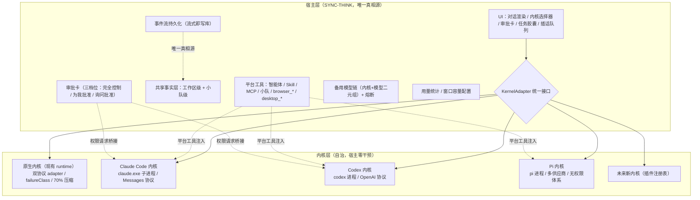

# 06 — 多内核架构设计（KernelAdapter 适配规范）

> **文档定位**：本文件是「SYNC-THINK 多内核改造」的完整设计基线，交付给负责实现适配的开发者/模型使用。文档自包含——所有关键事实（代码实证、NewMax 本机日志实证、官方文档调研）均写入正文，不需要额外的对话上下文即可开工。
>
> **状态**：设计已与需求方逐轮确认定稿，待实现。
> **相关文档**：`02-development-principles.md`（开发原则）、`04-tech-decisions.md`（技术决策总集）、`05-tech-decisions-mcp-global.md`（MCP 全局化）。

---

## 1. 背景与目标

### 1.1 现状

SYNC-THINK 是自研 runtime 直连模型 API 的对话产品。runtime 拥有原生双协议 adapter（`openai-chat` 直连 Chat Completions、`anthropic-messages` 直连 Messages），并实现了完整的平台能力：

| 现有资产（改造中复用） | 位置/机制 |
|---|---|
| 模型层重试 + 备用模型链 + 供应商熔断 | `shouldRetrySameModel` / `tryContinueWithFallback` / `providerFailureCounts`（runtime.ts） |
| 失败分类体系（八类） | `FailureClass`（transient/auth/protocol/permission/acceptance/rate-limit/timeout/unknown） |
| 审批卡机制 | `tool.approval_requested` 事件 + `approval.decide` 命令 |
| 对话权限三档位 | full-access / ask / workspace |
| 凭据组 | `CredentialGroupRecord` + per-model `credentialRefId` |
| 用量计费 | `provider.usage` 事件 → `pricing.ts` 四档计费 |
| 任务清单三表 | `task_plan` / `task_plan_dependency` / `task_plan_execution` |
| 事件流持久化 | 流式即写库，重启可恢复 |
| 平台工具组 | create_agent / browser_* / desktop_* / Skill / MCP / 小队管理 |
| 输入框任务胶囊 | RunTaskCapsule（从工具结果提取 plan 快照） |
| 插话队列 | ComposeRequestQueue（排队、可编辑/删除/插话/重试、持久化） |

### 1.2 目标

把 SYNC-THINK 改造成**宿主 harness + 多内核插件架构**：

1. 用户可以在模型选择器中**选择内核**（带内核图标）：原生内核 / Claude Code 内核 / Codex 内核 / Pi 内核
2. 新增内核可通过适配器注册表接入
3. 内核**自治**：压缩、模型重试、工具循环、会话管理由内核自己负责，宿主零干预
4. 宿主保留三件横向职责：**窗口容量配置、备用模型链、用量统计**

### 1.3 核心概念澄清

| 概念 | 定义 |
|---|---|
| **模型** | 发动机——只提供有限上下文窗口的 API，不做窗口管理 |
| **Agent** | 驾驶行为——"模型 + 系统提示 + 工具循环"的行为主体 |
| **内核（kernel）** | 整辆车——承载 agent 循环的可执行 harness：协议适配、工具执行、上下文管理、权限、I/O 的完整外壳。`claude.exe` / `codex` / `pi` / SYNC-THINK 自己的 runtime 都是内核 |
| **宿主（host）** | SYNC-THINK 应用本身：UI、事件持久化、平台工具、审批卡、小队管理 |

**"多内核"的正确定义**：让 SYNC-THINK 成为宿主 harness，spawn 并驱动多个外部 harness 子进程，把它们的输出归一化成统一事件流。

---

## 2. 核心原则：内核自治，宿主只做四件事

### 2.1 宿主不管的事（内核自治域）

| 领域 | 归属 | 宿主行为 |
|---|---|---|
| **上下文压缩**（何时触发/怎么摘要/阈值） | 内核 | **完全不管**。内核自己的压缩逻辑跑，宿主不干预、**不二次压缩**（双重压缩=信息损失翻倍） |
| 模型调用重试 | 内核 | 内核内部失败让内核自己处理 |
| 工具执行循环 | 内核 | 内核自己的工具循环 |
| 内核会话管理 | 内核 | 内核自己的 session/resume 机制 |

### 2.2 宿主必须做的事

1. **拉进程**：spawn 内核子进程、注入配置、Job Object 生命周期绑定
2. **翻译事件**：内核输出事件 → 统一 KernelEvent 流
3. **存历史**：事件流持久化（宿主的库是唯一真相源）
4. **注入平台工具**：把 SYNC-THINK 的平台工具按各内核机制注册进去

### 2.3 宿主的三件横向职责（与"不管压缩"零冲突）

| 职责 | 说明 | 实证依据 |
|---|---|---|
| **① 上下文容量配置** | 模型记录存 `contextWindow` → spawn 内核时注入 → 统计时除以它算百分比。压缩**时机**由内核决定，容量**值**由宿主配置 | NewMax 日志 `window=1000000 pct=20%` |
| **② 备用模型链** | 内核失败 → 宿主查链 → 切换"内核+模型"二元组继续。**内核之间互不知道对方存在**，这层天然属于宿主 | NewMax 日志 `fallback: { providerId, model: 'grok-4.5' }`（宿主层切换） |
| **③ 用量统计** | 读内核报告的 usage 事件 → 持久化 → UI 展示。**"不干预压缩" ≠ "不读用量报告"**：报告是内核对外输出，读它是适配协议的一部分 | NewMax 日志 `[ClaudeProxy][RealUsage] real=209623 window=1000000 pct=21%` |

---

## 3. 架构总览



### 3.1 数据流（一次内核请求的生命周期）

```
用户发消息（内核选择 = claude-code，模型 = claude-sonnet-4-5）
  → 宿主组装 KernelRequest { model, contextWindow, 凭据, 共享事实, 小队上下文 }
  → spawn claude.exe（stream-json 双向流 + permission-prompt-tool stdio）
  → 内核自治执行（压缩/重试/工具循环都是内核内部的事）
  → 内核事件流 → 适配器归一化 → 宿主渲染 + 流式写库
  → 内核权限请求 → 桥接 → 宿主审批卡 → 批准/拒绝回给内核
  → 内核报告 usage → 宿主持久化 + 用量统计
  → 内核崩溃/失败 → 宿主查备用链 → 切内核+模型继续 或 暂停等用户
  → 宿主退出 → Job Object 带走内核进程
```

---

## 4. KernelAdapter 接口规范（契约）

> **接口定义时就把以下槽位写进去**——它们不是后补项，而是契约的一部分。

```ts
// ─── 内核适配器统一接口 ───────────────────────────────────────
interface KernelAdapter {
  // 身份
  id: 'native' | 'claude-code' | 'codex' | 'pi' | string;
  name: string;                          // 显示名
  icon: string;                          // 内核图标（选择器 UI 用）

  // 能力声明（驱动 UI 降级与权限策略）
  capabilities: {
    protocols: Array<'anthropic-messages' | 'openai-chat' | 'openai-responses'>;
    permission: 'own' | 'none';          // 内核有无自身权限体系
    permissionBridge: boolean;           // 是否支持权限请求桥接到宿主（permission-prompt-tool 类机制）
    pause: 'executor' | 'turn' | 'session' | 'kill';
        // executor = 执行器级暂停/恢复（native）
        // turn     = 只能停当前 turn（Claude Code，Esc 语义）
        // session  = 暂停即关会话（Codex，Ctrl+C 语义）
        // kill     = 杀进程树，无恢复（Pi）
    compress: 'own' | 'none';            // 内核是否自带压缩（全部外部内核为 'own'）
    usageReport: boolean;                // 内核是否报告 usage 事件
  };

  // 版本（跟随更新策略，见 §9）
  knownGoodVersions: string[];           // 测试通过的版本号
  detectVersion(): Promise<string | null>; // 本地探测：PATH / 注册表 / --version

  // 生命周期
  start(req: KernelRequest): AsyncIterable<KernelEvent>;  // spawn + 注入配置，返回事件流
  stop(): Promise<void>;
  pause(): Promise<void>;
  resume(): Promise<void>;
  cancel(): Promise<void>;
  onExit(cb: (code: number | null, stderrTail: string) => void): void;

  // 权限桥接（仅 permissionBridge = true 的内核实现）
  onPermissionRequest(cb: (req: KernelPermissionRequest) => void): void;
  respondPermission(reqId: string, decision: { allow: boolean; updatedInput?: unknown; message?: string }): void;

  // 用量报告（仅 usageReport = true 的内核实现）
  onUsage(cb: (u: KernelUsage) => void): void;
}

interface KernelRequest {
  model: string;                          // 内核模型标识（透传）
  contextWindow: number;                  // ① 宿主配置的窗口容量
  credential: KernelCredential;           // 凭据（见 §8）
  systemContext: string;                  // 共享事实 + 小队上下文（见 §10）
  platformTools: PlatformToolDefinition[];// 平台工具注入（见 §7.3）
  permissionMode: 'full-access' | 'ask' | 'workspace';  // 三档位映射（见 §7.1）
  workspaceDir: string;
}

interface KernelUsage {
  real: number;                           // 内核报告的真实 token
  window: number;                         // 回显的窗口容量
  // 可选：input/output/cached 分项（各内核粒度不同，见 §12.2 对齐规则）
}

interface KernelPermissionRequest {
  requestId: string;
  toolName: string;
  toolInput: unknown;
  reason?: string;
}
```

### 4.1 统一事件流（KernelEvent 归一化目标）

各内核事件全部映射为以下统一类型（渲染层/持久化层只认这个）：

```ts
type KernelEvent =
  | { type: 'delta'; text: string }                     // 回复增量
  | { type: 'reasoning'; text: string }                 // 思考过程增量
  | { type: 'tool-call'; toolId: string; name: string; argsJson: string; partial: boolean }
  | { type: 'tool-result'; toolId: string; output: string; isError: boolean }
  | { type: 'permission-request'; requestId: string; toolName: string; toolInput: unknown }
  | { type: 'usage'; usage: KernelUsage }
  | { type: 'compacted' }                               // 内核报告发生压缩（可选，仅通知用）
  | { type: 'terminal'; status: 'completed' | 'failed'; error?: string };
```

**映射原则**：
- 内核输出**未知事件类型 → 忽略 + 记录日志**（NewMax 日志 `unhandled event type` 先例），不崩溃、不中断流
- 内核**没有的事件类型 → 宿主降级**（如 Pi 无 reasoning 事件，UI 不显示思考区）
- reasoning 语义各家不同（CC 无显式 reasoning 事件、Codex 有 `reasoning_text.delta`）——映射时尽力而为，映射不了就丢弃并记录

---

## 5. 各内核适配规格

### 5.1 原生内核（native，第一阶段唯一目标）

- **本质**：把现有 runtime 重构为 KernelAdapter 接口的第一个实现，**不改现有行为**
- 压缩（70% + `isMeaningfulCompactReduction`）、重试、备用模型链、审批 fence 全部保留在 native 内核内
- 直接调用现有 runtime 函数，不走进程边界
- `capabilities`：protocols = 双协议；permission = 'own'；pause = 'executor'；compress = 'own'（自己就是压缩实现）
- **注意**：后续章节里"外部内核"的规则（进程管理、协议桥接）对 native 不适用

### 5.2 Claude Code 内核

**协议**：只讲 Anthropic Messages（+ Bedrock/Vertex）。**不支持 OpenAI 协议**。

**启动参数（关键）**：
```bash
claude \
  --output-format stream-json \
  --input-format stream-json \
  --verbose \
  --permission-prompt-tool stdio \
  --model <透传模型名>
# 不使用 -p 参数；用户消息通过 stdin 的 JSON 控制消息发送
```
- `--permission-prompt-tool stdio`：把内核权限请求通过控制协议发给宿主（`control_request`），宿主回 `control_response`（allow 必须带 `updatedInput`，deny 必须带 `message`，`request_id` 必须匹配）。**内核会阻塞等待答复（默认超时约 60s）**。不加此参数时，非交互模式下工具**自动拒绝**
- 流式参数展示：stream-json 有 tool_use 的 partial_json 增量事件，映射到 `tool-call` 的 `partial: true`

**接入 OpenAI 系模型的两条路（优先级从上到下）**：

| 路径 | 做法 | 代价 |
|---|---|---|
| **A. 中转站 Messages 端点（首选）** | `ANTHROPIC_BASE_URL` 指向中转站的 `/v1/messages`，模型名透传。用户的中转站兼容 Anthropic 协议，此路**零翻译层** | 无 |
| B. 宿主翻译层（备选，仅当中转站不支持 Messages） | NewMax ClaudeProxy 模式：宿主内建 Messages → Responses 翻译（见 §5.5 实证）。每处 `Stripped`/`unhandled` 都是能力损耗 | 高 |

**已知 bug（适配时必须实测并兜底）**：
1. `ExitPlanMode` 的批准经 stdin `control_response` 回复会被静默忽略，进程停止输出并挂起（anthropics/claude-code#39666）。**规避**：启动时加 `--permission-mode acceptEdits` 绕过 plan mode
2. `.claude/skills/`、`.claude/agents/`、`.claude/commands/` 写入在 stream-json 模式下被静默拒绝，**且不发出任何 control_request**——宿主无从弹卡，agent 卡死在 "Claude requested permissions..."（#54850）。**规避**：平台工具注册时避开这些路径；或在能力探测时发现该行为
3. settings 文件 `permissions.allow` 规则对 Write 工具在 stream-json 下可能不生效（#13468）
4. hooks 在 `-p` 非交互模式不触发（#30143）——stream-json stdin 模式需自行验证
5. **stream-json 权限协议官方无文档**，是社区逆向发现的（claude-agent-sdk-go 的 cli-protocol.md）——适配时以实测为准

**凭据**：`ANTHROPIC_API_KEY` 或 `ANTHROPIC_AUTH_TOKEN` 环境变量注入（禁止命令行）。**红利**：用户本地 CC 的 OAuth 登录态可直接复用（检测到本地登录时优先用登录态，不注入 key）。

**pause 语义**：'turn'——「暂停」= 停当前 turn（Esc 语义），无执行器级恢复。宿主 UI 不显示「继续」，显示「发新指令」。

### 5.3 Codex 内核

- **协议**：OpenAI 协议族原生（Chat Completions / Responses）。`OPENAI_BASE_URL` 指向中转站即可，**零翻译层**
- **启动**：`codex exec` 模式，JSONL 事件流（`item.*` 事件）；输入用 stdin / `--prompt`
- **权限**：三层沙箱（read-only / workspace-write / danger-full-access）+ `--approval-policy`（untrusted / on-failure / on-request / never）。三档位映射：
  - 完全控制 → `--approval-policy never`（或 danger-full-access）
  - 询问批准 → `--approval-policy on-request`
  - 为我批准 → `--approval-policy on-failure`（写失败时才请求）
  - Codex 无 `permission-prompt-tool` 类桥接机制时，权限请求走宿主审批卡需要**实现时验证**（若有 `request_permissions` 工具事件可桥接则桥接，否则降级为 approval-policy 静态映射 + 平台工具宿主审批）
- **pause 语义**：'session'——Ctrl+C 是关会话。「暂停」按钮实际是取消 + 下次续跑（codex resume 机制可续会话）
- **凭据**：`OPENAI_API_KEY` 环境变量注入。**红利**：用户本地 ChatGPT 登录态可复用

### 5.4 Pi 内核

- **协议**：多供应商原生（内置 Anthropic/OpenAI/OpenRouter/Ollama 等 provider 配置，填 baseUrl 即可）
- **权限**：**无权限体系**（全信任）。`capabilities.permission = 'none'` → **宿主接管敏感操作**：
  - 不把 `run_command` 类敏感工具交给 Pi 直接执行
  - 宿主注册一个**代理工具**：Pi 调用 → 宿主弹审批卡 → 批准后宿主代执行
- **pause 语义**：'kill'——暂停 = 杀进程树，无恢复。UI 不显示「继续」
- **事件**：JSONL 会话格式，无 reasoning 事件 → UI 不渲染思考区

### 5.5 翻译层实证（NewMax 模式，仅路径 B 需要时参考）

本机 NewMax 日志实证（`~/.newmax/logs/`）：

```
[ClaudeProxy][REQBODY #511] model=deepseek-v4-flash-openai   ← 内核 Messages 请求
forwardCodex → https://中转站/v1/responses                    ← 翻译成 Responses 协议
Stripped output_config (effort=max)                          ← 参数剥离重映射
Codex stream unhandled event type: response.reasoning_text.delta  ← 事件翻译不全的兜底
[ClaudeProxy][RealUsage] real=202345 window=1000000 pct=20%  ← 宿主统计
```

结论：翻译层的每处 `Stripped` / `unhandled` 都是能力损耗点（thinking 参数被剥掉重做、reasoning 事件不被处理）。**优先走路径 A，翻译层是最后手段**。

### 5.6 新内核接入（插件化）

新增内核 = 实现一个 `KernelAdapter` + 图标 + 能力声明 + 注册进适配器注册表。验收标准：
- 事件流归一化完整（§4.1 全类型覆盖或声明降级）
- 权限策略明确（own + 桥接 / own 无桥接 / none → 宿主接管）
- pause 档位声明真实（实测验证）
- usage 报告格式声明

---

## 6. 权限体系统一（已定稿）

### 6.1 三档位 → 内核映射

| 宿主档位 | Claude Code | Codex | Pi | 平台工具（所有内核一致） |
|---|---|---|---|---|
| **完全控制** | `--dangerously-skip-permissions` | `--approval-policy never` | 宿主代理工具免批 | 免批 |
| **询问批准** | 权限请求桥接 → 宿主审批卡 | `--approval-policy on-request`（或桥接） | 宿主代理工具全批 | 全批 |
| **为我批准** | 只读放行，写/命令桥接弹卡 | `--approval-policy on-failure` | 宿主代理工具中间态 | 中间态 |

### 6.2 统一入口：所有权限请求汇到宿主审批卡

- 内核有桥接机制（CC 的 `permission-prompt-tool stdio`）→ 权限请求事件 → 宿主审批卡（复用现有 `tool.approval_requested` 审批卡 UI）→ `control_response` 回给内核
- 内核无桥接 → 静态映射（approval-policy）+ 平台工具宿主审批
- 内核无权限体系（Pi）→ 敏感工具宿主代理 + 审批卡

### 6.3 平台工具审批（一律宿主审批卡）

`create_agent` / `browser_*` / `desktop_*` / Skill / MCP / 小队管理——这些是"涉及宿主工作台"的操作，无论哪个内核执行，**一律走宿主审批卡**（受三档位控制）。cwd 越界校验撤掉作为独立机制，建议保留为审批卡显示项（弹卡时标注"此命令将写入工作区外"）。

### 6.4 平台工具副作用幂等

内核崩溃 → 宿主重试 → `create_agent` 被调用两次的风险。**写库的平台工具必须幂等**（如 create 前按名称查重）或带执行去重。

---

## 7. 凭据管理（已定稿）

| 项 | 决策 |
|---|---|
| **注入方式** | **环境变量**（`ANTHROPIC_API_KEY` / `OPENAI_API_KEY`）。**禁止命令行参数**——Windows 上 `wmic` 可读任何进程命令行（NewMax 取证时即用此法） |
| **来源** | SYNC-THINK 现有 `CredentialGroupRecord` 凭据组 → 内核凭据映射（per-model `credentialRefId`） |
| **登录态红利** | 本地已安装内核时，**优先复用用户本地登录态**（CC 的 OAuth / Codex 的 ChatGPT 登录），检测到则不注入 key——宿主不处理内核自己的认证流程 |
| **脱敏** | 错误消息注入前脱敏（复用现有 `scrubDiagnosticMessage`），防 key 泄漏进事件/UI |

---

## 8. 进程生命周期（已定稿）

| 层 | 机制 |
|---|---|
| **宿主死 → 内核死** | Windows **Job Object**：spawn 时挂入 Job，`JOB_OBJECT_LIMIT_KILL_ON_JOB_CLOSE`，宿主退出由 OS 内核级保证带走全部内核子进程 |
| **宿主崩溃后回收** | spawn 时给内核环境变量注入宿主标记（token/PID）→ 宿主重启时扫描带标记的孤儿进程 → 回收 |
| **内核崩溃 → 事件不丢** | 宿主**流式即写库**（现有持久化模式）→ 监听内核 exit → 归类（正常/崩溃/被杀）→ 发 `run.failed`（exit code + stderr 尾部）→ 已持久化的部分事件全部保留，用户看到"内核崩溃于第 N 步" |
| **文件写一半** | **不做自动回滚**。UI 提示"内核异常终止，最近文件改动请检查" + 提供 git diff 入口（`git_status` / `git_diff` 工具现成） |

---

## 9. 内核获取与版本策略（已定稿）

### 9.1 本地识别 + 引导安装（不打包二进制）

1. **探测**：启动时扫描 PATH + 常见安装路径 + Windows 注册表，`claude --version` / `codex --version` / `pi --version`
2. **未安装**：内核选择器中该内核图标置灰，hover 显示「未安装 · 点击安装」→ 一键安装（宿主跑安装命令，如 `npm i -g @openai/codex`）或引导用户手动装 → 装完自动重新探测
3. **兜底**：native 内核永远可用（自研红利）——"一个外部内核都没装"不影响应用运行

### 9.2 版本策略：跟随更新（不锁版本）

内核更新频繁（CC 已到 v2.1.x 级别），锁版本会天天失配：

| 策略 | 做法 |
|---|---|
| **容错解析** | 事件解析器对未知事件类型**忽略 + 记录日志**（NewMax `unhandled event type` 先例）——内核加新事件不会弄挂适配器 |
| **已知良好版本提示** | `knownGoodVersions` 声明测试过的版本 → spawn 前探测，发现未验证的新版本 → 黄条提示"该内核版本未经测试，可能异常"，**继续用** |
| **更新后回归** | 内核更新后跑适配器回归测试（§13） |

---

## 10. 小队与共享事实层（已定稿）

### 10.1 共享事实层（宿主存储，所有内核共享）

```
共享事实层：
  ├─ 工作区级共享事实：对标 CLAUDE.md / MEMORY.md 的文件（workspace 归属已有）
  ├─ 小队级共享事实：小队目标 / 成员分工 / 约束 / 已决事项
  │    （create_team 已存在，扩展其上下文存储）
  └─ 注入方式：无论哪个内核启动，宿主把该层拼进 system prompt
       —— 内核们不共享进程，但共享事实层
```

### 10.2 小队 × 多内核

- 小队成员可**各自绑定不同内核**（成员 A 用 claude code 内核、成员 B 用 codex 内核）——并行执行时通过共享事实层对齐认知，形成"异构智能体团队"
- **中途切换内核**：宿主的持久化事件流是唯一真相源 → 切内核 = 用真相源重建启动上下文（历史摘要 + 共享事实 + 小队上下文喂给新内核）。旧内核内部压缩过的摘要拿不到没关系——真相源在宿主

### 10.3 同文件冲突提示

宿主从各内核**写事件流**维护"活跃文件写集合"→ 检测到交叉 → UI 警告"智能体 B 正在修改你刚写入的文件 xxx"。**不做文件锁**（内核自治原则下宿主管不了内核内部的文件访问）。

---

## 11. UI 规格

### 11.1 内核选择器

- 模型选择器增加内核分组：每个模型显示**内核徽标**（`[原生]` / `[Claude Code]` / `[Codex]` / `[Pi]`）
- 未安装内核：图标置灰 + 「未安装 · 点击安装」+ 一键安装引导
- 内核图标：每个适配器自带图标资产

### 11.2 暂停/继续按钮降级

按 `capabilities.pause` 档位：

| pause 档位 | 「暂停」行为 | 「继续」按钮 |
|---|---|---|
| executor（native） | 执行器级挂起 | 显示 |
| turn（CC） | 停当前 turn | 不显示（显示「发新指令」） |
| session（Codex） | 取消 + 下次续跑 | 不显示（提示可续会话） |
| kill（Pi） | 杀进程 | 不显示 |

### 11.3 审批卡复用

内核权限请求桥接 → 复用现有审批卡 UI（`tool.approval_requested` 渲染路径），用户无感知差异。

---

## 12. 计费与用量统计

1. **窗口容量**：模型记录的 `contextWindow` 注入内核 + 统计时分母
2. **usage 报告**：各内核报告格式不同 → 统一 `KernelUsage { real, window }` 最小协议，分项（input/output/cached）按**最粗粒度对齐**（内核不报告的项置空，不估算）
3. **计费映射**：usage 事件接入现有 `provider.usage` 通道 → `pricing.ts` 四档计费 + 能力中心 45 天统计
4. **UI 展示**：内核模式跑时，上下文占用/压缩状态**以内核报告的为准**——拿不到就不展示，宿主不自己瞎算

---

## 13. 测试策略

| 项 | 做法 |
|---|---|
| **适配器单测** | 每个内核适配器配 **fixture 进程**（mock 内核输出固定事件流），验证事件归一化全覆盖 |
| **权限桥接测试** | fixture 发 `control_request` → 验证宿主审批卡弹出 → `control_response` 回填 → fixture 确认收到 |
| **生命周期测试** | 模拟内核崩溃（fixture 中途 exit 非零）→ 验证 run.failed + 部分事件保留；宿主退出 → 验证 Job Object 带走内核 |
| **版本回归** | 内核更新后跑一次全量适配器回归（手动命令或 CI） |
| **回归矩阵** | 内核数 × 平台工具数 × 权限档位数 |

---

## 14. 实施阶段

```
阶段 1：抽象层落地（不动现有功能）
  · 定义 KernelAdapter 接口（含本文件 §4 全部槽位）
  · 把现有 runtime 重构为 'native' 适配器
  · UI 加内核选择器（此时只有原生，图标先立起来）
  · 共享事实层（工作区级 + 小队级）存储与注入
  验收：现有功能零回归，内核选择器可见

阶段 2：接第一个外部内核（Claude Code）
  · 本地探测 + 引导安装 + Job Object 生命周期
  · stream-json 双向流 + permission-prompt-tool stdio 桥接
  · 中转站 Messages 端点直连（路径 A，零翻译层）
  · 审批卡桥接 + 三档位映射
  验收：用户能真正"选内核"跑通完整对话（含权限审批）

阶段 3：Codex / Pi 内核
  · 复用阶段 2 的适配器骨架
  · Codex：exec JSONL + approval-policy 映射
  · Pi：多供应商 + 宿主代理敏感工具 + 审批卡兜底
  验收：三内核可选，权限体验统一

阶段 4：插件化注册表（第三方内核接入）
  · 注册表 + 能力声明验收标准（§5.6）
```

---

## 15. 风险与已知坑清单

| # | 风险/坑 | 应对 |
|---|---|---|
| 1 | CC stream-json 权限协议**官方无文档**，依赖社区逆向 | 以实测为准，适配器加容错日志 |
| 2 | CC `ExitPlanMode` 批准被静默忽略 → 挂起（#39666） | 启动加 `--permission-mode acceptEdits` |
| 3 | CC `.claude/skills/` 等写入静默拒绝且不发 control_request（#54850） | 平台工具避开这些路径，实测兜底 |
| 4 | 翻译层摩擦（路径 B 时） | 优先中转站 Messages 端点（路径 A） |
| 5 | 权限体系被内核穿透（宿主管不了内核内部文件访问） | 三档位映射 + 平台工具一律宿主审批 + cwd 显示项 |
| 6 | 平台工具副作用重复（内核崩溃重试） | 写库工具幂等 |
| 7 | 内核压缩后 UI 历史与内核实际上下文不一致 | 展示以内核报告为准，宿主不二次压缩 |
| 8 | 内核更新破坏事件格式 | 容错解析 + knownGoodVersions 黄条 + 回归 |
| 9 | 双内核并行改同一文件 | 写事件流集合 + UI 风险提示 |
| 10 | 暂停语义差异（四内核四种） | capabilities.pause 档位 + UI 降级 |

---

## 16. 待实现时验证事项（检查清单）

实现时逐项打勾，未验证前不要声称完成：

- [ ] CC：`--permission-prompt-tool stdio` 在当前安装版本的行为（权限请求是否真实到达宿主）
- [ ] CC：stream-json 下 tool_use partial_json 增量事件的格式
- [ ] CC：`--permission-mode acceptEdits` 是否规避 ExitPlanMode 挂起
- [ ] CC：用户本地 OAuth 登录态在 spawn 子进程时是否可直接复用
- [ ] Codex：`request_permissions` 类事件能否桥接宿主审批卡（还是降级为 approval-policy 静态映射）
- [ ] Codex：exec JSONL 事件类型全集（对照 §4.1 归一化覆盖度）
- [ ] Pi：多供应商 provider 配置的 baseUrl 字段名与格式
- [ ] 中转站 `/v1/messages` 端点兼容性（CC 内核路径 A 的前提）
- [ ] Job Object 在 Electron 主进程下的可用性（Electron 自身已在 Job 中时的嵌套行为）
- [ ] 各内核 `--version` 输出格式（探测解析）
- [ ] 各内核 usage 报告的字段粒度（§12.2 对齐）
- [ ] 内核冷启动到首 token 的延迟实测（决定是否预启动/常驻策略）

---

*文档基线版本：2026-08-13，基于与需求方的多轮设计讨论定稿（内核自治原则、三件宿主职责、权限统一入口、小队共享事实、进程生命周期、版本跟随策略均已逐项确认）。*
