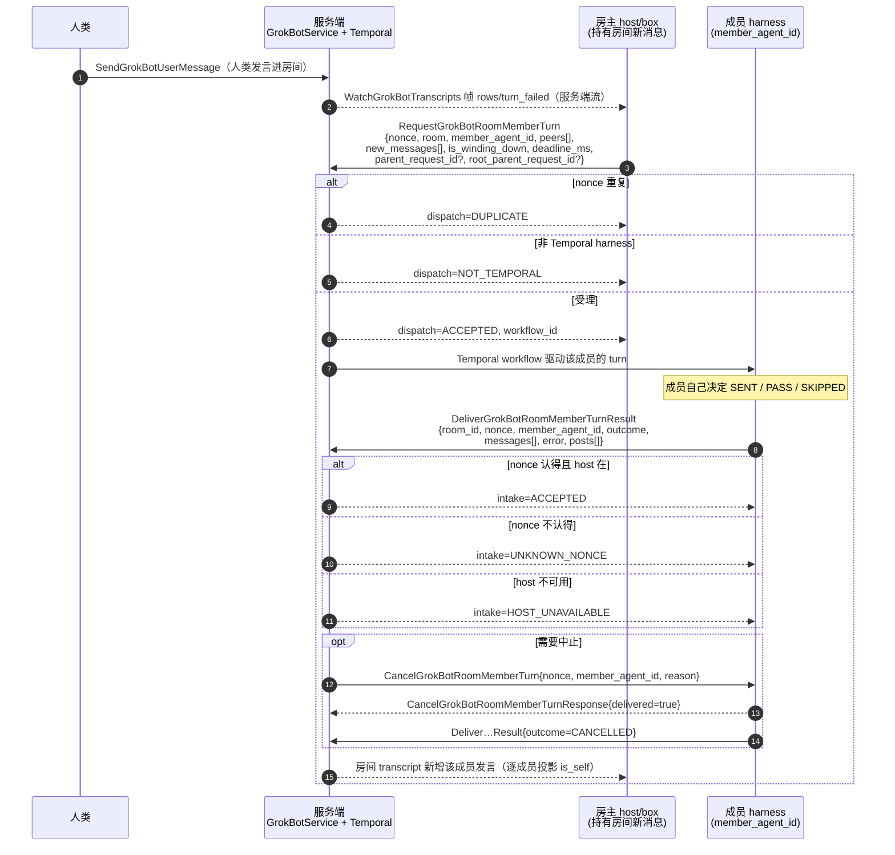
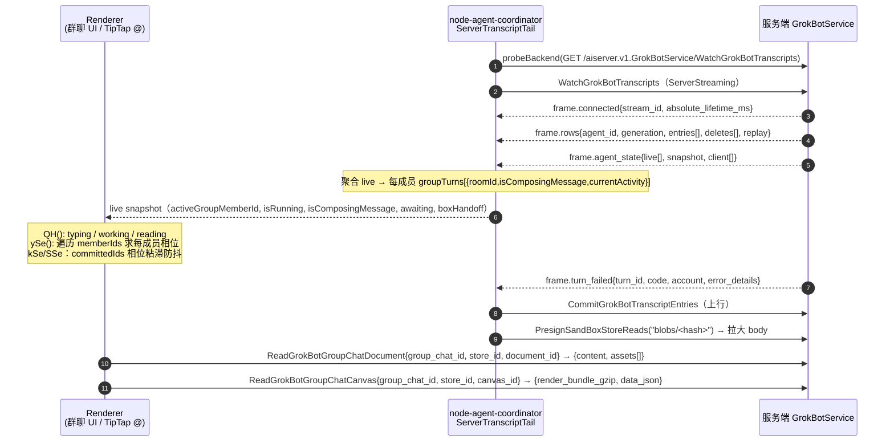

# 01 · 通信与群聊轮次编排（Grok Bot 0.63.0 逆向）

- **被测对象**：Grok Bot 桌面端 0.63.0（内部代号 `sand`，作者 SpaceXAI，Electron）。安装路径 `D:\tools\grok-bot\Grok Bot`，`app.asar` 已解包到 `.tmp-grok-bot/app/`。
- **取证方式**：只读分析 `.tmp-grok-bot/app/dist/**`（513 个 `.js/.cjs/.mjs/.json` 文件）。所有字段级结论均由 `.tmp-grok-bot/scripts/ws1-extract-proto.mjs` 从 `dist/electron-main/proto.cjs` 的结构化 schema 中程序化提取，未依赖人工猜测。
- **证据分级**：`【代码】`＝本次在 0.63.0 产物中直接读到；`【数据】`＝本机 `%APPDATA%\Grok Bot\sand-client-persistence\` 真实缓存（只读）；`【推断】`＝由字段语义/枚举取值反推，客户端无法直接证实；`【未证实】`＝0.63.0 产物里找不到证据。
- **引用约定**：`proto.cjs` 是压缩后仅 5 行的文件，**行号没有意义**，因此本文件一律用 `文件 : 字节偏移(off=)` + 可复现 grep 键 定位。偏移由 `ws1-scan.mjs` 输出，重跑脚本即可复现。
- **旧版对照**：工作区根 `grok-bot-groupchat-internals-research.md`（v0.47.0）。注意该文中的 `proto.cjs:39` 之类行号在压缩产物里不可复现，本文件不沿用。

---

## 0. 一句话结论

**0.63.0 的"群聊多 bot 协同"是一套服务端权威的 turn 编排协议：三个 RPC（`RequestGrokBotRoomMemberTurn` / `CancelGrokBotRoomMemberTurn` / `DeliverGrokBotRoomMemberTurnResult`）的名字在全部 513 个客户端产物里各出现恰好 9 次（3 个 bundle × 3 次），而这 27 次**全部**落在 protobuf 类型定义与服务方法表内，真实调用点数为 0；桌面端只"装着"协议 schema，真正决定"谁发言"的逻辑不在客户端。客户端能被观测到的只有 `WatchGrokBotTranscripts` 流上逐成员投影的轮次进度（`groupTurns` / `activeGroupMemberId` / `is_self`）——即：编排在服务端（Temporal），执行在 host/box，客户端只做展示与逐成员上下文副本。**

---

## 1. 总览：三层分工

```
┌─ 服务端 aiserver.v1.GrokBotService ────────────────────────────────┐
│  · 房间/成员/transcript 的权威状态                                  │
│  · turn 编排（Temporal workflow）→ 决定派发给哪个成员、何时收尾      │
│  · 逐成员投影：同一条群消息对 A 是 is_self=true，对 B 是 false       │
└───────────────┬──────────────────────────────┬────────────────────┘
                │ WatchGrokBotTranscripts       │ CommitGrokBotTranscriptEntries
                │ (ServerStreaming, 帧)          │ (Unary, 客户端上行)
┌───────────────▼──────────────────────────────▼────────────────────┐
│  host / box（执行侧）：跑 agent，产出 turn 结果                      │
│  · 协议上对应 RequestGrokBotRoomMemberTurn（请求派发）               │
│    + DeliverGrokBotRoomMemberTurnResult（上报结果）+ Cancel（取消）  │
└───────────────┬───────────────────────────────────────────────────┘
                │ 桌面端只消费上面那条流
┌───────────────▼───────────────────────────────────────────────────┐
│  Electron 桌面端（本仓库分析对象）                                  │
│  · 持有全部 proto schema（2070 个消息类型在 proto.cjs 中）           │
│  · 真实实现：transcript 服务端 tail + live state 投影 + TipTap @ 渲染 │
│  · turn RPC 调用点数 = 0                                            │
└───────────────────────────────────────────────────────────────────┘
```

支撑这条分层的两条硬证据：

1. `GrokBotAgentHarnessKind = UNSPECIFIED | BOX=1 | TEMPORAL=2`【代码】`proto.cjs off=793212`；同区还有 `GrokBotAgentKind = UNSPECIFIED | AGENT=1 | ROOM=2`（`off=792852`），说明"每个 agent 有一个运行底座""房间本身也是一种 agent"都是显式建模的。
2. `GrokBotRuntimeCapabilities = {durable_identity_enabled, durable_identity_writes_enabled, temporal_creation_enabled, agent_messaging_enabled, server_rooms_enabled}`【代码】`proto.cjs off=991472`（schema 原文：`"GrokBotRuntimeCapabilities|1 durable_identity_enabled 8|2 durable_identity_writes_enabled 8|3 temporal_creation_enabled 8|4 agent_messaging_enabled 8|5 server_rooms_enabled 8"`）。`server_rooms_enabled` 的存在直接说明"群房间可以由服务端托管"这一模式是可选能力。

---

## 2. 点对点通道：`SendGrokBotAgentMessage`

### 2.1 字段级协议【代码】

RPC：`aiserver.v1.GrokBotService/SendGrokBotAgentMessage`（Unary）
服务方法表原文：`sendGrokBotAgentMessage:{name:"SendGrokBotAgentMessage",I:HS,O:WS,kind:i.Unary}`
`proto.cjs off=1047630`（grep 键 `sendGrokBotAgentMessage:{name:`）

**`SendGrokBotAgentMessageRequest`**（`proto.cjs off=942921`，schema 原文
`"SendGrokBotAgentMessageRequest|1 from_agent_id 9|2 to_agent_id 9|3 message_id 9|4 text 9|5 sent_at_ms 3"`）

| # | 字段 | 类型 | 标签 | 语义 |
|---:|---|---|---|---|
| 1 | `from_agent_id` | string | singular | 发送方 agent id |
| 2 | `to_agent_id` | string | singular | 接收方 agent id |
| 3 | `message_id` | string | singular | 消息幂等/去重键 |
| 4 | `text` | string | singular | **纯文本**，无附件、无 reply_to、无 room 字段 |
| 5 | `sent_at_ms` | int64 | singular | 发送时间戳（毫秒） |

**`SendGrokBotAgentMessageResponse`**（`proto.cjs off=943402`，schema 原文
`"SendGrokBotAgentMessageResponse|1 delivery #0|2 target_agent_id 9|3 target_name 9|4 workflow_id 9?"`）

| # | 字段 | 类型 | 标签 | 语义 |
|---:|---|---|---|---|
| 1 | `delivery` | `GrokBotAgentMessageDelivery` | singular | 投递结论（枚举见 2.2） |
| 2 | `target_agent_id` | string | singular | 服务端解析后的目标 id |
| 3 | `target_name` | string | singular | 目标显示名（回显给发送方做 UI） |
| 4 | `workflow_id` | string | **optional** | 若走 Temporal，返回工作流 id |

**关键读法**：请求体只有 `text`。**同一个 bot 之间的"消息"是窄带纯文本 + 显式寻址**，没有群聊里那套 `reply_to` / 附件结构。`target_name` 只出现在响应里（服务端把 id 解析成名字回给发送方），说明**名字解析在服务端**。

### 2.2 投递语义枚举【代码】

`GrokBotAgentMessageDelivery`（`proto.cjs off=796305`；grep 键 `"GrokBotAgentMessageDelivery"`）

| 值 | 名称 | 读法【推断】 |
|---:|---|---|
| 0 | `UNSPECIFIED` | 未设置 |
| 1 | `DELIVERED_TEMPORAL` | 目标在 Temporal harness，消息交给工作流 |
| 2 | `DELIVERED_BOX` | 目标在 box（共享云电脑/本机），消息投到 box |
| 3 | `DUPLICATE` | `message_id` 去重命中 |
| 4 | `TARGET_NOT_FOUND` | 目标 agent 不存在 |
| 5 | `FORBIDDEN` | 权限不允许（跨账号/跨团队/非成员） |
| 6 | `BOX_UNREACHABLE` | box 在线状态不可达 |
| 7 | `TEMPORAL_UNAVAILABLE` | Temporal 编排服务不可用 |
| 8 | `INVALID_TARGET` | 目标非法（例如指向自己/人类） |

对照旁证：用户消息通道的 `GrokBotUserMessageDelivery = UNSPECIFIED | ACCEPTED_BOX=1 | ACCEPTED_TEMPORAL=2 | DUPLICATE=3 | REFUSED=4`【代码】`proto.cjs off=795265`。同一套 "box vs temporal" 二元投递在用户消息通道里也出现，说明**双 harness 是全局投递模型，不是群聊专属**。

### 2.3 消息如何进入接收方上下文

**能证实的部分：**

- **接收方上下文 = 自己的 transcript**。客户端模型 `GrokBotTranscriptEntry {seq:uint64, entry_kind:string, body?:bytes, blob_hash?:string, updated_seq:uint64, entry_id?:string, body_omitted:bool}`【代码】`proto.cjs off=828099`（`ws1-proto-full.txt` 第 6000 行；`entry_kind` 在 `off=828130`）。`entry_kind` 是字符串，`body` 是可选 bytes（可省略，由 `blob_hash` 外置）。
- **`role` 映射由 entry 自身携带，不由协议字段决定**。本机缓存【数据】显示：人类消息是 `kind="message"` + `role="user"`；bot 产出的消息是 `kind="send-message"` 且 **没有 `role` 字段**，而是带 `author:{id,name}`。
  - 例：群 `bd530ad7` 中 `t0u kind=message role=user`（人类）与 `t0s0 kind=send-message author={"id":"db2f7e9d…","name":"绿毛仔"}`（bot）。
- **附件**：群聊 transcript 里存在独立 entry 类型 `user-attachment`【数据】同上一群（`t1ua0` / `t7ua0` / `t12ua0` / `t13ua0`）。
- **`reply_to` 只存在于群聊 turn 的投影结构里**（`GrokBotRoomMemberTurnMessage.ReplyTarget`，见 3.5），**点对点通道没有 reply_to / 附件字段**。

**不能证实的部分**：【未证实】"bot A 的 `text` 被服务端写成 bot B 的 `role=user` 条目"这条链路——0.63.0 客户端里没有构造/消费 `SendGrokBotAgentMessage` 的代码（见 5.1），服务端实现不在产物内。旧版文档曾用"同一句话在收发两侧逐字一致、一侧 assistant 一侧 user"作为该链路的实证；本次复核确认**该数据形态在 0.63.0 的本机缓存中依然存在**（见第 7 节），但**产生该形态的代码仍不在客户端**。

### 2.4 调用点数 = 0【代码】

- `SendGrokBotAgentMessage` / `sendGrokBotAgentMessage` 全仓（513 文件）共 12 次命中，**全部**落在：`proto.cjs`（2 次消息 schema + 1 次服务表）、`local-exec-daemon/main.cjs`（同构 3 次）、`node-agent-coordinator/main.cjs`（同构 3 次），外加 `fromAgentId/toAgentId` 在 renderer 中属于 transcript 分页参数（`pagesRequested`/`parkedAtMs`/`boundaryAt`），与 agent 消息无关。
- 复现：`node .tmp-grok-bot/scripts/ws1-scan.mjs 'SendGrokBotAgentMessage|sendGrokBotAgentMessage' .tmp-grok-bot/app --ctx=120 --max=30`，逐个检查 `off` 落在 schema/方法表区间。

---

## 3. 群聊轮次协议（turn orchestration）

服务：`aiserver.v1.GrokBotService`（压缩标识 `qG`，`proto.cjs off=1034895`）。相关 RPC 在服务表中的位置【代码】`proto.cjs off=1050084 / 1050174 / 1050262`：

```
requestGrokBotRoomMemberTurn:{name:"RequestGrokBotRoomMemberTurn",I:Yy,O:Qy,kind:i.Unary},
cancelGrokBotRoomMemberTurn:{name:"CancelGrokBotRoomMemberTurn",I:Zy,O:_y,kind:i.Unary},
deliverGrokBotRoomMemberTurnResult:{name:"DeliverGrokBotRoomMemberTurnResult",I:tx,O:rx,kind:i.Unary},
```

### 3.1 `RequestGrokBotRoomMemberTurnRequest` — 9 个字段（全量）【代码】

`proto.cjs off=980612`，schema 原文：

```
"RequestGrokBotRoomMemberTurnRequest|1 nonce 9|2 room #0|3 member_agent_id 9|4 peers #1*|
 5 new_messages #2*|6 is_winding_down 8|7 deadline_ms 3|8 parent_request_id 9?|9 root_parent_request_id 9?"
 refs: #0=GrokBotRoomMemberTurnRoom  #1=GrokBotRoomMemberTurnPeer  #2=GrokBotRoomMemberTurnMessage
```

| # | 字段 | 类型 | 标签 | 语义与读法 |
|---:|---|---|---|---|
| 1 | `nonce` | string | singular | **幂等令牌**。同一 nonce 重复请求 → `DUPLICATE`；结果回传时携带同一 nonce → 服务端用 `UNKNOWN_NONCE` 拒绝过期/伪造结果 |
| 2 | `room` | `GrokBotRoomMemberTurnRoom` | singular | 房间身份（id/name/description） |
| 3 | `member_agent_id` | string | singular | **本次派给谁**（被编排出的成员） |
| 4 | `peers` | `GrokBotRoomMemberTurnPeer` | **repeated** | 同房间其他成员（id/name/description）；成员据此知道"还有谁在群里、各自定位" |
| 5 | `new_messages` | `GrokBotRoomMemberTurnMessage` | **repeated** | **增量**新消息（不是全量历史）；已按接收方投影（见 3.5） |
| 6 | `is_winding_down` | bool | singular | 本轮是否处于**收尾阶段** |
| 7 | `deadline_ms` | int64 | singular | 该轮截止时间（毫秒）；配合 Outcome 的 `TIMEOUT` |
| 8 | `parent_request_id` | string | **optional** | 上一跳请求 id（链路追踪 / 因果链） |
| 9 | `root_parent_request_id` | string | **optional** | 链路根请求 id（整条协作链的根） |

**注意 `peers` 与 `room` 是同一形状**（`{id, name, description}` 三字段），说明协议作者刻意把"房间"和"同侪"降维成同一种描述性引用——成员不需要理解房间拓扑，只需要名字+职责。

### 3.2 `RequestGrokBotRoomMemberTurnResponse`【代码】

`proto.cjs off=981173`，schema 原文 `"RequestGrokBotRoomMemberTurnResponse|1 dispatch #0|2 member_agent_id 9|3 workflow_id 9?"`

| # | 字段 | 类型 | 标签 |
|---:|---|---|---|
| 1 | `dispatch` | `GrokBotRoomMemberTurnDispatch` | singular |
| 2 | `member_agent_id` | string | singular |
| 3 | `workflow_id` | string | optional |

**`GrokBotRoomMemberTurnDispatch`**（`proto.cjs off=798004`）

| 值 | 名称 | 读法【推断】 |
|---:|---|---|
| 0 | `UNSPECIFIED` | 未设置 |
| 1 | `ACCEPTED` | 已受理，工作流启动（此时 `workflow_id` 有值） |
| 2 | `DUPLICATE` | `nonce` 重复，幂等丢弃 |
| 3 | **`NOT_TEMPORAL`** | **调用方/目标不在 Temporal harness → 拒绝走 turn 编排** |
| 4 | `TARGET_NOT_FOUND` | `member_agent_id` 不存在或不在房间 |
| 5 | `TEMPORAL_UNAVAILABLE` | Temporal 服务不可用 |

> `NOT_TEMPORAL=3` 是 **0.63.0 才有**的取值（旧版文档列的 Dispatch 值里没有它）。它的存在把"这套 turn 协议只服务于 Temporal harness"这一约束写进了协议本身。

### 3.3 `CancelGrokBotRoomMemberTurn`【代码】

`proto.cjs off=981622`（Request）/ `off=982023`（Response）

**Request**：`"CancelGrokBotRoomMemberTurnRequest|1 nonce 9|2 member_agent_id 9|3 reason 9"`

| # | 字段 | 类型 | 语义 |
|---:|---|---|---|
| 1 | `nonce` | string | 要取消的那一轮的 nonce |
| 2 | `member_agent_id` | string | 要取消的成员 |
| 3 | `reason` | string | 取消原因（自由文本） |

**Response**：`"CancelGrokBotRoomMemberTurnResponse|1 delivered 8"` — 单个 bool `delivered`。

> 这是**协作式取消**：服务端只回答"取消信号已投递"，不回答"已中止"。真正的中止语义要靠被取消方回报 `TurnOutcome.CANCELLED`（见 3.4）。**旧版文档未记录此 RPC。**

### 3.4 `DeliverGrokBotRoomMemberTurnResult`【代码】

**Request**（`proto.cjs off=982886`），schema 原文：

```
"DeliverGrokBotRoomMemberTurnResultRequest|1 room_id 9|2 nonce 9|3 member_agent_id 9|4 outcome #0|
 5 messages 9*|6 error 9|7 posts #1*"   refs: #0=GrokBotRoomMemberTurnOutcome  #1=GrokBotRoomPost
```

| # | 字段 | 类型 | 标签 | 语义 |
|---:|---|---|---|---|
| 1 | `room_id` | string | singular | 房间 id（这里用裸 id，不是 `room` 结构体） |
| 2 | `nonce` | string | singular | **回显 3.1 的 nonce**，服务端据此配对 |
| 3 | `member_agent_id` | string | singular | 产出该结果的成员 |
| 4 | `outcome` | `GrokBotRoomMemberTurnOutcome` | singular | 本轮结论（枚举见下） |
| 5 | `messages` | string | **repeated** | 产出的**纯文本**消息（可多条） |
| 6 | `error` | string | singular | 出错信息（`outcome=ERROR` 时） |
| 7 | `posts` | `GrokBotRoomPost` | **repeated** | 产出消息的**富文本版本**（见 3.5） |

**Response**（`proto.cjs off=983359`）：`"DeliverGrokBotRoomMemberTurnResultResponse|1 intake #0"`，refs `#0=GrokBotRoomMemberTurnResultIntake`。

**`GrokBotRoomMemberTurnOutcome`**（`proto.cjs off=798168`；grep `"GrokBotRoomMemberTurnOutcome"`）

| 值 | 名称 | 语义与读法 |
|---:|---|---|
| 0 | `UNSPECIFIED` | 未设置 |
| 1 | `SENT` | 本轮我发言了（对应 `messages`/`posts` 非空） |
| 2 | **`PASS`** | **正式的"本轮我不说话"**——成员主动弃权；这是防抢话的核心手段 |
| 3 | `SKIPPED` | 被跳过（未进入实际生成，或前置条件不满足）【推断】 |
| 4 | `TIMEOUT` | 超过 `deadline_ms` 仍未产出 |
| 5 | `CANCELLED` | 被 `CancelGrokBotRoomMemberTurn` 取消 |
| 6 | `ERROR` | 执行失败（`error` 字段带原因） |

**`GrokBotRoomMemberTurnResultIntake`**（`proto.cjs off=798309`；grep 同上）

| 值 | 名称 | 读法【推断】 |
|---:|---|---|
| 0 | `UNSPECIFIED` | 未设置 |
| 1 | `ACCEPTED` | 结果已收下并计入房间 transcript |
| 2 | `UNKNOWN_NONCE` | nonce 不认得（重复上报 / 已过期 / 被取消后到达） |
| 3 | `HOST_UNAVAILABLE` | 收件侧的 host 不可用，结果无人接收 |

**`messages` 与 `posts` 的分工**【代码/推断】：`messages: string*` 是给"纯文本消费方"（例如把发言灌进别的成员上下文的窄带通道），`posts: GrokBotRoomPost[]` 是给"富文本消费方"（房间 UI 渲染）。二者并列出现说明协议同时服务两件事：**上下文注入**与**展示**。

### 3.5 投影结构：TurnMessage / ReplyTarget / Peer / Room / Post【代码】

**`GrokBotRoomMemberTurnMessage`**（`proto.cjs off=979496`；`SpeakerKind` 枚举在 `off=979616`）
`"GrokBotRoomMemberTurnMessage|1 speaker_kind #0|2 speaker_name 9|3 is_self 8|4 text 9|5 reply_to #1?"`

| # | 字段 | 类型 | 标签 | 语义 |
|---:|---|---|---|---|
| 1 | `speaker_kind` | `…TurnMessage.SpeakerKind` | singular | `UNSPECIFIED=0 / HUMAN=1 / AGENT=2` |
| 2 | `speaker_name` | string | singular | 发言者显示名 |
| 3 | `is_self` | bool | singular | **这条是不是"我自己"说的**——逐成员投影的开关 |
| 4 | `text` | string | singular | 正文 |
| 5 | `reply_to` | `…TurnMessage.ReplyTarget` | **optional** | 引用回复 |

**`GrokBotRoomMemberTurnMessage.ReplyTarget`**（`proto.cjs off=980089`）
`"GrokBotRoomMemberTurnMessage.ReplyTarget|1 speaker_kind #0|2 speaker_name 9|3 is_self 8|4 quote 9"`

| # | 字段 | 类型 | 语义 |
|---:|---|---|---|
| 1 | `speaker_kind` | enum | 被引用者是人还是 agent |
| 2 | `speaker_name` | string | 被引用者名字 |
| 3 | `is_self` | bool | 被引用的是不是我 |
| 4 | **`quote`** | string | **引用的正文快照**——被引用消息的内容**在 `quote` 里**，不是 id 引用 |

> `ReplyTarget` **没有 message_id**，只有 `speaker_kind/speaker_name/is_self/quote`。所以引用是**内容快照**而非指针：接收方上下文里看到的是一段自包含的引用文本，不需要回查原始消息表。这是"每成员独立上下文"设计的必然结果——**不存在一份可以被 id 指向的共享消息表**。

**`GrokBotRoomMemberTurnPeer`**（`off=979051`）/ **`GrokBotRoomMemberTurnRoom`**（`off=978642`）
两者 schema 完全同形：`{1 id string, 2 name string, 3 description string}`。

**`GrokBotRoomPost`**（`off=982413`）：`"GrokBotRoomPost|1 text 9|2 message_json 9"`
| # | 字段 | 类型 | 语义 |
|---:|---|---|---|
| 1 | `text` | string | 纯文本正文 |
| 2 | `message_json` | string | **富文本消息体的 JSON 串**（客户端按 JSON 渲染） |

### 3.6 幂等 / 链路 / 截止 / 收尾【代码 + 推断】

| 机制 | 字段 | 证据 | 说明 |
|---|---|---|---|
| 幂等（派发侧） | `nonce` → `DUPLICATE` | `off=980612`, `off=798004` | 同一 nonce 重复请求不重复起工作流 |
| 幂等（回收侧） | `nonce` → `UNKNOWN_NONCE` | `off=982886`, Intake 枚举 | 结果与请求按 nonce 配对；无法配对即拒收 |
| 链路追踪 | `parent_request_id` / `root_parent_request_id` | `off=980612` 字段 8/9 | 支持"一次人类提问 → 多跳 bot 协作"的因果树；根 id 用于把整条链归一 |
| 截止 | `deadline_ms` | 字段 7（int64） | 与 `TIMEOUT` 配套；**超时判定方在服务端**【推断】 |
| 收尾 | `is_winding_down` | 字段 6（bool） | 告诉成员"该收口了"；配合 `PASS` 抑制继续发散【推断】 |

**字段 8/9 都是 optional 而不是 required**：说明**单跳 turn（人类直接问某个成员）不需要链路 id**，只有 bot 被 bot 触发的多跳链才需要。这与"点对点通道窄带、群聊 turn 才带链路"的分工一致。

---

## 4. 谁决定发言

### 4.1 结论

**三个层次共同决定，客户端不参与：**

1. **服务端 turn 编排**决定"给谁派 turn"（`RequestGrokBotRoomMemberTurn.member_agent_id` 由服务端填）【推断，但 §5.1 证明客户端 0 调用点】。
2. **成员 agent 自己**决定这一轮说什么：`TurnOutcome` 由成员产出并上报（`SENT` 或 `PASS`）【代码：Outcome 在 Deliver 请求里，方向是 host→server】。
3. **客户端只做投影**：把 `is_self` / `speaker_kind` / `groupTurns` / `activeGroupMemberId` 渲染成"谁在说、谁在读、谁在打字"。

### 4.2 四种触发规则（mention / keyword / message / reaction）在 0.63.0 的真实宿主 —— **重要更正**

**schema 原文**【代码】`dist/electron-main/main-app.cjs off=911834`（第 79 行；grep 键 `rpcLiteral)("reaction"`）：

```js
EMt = rpcUnion(
  rpcObject({kind: rpcLiteral("mention")}),
  rpcObject({kind: rpcLiteral("keyword"), keyword: rpcString()}),
  rpcObject({kind: rpcLiteral("message")}),
  rpcObject({kind: rpcLiteral("reaction"), emoji: rpcOptional(rpcArray(rpcString())), bySelf: rpcOptional(rpcBoolean())})
)
CMt = rpcObject({type: rpcLiteral("slack"),  channel: rpcString(), match: EMt})
bMt = rpcObject({type: rpcLiteral("github"), repo: rpcString(), events: rpcArray(...), pr?, userAllowlist?, ciBranch?})
IMt = rpcObject({type: rpcLiteral("origin"), repo: rpcString(), events: rpcArray(...), ...})
```

同一文件 `off=774637` 处的 UI 文案把宿主说得毫无歧义：

```js
uwt = [
  {platform:"github", displayName:"GitHub", blurb:"Let automations watch a repo's PRs, comments, issues, and CI."},
  {platform:"origin", displayName:"Origin", blurb:"Let automations watch a native Origin repo's PRs, reviews, comments, and CI."},
  {platform:"slack",  displayName:"Slack",  blurb:"Wake automations on Slack messages, mentions, and reactions."}
]
```

**因此（0.63.0 结论）**：`mention | keyword | message | reaction` 这套 union 的**宿主是"渠道自动化（automation）的唤醒条件"**，判别字段是 `type: "slack" | "github" | "origin"`，而不是"群聊房间内成员的发言触发规则"。`isGroup` 群房间成员如何被唤醒，在 0.63.0 客户端产物里**只有 turn 协议本身，没有可配置触发规则表**【未证实】。

> **与 v0.47.0 旧文档的差异**：旧文 §3.5 断言"协调器里存在一套成员触发配置 schema（`mention/keyword/message/reaction`），并称'这解释了为什么群聊里 bot 不会全部抢答——每个成员可以配不同的触发条件'"。本次在 0.63.0 复核：**schema 仍在，但类型挂在 automation trigger 上（slack/github/origin），文案明确写 `Wake automations on…`；没有任何代码把它绑到 room 成员上**。旧文的因果解释**不成立**；"群聊不抢话"在 0.63.0 只能由 turn 编排 + 成员自决 `PASS` 解释。

### 4.3 `harnessMayCollect` 的真实归属 —— **重要更正**

`harnessMayCollect` 属于 **voice call（语音通话）记录**，不是群聊开关【代码】：

- `main-app.cjs off=911535`（第 79 行）：voice call 记录的 rpc schema 尾部字段
  `…turns, nudges, events?, toolCalls?, overheard?, harnessMayCollect: rpcOptional(rpcBoolean())`。
- 同构 schema 在 `node-agent-coordinator/main.cjs off=595440`（第 41 行）与 `renderer/assets/index.eager-app-B5P3neeI.js off=651099`（第 10 行）重复出现。
- **赋值处**：`index.eager-app-B5P3neeI.js off=799411`（第 49 行）
  `e.desktop.getCursorPrivacyModeEnabled().then(ee => { … T.harnessMayCollect = !ee })`
  → **隐私模式下 `harnessMayCollect=false`**，即"harness 是否可以采集（通话内容）"，与 `recordVoiceCall` 一起上报。
- 客户端另有一处初始化 `harnessMayCollect:!1`（`off=789815`）。

**结论**：0.63.0 里 `harnessMayCollect` 是**语音通话记录的隐私采集开关**（CSP：`getCursorPrivacyModeEnabled()` 取反）。旧文把 `harnessMayCollect` 与"四种触发规则"并列当成群聊成员开关，**在 0.63.0 是错的**。

### 4.4 `@` 提及：客户端的解析与寻址

**（a）编辑器层：TipTap mention（第三方扩展，非自研）**【代码】
`dist/renderer/assets/chunk-prompt-editor-Vp_ReBHQ.js off=28089`（grep 键 `name:"mention"`）：

```js
Fo = Pe.create({ name:"mention", priority:101, group:"inline", inline:!0, atom:!0, selectable:!1,
  addAttributes(){ return { id:{default:null, parseHTML:t=>t.getAttribute("data-id"), renderHTML:…},
                            label:{…"data-label"…},
                            mentionSuggestionChar:{default:"@", …"data-mention-suggestion-char"} } },
  parseHTML(){ return [{tag:`span[data-type="${this.name}"]`}] }, … })
```

- 提及**作为原子 inline 节点**存储，属性是 `id` / `label`；序列化成 `span[data-type="mention"][data-id][data-label][data-mention-suggestion-char]`。
- 默认触发字符 `@`（`char:"@"`，`Bo({editor, …, char:"@"})`）。
- suggestion 菜单项渲染成 `sand-mention-menu-item` / `sand-reference-menu`（`chunk-prompt-editor` 内 CSS 常量区）。

**（b）寻址层：@ 的语义由服务端投影，客户端只消费**【代码 + 数据】

客户端 entry 上有一个 `targeted` 字段，形状为：

```js
targeted = { answerAt: { agentId, sessionId }, forUser: { authId, name } }
```

证据【代码】：
- `renderer/assets/chunk-group-chat-connect-waiting-BHr16qfO.js`（全文 805 字节，仅 2 行）
  ```js
  function f(t,n){ if(!(t===void 0||t.forUser.authId===n)) return t.forUser.name }
  function C({targeted:t,viewerAuthId:n,transcriptAgentId:s}){
    return t===void 0 ? {agentId:s}
                      : {agentId:t.answerAt.agentId, groupChat:{sessionId:t.answerAt.sessionId, waitingOn:f(t,n)}}
  }
  ```
- `renderer/assets/chunk-view-DdT6whHZ.js off=9817`（第 2 行）
  ```js
  const {targeted:c} = t;
  const u = c?.answerAt.agentId ?? n ?? void 0;
  const g = c?.forUser.authId===s ? void 0 : c?.forUser.name;
  const A = c===void 0 ? {} : {groupChat:{sessionId:c.answerAt.sessionId, waitingOn:g}};
  ```
- 全仓 `targeted:` 仅 3 处（上述两个 chunk + `chunk-view-DpunK7L6.js`），**全部是读取/解构，没有一处是在构造一个"我要 @ 谁"的请求**。

**读法**：用户在群里发一条消息并 @ 某个成员后，**寻址结果以 `targeted.answerAt.agentId` 的形式出现在服务端下发的 entry 上**；客户端据此切到该成员的 transcript 视图并显示 `waitingOn`（若被 @ 的是另一个人，则显示那个人的名字）。**@→路由的解析过程在客户端不可见**【未证实】。

**（c）`@everyone`**【数据】本机群 `bd530ad7` 的最后一条 bot 消息以 `@everyone 双行标签已改到 …` 开头（`t14s2`），说明广播式提及是**文本约定**，未见独立的广播枚举或字段。

**（d）成员候选列表**：`memberIds.flatMap` 生成 @ 候选的旧版结论，在 0.63.0 由 `isGroup → e.agent.memberIds` 接管【代码】`renderer/assets/index.eager-app-B5P3neeI.js`（命令面板 `pOe()` 内 `case"agent": return e.agent.isGroup ? e.agent.memberIds…`，第 103 行区域），以及 `ySe()` 遍历 `e.memberIds`（见 6.1）。

---

## 5. 编排在哪执行

### 5.1 客户端调用点：**0**（可复现的 grep 证据）【代码】

在 `.tmp-grok-bot/app` 全量 513 个文件中：

| 检索串 | 命中数 | 命中位置性质 |
|---|---:|---|
| `RequestGrokBotRoomMemberTurn` | 9 | 3 个 bundle × 3 次（每 bundle：2 处消息 schema 名 + 1 处服务方法表） |
| `DeliverGrokBotRoomMemberTurnResult` | 9 | 同上 |
| `CancelGrokBotRoomMemberTurn` | 9 | 同上 |
| `SendGrokBotAgentMessage`(+camel) | 12 | 同上 + 无 |
| `speaker_kind` / `speakerKind` | 12 | **只有 proto schema 定义**，无任何消费代码 |
| `is_winding_down` / `isWindingDown` | 6 | **只有 proto schema 定义** |

复现命令：

```powershell
node .tmp-grok-bot/scripts/ws1-scan.mjs 'winding_down|isWindingDown' .tmp-grok-bot/app --ctx=300 --max=25
node .tmp-grok-bot/scripts/ws1-scan.mjs 'RoomMemberTurn'          .tmp-grok-bot/app --ctx=700 --max=12
```

**派生的强结论**：`local-exec-daemon/main.cjs`（3.24 MB，含 agent 运行时）与 `node-agent-coordinator/main.cjs`（0.73 MB）里，turn 协议**只有 schema 副本**（分别 1035 / 675 个消息 schema），**没有编排逻辑**。

**为什么"0 调用点"不是统计假象（已排除两种通用派发路径）**：

1. protobuf-ts 的 `createClient` 会遍历 `Object.entries(t.methods)` 把服务的**全部**方法挂到客户端对象上（库函数 `jk(t,e){ for(let[n,s] of Object.entries(t.methods)) … }`，`node-agent-coordinator/main.cjs off=491081`）——所以"能调"是库能力，"调了没调"要看有没有代码**选中**该方法。协调器里对 GrokBotService 方法表的引用**只有一处**：`` rJ = `${gg.typeName}/${gg.methods.watchGrokBotTranscripts.name}` ``（`off=531751`）。全仓 `gg.methods` 命中数 = 1。
2. 协调器里确实存在一个**通用命令分发器**（`{ rB={}; for(let[t,e] of Object.entries(zg.methods)) eB(t)&&(rB[t]=e) }`，`off=704402`；`eB(t)=cn(BV,t)`，`off=702673`），但它迭代的是**本地进程间 gateway 服务** `zg = ln("gateway",{methods:{getAgentTranscript, openAgentWindowed, sendPrompt, getAgentTranscriptTail, …}})`（`off=598190`），暴露的是 UI↔协调器的本地命令（`listAllAutomations` / `setAgentAutomationEnabled` / `isEgressTunnelAvailable` …），**不是 `aiserver.v1.GrokBotService` 的远程方法**。
3. 另已排查字符串拼接构造 RPC 名的可能：`RequestGrokBotRoomMemberTurn` / `Deliver…` / `Cancel…` 三个名字在 513 个文件中各 9 次，逐条核对后**全部**位于 schema 字符串或服务方法表的 `name:"…"` 内。

> **与 v0.47.0 旧文档的差异（重要）**：旧文 §6 写"本地 `node-agent-coordinator/main.cjs` 是一个独立进程，**内含完整的 Room/Turn 协议实现**"。0.63.0 复核：**不成立**。它内含的是**完整的协议定义（schema）**，不是实现；`winding_down`、`speaker_kind`、三个 turn RPC 名在协调器里各出现且**仅出现**在 protobuf 定义区与服务方法表内。旧文由此推出的"客户端角色是与服务端编排对接"需要改写为：**客户端角色是 transcript 消费与展示**。
> 旧文 §3.4 的"本地协议里没有看到解析 @ 的逻辑 → 派发权在服务端"这一条 **0.63.0 确认成立且更强**（连 turn 请求本身都不在客户端发）。

### 5.2 客户端唯一真正实现的协同通道：`ServerTranscriptTail`【代码】

`dist/node-agent-coordinator/main.cjs` 里存在真实业务实现（非 schema）：

```js
rJ = `${gg.typeName}/${gg.methods.watchGrokBotTranscripts.name}`   // 健康探针路径
var Nr = class extends Te { name = "ServerTranscriptTailDisabledError" }
var Qo = class extends Te { name = "ServerTranscriptTailAccessError" }
var S_ = class extends Te { name = "ServerTranscriptBlobReadError" }
function XO(t) {                       // ServerTranscriptTail 工厂
  return {
    async isEnabled(){…},
    async probeBackend(y){ … fetch(`${base}/${rJ}`) … i_(E) ? "down" : "up" },
    async* watch(y,E){ yield* h(await g({})).watchGrokBotTranscripts(y,{signal:E}) },   // 服务端流
    async list(y,E){ return await h(await g({agentId:y.agentId??""})).listGrokBotTranscriptEntries(y,…) },
    async readBlobs(y,E){ … presignSandBoxStoreReads({relPaths:…"blobs/"+hash}) … }      // 大 body 走 blob
  }
}
```

证据位置：`node-agent-coordinator/main.cjs off=531762`、`off=533707`（第 41 行），错误类定义 `off=531500` 附近。

**这张图解释了两件事：**

1. **transcript 才是协同的载体**：服务端 `WatchGrokBotTranscripts`（ServerStreaming，`proto.cjs off=1040152`）下发帧，客户端 tail 它；上行用 `CommitGrokBotTranscriptEntries`（Unary，`off=1039968`）。
2. **大内容外置**：`GrokBotTranscriptEntry.body` 可省略（`body_omitted`，字段 7），改由 `blob_hash` + `presignSandBoxStoreReads` 拉 `blobs/<hash>`（`y_="blobs/"`，批量 8 个 `YO=8`，5 s 缓存 `aJ=5e3`）。

**`GrokBotTranscriptWatchFrame` 是一个真正的 proto3 `oneof frame`，11 个分支**【代码】`proto.cjs off=870823`，schema 原文：

```
"GrokBotTranscriptWatchFrame|1 connected #0 frame|2 rows #1 frame|3 cleared #2 frame|4 cursor_too_old #3 frame|
 5 heartbeat #4 frame|6 agent_state #5 frame|7 computer_actions #6 frame|8 agent_state_changed #7 frame|
 9 turn_failed #8 frame|10 roster_changed #9 frame|11 box_state #10 frame"
```

（构造器侧对应 `this.frame={case:void 0}`，`Bg=class e extends n{constructor(t){super(),this.frame={case:void 0},…`）

| # | 分支 | 用途 |
|---:|---|---|
| 1 | `connected{stream_id, server_time_ms, absolute_lifetime_ms}` | 流生命周期 |
| 2 | `rows{agent_id, generation, entries[], deletes[], replay, session_id}` | **增量行**（`replay` 标记全量重放） |
| 3 | `cleared{agent_id, new_generation, session_id}` | 清空/换代号 |
| 4 | `cursor_too_old{…}` | 游标过期，需重放 |
| 5 | `heartbeat{server_time_ms}` | 心跳 |
| 6 | `agent_state{live[], snapshot, client[]}` | **agent live state（含 groupTurns 来源）** |
| 7 | `computer_actions{actions[]}` | 云电脑动作回放 |
| 8 | `agent_state_changed{agent_id, families[], changed_at_ms}` | 状态失效通知 |
| 9 | **`turn_failed`** | **轮次失败**（见下） |
| 10 | `roster_changed{kind, agent_id, changed_at_ms, agent?, changed_fields[]}` | 名册变更 |
| 11 | `box_state{state, snapshot}` | box 状态 |

**`GrokBotTranscriptWatchTurnFailed`**【代码】`ws1-proto-full.txt` 第 6093 行：

| # | 字段 | 类型 |
|---:|---|---|
| 1 | `agent_id` | string |
| 2 | `session_id` | string |
| 3 | `turn_id` | string |
| 4 | `code` | `GrokBotTurnFailureCode` |
| 5 | `summary` | string |
| 6 | `failed_at_ms` | int64 |
| 7 | `error_details` | `ErrorDetails` (optional) |
| 8 | `account` | `GrokBotTurnFailureAccount` |

`GrokBotTurnFailureCode = UNSPECIFIED | INTERNAL=1 | TIMEOUT=2 | USAGE_LIMIT=3 | RATE_LIMIT=4 | TEAM_POLICY_UNAVAILABLE=5 | UNPAID_INVOICE=6`
`GrokBotTurnFailureAccount = UNSPECIFIED | OWNER=1 | ACTING_USER=2`【代码】`proto.cjs off=…`（`ws1-proto-full.txt` 第 13050-13062 行）

> **这是 0.63.0 才有的、把"turn 失败"提升为一等公民的设计**：`turn_id` 是独立于 turn RPC `nonce` 的概念，失败原因细分到计费/限额/团队策略/账户归属（谁的责任：owner 还是 acting user）。旧版文档没有这一层。

### 5.3 服务端 vs host/box 的边界

**协议字段给出的边界**【代码 + 推断】：

- `Dispatch.NOT_TEMPORAL` + `TEMPORAL_UNAVAILABLE`：**turn 编排只有在 Temporal 模式下才成立**。
- `Intake.HOST_UNAVAILABLE`：结果回传需要一个"活着的 host"接收。
- `RequestGrokBotRoomMemberTurnResponse.workflow_id`：受理后返回工作流 id → **编排是一等工作流实体**。

**方向性判断**【推断，需标注不确定性】：

- `Request…Turn` 的调用方是**持有房间新消息的一方**（其请求体带 `new_messages[]` 增量、`peers[]` 名册、`deadline_ms`），即 **host/box 侧**（"我看到房间有新消息，请编排"）；服务端返回 `dispatch`/`workflow_id`。
- `Deliver…Result` 的调用方是**执行该成员 turn 的 harness**（回显 nonce、带上自己产出的 `messages`/`posts`）；服务端把结果路由给等待中的房主 host，因此才有 `HOST_UNAVAILABLE`。
- 反向假设（服务端主动推给 box）与 `NOT_TEMPORAL`（拒绝"非 Temporal 的调用方"）语义不兼容，故不采纳。

**0.63.0 新增的、直接指向"房间托管位置迁移"的证据**【代码】：

- `GrokBotHarnessMigrationRolloutStatus`（`proto.cjs off=993477`）：
  `"GrokBotHarnessMigrationRolloutStatus|1 migration_gate_enabled 8|2 identity_reads_enabled 8|3 temporal_harness_mode 9|4 host_update_trigger_enabled 8|5 ineligibility 9|6 room_promotion_enabled 8?|7 empty_flip_enabled 8?"`
  → 服务端下发开关，其中 **`room_promotion_enabled`（房间提升）** 与 `empty_flip_enabled` 是 0.63.0 新增的 optional 字段。
- `GrokBotBoxRoomSummary`（`proto.cjs off=1002596`）：`"GrokBotBoxRoomSummary|1 room_id 9|2 members_server_bound 8"`
  → 对某个 box 而言，**每个房间的成员是否已"绑定到服务端"**。这是"box 托管 → 服务端托管"迁移期的对账结构。
  （注意：该类型在客户端产物中**只有定义、没有消费代码**，`ws1-scan.mjs 'GrokBotBoxRoomSummary'` 在全部 513 文件中仅 4 次命中，全为 schema 区。）
- `GrokBotHarnessMigration*` 系列：`GrokBotHarnessMigrationAgentStatus`、`…PassAgentResult`、`…PassRoomResult`、`…PassStatus`、`…RolloutStatus`（`ws1-proto-full.txt` 第 5597-5633 行），RPC `EnsureGrokBotBoxHarnessMigrationPass`、`GetGrokBotHarnessMigrationStatusInternal`、`ClearGrokBotHarnessMigrationHoldInternal`。

### 5.4 Temporal harness 模式**不是**客户端环境变量

**负向结论（可复现）**：全仓 513 文件搜索 `GROK_BOT_TEMPORAL_HARNESS_MODE` / `HARNESS_MODE` / 任何 `process.env.*HARNESS*` → **0 命中**（唯一相关的是 `electron-preload/preload.cjs` 的 `SAND_VOICE_HARNESS`，属语音，不相关）。复现：

```powershell
node .tmp-grok-bot/scripts/ws1-scan.mjs 'HARNESS_MODE|harnessMode\s*[:=]' .tmp-grok-bot/app --ctx=200 --max=15   # total=0
node .tmp-grok-bot/scripts/ws1-scan.mjs 'GROK_BOT[A-Z_]*|process\.env\.[A-Z_]*HARNESS[A-Z_]*' .tmp-grok-bot/app --ctx=120 --max=20
```

**模式的三种真实来源**【代码】：

1. **服务端灰度**：`GetGrokBotHarnessMigrationStatusInternal` → `GrokBotHarnessMigrationRolloutStatus.temporal_harness_mode`（**string**，不是枚举），另配 `migration_gate_enabled` / `identity_reads_enabled` / `ineligibility`。注意 `Get…StatusInternal` 的请求体只有 `owner_auth_id`（`"GetGrokBotHarnessMigrationStatusInternalRequest|1 owner_auth_id 9"`，`off=993140`）→ **按 owner 灰度**。
2. **客户端 feature flag**：`main-app.cjs off=1081926`（第 85 行）特性开关表里有
   `grok_bot_temporal_harness:{client:!0,default:!1}`、`grok_bot_turn_end_through_agent:{client:!0,default:!0}`、`grok_bot_durable_identity`、`grok_bot_durable_identity_writes`、`grok_bot_shared_identity`、`sand_send_message_delivery_owed:{default:!1}`、`grok_bot_active_reactions:{default:!0}` 等。
3. **运行时能力探测 + 本地判定**【代码】`main-app.cjs off=1851715`（第 365 行）：
   ```js
   async function zQt(e,t,r){ … (await n.getGrokBotRuntimeCapabilities({},{timeoutMs:2e4})).capabilities … }
   function YQt(e){ return e!==void 0 && e.temporalCreationEnabled && e.durableIdentityEnabled && e.durableIdentityWritesEnabled }
   // 不满足时：
   throw new ConnectError("Server-owned creation requires server roster and transcript support", H.Code.FailedPrecondition)
   ```
   → **客户端确实参与"创建走服务端(Temporal)还是走 box"的判定**（`temporalCreationEnabled && durableIdentityEnabled && durableIdentityWritesEnabled` 三者齐备才允许 server-owned creation）。能力结果按 `[accountScope, teamId]` 缓存 60 s（`WQt=6e4`）。
   **注意**：`agentMessagingEnabled` 与 `serverRoomsEnabled` **没有被这个判定使用**，在客户端也找不到其他消费者 → 这两个开关更像服务端行为开关。

`GrokBotTemporalHarnessMode` 枚举（`OFF=1 | SHADOW=2 | LIVE=3 | BOX=4`，`proto.cjs off=795399`）在客户端**只有定义**，无消费代码【代码】。

---

## 6. 并发与防抢话

### 6.1 `groupTurns`：逐成员 turn 进度投影（0.63.0 关键新机制）【代码】

**渲染侧**（`renderer/assets/index.eager-app-B5P3neeI.js` 第 100 行，`off=904056` 起）：

```js
function QH(e){                                   // 单个成员在某房间的轮次相位
  return e.isComposingMessage ? "typing"
       : e.currentActivity?.kind === "tool" ? "working"
       : "reading";
}
function ySe(e,t){                                // e=群(room) agent, t=成员 agent 列表
  if (e == null || !e.isGroup) return [];
  const n = new Map(t.map(r=>[r.id,r])), s = [];
  for (const r of e.memberIds) {                  // ★ 遍历"全部"成员
    const o = n.get(r);
    const i = o?.groupTurns?.find(a => a.roomId === e.id);   // ★ 每个成员按 roomId 查自己的活跃轮次
    if (o != null && i != null) s.push({member:o, phase:QH(i), activity:i.currentActivity ?? null});
  }
  return s.length === 0 ? [] : s;
}
function kSe(e,t,n){                              // committedIds：已"离开 reading"的成员保持显示，防闪烁
  const s = e.roomId===t ? e.committedIds : EMPTY.committedIds, r = new Set();
  for (const i of n) (i.phase !== "reading" || s.has(i.member.id)) && r.add(i.member.id);
  …
}
function SSe(e,t){                                // 相位粘滞：reading → working（一旦 committed）
  return t.committedIds.size === 0 ? e
    : e.map(n => n.phase==="reading" && t.committedIds.has(n.member.id) ? {...n, phase:"working"} : n);
}
function wSe(e,t,n=[]){                           // 兜底：无轮次数据时用 isRunning + activeGroupMemberId 选人
  if (n.length > 0) { const i = n.filter(a=>a.phase!=="reading"); return i.length===0?[]:i.map(a=>a.member); }
  …
  if (!e.isRunning || e.activeGroupMemberId == null) return r;
  const o = s.get(e.activeGroupMemberId); … return r;   // 把当前活跃成员补进列表
}
```

**协调器侧**（`node-agent-coordinator/main.cjs` 第 40 行，`off=104964`）构造同样的数据：

```js
var xS = "group:";
function bo(t){ return t.length > xS.length && t.startsWith(xS) ? t.slice(xS.length) : void 0 }
function qb(t){                                   // 聚合 live state
  …
  for (let [l,{live:u}] of [...t].sort(vU)) {
    let p = bo(l);                                // key 形如 "group:<roomId>"
    if (p !== void 0) { u.isRunning && i.push({roomId:p, isComposingMessage:u.isComposingMessage,
                                               ...(u.currentActivity===void 0?{}:{currentActivity:u.currentActivity})}); continue }
    u.isRunning && (a.push(l), e ??= u, r ||= vb(u));
    …
  }
  return { …isRunningTurn:r, …, runningSessionIds:a, groupTurns:i };
}
function PU(t){                                   // 投影给 UI 的 live state
  … ...(t.isRunning && t.activeGroupMemberId ? {activeGroupMemberId:t.activeGroupMemberId} : {}), …
}
```

**可推出的并发结论**：

1. **`groupTurns` 是数组，且 `ySe` 对每个成员独立求值** → 同一房间内**多个成员可以同时持有进行中的轮次**（各自 `phase` 不同：`reading`/`working`/`typing`）。这是"**并行派发**"在客户端可观测的直接证据【代码 + 推断】。
2. `activeGroupMemberId` 是**房间级的"当前活跃发言人"指针**，只有在 `isRunning` 时才透出（协调器 `PU`）——它用于在 UI 上把"正在真正输出的人"单独标出来，而不是用来串行化。
3. `kSe`/`SSe` 的 committedIds 粘滞逻辑说明设计者关心的是**多成员同时活动时的 UI 抖动**，而不是"防止同时活动"——进一步印证并行是常态。
4. **没有发现任何"同一房间同一时刻只允许一个 turn"的客户端约束**（无互斥锁、无单飞队列、无房间级 token）【未证实：不存在】。

### 6.2 `active_group_member_id` 的协议来源【代码】

`GrokBotAgentLiveState`（`proto.cjs off=833168`）：

| # | 字段 | 类型 |
|---:|---|---|
| 1 | `agent_id` | string |
| 2 | `is_running` | bool |
| 3 | `is_composing_message` | bool |
| 4 | `is_retrying` | bool |
| 5 | `activity` | `GrokBotAgentLiveActivity` (optional) |
| 6 | `awaiting` | `GrokBotAgentAwaitingState` (optional) |
| 7 | `updated_at_ms` | int64 |
| 8 | `stale_after_ms` | int64 |
| 9 | `box_handoff_request_id` | string (optional) |
| 10 | `box_handoff_instruction` | string (optional) |
| 11 | `session_id` | string |
| 12 | **`active_group_member_id`** | string (optional) |
| 13 | `has_running_subagents` | bool |

`stale_after_ms` = **租约/新鲜度**：live state 超过该时长即视为过期（客户端 `/live` 合并逻辑 `oy()` 用它）。`box_handoff_request_id/instruction` = box 交接（人手接管）通道。

### 6.3 超时 / 取消 / 收尾如何收敛【代码 + 推断】

| 环节 | 机制 | 证据 |
|---|---|---|
| 超时 | `deadline_ms`（请求字段 7）→ 成员回报 `Outcome.TIMEOUT=4` | `off=980612` / Outcome 枚举 |
| 外部失败 | `GrokBotTranscriptWatchTurnFailed` 帧（`turn_id` + `code` + `account`） | `ws1-proto-full.txt` 第 6093 行 |
| 取消 | `CancelGrokBotRoomMemberTurn{nonce, member_agent_id, reason}` → 只回 `delivered`；被取消方回报 `Outcome.CANCELLED=5` | 3.3 / 3.4 |
| 幂等收敛 | 派发 `nonce→DUPLICATE`；回收 `nonce→UNKNOWN_NONCE` | 3.6 |
| 收尾 | `is_winding_down` 标志位 | 请求字段 6 |
| 无人接收 | `Intake.HOST_UNAVAILABLE` | Intake 枚举 3 |
| 链路归一 | `parent_request_id` / `root_parent_request_id` | 请求字段 8/9 |

【未证实】`is_winding_down` 的触发条件（谁判定"该收尾了"、是时间还是消息数还是模型自判）——客户端无逻辑，服务端不可见。`deadline_ms` 的**判定方与默认值**同样不可见（协议只给字段）。

---

## 7. 0.63.0 相对 v0.47.0 的差异与确认

### 7.1 确认（旧结论在 0.63.0 依然成立）

| 旧版结论 | 0.63.0 复核 | 证据 |
|---|---|---|
| `TurnOutcome = SENT=1\|PASS=2\|SKIPPED=3\|TIMEOUT=4\|CANCELLED=5\|ERROR=6` | **完全一致** | `off=798168`（Outcome 枚举） |
| `TurnResultIntake = ACCEPTED=1\|UNKNOWN_NONCE=2\|HOST_UNAVAILABLE=3` | **完全一致** | `off=798309`（Intake 枚举） |
| `SpeakerKind = HUMAN=1\|AGENT=2` | **完全一致** | `off=979496` |
| `is_self` 逐成员投影（"同一条消息对不同成员 `is_self` 不同"） | **成立**，且 `ReplyTarget` 也带 `is_self` | `off=979496` / `off=980089` |
| `SendGrokBotAgentMessageRequest{from_agent_id, to_agent_id, message_id, text, sent_at_ms}` | **字段与编号完全一致** | `off=942921` |
| `Request…Turn` 的 7 个字段（nonce/room/member_agent_id/peers/new_messages/is_winding_down/deadline_ms/parent_request_id） | **全部一致**，编号 1–8 不变；**新增第 9 个 optional 字段 `root_parent_request_id`** | `off=980612` |
| `@` 不是客户端硬路由；派发权在服务端 | **成立且更强**：客户端连 turn 请求都不发 | §5.1 |
| "群组即 agent"（room 有 transcript/unread/路径） | **成立**：`GrokBotAgentKind = AGENT=1 \| ROOM=2`；live state key 前缀 `group:`；`isGroup`/`memberIds` 遍布 UI | `proto.cjs off=…`（枚举区 12720 行）；`node-agent-coordinator` `off=99591` |

### 7.2 差异（0.63.0 新增 / 旧结论被推翻）

| # | 项 | 0.63.0 事实 | 旧版文档 |
|---:|---|---|---|
| D1 | **`NOT_TEMPORAL=3`** | `GrokBotRoomMemberTurnDispatch = UNSPECIFIED\|ACCEPTED=1\|DUPLICATE=2\|**NOT_TEMPORAL=3**\|TARGET_NOT_FOUND=4\|TEMPORAL_UNAVAILABLE=5` | 旧文只列 `ACCEPTED, DUPLICATE, TARGET_NOT_FOUND, TEMPORAL_UNAVAILABLE` → **新增，且插入在中间导致后续编号整体 +1** |
| D2 | **`root_parent_request_id`（字段 9）** | 新增，optional | 旧文列到 `parent_request_id` 为止 |
| D3 | **`CancelGrokBotRoomMemberTurn` RPC** | 新增三字段请求 + `delivered` 响应 | 旧文无 |
| D4 | **`GrokBotRoomMemberTurnMessage.ReplyTarget.quote`** | 引用是**内容快照**（`quote`），无 message_id | 旧文只说"`reply_to` 引用回复"，未展开 |
| D5 | **`GrokBotAgentSessionKind` 新增 `GROUP=5`，且枚举被重编号** | `UNSPECIFIED=0 \| MAIN=1 \| SLACK_DM=2 \| SLACK_THREAD=3 \| DM=4 \| **GROUP=5**` | `grok-bot-context-sharing-research.md:26-34`（v0.47.0）明确记录 `MAIN=1, DM=2, SLACK_DM=3, SLACK_THREAD=4` 并写"**枚举里没有 ROOM / GROUP。群聊不是一个工作会话——这一点是整套设计的核心**"。0.63.0 既**新增了 `GROUP=5`**，又把 `DM` 从 2 挪到 4（`SLACK_DM/SLACK_THREAD` 各前移 1 位）→ **旧文的"核心"论断被推翻，且这是一次破坏性的枚举重编号** |
| D6 | **`groupTurns` / `activeGroupMemberId` / `phase(reading\|working\|typing)`** | 客户端真实实现的逐成员轮次进度投影 | 旧文无（旧文只有 `is_self` 与静态 `isRunning`） |
| D7 | **`GrokBotTranscriptWatchTurnFailed` + `GrokBotTurnFailureCode/Account`** | turn 失败一等公民化，含 `turn_id`、计费/限额/策略原因、责任归属 | 旧文无 |
| D8 | **`GrokBotHarnessMigration*` + `room_promotion_enabled` + `GrokBotBoxRoomSummary.members_server_bound`** | 明确的 box→服务端(Temporal) 房间迁移与对账 | 旧文无 |
| D9 | **群聊共享文档 / 画布** | `ReadGrokBotGroupChatDocument{group_chat_id,store_id,document_id}` → `{content, assets[]{name,url,expiresAtMs}}`；`ReadGrokBotGroupChatCanvas{…canvas_id}` → `{render_bundle_gzip, data_json}`；**客户端有真实调用点** | 旧文无 |
| D10 | **`SendGrokBotAgentMessageResponse.delivery` 9 值** | 含 `BOX_UNREACHABLE=6`、`INVALID_TARGET=8` | 旧文只列字段名未列值 |
| D11 | **`GrokBotRuntimeCapabilities`** | 5 个能力位；`temporal_creation_enabled` 参与客户端"server-owned creation"判定 | 旧文无 |
| D12 | **触发规则归属被推翻** | `mention/keyword/message/reaction` 挂在 **automation trigger**（`type: slack/github/origin`，文案 "Wake automations on…"） | 旧文 §3.5 断言它是"成员触发配置" → **推翻** |
| D13 | **`harnessMayCollect` 归属被推翻** | 属 **voice call 记录**，取值 = `!getCursorPrivacyModeEnabled()` | 旧文把它与四种触发规则并列当群聊开关 → **推翻** |
| D14 | **"协调器内含完整 Room/Turn 协议实现"被推翻** | 只有 schema 副本 + transcript tail；turn 调用点 0 | 旧文 §6 → **推翻（改写为"内含完整协议定义"）** |
| D15 | **无 `GROK_BOT_TEMPORAL_HARNESS_MODE_*` 环境变量** | 0 命中；模式由服务端 rollout RPC + feature flag + capabilities 决定 | 任务书假设存在该 env var → **不存在** |
| D16 | **群聊 transcript 数据规模变化**【数据】 | 本机群 `bd530ad7` 现有 **49** 条 entry（含 4 名成员、4 张 `user-attachment`） | 旧文 §4.3/§5.5 写"只有 3 条" |

### 7.3 数据侧的强证据：一次人类提问 → 四名成员同轮发言【数据】

本机群 `bd530ad7` 的 `t12` 轮（人类提出 tab 样式与前端改动）：

```
t12u    kind=message      role=user   ← 人类（1 条）
t12s0   kind=send-message author=绿毛仔        (db2f7e9d…)
t12s1   kind=send-message author=前端熬夜仔     (d4c37f88…)
t12s2   kind=send-message author=优化到起飞仔   (50ba98ed…)
t12s3   kind=send-message author=偷感十足仔     (801c18df…)
t12s4   kind=send-message author=前端熬夜仔     (d4c37f88…)
```

- **一名人类 → 四条不同成员的发言 + 一条追加**：与 §6.1 的"并行 turn + 各成员独立 `SENT`"完全吻合；若串行且严格互斥，很难解释四条成员消息在同一轮窗口内产出。
- 同一批数据里 `t4u` 人类抱怨"为什么每次你们俩都要回答呢？这种问题一个人回答就行了"，`t4s0` 绿毛仔回答"以后同类的我先看 @前端熬夜仔 有没有说清，说清了我就闭嘴"——**`PASS` 的决策者是成员 agent 自身**【数据 + 推断】，与 `TurnOutcome` 由成员上报的方向一致。
- bot 发言 entry **无 `role` 字段、有 `author`**；人类 entry **有 `role=user`、无 `author`**。说明"投影"在 entry 层面就已经完成，客户端不做 role 推导。

---

## 8. 时序图

### 8.1 协议语义层（服务端编排 + host/box 执行）【推断，方向由字段语义与 §5.1 反推】



### 8.2 客户端可观测层（0.63.0 实际实现的路径）【代码】



---

## 9. 设计取舍

### 9.1 编排集中、执行分散（服务端权威）
把"谁发言"放在服务端 Temporal，而不是让 bot 互相协商（gossip / 黑板 / 投票）。收益：单点可决定、可审计、可重放、可灰度；代价：强依赖 Temporal（`TEMPORAL_UNAVAILABLE` / `NOT_TEMPORAL` 两个失败码就是代价的显式化），且客户端无法离线协同。

### 9.2 用"每成员投影"代替"共享消息表"
`is_self` / `speaker_kind` / `ReplyTarget.quote` 三件套说明：**没有一份被所有成员引用的共享消息对象**。同一批消息按接收方投影成各自 transcript 的一行；引用只能靠**内容快照**（`quote`）而非 id。
收益：上下文天然隔离、无并发写共享状态、权限边界清晰；代价：引用的保真度下降（引用的是快照不是活对象）、同一内容在 N 个成员上下文里重复存储、服务端要为每个成员做一次投影。

### 9.3 增量 + 幂等 + 链路 id
`new_messages[]`（增量而非全量）+ `nonce`（双向幂等）+ `parent/root_parent_request_id`（因果链）的组合，使"一次人类提问触发的多跳 bot 协作"变成一个**可去重、可追溯、可断点续跑**的工作流，而不是一段无状态的对话。

### 9.4 `PASS` 写成协议一等公民
`TurnOutcome` 把"我不说话"显式化（`PASS=2`），而不是用"空回复/超时"隐式表达。收益：群聊里"沉默"是可观测、可统计、可审计的行为；编排层可以区分"成员主动弃权"与"成员挂了"（`TIMEOUT`/`ERROR`/`CANCELLED`）。这是多 agent 群聊最重要的一条协议设计。

### 9.5 允许并行、用 UI 粘滞而非互斥锁防抢话
`ySe` 对全部成员求相位 + `activeGroupMemberId` 标出当前活跃者 + `committedIds` 相位粘滞，说明防抢话靠**协议层的 `PASS`** 与**UI 层的可读性**，而不是把 turns 串行化。代价：真实数据里仍会出现"两人都回答"（`t4u`），修法落在成员 prompt 层（"说清了我就闭嘴"）而非编排层。

### 9.6 失败与迁移都做成显式枚举
`TurnFailureCode`（TIMEOUT / USAGE_LIMIT / RATE_LIMIT / TEAM_POLICY_UNAVAILABLE / UNPAID_INVOICE）+ `TurnFailureAccount`（OWNER / ACTING_USER）+ `HarnessMigration*` + `room_promotion_enabled`：把一个正在从 "box 托管房间" 迁到 "服务端托管房间" 的系统的**灰度、失败归因、责任归属**全部写成协议。这是长期演进的产品才会有的形状。

---

## 10. 可迁移要点（若要在自己产品里复刻"群聊多 agent 协同"）

按"照抄能省多少时间"排序：

1. **先定"谁决定发言"，再定传输**。在协议里放一个 `TurnOutcome` 之类的枚举，并且**把"弃权"写成正式取值**（`PASS`），而不是靠空消息/超时。这一条决定了群聊是"吵"还是"静"。
2. **turn 请求/结果分离成两个 RPC，用 `nonce` 双向幂等**。派发侧 `nonce→DUPLICATE`，回收侧 `nonce→UNKNOWN_NONCE`，两端都幂等后，重试与乱序就不再是事故。
3. **请求体带增量（`new_messages[]`）而不是全量历史**。上下文由接收方自己维护，编排层只负责"新发生了什么"。
4. **逐成员投影而不是共享消息对象**。用 `is_self` + `speaker_kind` + 引用快照（`quote`）三个字段就能实现"群聊观感 + 上下文隔离"。省掉整套共享状态与并发控制。
5. **显式给出"被派给谁"（`member_agent_id`）+ 同侪名册（`peers[]`）**。成员知道自己是谁、还有谁、各自职责，才可能自主 `PASS` 而不是全员抢答。
6. **截止与收尾是两个字段，不是一个超时**。`deadline_ms`（硬截止 → `TIMEOUT`）与 `is_winding_down`（软收口 → 鼓励继续则发言、否则弃权）语义不同，合并会丢掉"礼貌收尾"的表达力。
7. **取消是协作式的**：`Cancel` 只保证"信号已投递"（`delivered`），中止由被取消方回报 `CANCELLED`。别把取消做成服务端强杀。
8. **允许并行，把可读性做到 UI**：给每个成员一个相位（`reading/working/typing`）+ 一个房间级 `activeGroupMemberId`；用"相位粘滞"防抖，而不是用互斥锁防并发。
9. **失败要能归因到人/账单**：`code`（TIMEOUT/RATE_LIMIT/UNPAID_INVOICE/…）+ `account`（OWNER/ACTING_USER）。多 agent 系统一旦上线收费与团队策略，没有这两维会无法运营。
10. **迁移期要有对账结构**（`members_server_bound` 这类 per-entity 布尔）：从客户端托管迁到服务端托管时，能回答"这个房间的成员现在归谁管"。

---

## 11. 证据索引表

### 11.1 协议字段（全部来自 `dist/electron-main/proto.cjs`，压缩单行文件，定位用 off）

| 结论 | 位置 | 可复现 grep |
|---|---|---|
| `SendGrokBotAgentMessageRequest` 5 字段 | `proto.cjs off=942921` | `ws1-scan.mjs 'SendGrokBotAgentMessageRequest' proto.cjs` |
| `SendGrokBotAgentMessageResponse` 4 字段 | `proto.cjs off=943402` | 同上 |
| `GrokBotAgentMessageDelivery` 9 值 | `proto.cjs off=796305` | `ws1-scan.mjs 'GrokBotAgentMessageDelivery' proto.cjs` |
| `RequestGrokBotRoomMemberTurnRequest` 9 字段 + 编号 | `proto.cjs off=980612` | `ws1-scan.mjs 'RequestGrokBotRoomMemberTurnRequest' proto.cjs` |
| `RequestGrokBotRoomMemberTurnResponse` 3 字段 | `proto.cjs off=981173` | 同上 |
| `GrokBotRoomMemberTurnDispatch` 6 值（含 `NOT_TEMPORAL=3`） | `proto.cjs off=798004` | `ws1-scan.mjs 'GrokBotRoomMemberTurnDispatch' proto.cjs` |
| `CancelGrokBotRoomMemberTurnRequest/Response` | `proto.cjs off=981622` / `off=982023` | `ws1-scan.mjs 'CancelGrokBotRoomMemberTurnRequest' proto.cjs` |
| `DeliverGrokBotRoomMemberTurnResultRequest` 7 字段 | `proto.cjs off=982886` | `ws1-scan.mjs 'DeliverGrokBotRoomMemberTurnResultRequest' proto.cjs` |
| `DeliverGrokBotRoomMemberTurnResultResponse` | `proto.cjs off=983359` | 同上 |
| `GrokBotRoomMemberTurnOutcome` 7 值 | `proto.cjs off=798168` | `ws1-scan.mjs 'GrokBotRoomMemberTurnOutcome' proto.cjs` |
| `GrokBotRoomMemberTurnResultIntake` 4 值 | `proto.cjs off=798309` | `ws1-scan.mjs 'GrokBotRoomMemberTurnResultIntake' proto.cjs` |
| `GrokBotRoomMemberTurnMessage` + `SpeakerKind` | `proto.cjs off=979496`（消息）/ `off=979616`（枚举） | `ws1-scan.mjs 'GrokBotRoomMemberTurnMessage' proto.cjs` |
| `…ReplyTarget`（含 `quote`） | `proto.cjs off=980089` | 同上 |
| `GrokBotRoomMemberTurnPeer` / `…Room` | `proto.cjs off=979051` / `off=978642` | `ws1-scan.mjs 'GrokBotRoomMemberTurnPeer' proto.cjs` |
| `GrokBotRoomPost{text, message_json}` | `proto.cjs off=982413` | `ws1-scan.mjs 'GrokBotRoomPost' proto.cjs` |
| 服务表 3 个 turn RPC | `proto.cjs off=1050084/1050174/1050262` | `ws1-scan.mjs 'requestGrokBotRoomMemberTurn' proto.cjs` |
| `GrokBotAgentLiveState`（含 `active_group_member_id` 字段 12） | `proto.cjs off=833168`（`active_group_member_id` 在 `off=833403`） | `ws1-scan.mjs 'GrokBotAgentLiveState' proto.cjs` |
| `GrokBotTranscriptWatchFrame` oneof `frame` 11 分支 | `proto.cjs off=870823` | `ws1-scan.mjs 'GrokBotTranscriptWatchFrame\|1' proto.cjs` |
| `GrokBotTranscriptWatchTurnFailed` 8 字段 | `proto.cjs off=846207` | `ws1-scan.mjs 'GrokBotTranscriptWatchTurnFailed' proto.cjs` |
| `GrokBotRuntimeCapabilities` 5 能力位 | `proto.cjs off=991472` | `ws1-scan.mjs 'serverRoomsEnabled' proto.cjs` |
| `GrokBotHarnessMigrationRolloutStatus`（含 `room_promotion_enabled`） | `proto.cjs off=993477` | `ws1-scan.mjs 'temporal_harness_mode' proto.cjs` |
| `GrokBotBoxRoomSummary{room_id, members_server_bound}` | `proto.cjs off=1002596` | `ws1-scan.mjs 'GrokBotBoxRoomSummary' proto.cjs` |
| `GrokBotTemporalHarnessMode = OFF/SHADOW/LIVE/BOX` | `proto.cjs off=795399` | `ws1-scan.mjs 'GrokBotTemporalHarnessMode' proto.cjs` |
| `GrokBotAgentHarnessKind = BOX/TEMPORAL`（`off=793212`）；`GrokBotAgentKind = AGENT/ROOM`（`off=792852`）；`GrokBotAgentSessionKind` 含 `GROUP=5` | `proto.cjs` 枚举区（`ws1-proto-full.txt` 第 12715-12742 行） | `ws1-scan.mjs 'GrokBotAgentSessionKind' proto.cjs` |
| `ReadGrokBotGroupChatDocument/Canvas` 字段；`GrokBotGroupChatDocumentAssetUrl` | `proto.cjs off=841694` / `off=842964` / `off=842133` | `ws1-scan.mjs 'ReadGrokBotGroupChatDocumentRequest' proto.cjs` |
| `CreateGrokBotRoomRequest` / `SetGrokBotRoomMembers` / `AddGrokBotRoomPeople` | `ws1-proto-full.txt` 第 2801 / 10708 / 56 行 | — |

### 11.2 客户端代码

| 结论 | 位置（文件:行，压缩文件附 off） | 可复现 grep |
|---|---|---|
| turn / agent-message RPC **无调用点** | 全 513 文件，仅 schema/方法表 | `ws1-scan.mjs 'RoomMemberTurn' .tmp-grok-bot/app --ctx=700 --max=12` |
| `winding_down` / `speaker_kind` 无消费代码 | 同上 | `ws1-scan.mjs 'winding_down\|isWindingDown' .tmp-grok-bot/app --ctx=300 --max=25` |
| `harnessMayCollect` 属 voice call + 隐私取反 | `main-app.cjs:79 off=911535`；`index.eager-app-B5P3neeI.js:49 off=799411` | `ws1-scan.mjs 'harnessMayCollect' .tmp-grok-bot/app --ctx=260 --max=25` |
| 触发规则属 automation（slack/github/origin） | `main-app.cjs:79 off=911834`；平台文案 `off=774637` | `ws1-scan.mjs 'reaction' main-app.cjs --ctx=700 --max=6` |
| feature flags（`grok_bot_temporal_harness` 等） | `main-app.cjs:85 off=1081926` | `ws1-scan.mjs 'grok_bot_temporal_harness' main-app.cjs` |
| capabilities 探测 + server-owned creation 判定 | `main-app.cjs:365 off=1851715` | `ws1-scan.mjs 'GrokBotRuntimeCapabilities' main-app.cjs --ctx=600 --max=1` |
| group chat 文档真实调用点 | `main-app.cjs:189 off=1748642` | `ws1-scan.mjs 'readGrokBotGroupChatDocument' main-app.cjs --ctx=2200 --max=2` |
| `ServerTranscriptTail`（watch/list/readBlobs/probe） | `node-agent-coordinator/main.cjs:41 off=531762`, `off=533707` | `ws1-scan.mjs 'watchGrokBotTranscripts' node-agent-coordinator/main.cjs --ctx=1500 --max=3` |
| `groupTurns` 聚合（`group:` key、`bo()`） | `node-agent-coordinator/main.cjs:39 off=99591`（`bo`）；`:40 off=104964`（`qb`） | `ws1-scan.mjs 'groupTurns' node-agent-coordinator/main.cjs --ctx=1000 --max=4` |
| `activeGroupMemberId` 投影 | `node-agent-coordinator/main.cjs:40 off=105530` | `ws1-scan.mjs 'activeGroupMemberId' node-agent-coordinator/main.cjs --ctx=700 --max=4` |
| `QH()`/`ySe()`/`kSe()`/`SSe()`/`wSe()` 相位投影 | `renderer/assets/index.eager-app-B5P3neeI.js:100 off=904056` | `ws1-scan.mjs 'groupTurns' renderer/assets/index.eager-app-B5P3neeI.js --ctx=1000 --max=5` |
| `activeGroupMemberId` 合并进 agent 模型 | `renderer/assets/index.eager-app-B5P3neeI.js:148 off=1176459` | `ws1-scan.mjs 'activeGroupMemberId' renderer/assets/index.eager-app-B5P3neeI.js --ctx=900 --max=6` |
| TipTap mention 扩展（`@` 原子节点） | `renderer/assets/chunk-prompt-editor-Vp_ReBHQ.js:2 off=28089` | `ws1-scan.mjs 'name:"mention"' chunk-prompt-editor-Vp_ReBHQ.js --ctx=2000 --max=2` |
| `targeted/answerAt/groupChat.waitingOn` 消费 | `renderer/assets/chunk-group-chat-connect-waiting-BHr16qfO.js`（全文）；`chunk-view-DdT6whHZ.js:2 off=9836` | `ws1-scan.mjs 'answerAt' renderer --ctx=150 --max=40` |
| 群聊 info pane "members" 段 | `renderer/assets/index.eager-app-B5P3neeI.js:103` 区域 | `ws1-scan.mjs 'people","group","participants' index.eager-app-B5P3neeI.js` |

### 11.3 本机数据（只读，`%APPDATA%\Grok Bot\sand-client-persistence\`）

| 结论 | 位置 | 复现 |
|---|---|---|
| 缓存是**版本化 JSON 显示副本**（`{"schemaVersion":1,"value":{"entries":[…]}}`），**不含** `targeted/groupTurns/isGroup/peers` | 群 `bd530ad7` blob（27,340 B） | `node .tmp-grok-bot/scripts/ws1-blob-peek.mjs bd530ad7` |
| 人类 entry 有 `role=user`；bot entry 有 `author{id,name}` 无 `role` | 群 `bd530ad7`（49 条） | `node .tmp-grok-bot/scripts/ws1-transcripts.mjs` |
| 一次人类提问 → 4 名成员同轮发言（`t12s0…t12s4`） | 群 `bd530ad7` | 同上 |
| `PASS` 由成员自决的自述 | `t4s0`（"说清了我就闭嘴"） | 同上 |
| `user-attachment` entry 存在（`t1ua0/t7ua0/t12ua0/t13ua0`） | 群 `bd530ad7` | 同上 |
| `@everyone` 是文本约定 | `t14s2` | 同上 |
| 仅 17 个持久化 key（7 个 transcript 副本 + roster + send-journal 等），与 v0.47.0 时期同构 | 目录清单 | `node .tmp-grok-bot/scripts/ws1-keys.mjs` |

### 11.4 本次产出的可复现脚本（均在 `.tmp-grok-bot/scripts/`，未修改被测产物）

| 脚本 | 作用 |
|---|---|
| `ws1-extract-proto.mjs` | 从 `proto.cjs` 提取 2070 消息 / 71 枚举 / 7 服务 → `ws1-out/ws1-proto-full.txt` 等 |
| `ws1-scan.mjs` | 压缩单行文件的正则扫描，输出 `文件:行 @off=` + 上下文（`.tmp-grok-bot` 被 gitignore，通用 grep 工具会跳过，故自建） |
| `ws1-keys.mjs` | base32 解码持久化 key，列出逻辑 key |
| `ws1-transcripts.mjs` | 汇总本机 transcript 的 entry（kind/role/author/文本摘要） |
| `ws1-blob-peek.mjs` | 探测某个 blob 是否含 0.63.0 客户端模型字段 |

---

## 12. 未证实清单（宁可写"未证实"）

1. **`Request…Turn` / `Deliver…Result` 的调用方向**：客户端 0 调用点，方向由字段语义反推（§5.3）。**没有直接代码证据**证明是"房主 host 发 Request、成员 harness 发 Deliver"。若日后拿到 box/host 侧产物或抓包，应优先验证。
2. **服务端如何解析 `@` 并决定 `member_agent_id`**：客户端只看到结果（`targeted.answerAt.agentId`），无解析代码。
3. **`PASS` 的触发条件**：是"服务端按规则预先过滤掉不该说话的人"还是"成员自己判断"？协议形状（`Outcome` 出现在 Deliver 请求里，方向 host→server）与数据自述（`t4s0`）都指向**成员自决**，但服务端预过滤是【推断】无法排除的第二种解释。
4. **`is_winding_down` 的判定方与阈值**：字段级确认，触发逻辑不可见。
5. **`deadline_ms` 的默认值、判定方、超时后服务端动作**（是否自动记为 `TIMEOUT`）：不可见。
6. **并发上限**：客户端**未发现**任何房间级串行化/互斥，且 `groupTurns` 支持多成员并行；但**服务端是否有并发上限（例如"同房间最多 N 个 turn 同时跑"）不可见**。
7. **`GrokBotRoomMemberTurnResultIntake.HOST_UNAVAILABLE` 的精确语义**：只有枚举名，无法区分"接收结果的 host 掉了"与"该 host 不再拥有该房间（已迁移）"。
8. **`posts[].message_json` 的具体 schema**：字段是字符串 JSON，未在 proto 中建模（客户端按 `message_json` 解析渲染，具体形状未提取）。
9. **点对点消息进入接收方上下文的落库细节**：`SendGrokBotAgentMessage.text` → 接收方 `role=user` entry 的转换在服务端，客户端不可见（旧文的"逐字一致"数据形态在 0.63.0 本机数据中仍存在，但那是**结果**不是**机制**）。
10. **`server_rooms_enabled` / `agent_messaging_enabled` 的消费点**：客户端只读到能力位，没有消费代码；推断为服务端行为开关。
11. **`GrokBotAgentSessionKind.GROUP` 的赋值点**：枚举确认存在，客户端无赋值/比较代码。
12. **`proto.cjs` 之外的推理边界**：本次分析对象是**客户端产物**。任何"服务端 X 的实现"结论都超出可证实范围，本文一律标为【推断】并按字段语义给出保守表述。
13. **消息类型总数**：本次从 `proto.cjs` 提取到 **2070 个消息 + 71 个枚举 + 7 个服务**（`ws1-extract-proto.mjs` 输出）。共享背景中"5677+ 消息类型"的数字与本次测量不一致，可能来自跨 bundle 去重或含嵌套类型的统计口径差异，**本文所有类型数据以 2070 为准**（可复现）。
