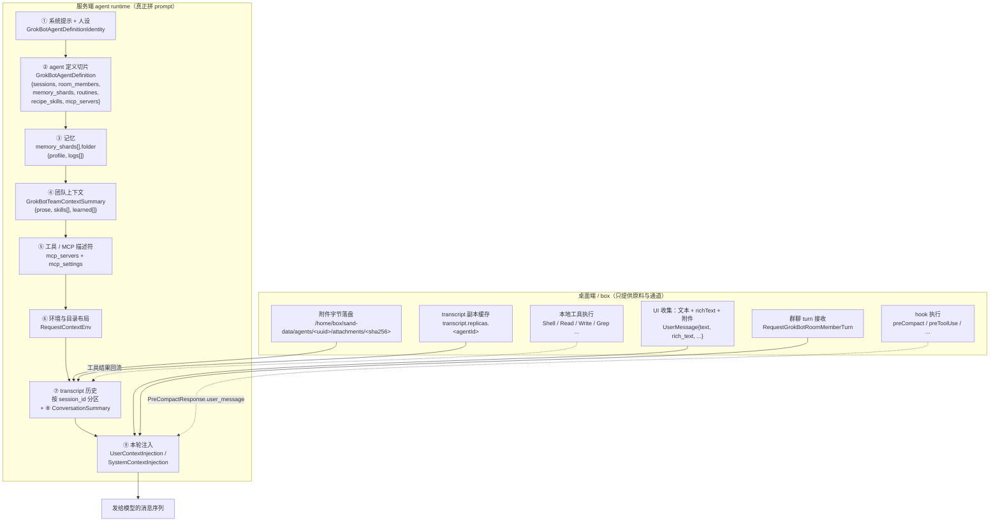

# Grok Bot 上下文与记忆架构（0.63.0 逆向）

> 调研对象：`app.asar` 解包产物 `.tmp-grok-bot/app`，版本 **0.63.0**，`sandBuiltAt = 2026-09-29T18:02:52Z`，产品名 Grok Bot（内部代号 `sand`，作者 SpaceXAI，Electron）
> 主证据文件：`dist/electron-main/proto.cjs`（1.04 MB，全量 protobuf 描述符）、`dist/local-exec-daemon/main.cjs`（3.24 MB，本地执行守护进程，内含完整 agent/context proto 表）、`dist/node-agent-coordinator/main.cjs`（767 KB）、`dist/electron-main/main-app.cjs`（2.16 MB）、`dist/renderer/assets/index.eager-app-B5P3neeI.js`（1.42 MB，UI 主包）
> 本机数据：`%APPDATA%\Grok Bot\sand-client-persistence\`（**只读**）
> 证据分级：`【代码】`= 反编译产物中提取；`【数据】`= 本机真实账户数据；`【推断】`= 基于前两者的合理推论；`未证实`= 明确标注
> 复现脚本：`.tmp-grok-bot/scripts/ws2-*.mjs`（只读，不改动 `app/`）

---

## 0. 一句话结论

**0.63.0 里"给模型的消息"不由桌面端拼接**：桌面/守护进程只提供 **本地上下文通道**（工具执行、附件字节、transcript 副本、box 目录布局）与**一次性注入的用户消息**；真正的上下文组装（系统提示 + 记忆 + 技能 + 工具/MCP + 压缩后的历史）发生在服务端 agent runtime，桌面端通过 `ConversationMessage` / `RequestContext` 这套 proto 与之对接。**"每个 bot 一份上下文"仍然是硬边界（per-agent transcript / per-agent box 目录 / per-agent memory 定义），但 0.63.0 第一次打开了"把单条记忆显式提升到团队"的通道（`PromoteGrokBotMemoriesToTeam`），并新增了 `GrokBotTeamContextSummary`——这是与 v0.47.0 最大的架构差异。**

---

## 1. 上下文组装顺序（0.63.0）

### 1.1 分层清单（含来源与优先级）

| # | 层 | 内容 | 由谁组装 | 载体 / 代码出处 | 优先级 |
|---|---|---|---|---|---|
| 1 | **系统提示 / 人设** | `GrokBotAgentDefinitionIdentity{name, description, title, role, visibility, slack}` | 服务端 | 【代码】`proto.cjs` `GrokBotAgentDefinitionIdentity`（`scripts/proto-all.txt:5657`） | 最高，模型不可覆盖 |
| 2 | **agent 定义（"我是谁"的完整切片）** | `GrokBotAgentDefinition{ sessions[], room_members[], member_of_rooms[], template_imports[], **memory_shards[]**, routines[], recipe_skills[], mcp_settings, mcp_servers[] }` | 服务端 | 【代码】`proto.cjs` / `local-exec-daemon/main.cjs` `GrokBotAgentDefinition.$()` @3133313 | 高 |
| 3 | **记忆** | `memory_shards[].folder{profile, logs[]}`（见 §3） | 服务端读取 + 注入 | 【代码】`GrokBotMemoryFolder|1 profile 9|2 logs 9,9` @proto.cjs 803981 | 高（人设级） |
| 4 | **团队上下文** | `GrokBotTeamContextSummary{memory_version, generated_at_ms, prose, summary_model}` + `skills[]` + `learned[]` | 服务端 | 【代码】`GetGrokBotTeamContextSummaryResponse|1 summary|4 stale|5 skills|6 learned|7 memory_count` | 中 |
| 5 | **技能** | `GrokBotAgentDefinitionSkill{id, description, content}`（`recipe_skills[]`）+ 账号级 `GrokBotAgentSkill{id,name,description,body,source}` | 服务端 | 【代码】`proto.cjs` `GrokBotAgentDefinitionSkill` | 中 |
| 6 | **工具 / MCP** | `GrokBotAgentDefinitionMcpServer{id,name,type,scope,plugin_id}` + `mcp_settings` | 服务端 | 【代码】`proto.cjs` `GrokBotAgentDefinitionMcpServer` | 中 |
| 7 | **工作区 / 目录布局** | `RequestContextEnv{workspace_paths[], project_folder, terminals_folder, agent_shared_notes_folder, agent_conversation_notes_folder, agent_transcripts_folder, artifacts_folder, mounted_agent_stores[]}` | 服务端组装，值来自 box | 【代码】`proto.cjs` `RequestContextEnv`（字段号 1–27） | 中 |
| 8 | **transcript 历史（会话分区）** | `GrokBotTranscriptEntry{seq, entry_kind, body, blob_hash, updated_seq, entry_id, body_omitted}`，按 `session_id` 分区 | 服务端读，桌面端缓存副本 | 【代码】`GrokBotTranscriptEntry`；【数据】本地 7 份 `transcript.replicas.<agentId>` | 中 |
| 9 | **压缩摘要** | `ConversationSummary{summary, truncation_last_bubble_id_inclusive, client_should_start_sending_from_inclusive_bubble_id, previous_conversation_summary_bubble_id, includes_tool_results, strategy}` | 服务端 | 【代码】`proto.cjs` `ConversationSummary` | 压缩后取代被截断区间 |
| 10 | **本轮显式注入** | `UserContextInjection{user_message, request_context}` / `SystemContextInjection{producer, content}` / `InjectContextAction{injection_id, expected_run_id, user_context, system_context}` | 桌面端或服务端 | 【代码】`proto.cjs` `UserContextInjection`/`SystemContextInjection`/`InjectContextAction` | 最高（追加在末尾） |
| 11 | **用户消息本体 + 附件** | `UserMessage{text, message_id, selected_context, mode, rich_text, hook_additional_contexts[], sent_by_agent_id}` | 桌面端 | 【代码】`proto.cjs` `UserMessage` | 最高 |
| 12 | **群聊投影** | `RequestGrokBotRoomMemberTurnRequest{room, member_agent_id, peers[], new_messages[], is_winding_down, deadline_ms}` | 服务端下发 | 【代码】`proto.cjs` `RequestGrokBotRoomMemberTurnRequest` | **独立通道，不写入成员工作 transcript**（见 §5） |

### 1.2 顺序图



### 1.3 关键结构性判断（为什么说组装不在桌面端）

- 【代码】`ConversationMessage`（`scripts/proto-all.txt:2499`，101 个字段）里同时存在 `conversation_summary`(31)、`cached_conversation_summary`(39)、`context_window_status`(76)、`context_pieces`(44)、`attached_folders`(11)、`attached_folders_list_dir_results`(38)、`attached_folders_new`(14)、`relevant_files`(17)、`knowledge_items`(58)、`mcp_descriptors`(83)、`project_layouts`(64)、`todos`(71) 等字段——这些是**一整轮对话消息的上下文附件**。桌面端没有任何一处代码把 `memory_shards`、`recipe_skills`、`mcp_servers` 拼进消息文本（`RequestContext` 是与之并列的另一个请求级容器，见 Step 5）。
- 【代码】`local-exec-daemon/main.cjs` 内 `GrokBotAgentDefinition`、`GrokBotMemoryFolder`、`GrokBotTeamContextSummary` 等类型**只以 proto 声明形态存在**（`@3132877` 起），全库检索 `memoryShard` 仅 1 次命中（即该字段名本身）；agent 运行时（daemon/coordinator）**没有任何一处真正读取记忆或注入 prompt 的代码**。
- 【代码】`update_state`（agent 写记忆的工具）在 `app/dist` 全量 511 个 JS/CJS 文件中，**只出现在渲染进程的模板初始化提示语里**（`index.eager-app-B5P3neeI.js` @708737、@708934），服务端/桌面端均无该工具的 schema 或实现。
- 【代码】`RequestContextEnv` 的所有路径字段（`terminalsFolder`、`agentSharedNotesFolder`、`agentConversationNotesFolder`、`agentTranscriptsFolder`、`artifactsFolder`）在 daemon 里仅出现 1 次（定义处 @2090195–@2090302），`RequestContext` 同样仅 7 次且全为类型定义 → 【推断】这些字段由服务端填充后下发，桌面端只负责让这些目录真实存在（box 沙箱 `.gitignore` 白名单里有 `agent-notes/`、`agent-transcripts/`、`agent-tools/`、`terminals/`，见 `local-exec-daemon/main.cjs` @2725436）。

---

## 2. 一个 bot 收到用户消息后，最终发给模型的消息由哪几段拼成

逐步还原（尽量标注代码出处）：
<br/>

**Step 1 · UI 收集裸输入**
`UserMessage{ text, message_id, rich_text, selected_context, mode, sent_by_agent_id, hook_additional_contexts[] }`
【代码】`proto.cjs` `UserMessage`（`scripts/proto-all.txt:13159`）。渲染端会区分 `visibleText`（给人看的）与 `modelText`（给模型的），两者可能不同——见 Step 6 的模板初始化实例。

**Step 2 · 附件单独落盘，不进文本**
附件条目 `kind:"user-attachment"` 带 `file_path`、`file_name`、`width/height/byteSize`、`batchId`。
【数据】`transcript.replicas.bd530ad7` `t1ua0`：
`file_path=/home/box/sand-data/agents/bd530ad7-ef2c-4ce2-ab77-4f5ab45b7d06/attachments/f22084965d8bc4358e67dcf569d96b65ef07b0f7d7cc767a6cc537ada419c0ef.png`，`byteSize=149285`。
→ **路径模板是 per-agent 的**：`sand-data/agents/<agentId>/attachments/<sha256>.<ext>`。

**Step 3 · transcript 追加一条 `message` 条目**
`{kind:"message", role:"user", content, richText, isStreaming, timestampMs, clientNonce, requestId, seq}`
【数据】7 份 transcript 副本共 174 条条目，字段统计：`kind/id/timestampMs/seq` 各 174，`role/content/isStreaming` 各 63，`richText` 38，`clientNonce` 46，`requestId` 93。

**Step 4 · 服务端构造 `ConversationMessage`**
把历史消息 + 该轮上下文附件打包：`conversation_summary` / `cached_conversation_summary` / `context_window_status` / `context_pieces` / `attached_folders_list_dir_results` / `cursor_rules` / `mcp_descriptors` / `project_layouts` / `todos` 等。
【代码】`proto.cjs` `ConversationMessage` 字段 31/38/39/43/44/64/71/76/83。

**Step 5 · 服务端构造 `RequestContext`（"这一轮的环境事实"）**
`RequestContext{ rules[], env, repository_info[], tools[], conversation_notes_listing, shared_notes_listing, git_repos[], project_layouts[], mcp_instructions[], skill_options, agent_skills[], file_contents, user_intent_summary, custom_subagents[], non_file_rules[], system_prompt_override }`
【代码】`proto.cjs` `RequestContext`（`scripts/proto-all.txt:9914`，53 个字段，含 `system_prompt_override`(53)）。

**Step 6 · 本轮可能的显式注入段**
- 模板初始化：`<bot_template_setup_context>{json}</bot_template_setup_context>` + `<bot_template_setup_instructions>1. …</bot_template_setup_instructions>`
  【代码】`index.eager-app-B5P3neeI.js` @710318–@712297（`modelText` 由可见文本 + 两段 XML 标签拼成）
  【数据】**实锤**：`transcript.replicas.1d2a1a9f` 的第 1 条 `content` 就是 `Hi Luma Pages. Please install these plugins and write your memories.\n\n<bot_template_setup_context>\n{ "routines": [], "plugins": [ { "plugin_id": "404", "name": "Notion", … } ], "memories": [ { "content": "Lane: builds and updates private Luma event pages…", "created_at": "2026-07-30" }, … ] }…`（全长 4413 字符，含 10+ 条记忆事实）。
  注意 `{"type":"doc",...}` 的 `richText` 只含可见文本 `Hi Luma Pages. Please install these plugins and write your memories.`——**modelText ≠ visibleText**。
- 压缩注入：`PreCompactRequestResponse{ user_message }`（见 §4）。
- hook 注入：`UserMessage.hook_additional_contexts[]` + `HookAdditionalContext`。
- 上下文注入动作：`InjectContextAction{ injection_id, expected_run_id, user_context, system_context }`。

**Step 7 · 群聊成员轮次（若这轮来自群聊）**
`RequestGrokBotRoomMemberTurnRequest{ room{id,name,description}, member_agent_id, peers[]{id,name,description}, new_messages[]{speaker_kind, speaker_name, is_self, text, reply_to}, is_winding_down, deadline_ms, parent_request_id, root_parent_request_id }`
【代码】`proto.cjs` `RequestGrokBotRoomMemberTurnRequest`。
→ **该请求体里没有任何"该成员记忆 / 该成员 transcript / 该成员技能"字段**：群聊只给"房间 + 同僚名单 + 新增群消息"。

**Step 8 · 模型输出回流**
`DeliverGrokBotRoomMemberTurnResultRequest{ room_id, nonce, member_agent_id, outcome, messages[], error, posts[] }`；`posts[]` 类型 `GrokBotRoomPost{text, message_json}`（0.63.0 新增字段）。
桌面端 agent 输出则记 `send-message` 条目（103 条 / 全部副本），可选带 `author{id,name}`、`toAgent{id,name}`、`reactons`、`respondedValue`。

---

## 3. 记忆（memory）的字段级真相

### 3.1 `GrokBotAgentDefinitionMemoryShard` 全部字段

【代码】`proto.cjs` @1012740 附近（类型名 `GrokBotAgentDefinitionMemoryShard`，`$()` 描述符）：

| 字段号 | 名称 | 类型 | proto 声明 | 语义（依据） |
|---|---|---|---|---|
| 1 | `scope` | string（**字符串，非枚举**） | `1 scope 9` | 记忆分片的作用域。**未证实具体取值**——全库无枚举定义、无字面量写入点（见 §3.5） |
| 2 | `scope_key` | string | `2 scope_key 9` | 该作用域下的具体键。**未证实具体取值** |
| 3 | `version` | uint64 | `3 version 13` | 分片版本号，用于同步/冲突（配合 `GrokBotTeamContextSummary.memory_version`） |
| 4 | `box_backfilled` | bool | `4 box_backfilled 8` | 该分片是否已回填到 box 目录（【推断】与 `HarnessMigration`/`box` 迁移相关） |
| 5 | `updated_at_ms` | int64 | `5 updated_at_ms 3` | 更新时间 |
| 6 | `folder` | message `GrokBotMemoryFolder` | `6 folder #0` | 分片内容载体（见 §3.2） |

### 3.2 `GrokBotMemoryFolder` 全部字段

【代码】`proto.cjs` @803981：`GrokBotMemoryFolder|1 profile 9|2 logs 9,9`

| 字段号 | 名称 | 类型 | 语义 |
|---|---|---|---|
| 1 | `profile` | string | 单值"画像/长期事实"层 |
| 2 | `logs` | repeated string | 累积式"流水记忆"层 |

**关键交叉证据**：agent 写记忆的指令是 `update_state target "memory" action "write" and tier "log"`
【代码】`index.eager-app-B5P3neeI.js` @708737（常量 `UA`）。
→ `tier: "log"` 直接对应 `folder.logs[]`；【推断】另一个 tier（未在 0.63.0 客户端出现）对应 `folder.profile`。这解释了 `profile` 单值 + `logs` 复数的形状差异。

### 3.3 配套 RPC 与字段（0.63.0 全部记忆相关协议）

| RPC / 类型 | 字段 | 出处 |
|---|---|---|
| `GrokBotMemoryFact` | `1 fact_id 9`、`2 text 9`、`3 learned_at_ms 3` | proto.cjs @913846 |
| `ListGrokBotUserBotMemoriesRequest` | `1 agent_id 9` | @3036388 |
| `ListGrokBotUserBotMemoriesResponse` | `1 memories #0*`（`GrokBotMemoryFact`） | @3036759 |
| 客户端 mapper `c6(e)` | `function c6(e){return{factId:e.factId,text:e.text,learnedAtMs:Number(e.learnedAtMs)}}`（`main-app.cjs` @1899171 附近） | 三字段直传 |
| 面板 UI 渲染项 `Pl(s)` | `{date: We(s.learnedAtMs), text: s.text, factId: s.factId}` —— 仅渲染「日期 + 正文」，`key=s.factId ?? date-text` | `chunk-view-Bq7of5fi.js` @46892 / @6321 |
| `PromoteGrokBotMemoriesToTeamRequest` | `1 agent_id 9`、`2 fact_ids 9*` | @3037151 |
| `PromoteGrokBotMemoriesToTeamResponse` | `1 created #0*`、`2 already_in_team #0*`、`3 kept_private_count 13` | @3037583 |
| `GetGrokBotTeamContextSummaryRequest` | `1 agent_id 9` | @3035112 |
| `GetGrokBotTeamContextSummaryResponse` | `1 summary #0?`、`4 stale 8`、`5 skills #1*`、`6 learned #2*`、`7 memory_count 13` | @3035532 |
| `GrokBotTeamContextSummary` | `1 memory_version 13`、`2 generated_at_ms 3`、`3 prose 9`、`4 summary_model 9` | @3034359 |
| `GrokBotTeamContextLearnedEntry` | `1 fact_id 9`、`2 text 9`、`3 learned_at_ms 3` | proto.cjs @912076 |
| `GrokBotTeamAgentSharedState` | `1 participants`、`2 agent_memory?`、`3 marketplace?`、`4 plugins[]`、`5 routines[]`、`6 recipe_skills[]`、`7 boxes[]` | daemon @3148558 |

**⚠️ 与 v0.47.0 的差异（重要）**：旧文档记载的 `ListGrokBotMemoryShards` / `PutGrokBotMemoryShard` **在 0.63.0 中已不存在**（`proto.cjs` 与 `local-exec-daemon/main.cjs` 双向检索均为 0 命中）。取而代之的是：
- `ListGrokBotUserBotMemories`（列出该 bot 的"事实"清单，供 UI 展示与勾选）
- `PromoteGrokBotMemoriesToTeam`（把选定 fact 提升为团队记忆）
- `GetGrokBotTeamContextSummary`（读团队上下文摘要）

### 3.4 记忆的读写时机（谁在什么时候写）

| 场景 | 写入者 | 证据 |
|---|---|---|
| **模板初始化（自动蒸馏/搬运）** | 渲染端拼一条带 `<bot_template_setup_context>` 的用户消息，**要求 agent 自己写**：`For every memory, persist the content with update_state target "memory" action "write" and tier "log". Do not invent extra facts. Use the listed created_at when present.` | 【代码】`index.eager-app-B5P3neeI.js` @708934；【数据】`transcript.replicas.1d2a1a9f` 第 1 条 content（含 4413 字符模板上下文） |
| **用户显式添加** | UI 按钮 **"Add Memories"** | 【代码】`index.eager-app-B5P3neeI.js` i18n `UtuiyF:"Add Memories"` @43975 |
| **提升到团队** | 用户在记忆列表勾选 fact → `promoteGrokBotMemoriesToTeam({agentId, factIds})` | 【代码】`index.eager-app-B5P3neeI.js` @381519（`promoteToTeam:(n,s)=>e.desktop.promoteGrokBotMemoriesToTeam({agentId:n,factIds:s})`）；`main-app.cjs` @1899406（`promoteMemoriesToTeam` 实现）；`chunk-view-Bq7of5fi.js` @43768（多选 UI，`M.has(K.factId)&&!$.has(K.factId)` 计算待提升集合） |
| **团队上下文摘要生成** | 服务端（`summary_model` 字段说明由某个模型生成 prose）；**桌面端无任何调用点** | 【代码】`GrokBotTeamContextSummary.summary_model`；`getGrokBotTeamContextSummary` 在 `proto.cjs`/daemon/coordinator 仅出现于 service registry（daemon @3167448），**无实际调用** |
| **agent 自主写** | 通过服务端工具 `update_state`（桌面端无实现） | 【代码】仅渲染端提示语出现 |

### 3.5 记忆注入 prompt 的位置与格式

- **位置**：【推断】在系统提示之后、工具描述之前（与 `memory_shards` 在 `GrokBotAgentDefinition` 中的位置一致）。
- **格式**：
  - 单 bot 记忆（人设级）→ 【推断】按 `folder.profile` 渲染一段文本 + `folder.logs[]` 逐条列出。
  - 模板搬运场景 → 【数据】实锤为 JSON 内嵌 XML 标签：`<bot_template_setup_context>{ "memories": [ {"content": "...", "created_at": "2026-07-30"}, ... ] }</bot_template_setup_context>`。
  - 团队记忆 → `GrokBotTeamContextSummary.prose`（模型生成的散文）+ `learned[]`（逐条 `{fact_id,text,learned_at_ms}`）+ `skills[]`。
- **未证实**：单 bot 记忆注入的确切模板字符串（服务端代码未在解包产物中）。

### 3.6 `scope` / `scope_key` 能取什么值？——**未证实，但有强约束**

诚实的结论：**0.63.0 桌面端产物中没有任何 `scope` / `scope_key` 的字面量取值、枚举或写入点。**

- 【代码】`scope_key` 在整个 `app/dist` 中只出现 **1 次**（`GrokBotAgentDefinitionMemoryShard` 描述符本身 @3135106）；`scope` 的其他 245 次命中全部是 OAuth/MCP 的 `scopes`（无关）。
- 【代码】无 `GrokBotMemoryScope` 之类的枚举；65 个 `GrokBot*` 枚举（已全量导出，见 `scripts/ws2-proto3.mjs`）中没有记忆作用域枚举。
- 【代码】唯一带 `scope` 的 GrokBot 类型是 `GrokBotPluginScope{1 agent_id 9|2 session_kind 9}`——说明这个代码库用 **`scope` = 分类字符串 + `scope_key` = 该分类下的键** 的模式（这里是"agent_id + session_kind"）。
- **强约束（可证伪的边界）**：
  1. `memory_shards[]` 嵌套在 **per-agent** 的 `GrokBotAgentDefinition` 内 → 【代码】记忆**默认是 per-agent 的**。
  2. 记忆写入的 tier 是 `"log"`，落到 `folder.logs[]` → 【代码】记忆有"层级"概念。
  3. 存在 `PromoteGrokBotMemoriesToTeam`（fact_ids 级别）→ 【代码】**跨 agent 共享只发生在"团队"这一层，且必须显式提升，粒度是单条 fact**。
  4. `kept_private_count` 字段 → 【代码】未提升的记忆保持私有。
- 【推断】`scope` ∈ {`"agent"` / `"user_bot"` / `"team"`} 之类的分类字符串，`scope_key` 为对应 id（agent_id / auth_id / team_id）。**这是推断，不是代码级答案。**

### 3.7 本机数据的记忆线索

- 【数据】`sand-client-persistence` 共 18 个文件、104,347 字节，**没有记忆分片/团队记忆的落盘**。全部 key：

  ```
  sand.client.slice.ui-layout
  sand.client.slice.client-meta.account-slot
  sand.client.slice.first-run.device-onboarded
  sand.client.slice.account.google-oauth2|<authId>.bot-templates.export-policy
  sand.client.slice.account.google-oauth2|<authId>.connection.last-host-capabilities
  sand.client.slice.account.google-oauth2|<authId>.roster.last-roster
  sand.client.slice.account.google-oauth2|<authId>.selection.last-agent
  sand.client.slice.account.google-oauth2|<authId>.send-journal
  sand.client.slice.account.google-oauth2|<authId>.sidebar.last-sections
  sand.client.slice.account.google-oauth2|<authId>.transcript.replicas.<agentId>   ×7
  sand.client.slice.account.google-oauth2|<authId>.ui-agent-refs
  ```
  → 【推断】本地只缓存"客户端切片"（client slice），**记忆 / 技能 / 团队上下文全部留在服务端 + box 的 `store.db`**（box 处于云端，本次未能读取）。
- 【数据】roster 里每个 agent（含群组）都有独立 box 目录：`/home/box/sand-data/agents/<uuid>/store.db`；`harness:"temporal"`。
- 【数据】**记忆中未出现**"compact 事件"条目：174 条 transcript 条目中 `kind` 只有 `send-message`(103)、`message`(63)、`user-attachment`(8)。没有 `tool-call`、`event`、`compaction` 条目类型 → 【推断】压缩事件不作为 transcript 条目落盘（本地缓存只保留 UI 渲染所需的行）。

---

## 4. 压缩 / 摘要

### 4.1 `@anysphere/agent-summarization` 在 0.63.0 桌面产物中**不存在**

- 【代码】`package.json` 确实声明了 `"@anysphere/agent-summarization": "workspace:*"`（`app/package.json:20`），连同 `@anysphere/context`(29)、`@anysphere/context-rpc`(30)、`@anysphere/agent-transcript`(21)、`@anysphere/agent-kv`(18)、`@anysphere/agent-store-sync`(19)。
- 【代码】对 `app/dist` 下 **511 个 JS/CJS 文件**做全量字符串检索：`agent-summarization`、`@anysphere/context`、`context-rpc`、`agent-kv`、`agent-store-sync`、`@anysphere/grok-bot`、`grok-bot-harness` **全部 0 命中**；`agent-transcript` 只有 3 处命中，且全部是 box 沙箱目录名常量 `"agent-transcripts"`（daemon @1050135）及其在沙箱 `.gitignore` 白名单里的两次出现（@2725436、@2725469）——**没有一处是该 npm 包的代码**。
- **结论**：`workspace:*` 依赖在 Electron 打包时被"只打进去被引用的部分"，summarization / context / context-rpc / agent-kv / agent-store-sync 这几包是**服务端（agent runtime / gateway）的依赖**，桌面包里只剩协议契约。
- 【代码】顺带澄清：daemon 里唯一的 `summariz` 是日志函数 `summarizeDroppedEvents`（丢帧统计），与 LLM 摘要无关。

### 4.2 真正的压缩机制：`PreCompact` hook + `ConversationSummary`

**触发条件（协议级，`PreCompactRequestQuery` 的字段就是触发输入）**
【代码】`local-exec-daemon/main.cjs` @2199229（`agent.v1` 包，类型 `PreCompactRequestQuery`）：

| 字段号 | 名称 | 类型 | 说明 |
|---|---|---|---|
| 1 | `trigger` | string | 触发原因（字符串，非枚举；取值未证实） |
| 2 | `context_usage_percent` | float | **上下文占用百分比** |
| 3 | `context_tokens` | int64 | 当前 token 数 |
| 4 | `context_window_size` | int64 | 上下文窗口大小 |
| 5 | `message_count` | int32 | 消息总数 |
| 6 | `messages_to_compact` | int32 | **本次要压缩多少条** |
| 7 | `is_first_compaction` | bool | 是否首次压缩 |
| 8–11 | `conversation_id` / `generation_id` / `model` / `model_id` | string? | 归属 |
| 12 | `model_params` | repeated | 模型参数 |

`PreCompactRequestResponse{ 1 user_message 9? }` — **返回一条可选的 user 消息**。

→ 所以：**触发条件是"上下文占用百分比 + 要压缩的消息条数"，且压缩后由客户端/hook 决定插入一条什么 user 消息**。这不是桌面的"轮数阈值"，是服务端按 token 占用算出来的。

**hook 挂载点（0.63.0 完整 hook 事件表）**
【代码】`local-exec-daemon/main.cjs` @2238375–@2244689：

| hook 事件 | 校验器 | 说明 |
|---|---|---|
| `beforeShellExecution` / `beforeMCPExecution` | `Mre` | |
| `afterShellExecution` / `afterMCPExecution` | `uTe` / `cTe` | |
| `beforeReadFile` / `afterFileEdit` | `fTe` / `aTe` | |
| `beforeTabFileRead` / `afterTabFileEdit` | `pTe` / `lTe` | |
| `beforeSubmitPrompt` | `dTe` | |
| `stop` | `ETe` | |
| `afterAgentResponse` / `afterAgentThought` | `oTe` / `sTe` | |
| `sessionStart` / `sessionEnd` | `yTe` / `STe` | |
| **`preCompact`** | `gTe` — 校验 `user_message must be a string if provided` | **压缩前注入** |
| `subagentStart` / `subagentStop` | `wTe` / `xTe` | 校验 `permission ∈ {allow,deny,ask}` / `followup_message` |
| `preToolUse` / `postToolUse` / `postToolUseFailure` | `_Te` / `mTe` / `hTe` | |
| `workspaceOpen` | `bTe` | 校验 `pluginPaths[]` |

执行通道：`ExecuteHookRequest`（oneof，字段 1 = `pre_compact`）→ `ExecuteHookResponse`；执行器注册为 `executeHookArgs` / `executeHookResult`。
【代码】`local-exec-daemon/main.cjs` @2217001、@2243200。

### 4.3 摘要写回哪里？原始消息是否保留？

- 【代码】`ConversationSummary{ summary, truncation_last_bubble_id_inclusive, client_should_start_sending_from_inclusive_bubble_id, previous_conversation_summary_bubble_id, includes_tool_results, strategy }`
  → **摘要是一个"指针式"结构**：`truncation_last_bubble_id_inclusive` 标记"截断到哪条之前"，`client_should_start_sending_from_inclusive_bubble_id` 告诉客户端"从哪条开始重新发"，`previous_conversation_summary_bubble_id` 形成摘要链。
- 【代码】`ConversationMessage` 同时有 `conversation_summary`(31) 与 `cached_conversation_summary`(39) → 支持多层/缓存摘要。
- 【代码】`ContextWindowStatus{ percentage_remaining, tokens_used, token_limit, percentage_remaining_float }` —— UI/客户端侧的剩余窗口状态。
- **写回目标**：**不是 transcript，也不是 memory shard**。协议里没有任何"摘要写入 memory_shard"的路径（`memory_shards` 只由 `folder.profile/logs` 组成，无摘要字段）。
  → 【推断】压缩结果作为 `ConversationMessage.conversation_summary` 随下一轮请求发送，**原始消息仍保留在服务端 transcript**（本地缓存的 7 份副本里，最老的条目 `seq=1` 仍在，且 `epochHint` 允许"重放"——见 `transcript.replicas.ab2c2a47` 的 `epochHint:"568e2886-…:0"` + `acceptedSequenceHint:11`，说明客户端按 epoch 重放/对齐而非裁剪）。
- **未证实**：`ConversationSummary.strategy` 的取值集合、`trigger` 的取值集合。

### 4.4 `chunk-compact-*.js` 是什么？——**它不是 `/compact`**

- 【代码】`dist/renderer/assets/chunk-compact-C8-lyxgK.js`，571,490 字节。全文检索 `compact` **0 命中**；文件内容是一整段 JSON：`const e=JSON.parse(`[{"hexcode":"1F1E6","label":"regional indicator A",…}]`)` —— 即 **emojibase 的紧凑（compact）表情数据表**（5225 个表情，最后一条是 `flag: Wales`）。
- 【代码】全库检索 `"/compact"`、`compactContext`、`autoCompact`、`auto_compact` 均为 **0 命中**；渲染端 `compact` 的其余命中是 `compact_terminal` 特性开关、`effort_first_compact_model_ids`（实验配置）、`compactpro`/`relax-ng-compact-syntax`（MIME 表）。
- 【代码】唯一与压缩有关的用户可见配置是 **Statsig 配置 `client_speculative_summarization_config`**：`{ tokenUsageThresholdPercentage: 70, tolerancePercentage: 5, inflightMaxAgeMinutes: 5, speculativeStreamTimeoutMinutes: 5 }`
  【代码】`main-app.cjs` @1183446（fallbackValues），schema 定义 @1143737。
  → 【推断】存在"**70% 上下文占用时开始投机摘要**"的服务端策略，但该配置名带 `client_`，**且它的相邻配置是 `editor_bugbot_config`（默认模型 `claude-4-5-sonnet-20250929`）、`meta_agent_config`——明显属于 Cursor IDE agent 的配置组，而非 Grok Bot**；**未能证实它作用于 Grok Bot**，仅作为线索列出。

---

## 5. 隔离与共享边界

### 5.1 边界表

| 维度 | 是否 per-agent | 证据 |
|---|---|---|
| **transcript** | ✅ **per-agent**（且按 `session_id` 再分区） | 【代码】`List/CommitGrokBotTranscriptEntriesRequest.session_id`；【数据】7 份 `transcript.replicas.<agentId>`，文件名就是 agent uuid |
| **box 文件与附件** | ✅ **per-agent 目录**（同一台 box） | 【数据】`/home/box/sand-data/agents/<uuid>/{store.db,attachments/<sha256>.png}` |
| **记忆（memory_shards）** | ✅ **默认 per-agent**（挂在 `GrokBotAgentDefinition` 内） | 【代码】`GrokBotAgentDefinition` 字段 5 |
| **记忆提升到团队** | ⚠️ **可以，但必须显式** | 【代码】`PromoteGrokBotMemoriesToTeam{agent_id, fact_ids[]}` → `{created[], already_in_team[], kept_private_count}` |
| **团队上下文摘要** | ⚠️ **团队级共享**（按 agent 查询，但内容跨 agent） | 【代码】`GetGrokBotTeamContextSummaryResponse{summary, stale, skills[], learned[], memory_count}` |
| **技能** | ✅ per-agent（`recipe_skills[]`）+ 账号级技能库 | 【代码】`GrokBotAgentDefinitionSkill` + `GrokBotAgentSkill` |
| **MCP / 插件** | ✅ per-agent | 【代码】`GrokBotAgentDefinitionMcpServer{scope, plugin_id}` |
| **会话（MAIN/DM/SLACK_*/GROUP）** | ✅ **同一 agent 内按 session 分区** | 【代码】`GrokBotAgentSessionKind` 枚举 |
| **群聊** | ✅ **独立 agent 实体**（`isGroup:true`），有自己 transcript / 自己的 box 目录 | 【数据】`roster.last-roster` `bd530ad7` `isGroup:true` `memberIds:[4 个]` |
| **本地客户端缓存（client slice）** | ✅ per-account（不是 per-agent），含各 agent 的 transcript 副本 | 【数据】key 前缀 `sand.client.slice.account.<authId>.*` |

### 5.2 `GrokBotAgentSessionKind` 完整枚举（0.63.0）

【代码】`local-exec-daemon/main.cjs` @2913386：

```
0 = UNSPECIFIED
1 = MAIN
2 = SLACK_DM
3 = SLACK_THREAD
4 = DM
5 = GROUP     ← 0.63.0 新增（v0.47.0 无）
```

**⚠️ 与 v0.47.0 的差异（修正）**：旧文档写的是 `DM=2, SLACK_DM=3, SLACK_THREAD=4`；0.63.0 的实际编号是 `SLACK_DM=2, SLACK_THREAD=3, DM=4`，并**新增 `GROUP=5`**。旧文档"枚举里没有 ROOM/GROUP"的论断在 0.63.0 **已不成立**——群聊现在是一个有 `session_kind` 的一等会话种类。

### 5.3 群聊上下文 vs bot 工作上下文：**旧结论在 0.63.0 仍然成立（且样本更强）**

用 0.63.0 的真实数据复核（全部来自 `%APPDATA%\Grok Bot\sand-client-persistence`）：

**样本规模升级**：群组「拼死拼活组」`bd530ad7` 现在有 **49 条**条目（v0.47.0 是 3 条），成员从 2 个增加到 **4 个**（绿毛仔 `db2f7e9d`、前端熬夜仔 `d4c37f88`、优化到起飞仔 `50ba98ed`、偷感十足仔 `801c18df`）。

**群组 transcript 的内容形态**（49 条）：

```
#1  message [user]       你们好，现在拼死拼活组正式成立了…
#2  send-message [author:绿毛仔]        拼死拼活组就是咱俩一起扛工程活的…
#3  send-message [author:前端熬夜仔]    对，我这边专扛前端页面…
#4  user-attachment []   image.png
#6  send-message [author:绿毛仔]        对，可点的标签 hover 应该变手指。@前端熬夜仔…
#34 send-message [author:前端熬夜仔]    理解。上排工作区对齐 Morphing Tabs…
#35 send-message [author:优化到起飞仔]  补一句性能：上排 Morphing Tabs 若用测量布局再滑动，tab 一多容易卡一下…
#36 send-message [author:偷感十足仔]    补接入这一侧：这是把 beui 的 Morphing Tabs 接到现有两排梯形 tab 上…
#45 send-message [author:前端熬夜仔]    @everyone 双行标签已改到 DESKTOP-Q094PDB…
```

**复核结论（5 条全部可验证）**：

| 旧结论 | 0.63.0 复核 | 证据 |
|---|---|---|
| 群聊有自己的 transcript，与成员 transcript 不是同一份 | ✅ **仍然成立** | `bd530ad7` 49 条；成员各自的副本里**没有任何 `author` 字段条目** |
| 群聊发言不写入发言者自己的工作 transcript | ✅ **仍然成立** | 绿毛仔副本 `db2f7e9d`（61 条）中 `author` 出现 **0 次**；`bd530ad7` 中的 28 条 `author` 条目只存在于群组副本 |
| 群消息逐成员投影、`is_self` 标记自己 | ⚠️ **协议仍在，但渲染端依旧不读** | 【代码】`is_self`/`isSelf` 在 `proto.cjs`+daemon+coordinator 各只出现 2 次（`GrokBotRoomMemberTurnMessage` 及其 `ReplyTarget`），**无读取点**；【数据】群组副本用 `author{id,name}` 而非 `is_self` |
| 跨 bot 消息是"投递一条 user 消息" | ✅ **仍然成立** | 前端熬夜仔副本 `d4c37f88`：`#1 message from=绿毛仔` → `#2 message to=绿毛仔`；绿毛仔副本 `db2f7e9d`：`#41 message to=前端熬夜仔` → `#43 message from=前端熬夜仔`。**同一句在发送方是 `toAgent`、接收方是 `fromAgent`** |
| 编排在服务端 | ✅ **仍然成立（且更明确）** | 【代码】`requestGrokBotRoomMemberTurn` / `deliverGrokBotRoomMemberTurnResult` / `cancelGrokBotRoomMemberTurn` 在 daemon+coordinator 各出现 **1 次**（只在 service registry），**无调用点**；`RequestGrokBotRoomMemberTurnResponse{dispatch, member_agent_id, **workflow_id**}` 中的 `workflow_id` 直接指向 Temporal 工作流 |

**0.63.0 的新增细节**：群成员还会**主动广播到群**——`d4c37f88` 副本 `#37 message to=拼死拼活组(bd530ad7)`，即成员 agent 的副本里出现了 `toAgent = 群组` 的条目。群组本身因此**既是接收方也是发送方**。

### 5.4 群聊 turn 请求**不携带**成员工作上下文（代码级确认）

`RequestGrokBotRoomMemberTurnRequest` 的 **9 个字段里没有一处**能承载该成员的记忆、技能、transcript 或工具：

```
1 nonce                    6 is_winding_down
2 room{id,name,description} 7 deadline_ms
3 member_agent_id          8 parent_request_id
4 peers[]{id,name,description} 9 root_parent_request_id
5 new_messages[]{speaker_kind, speaker_name, is_self, text, reply_to}
```

→ 【代码】**群聊轮次是"增量推送"而非"上下文共享"**：成员拿到房间信息 + 同僚名单 + 新增群消息，剩下的"我是谁 / 我记得什么 / 我有哪些技能"由它自己的 agent runtime 补上。这与 §1.3 的判断一致：**上下文组装在服务端，群聊只是触发源之一**。

---

## 6. context folder：**未证实存在这个产品概念**

任务提示的解包产物里有 `dist/renderer/assets/context-folder-B7_jGHrF.webp` 图标。核查结果：

1. 【代码】**该图标在整个 `app/` 目录（567 个文件，含全部 `.js`/`.cjs`/`.mjs`/`.css`/`.html`）中没有任何引用**。字符串 `context-folder` 0 命中；`B7_jGHrF` 0 命中；`.webp` 的全部命中只有 6 处，其中渲染端 2 处是 MIME 扩展名映射表（`".webp":"image/webp"`），另 3 处是内联 webp 图片（集成商城 logo，如 Slack/Figma），与 `context-folder` 无关。
2. 【代码】**没有 `GrokBotContextFolder` 或任何 `ContextFolder` proto 类型**。全量 2048 个 proto 类型中，名称含 `Folder` 的只有：`FolderFileInfo`、`FolderInfo`、`GrokBotMemoryFolder`、`SelectedFolder`。
3. 【代码】**渲染端国际化文案里没有 "context folder" 字符串**（`"context folder"` / `"Context folder"` 均 0 命中）；`index.eager-app-B5P3neeI.js` 里含 "folder" 的长文本只有两条：`"The folder changed after Cursor proposed it…"`、`"List a folder on your computer"`（后者是本地工具描述，对应 box 上的 `Ls` 工具）。
4. 【代码】**最接近的机制是 `ConversationMessage.attached_folders`**：
   - `ConversationMessage` 字段 11 `attached_folders` (repeated string)
   - 字段 14 `attached_folders_new`（另一版结构）
   - 字段 38 `attached_folders_list_dir_results`（挂载目录的 `ls` 结果缓存）
   - 相关类型：`SelectedFolder{1 path 9|2 relative_path 9?|3 directory_tree #0}`、`FolderInfo{1 relative_path 9|2 files #0}`、`AgentWorkspaceBinding{1 id 9|2 display_name 9|3 private_workspace_identifier #0}`
5. 【代码】另一个"文件夹进上下文"的通道是**技能目录**：`addGrokBotAgentSkill` 接受 `files`，UI 用 `folderInputRef` 做目录选择（`chunk-team-bot-context-dialog-Gocmvno9.js` @1721、@2167）——即"把整个文件夹上传成技能"，不是"挂载为对话上下文目录"。
6. 【代码】box 沙箱的 `.gitignore` 白名单把几类目录显式暴露给 agent 读取（`local-exec-daemon/main.cjs` @2725436）：
   ```
   !projects/*/agent-transcripts/**   # Agent transcripts for citation
   !projects/*/terminals/**           # Terminal output files
   !projects/*/agent-notes/**         # Conversation notes (shared scratchpad)
   !projects/*/agent-tools/**         # Large tool output files
   !plugins/**  !skills-cursor/**  !skills/**  !commands/**  !plans/**  !subagents/**  !rules/**
   ```
   并且有专门的 `ReadAgentTranscript` 工具：`ReadAgentTranscriptArgs{tool_call_id, agent_id, mode, max_turns}` → `ReadAgentTranscriptSuccess{transcript, truncated}`。
   → 【推断】**"读别人的 transcript"是存在的，但走的是显式工具调用（并会被截断），不是自动挂载目录。**

**结论（未证实）**：0.63.0 中不存在名为 "context folder" 的产品概念。`context-folder-*.webp` 是一个**孤立资源**（打包残留/未引用的 UI 资源），**不能**据此推断存在"用户显式挂载上下文目录"的功能。真正存在的三种"文件夹"是：(a) `ConversationMessage.attached_folders`（对话级挂载，协议存在，客户端填充点未在解包产物中找到）；(b) 技能目录上传；(c) box 上的 `agent-notes/` `agent-transcripts/` `agent-tools/` `terminals/` 目录族 + `ReadAgentTranscript` 工具。

---

## 7. 与 v0.47.0 旧文档的差异清单

（旧文档：`grok-bot-context-sharing-research.md`、`grok-bot-groupchat-internals-research.md`，均为 0.47.0，**未修改**）

| # | 项目 | v0.47.0 旧文档 | 0.63.0 实测 | 类型 |
|---|---|---|---|---|
| 1 | **记忆 RPC** | `ListGrokBotMemoryShards` / `PutGrokBotMemoryShard` | **已不存在**（0 命中）；改为 `ListGrokBotUserBotMemories` / `PromoteGrokBotMemoriesToTeam` / `GetGrokBotTeamContextSummary` | **能力新增** |
| 2 | **记忆可否跨 agent** | 旧文档 §9.2 标注"**未证实**，`scope`/`scope_key` 理论上留了口子" | **已证实存在显式的跨 agent 共享通道**：`PromoteGrokBotMemoriesToTeam{agent_id, fact_ids[]}` → `{created[], already_in_team[], kept_private_count}`；配套团队上下文 `GrokBotTeamContextSummary`（含 `memory_version` / `prose` / `summary_model` / `learned[]`） | **旧未证实点已被回答** |
| 3 | `GrokBotMemoryFolder` | 旧文档只记录 `folder{profile}` | `{profile, logs[]}` —— **多了 `logs` 复数层**，对应 agent 写记忆时的 `tier:"log"` | **结构变更** |
| 4 | `GrokBotAgentDefinitionMemoryShard` | 6 字段（scope, scope_key, version, box_backfilled, folder） | 字段级确认同为 6 个，**新增 `updated_at_ms`(5)** | **结构变更** |
| 5 | `GrokBotAgentSessionKind` | "枚举里没有 ROOM/GROUP" | **有 `GROUP=5`**；且编号变为 `SLACK_DM=2, SLACK_THREAD=3, DM=4` | **旧结论被推翻** |
| 6 | 群聊规模 | 群组 transcript 3 条 / 2 成员 | **49 条 / 4 成员**；群成员可 `toAgent=群组` 广播 | **规模与行为扩展** |
| 7 | 群聊 turn 协议 | `nonce, room, member_agent_id, peers[], new_messages[], is_winding_down, deadline_ms, parent/root_parent_request_id` | **字段完全一致**；`DeliverGrokBotRoomMemberTurnResultRequest` **新增 `posts[]`**（`GrokBotRoomPost{text, message_json}`）；响应新增 `workflow_id` | **结构变更** |
| 8 | 群聊不写入成员工作 transcript | 成立 | ✅ **仍然成立**（4 个成员副本 `author` 字段 0 命中；群组副本 28 条 `author`） | **旧结论确认** |
| 9 | 编排在服务端 | 成立（`TEMPORAL_HARNESS_MODE`） | ✅ 仍然成立；`RequestGrokBotRoomMemberTurnResponse.workflow_id` 是更直接的证据 | **旧结论确认（证据升级）** |
| 10 | 压缩/摘要机制 | 旧文档未涉及 | 新增完整 `PreCompact` hook 协议 + `ConversationSummary` 指针结构 + `ContextWindowStatus` | **新增发现** |
| 11 | 团队上下文 | 旧文档未涉及 | `GrokBotTeamContextSummary` / `GrokBotTeamContextLearnedEntry` / `GrokBotTeamAgentSharedState.agent_memory` | **新增发现** |
| 12 | transcript 条目结构 | `{seq, entry_kind, body, blob_hash, updated_seq}` | **新增 `entry_id`(6) 与 `body_omitted`(7)**；本地副本实测 `kind` 仅 3 类（`send-message`/`message`/`user-attachment`），另有 `fromAgent`/`toAgent`/`author`/`reactons`/`respondedValue`/`batchId` | **结构变更** |

**最值得强调的差异是 #2**：v0.47.0 留下的最大空白（"记忆能否跨 agent 共享"）在 0.63.0 有了代码级答案——**默认不能，但存在一条产品化的显式通道：把单条 fact 提升为团队记忆**。这条通道在客户端有完整的 UI（记忆列表勾选 → 提升 → "Shared with team" 状态），并在 `main-app.cjs` 有完整实现（`listUserBotMemories` / `promoteMemoriesToTeam`）。

---

## 8. 未证实清单（诚实标注）

1. **`scope` / `scope_key` 的取值集合**：全库无枚举、无字面量、无写入点。只能给出约束（per-agent 默认 + 团队显式提升 + tier=`log`↔`folder.logs`）。§3.6 的候选值是【推断】。
2. **系统提示的确切模板字符串**：服务端代码不在解包产物内。本地只能看到渲染端为模板初始化拼的 `<bot_template_setup_context>` / `<bot_template_setup_instructions>` 两段（这**不是**系统提示）。
3. **`PreCompactRequestQuery.trigger` 的取值集合**、**`ConversationSummary.strategy` 的取值集合**：均未在产物中出现。
4. **压缩是否真在 70% 触发**：`client_speculative_summarization_config{tokenUsageThresholdPercentage:70, tolerancePercentage:5}`（`main-app.cjs` @1183446）是唯一的阈值线索，但其相邻配置为 `editor_bugbot_config` / `meta_agent_config`，**属于 Cursor IDE agent 的 Statsig 配置组**；未能证实作用于 Grok Bot。
5. **`attached_folders` 的客户端填充点**：协议字段存在（`ConversationMessage` 11/14/38 + `SelectedFolder`/`FolderInfo`/`AgentWorkspaceBinding`），但在 `app/dist` 全量检索 `attachedFolders`/`attached_folders` **0 命中** → 填充逻辑在服务端或未打包进桌面的模块。
6. **团队上下文摘要由哪个模型生成、何时重算**：`summary_model` 字段只能证明"由某个模型生成"，`stale` 字段证明"会过期"，但生成时机与模型名未证实。
7. **`is_self` 由谁设置**：与 v0.47.0 相同，协议字段存在但渲染端/执行端零读取点。
8. **`ReadAgentTranscript` 的调用方**：工具协议存在（含 `max_turns` 截断），但调用点在服务端，客户端无实现。
9. **`context-folder-*.webp` 的真实用途**：孤立资源，推测为未引用残留或新功能的半成品资源，**无任何代码证据**。

---

## 9. 证据索引

| 结论 | 证据位置（可复现） |
|---|---|
| 版本 0.63.0 / 构建时间 | `app/package.json`（`version`、`sandBuiltAt`）；`app/dist/electron-main/main.cjs`（`buildId`） |
| `@anysphere/*` 依赖声明 | `app/package.json:13-53`（`agent-summarization`:20、`context`:29、`context-rpc`:30、`agent-transcript`:21、`agent-kv`:18、`agent-store-sync`:19） |
| 上述包在桌面包内 0 命中 | 全量扫描 `app/dist` 511 个 JS/CJS（脚本 `scripts/ws2-count.mjs`） |
| `GrokBotAgentDefinitionMemoryShard` 6 字段 | `proto.cjs` @1012740 附近；`scripts/proto-all.txt:5689`；`local-exec-daemon/main.cjs` @3135106 |
| `GrokBotMemoryFolder{profile, logs}` | `proto.cjs` @803981；`scripts/proto-all.txt:6134` |
| `GrokBotMemoryFact` / `GrokBotTeamContextSummary` / `...LearnedEntry` | `proto.cjs` @913846 / @913200 / @912076 |
| 记忆三条 RPC（字段级） | daemon @3035112 / @3035532 / @3036388 / @3036759 / @3037151 / @3037583；`scripts/proto-all.txt:6128`(Fact) / `:7460`(ListReq) / `:7464`(ListResp) |
| 记忆清单端到端形状（proto→mapper→UI） | `proto.cjs` `GrokBotMemoryFact{fact_id, text, learned_at_ms}` → `main-app.cjs` @1899246 `listUserBotMemories` + mapper `c6`（仅 factId/text/learnedAtMs）→ `chunk-view-Bq7of5fi.js` @46892（`{date, text, factId}`） |
| 记忆 RPC 无实际调用点 | daemon @3167448（service registry）+ 全库 `promoteGrokBotMemoriesToTeam` 仅 main-app.cjs @1899406 |
| 客户端记忆 UI 桥 | `index.eager-app-B5P3neeI.js` @381519（`promoteToTeam`）、@1368592（`listGrokBotUserBotMemories`）；`index-C0KKXNsc.js` @1875414；`chunk-view-Bq7of5fi.js` @43768（多选提升） |
| 记忆 UI 文案 | `index.eager-app-B5P3neeI.js` i18n：`Add Memories`(UtuiyF)、`No memories yet`(2cRvsl)、`Memories`(QCEzof)、`Shared with team`(F3zbZr)、`# was already in team memory`(3MsLBr)、`Memories just between you and {botName}`(EFqXda) |
| `tier:"log"` 写记忆指令 | `index.eager-app-B5P3neeI.js` @708737（常量 `UA`） |
| 模板初始化 `modelText` 拼装 | `index.eager-app-B5P3neeI.js` @710318–@712297（`<bot_template_setup_context>` + `<bot_template_setup_instructions>`） |
| 真实模板上下文消息（4413 字符，含 memories[]） | 【数据】`transcript.replicas.1d2a1a9f` 第 1 条 `entries[0].content` |
| `PreCompactRequestQuery` 12 字段 | daemon @2199229 |
| hook 事件表 + `preCompact` 校验器 | daemon @2238375–@2244689 |
| `ExecuteHookRequest.pre_compact` | daemon @2217001 |
| `ConversationSummary` 6 字段 | `proto.cjs`；`scripts/proto-all.txt:2823` |
| `ContextWindowStatus` 4 字段 | `scripts/proto-all.txt:2403` |
| `ConversationMessage` 101 字段 | `scripts/proto-all.txt:2499` |
| `ConversationMessage.attached_folders`(11) / `_new`(14) / `_list_dir_results`(38) | `scripts/proto-all.txt:2499` |
| `SelectedFolder` / `FolderInfo` / `AgentWorkspaceBinding` | `scripts/proto-all.txt:11032` / `:4266` / `:670` |
| `RequestContext` 53 字段 | `scripts/proto-all.txt:9914`；daemon @2096190 |
| `RequestContextEnv` 27 字段（含 4 个 folder） | daemon @2090195–@2090302；`scripts/proto-all.txt:9965` |
| `UserContextInjection` / `SystemContextInjection` / `InjectContextAction` | `scripts/proto-all.txt:13154` / `:12330` / `:6847` |
| `UserMessage` 字段 | `scripts/proto-all.txt:13159` |
| `GrokBotAgentSessionKind`（含 GROUP=5） | daemon @2913386 |
| 全部 65 个 GrokBot 枚举 | 脚本 `scripts/ws2-proto3.mjs`（输出可复现） |
| `RequestGrokBotRoomMemberTurnRequest` 9 字段 | `scripts/proto-all.txt:10004` |
| `DeliverGrokBotRoomMemberTurnResultRequest`（含 `posts[]`） | `scripts/proto-all.txt:3452` |
| `RequestGrokBotRoomMemberTurnResponse.workflow_id` | `scripts/proto-all.txt:10016` |
| 群聊 RPC 无客户端调用点 | daemon+coordinator 全库检索 `requestGrokBotRoomMemberTurn` 等各 1 命中（service registry） |
| `is_self` 无读取点 | daemon+coordinator+proto 全库 `isSelf`/`is_self` 各 2 命中（均为类型定义） |
| `ReadAgentTranscript` 工具 | `scripts/proto-all.txt:9139–9160` |
| box 沙箱目录白名单 | daemon @2725436 |
| `sand-data` / 数据根解析（`SAND_DATA_ROOT` → `SAND_USER_DATA_DIR/sand-data` → `~/.grokbot`） | daemon @1896080；coordinator @735941 |
| 【数据】7 份 transcript 副本结构 | 脚本 `scripts/ws2-transcripts.mjs`、`ws2-transcript-deep.mjs`、`ws2-entry-inventory.mjs` |
| 【数据】跨 agent 消息路由（from/toAgent） | 脚本 `scripts/ws2-routing.mjs` |
| 【数据】roster（群组 `isGroup:true` + 4 成员 + per-agent box 路径） | `roster.last-roster`，脚本 `scripts/ws2-persist.mjs --keys` |
| 【数据】本地持久化全部 key（无记忆落盘） | 脚本 `scripts/decode-persistence.mjs`（WS5 提供）/ `ws2-persist.mjs --keys` |
| `chunk-compact-*.js` 实为 emojibase 数据 | `chunk-compact-C8-lyxgK.js`（571,490 字节，`compact` 0 命中，内容为 5225 条表情 JSON） |
| `context-folder-B7_jGHrF.webp` 无引用 | 全量扫描 `app/` 567 个文件，`context-folder` / `B7_jGHrF` 均 0 命中 |

### 引用的旧版文档（只读对照，未修改）

- `grok-bot-context-sharing-research.md`（v0.47.0）
- `grok-bot-groupchat-internals-research.md`（v0.47.0）
- `grok-bot-collaboration-research.md`（v0.47.0）