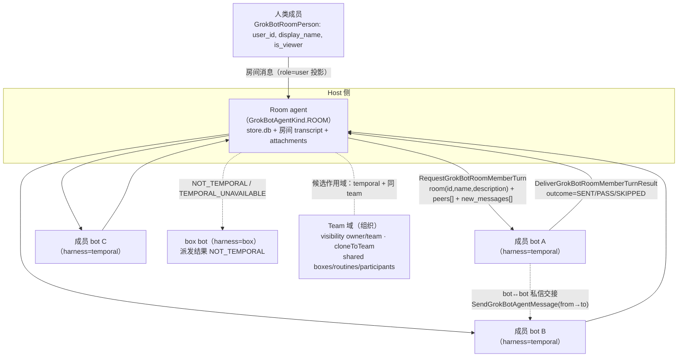
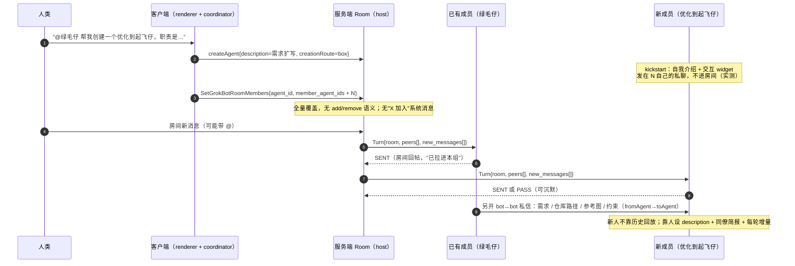

# 04 · 群聊动态加人与协作拓扑（Grok Bot 0.63.0 逆向）

> **对象**：Grok Bot 桌面端（内部名 `sand`），版本 **0.63.0**，构建 2026-09-29，Electron；解包产物 `.tmp-grok-bot/app`。
> **调研日期**：2026-10-01。**方式**：静态逆向解包产物 + 解码本机真实账户数据（只读），不采信官方文档与模型自述。
> **证据分级**：【代码】= 从解包产物提取；【数据】= 从 `%APPDATA%\Grok Bot\sand-client-persistence\` 解码得到；【推断】= 由前两者推导；**未证实** = 本地证据不足。
> **引用约定**：`dist` 下产物多为单行压缩，故引用写作 `文件:行 @字节偏移`（例：`proto.cjs:4 @980611`）。偏移可用 `.tmp-grok-bot/scripts/ws4-ctx.mjs` 复现。本报告用到的自建脚本全部在 `.tmp-grok-bot/scripts/ws4-*.mjs`。
> **数据副本**：本机数据解码结果落盘为 `.tmp-grok-bot/scripts/ws4-roster.json`、`ws4-group-transcript.json`、`ws4-tx-<id8>.json`（只读源目录，未修改任何原始文件）。

---

## 0. 一句话结论

**Grok Bot 的"群"就是一个 `GrokBotAgentKind.ROOM` 的 agent，成员是它的 `memberAgentIds`；动态加人靠 `SetGrokBotRoomMembers` 整体覆盖成员列表（无增删语义），新人拿到的是"每轮增量消息 `new_messages` + 同僚 `peers[]` + 房间 `room{id,name,description}`"，本地没有任何历史回放 RPC 或回放条数上限——0.63.0 的实测里，新人能不出错靠的是「创建者把用户的人设要求写成新 bot 的 `description`」＋「同僚用 agent 间私信做显式交接」＋「每轮增量」＋「成员可 PASS 不说话」这四件套，而不是历史回放。**

---

## 1. 逐问速答

| # | 问题 | 结论 | 分级 |
|---|---|---|---|
| 1 | 建群/成员管理 RPC | 4 个：`CreateGrokBotRoom`、`SetGrokBotRoomMembers`、**`AddGrokBotRoomPeople`（0.63.0 新增，人类成员）**、`GrokBotAgentDefinition.{room_members,member_of_rooms}`（本地双向） | 【代码】 |
| 2 | 是否回放历史 | **未证实有回放**。协议只有 `new_messages`（增量），内嵌注册表（约 2070 条描述符）里**没有** room 历史回放 RPC/条数上限字段 | 【代码】 |
| 3 | 同僚怎么知道 | 每轮下发 `peers[{id,name,description}]`（不含成员间消息历史） | 【代码】 |
| 4 | `room.description` 是否 briefing | **是**：`GrokBotRoomMemberTurnRoom{id,name,description}` 每轮随 turn 下发，等于每次都给成员一遍房间级 briefing；实测房间 `description=""`（空） | 【代码】+【数据】 |
| 5 | 触发规则默认值 | **0.63.0 不存在"成员触发规则"配置**。旧版说的 `mention/keyword/message/reaction` 在 0.63.0 属于 **Slack/GitHub/Origin/Teams 外部集成频道的 match 规则**，不是群成员参与规则。成员参与靠：`@` 点名 + 成员自主 `SENT/PASS/SKIPPED` | 【代码】 |
| 6 | 并行还是串行 | 一轮内成员发言**串行**（实测相邻间隔 15–133 秒），后发言者能看到同轮先发言者的内容 | 【数据】+【推断】 |
| 7 | 群能否作为成员加入另一个群 | **不能**。候选过滤器显式 `!o.isGroup` | 【代码】 |
| 8 | 人类如何入群 | `human_member_user_ids[]` / `AddGrokBotRoomPeople(user_ids[])`；**有人类成员的房间必须是 server-hosted（temporal），且需要 team 账号**，否则报 `Group chats need a team account that can create server-hosted Bots` | 【代码】 |
| 9 | 移除成员的上下文 | 移除只改房间成员表，不动成员自身 store；成员只是不再收到该房间的 turn | 【代码】+【推断】 |
| 10 | team vs room | **不是一回事**：`room` = 群聊 agent；`team` = 账号所属组织（Cursor team）的可见性/共享域（`visibility: owner\|team`、`cloneGrokBotAgentToTeam`、共享 box/routine/participant）。team 不是"跨群成员池" | 【代码】 |
| 11 | 本机真实群组 | 1 个群「拼死拼活组」`bd530ad7-…`，4 个 bot 成员，`description=""`，7 个 agent 行 + 7 个 transcript 副本 | 【数据】 |

---

## 2. 成员生命周期 RPC 全貌

### 2.1 服务端 `GrokBotService`（房间三件套）

全部字段逐字取自内嵌 proto 描述符（`proto.cjs:4 @874664` 一带）。类型码：`9`=string、`5`=int32、`8`=bool、`3`=int64、`2`=double、`?`=optional、`*`=repeated、`#n`=消息引用。

| RPC | Request 字段 | Response 字段 | 位置 |
|---|---|---|---|
| `CreateGrokBotRoom` | `1 agent_id`(9) `2 name`(9) `3 description`(9) `4 member_agent_ids`(9*) `5 human_member_user_ids`(5*) | `1 agent`(GrokBotAgent) | `proto.cjs:4 @875976` |
| `SetGrokBotRoomMembers` | `1 agent_id`(9) `2 member_agent_ids`(9*) | `1 agent`(GrokBotAgent) | `proto.cjs:4 @876780` |
| `AddGrokBotRoomPeople` | `1 agent_id`(9) `2 user_ids`(5*) | `1 agent`(GrokBotAgent) | `proto.cjs:4 @880651` |
| `RequestGrokBotRoomMemberTurn`（服务端→成员） | `1 nonce` `2 room`(`GrokBotRoomMemberTurnRoom`) `3 member_agent_id` `4 peers`(Peer*) `5 new_messages`(Message*) `6 is_winding_down`(8) `7 deadline_ms`(3) `8 parent_request_id`(9?) `9 root_parent_request_id`(9?) | `1 dispatch`(enum) `2 member_agent_id` `3 workflow_id`(9?) | `proto.cjs:4 @980611` |
| `CancelGrokBotRoomMemberTurn` | `1 nonce` `2 member_agent_id` `3 reason` | `1 delivered`(8) | `proto.cjs:4 @981621` |
| `DeliverGrokBotRoomMemberTurnResult`（成员→服务端） | `1 room_id` `2 nonce` `3 member_agent_id` `4 outcome`(enum) `5 messages`(9*) `6 error` `7 posts`(`GrokBotRoomPost`*) | `1 intake`(enum) | `proto.cjs:4 @982885` |

嵌套消息：

```
GrokBotRoomMemberTurnRoom   { id, name, description }                       ← 房间级 briefing      proto.cjs:4 @978641
GrokBotRoomMemberTurnPeer   { id, name, description }                       ← 同僚 + 职责          proto.cjs:4 @979050
GrokBotRoomMemberTurnMessage{ speaker_kind(enum), speaker_name, is_self, text,
                              reply_to{ speaker_kind, speaker_name, is_self, quote }? }   proto.cjs:4 @979495
GrokBotRoomPost             { text, message_json }                          ← 成员产出的结构化帖子
GrokBotRoomPerson           { display_name, avatar_url?, is_viewer, user_id? } ← 人类成员  proto.cjs:4 @875492
GrokBotBoxRoomSummary       { room_id, members_server_bound }               ← 迁移用
GrokBotHarnessMigrationPassRoomResult { room_id, outcome, deferral_reason }
EnsureGrokBotBoxHarnessMigrationPass { operation_id, box_rooms(=GrokBotBoxRoomSummary)* }  proto.cjs:4 @1002166
SendGrokBotAgentMessage     { from_agent_id, to_agent_id, message_id, text, sent_at_ms }   proto.cjs:4 @942920
```

关键枚举（`proto.cjs:4 @792852`、`@798168` 直接核对）：

```
GrokBotAgentKind            = UNSPECIFIED|AGENT=1|ROOM=2          ← "群"是一等 agent 类型
GrokBotAgentHarnessKind     = UNSPECIFIED|BOX=1|TEMPORAL=2
GrokBotAgentSessionKind     = UNSPECIFIED|MAIN=1|SLACK_DM=2|SLACK_THREAD=3|DM=4|GROUP=5   ← 0.63.0 新增 GROUP
GrokBotRoomMemberTurnDispatch= UNSPECIFIED|ACCEPTED=1|DUPLICATE=2|NOT_TEMPORAL=3|TARGET_NOT_FOUND=4|TEMPORAL_UNAVAILABLE=5
GrokBotRoomMemberTurnOutcome = UNSPECIFIED|SENT=1|PASS=2|SKIPPED=3|TIMEOUT=4|CANCELLED=5|ERROR=6
GrokBotRoomMemberTurnResultIntake = UNSPECIFIED|ACCEPTED=1|UNKNOWN_NONCE=2|HOST_UNAVAILABLE=3
GrokBotRoomMemberTurnMessage.SpeakerKind = UNSPECIFIED|HUMAN=1|AGENT=2
GrokBotRosterChangeKind     = …|ROOM_MEMBERS_CHANGED=5|…
GrokBotAgentCreateCaller    = UNSPECIFIED|ROOM_MEMBERS=1|ENSURE_SERVER_BACKED=2|MINT=3|BACKFILL=4|PRODUCT_CREATE=5
GrokBotTemporalHarnessMode  = UNSPECIFIED|OFF=1|SHADOW=2|LIVE=3|BOX=4
GrokBotBoxHarnessMigrationPassState = UNSPECIFIED|DISABLED=1|DONE=2|PENDING=3
```

**三条最硬的协议事实**：
1. `NOT_TEMPORAL` 存在于派发结果 → **room 成员轮次只派发给 temporal harness 的 agent**（box agent 收不到）。
2. `new_messages` 是**增量**命名（不是 `messages`/`history`），且整个内嵌注册表（约 2070 条消息描述符 + 71 枚举）里没有 room 历史回放类型（`replay` 字段只出现在 `GrokBotTranscriptWatchRows{…, replay: bool}`，那是**客户端 transcript 订阅流**的"这批是回放帧"标志，与入群无关；`max_messages` 只属于邮件线程读取）。
3. `members` 是整体数组：`SetGrokBotRoomMembers` 只带 `member_agent_ids[]`，**没有 add/remove 操作语义**，只能整体覆盖。

### 2.2 客户端三层与路由（谁决定 box 还是 temporal）

渲染进程 → main（`desktop.grokBot.*`）→ **node-agent-coordinator**（决策 + 路由）→ 本地 box 执行 / 服务端 host。

渲染进程暴露的成员管理方法（`main-app.cjs:79 @920871`、`@921355`）：

```js
createGroup:      args{ name, description?, memberAgentIds[], humanMemberUserIds?(number[]),
                         namedBy?, creationRoute?{box|temporal,scope}, clientNonce? }
setGroupMembers:  args{ id, memberAgentIds[], requesterAgentId? }
addGrokBotRoomPeople: args{ agentId, userIds:number[] }
```

**建群路由**（`node-agent-coordinator/main.cjs:43 @722416`）：

```js
if (H.method === "createGroup") {
  const box = async () => { const {creationRoute, clientNonce, ...T} = H.args;
                           return await e.dispatchCommand("createGroup", T, G); };   // 本地 box 建群
  const hasHumans = (H.args.humanMemberUserIds?.length ?? 0) > 0;
  // ① 无人、未指定路由、且存在非 temporal 成员 → 走 box
  if (!hasHumans && H.args.creationRoute === undefined && H.args.clientNonce === undefined &&
      H.args.memberAgentIds.some(m => t.harnessOf?.(m) !== "temporal")) return await box();
  let route = H.args.creationRoute;
  if (route === undefined) { route = await resolveAgentCreation();  // {kind:"temporal",scope} 或 {kind:"box"}
                             /* unimplemented → "Server creation routing is unavailable" */ }
  if (route.kind === "box") {
    if (hasHumans) throw new Error("Group chats need a team account that can create server-hosted Bots");
    return await box();
  }
  const nonce = H.args.clientNonce || randomUUID();
  const res = await host({method:"createGroup", args:{...H.args, creationRoute: route, clientNonce: nonce}});
  /* unimplemented → "Server-hosted rooms are not supported by this server" */
}
```

**成员变更路由**：`setGroupMembers` 在 scope 表里被固定归到 temporal（`node-agent-coordinator/main.cjs:41 @610954`，`function sP` 返回 `{scope:"temporal", mirrorGateway:false}`）；随后按 `harnessOf(args.id)` 决定发服务端还是本地执行（`main.cjs:43 @725388`）。服务端不实现时报 `The server does not support SetGrokBotRoomMembers for Temporal agents`。

`creationRoute.scope` 的语义（非"分组/嵌套"）：`main-app.cjs:365 @1853750` 中 `resolve()` 返回 `{kind:"temporal", scope}`，`scope = JSON.stringify([backendUrl, accountScopeOfToken({accessToken})])`；创建时比对 `route.scope`，不一致直接抛 `The creation account or backend changed` → **scope 是"创建身份=账号+后端"的防串号令牌**。

---

## 3. UI 侧约束（0.63.0 复核）

### 3.1 成员管理面板

组件为 renderer 里的 group-members 区块（`index-C0KKXNsc.js:15 @581903`，class 前缀 `sand-group-members-*` / `sand-group-member-row` / `sand-group-member-add`）。同一面板里**两排"+"**：
- 加 bot：候选来自 `getMembers()`；
- 加人（人类）：`index-C0KKXNsc.js:15 @592557` 的 `oye()` → `{showAddRow, candidates, isPending, notice, retry, addPerson}`，`addPerson: k => dispatch({id, userIds:[k]})`，**一次加一个 user_id**，落到 `desktop.addGrokBotRoomPeople`（`index-C0KKXNsc.js:33 @1229687`）。

### 3.2 所有成员数量限制（0.63.0 实证）

| 约束 | 值 | 证据 |
|---|---|---|
| bot 成员上限（**房间含人类**） | **3** | `const h5=6, m5=3, jS=20, ume=jS-1;`（`index.eager-app-B5P3neeI.js:10 @616237`）；`wme()` 返回 `maxMembers: 有人类 ? m5 : h5`（`:10 @624427`） |
| bot 成员上限（**无人房间**） | **6** | 同上 |
| 人类成员上限 | **20** | `jS=20`（同处）；`bme()`：`if(people.length===0||people.length>=jS) return []`（`:10 @624427`） |
| 达上限后行为 | 「+」按钮消失（`C = 仅群主 && !达上限 && 候选>0`） | `index-C0KKXNsc.js:15 @581903` |
| **移除成员：成员数 ≤1 直接拒绝**（旧版结论复核） | **成立，且更严** | 见下 |
| 移除按钮可点条件 | 群主（`viewerIsOwner!==false`）**且** 成员数 >1 **且** 无 pending | `index-C0KKXNsc.js:15 @581903`：`j = S && h.length>1 && !f` |
| 移除时兜底 | 二次校验 `memberIds.length<=1` 则**静默不执行** | 同处：`ye.length<=1 \|\| !ye.includes(xe.id) \|\| await c({id, memberAgentIds: ye.filter(...)})` |
| 候选成员过滤 | `!o.isGroup && o.id!==room.id && !room.memberIds.includes(o.id)` + 作用域规则 | `index.eager-app-B5P3neeI.js:10 @624427` |
| 候选作用域规则 | 房间有人类 → 房间必须有 teamId，且候选 `harness==="temporal" && visibility===team`、候选 `teamId` 为空或等于房间 teamId；无人但房间有 teamId → 候选必须 temporal；否则必须 `viewerIsOwner!==false` | `:10 @623940`(`T5`/`I5`) + `:10 @624427`(`wme`) |

### 3.3 文案 key（本 app 用远端 i18n id，产物内无明文）

| key | 位置/用途 |
|---|---|
| `wlQNTg` | 成员区块标题 |
| `jbz1Nw`({memberName}) | 成员行"打开"aria-label |
| `OAELiS`({memberName}) | 成员行"移除"aria-label |
| `t/YqKh` | 移除按钮与确认框 confirmLabel |
| `6NKWRX`({name}) | 移除确认框标题（`c0e({name,removeMember})`，`destructive:true`） |
| `M5RhXF` / `dEgA5A` / `0FUm9b` | 确认框 pending / cancel / 失败文案 |
| `3Qn0me` / `+Hb2f0` | "加 bot" / "加人"按钮 aria-label |
| `HgLwKq` | 群主但候选为空时的页脚提示 |
| `EkYKom` / `ochb2l` / `6gRgw8` | 通用失败详情兜底 / 加人失败提示 / 重试 |
| `hsMz1s`({0:count}) | @ 菜单里群条目的"N 个成员"副标题 |

### 3.4 `@` 与 `@所有人`

- mention 候选构造（`chunk-prompt-editor-Vp_ReBHQ.js:2 @46688`）：`@所有人` 伪 id 为 **`__everyone__`**（`const rt="__everyone__"`），关键字 `["all"]`，且**只有 `allowEveryone()!==false` 且 `members.length + people.length >= 2` 时才出现**；bot 成员与 **人类成员**（`seat:"person"`、person 图标）并列；带 `trigger` 的技能走 `automations` 分类（`insert:{type:"skill"}`）。
- 房间内候选：`index.eager-app-B5P3neeI.js:49 @811282` 的 `_1e()`：先铺 `memberIds`，**仅当 `isGroupChatsEnabled` 才追加 `people`**（人类）。
- `isGroupChatsEnabled = ci()!=null`，来自特性开关 `gn("grok_bot_group_chats")`（`index-C0KKXNsc.js:35 @1340361`）。
- 数据侧：成员 bot 真的会用 `@everyone` 发群公告（本机 `d4c37f88` transcript 的 `t2a5`，`toAgent:{kind:"group"}`）。

---

## 4. 入群时序（逐步）

以下为"群已经在跑 → 加人 → 新人接上"的完整链路。Step 1–3 为【代码】链路，Step 4–6 有【数据】实证。

### Step 1 · 触发加人（三种入口）
1. 建群时就带成员：`createGroup{memberAgentIds, humanMemberUserIds}`（`index.eager-app-B5P3neeI.js:49 @824069`）。
2. 群内成员面板点「+」：`dispatch({id, memberAgentIds: [...room.memberIds, newId]})`（**全量覆盖**，`index-C0KKXNsc.js:15 @581903`）。
3. **群内 bot 自己加人**：`绿毛仔` 在群里收到 `@绿毛仔 帮我创建一个偷感十足仔…` 后，建 bot + 拉进群，并在群里回帖通报（本机数据 `ws4-group-transcript.json` 的 `t5u/t5s0`、`t6u/t6s0`）。

### Step 2 · 下达 `SetGrokBotRoomMembers`（全量覆盖）
`desktop.setGroupMembers{id, memberAgentIds}` → coordinator 按房间 harness 路由 → 服务端 `SetGrokBotRoomMembers{agent_id, member_agent_ids[]}`（`main-app.cjs:365 @1855611`）。服务端返回新 `agent`（room），客户端若发现 `agent.agentId !== 请求 id` 直接判 `DataLoss`（`The server reseated a different room`）。人类成员走另一条：`AddGrokBotRoomPeople{agent_id, user_ids[]}`，返回必须 `kind===ROOM` 否则 `AddGrokBotRoomPeople returned no room`（`main-app.cjs:369 @1914224`）。

### Step 3 · 客户端认识"这是个群"
`agent.kind===ROOM ? {isGroup:true, memberIds:[...memberAgentIds]} : {isGroup:false, memberIds:[]}`，`people` 仅在 `kind===ROOM && people.length>0` 时下发（`main-app.cjs:365 @1853750`）；renderer 再合成 `isGroup/memberIds/people`（`index.eager-app-B5P3neeI.js:148 @1185226`、`@1201893`）。**没有"X 加入了房间"的系统消息**：本机 49 条房间 transcript 里 entry kind 只有 `message`(16)/`send-message`(28)/`user-attachment`(5)，没有 join/leave 事件。

### Step 4 · 新人收到什么（本机实证）
- **收到 1：人设 `description`。** 新 bot 由创建者（或用户在建群时的描述）写好人设。实测：用户 `t5u`/`t6u` 两段需求 → `绿毛仔` 建 bot，roster 里两个新 bot 的 `description` 就是被扩写后的那段需求（"专注系统性能优化的助手…" / "专注把别人已做好的功能接入到用户自己的系统里…"）（`ws4-roster.json:108-173`，两个新 bot 行；`description` 分别在 `:110`/`:144`）。**这是新人唯一的"先验知识"来源。**
- **收到 2：kickstart 自我介绍 + 交互 widget，但发在它自己的私聊里，不在房间。** 两个新人的私有 transcript 各只有 2 条：`tbs0` 自我介绍、`tbs1` widget（"现在最想先盯哪块？" / "这次要接什么？"），两条共享同一个 `requestId`（`ws4-tx-50ba98ed.json`、`ws4-tx-801c18df.json`）。**同样文本在房间 transcript 里 0 命中**（全表检索 `嗨，我是优化到起飞仔` / `你好。把别人做好的功能` / `现在最想先盯哪块` / `这次要接什么`）。
- **收到 3：`room{id,name,description}` + `peers[{id,name,description}]`**，每轮随 turn 下发（协议层，Step 5）。这是它知道"同僚有谁、各自分工"的**唯一**结构化来源；`peers` 不含成员间的消息历史，也不含 `member_of_rooms`。
- **收到 4：`new_messages`（增量投影消息）**，每条带 `speaker_kind(HUMAN/AGENT)`、`speaker_name`、`is_self`、`reply_to`。**未见任何"回放全部历史"的字段或 RPC**。

### Step 5 · 轮次派发（谁在什么时候被叫醒）
用户往房间发消息 → 服务端为该房间的成员逐个构造 `RequestGrokBotRoomMemberTurnRequest{nonce, room, member_agent_id, peers[], new_messages[], is_winding_down, deadline_ms, parent/root_parent_request_id}`。成员把结果用 `DeliverGrokBotRoomMemberTurnResult{room_id, nonce, member_agent_id, outcome, messages[], posts[]}` 交回；`outcome = SENT|PASS|SKIPPED|TIMEOUT|CANCELLED|ERROR`，`intake = ACCEPTED|UNKNOWN_NONCE|HOST_UNAVAILABLE`，派发侧还有 `NOT_TEMPORAL`（box 成员收不到）。`nonce` 保证幂等（重复派发返回 `DUPLICATE`）。

### Step 6 · 第一次发言（实测形态）
- 被 `@` 点名：**只有被点名者发言**。`t13u/t14u/t15u`（`@前端熬夜仔`）分别只产生 1 个作者（前端熬夜仔，同轮可连发 2–3 条，第 2 条时间戳与第 1 条相同 = 同一轮多帖）。
- 未被 `@`：**可能全员都答，也可能只有 1 人答**。`t0u–t4u`（当时 2 名成员）每次都是 2 人各答 1 条；用户在 `t4u` 抱怨"为什么每次你们俩都要回答呢？这种问题一个人回答就行了吧"之后，`t5u` 起未点名的消息**长期只有 1 人（绿毛仔）回答**；但 `t12u`（4 名成员、前端改版大活）又出现 4 人全答（前端熬夜仔答了 2 次，共 5 条）。→ **参与权在成员侧（可 PASS/自选），@ 是强制点名**。
- 新成员在**加入后的第一个房间帖**是 `t12s2`（优化到起飞仔）"补一句性能：上排 Morphing Tabs 若用测量布局再滑动…**视觉方案以 @前端熬夜仔 为准**。"——它能引用的只有同轮里 `t12s1`（前端熬夜仔）刚说的话，**是同轮增量，不是历史回放**；`t12s3`（偷感十足仔）同样只承接本轮的 `t12u/t12s1`。
- 新人加入后**没有"必须说第一句话"**：`t7u–t11u` 共 5 轮没有任何一个新人发言（当时新人已在群里）。

### ★ 核心问题的答案：新成员如何在不知道历史的情况下不犯错？

**站边：靠"同僚显式交接"＋"人设 description"＋"每轮增量"，不靠历史回放，也不靠 `room.description`（实测为空）。**

证据链（全部 0.63.0 本机实证）：

1. **同僚显式交接是主通道。** `绿毛仔`（协调者）与 `前端熬夜仔` 之间有一条完整的 bot↔bot 私信通道，消息带 `fromAgent` / `toAgent`：
   - 建关系："你好。用户希望我们协作：凡是前端页面相关任务…绿毛仔会转交给你主导。**交接约定：1. 我会把需求、仓库/路径、参考图或链接、约束一并转给你。2. 你按自己的流程…**"（`ws4-tx-d4c37f88.json` 的 `t0u`，`role=user` + `fromAgent:{绿毛仔}`）。
   - 真实任务交接（含 3 张附图、要改的 3 个点、协作要求、回报要求）：`t1u`。
   - 第二次任务交接（仓库 `1447751897/SYNC-THINK`、分支 `integrate-local-newmax`、参考链接、上下两排标签的具体对齐要求）：`t2u`（带 1 张图）。
   - 接收方以 `toAgent:{id,name,kind:"agent"}` 回执（`t0a0`/`t1a0`）。这正是 `SendGrokBotAgentMessage{from_agent_id,to_agent_id,message_id,text,sent_at_ms}` 的落地形态。
2. **新人（被创建者拉进群的 bot）拿的是人设 description，不是历史。** 它的私有 store 里只有自己的 2 条 kickstart；房间 transcript 里没有它的入群记录。
3. **每轮增量足够用。** 成员在回答时引用的是同一轮里别人刚说的话（`t12s2`→`t12s1`；`t12s3`→`t12u/t12s1`），从不需要跨轮历史。
4. **不需要说话时可以不说。** `PASS/SKIPPED` 是正式枚举；实测未点名消息经常只有 1 人应答。新人在没上下文时保持沉默不会出错。
5. **人类是信息中枢。** 房间 transcript 里人类消息是 `role:"user"` 一等条目；成员发言是带 `author:{id,name}` 的 `send-message`。谁都能看到人在说什么，而人能看到全部。

**反面（必须诚实标注）**：本地**没有**一条"新人加入后立刻说了一句只有靠历史才能说出的话"的样本，因此"新人首次 turn 的 `new_messages` 是否被服务端补成"自入群以来的全部积压"（即用"无游标 ⇒ 全量"实现事实上的回放）**无法从本地证据证实或证伪**。可证伪的方向：协议里**不存在**独立的回放 RPC、也不存在回放条数/摘要上限字段。

---

## 5. 协作拓扑

### 5.0 拓扑图（mermaid）





### 5.1 双向关系【代码】

本地 agent 定义（`local-exec-daemon/main.cjs:703 @3132831`，同一份 proto 也在 `node-agent-coordinator/main.cjs:41`、`proto.cjs:4 @1010874`）：

```
GrokBotAgentDefinition {
  sessions[], room_members[], member_of_rooms[], template_imports[], memory_shards[],
  routines[], recipe_skills[], mcp_settings{}, mcp_servers[]
}
GrokBotAgentDefinitionAgentRef { id, agent_id, name, harness, kind }   ← 两个方向的元素类型相同
```

`room_members` = 我作为房主，我的成员有谁；`member_of_rooms` = 我作为成员，我在哪些房里。两者元素都带 `harness`/`kind`，因此**成员侧能自查"我在哪些群、群里是什么形态"**。

### 5.2 嵌套：群不能进群【代码】

候选过滤器显式排除：`t.filter(o => !o.isGroup && o.id !== e.id && !e.memberIds.includes(o.id) && r(o))`（`index.eager-app-B5P3neeI.js:10 @624427`）。**没有子组/嵌套群**。群身份只用于两类用途：@ 候选菜单里的一个"群条目"（可整群寻址）、以及 `toAgent.kind:"group"` 的消息目标。

`creationRoute` **不是**嵌套机制，是 host 路由：

| route | 含义 | 约束/影响 |
|---|---|---|
| `{kind:"box"}` | 房间 agent 跑在 box（本地/共享电脑执行侧） | 若带 `humanMemberUserIds` 直接抛 `Group chats need a team account that can create server-hosted Bots`（`main.cjs:43 @723705`） |
| `{kind:"temporal", scope}` | 房间 agent 服务端托管（Temporal） | 必须服务端支持；`scope` 必须与当前 `[backendUrl, accountScope]` 一致，否则 `The creation account or backend changed`（`main-app.cjs:365 @1853750`）。**人类成员只能走这条** |
| 未指定 | coordinator 自动 `resolveAgentCreation()`：服务端开启 → temporal；否则 box（`main.cjs:43 @722742`） |

推论（重要）：**0.63.0 的"成员轮次"只发给 temporal agent（`NOT_TEMPORAL`）**，所以新建的 box bot 要真正参与群聊发言，需要先被迁移成 server-backed —— 这正是 0.63.0 新增的 `GrokBotAgentCreateCaller.ENSURE_SERVER_BACKED`、`GrokBotHarnessMigrationPassRoomResult`、`EnsureGrokBotBoxHarnessMigrationPass{box_rooms[{room_id, members_server_bound}]}`、`GrokBotTemporalHarnessMode{OFF|SHADOW|LIVE|BOX}` 一组设施存在的理由。【推断】

### 5.3 并行 or 串行

- 【数据】一轮内相邻成员发言间隔：`t0` 10.6s→39.0s、`t12` 26.6→79.4→41.6→89.0→95.9 秒；单成员一轮内连发多帖则时间戳相同。→ **轮内串行、轮间由人类驱动**。
- 【代码】客户端只保留**一个** `activeGroupMemberId`，以及每个成员的 `groupTurns[{roomId, phase, currentActivity}]`，`phase ∈ typing|working|reading`（`index.eager-app-B5P3neeI.js:100 @904294`、`:148 @1176481`）。UI 侧还有"reading 必须已 commit 才显示"的防抖（`kSe`，同处）。
- 【代码】协议层没有任何 parallelism 字段；`NOT_TEMPORAL/TEMPORAL_UNAVAILABLE/HOST_UNAVAILABLE` 说明派发是**逐个 host 调用**。→ **编排在服务端、串行为主**（编排实现本体不在客户端产物内，未证实细节）。

### 5.4 `@所有人` vs `@具体成员`

| 维度 | `@某成员` | `@所有人` |
|---|---|---|
| 载荷 | mention 节点 `{id: agentId, label: name}`（人类成员则为 person seat 的 userId/name） | 伪 id `__everyone__`，label 由 `ds({isEveryone:true,…})` 本地化，关键字 `all` |
| 出现条件 | 候选非空 | `allowEveryone()!==false` 且 `成员+人类 ≥ 2` |
| 行为实证 | 只有被点名者发言（`t13u/t14u/t15u` 均为单一作者） | 成员可用它给全群发公告（数据 `t2a5`: "@everyone 双行标签已改到…"，`toAgent.kind:"group"`）；用户侧本机样本中人类只用过 `@具体成员` |
| 解析位置 | **UI 只负责寻址编码**（写进 richText 的 mention 节点）；**派发决策在服务端**（本地无"解析 @ 文本→决定派给谁"的代码） | 同左 |

---

## 6. 移除成员 / 退群 / 群解散

| 场景 | 机制 | 上下文影响 | 证据 |
|---|---|---|---|
| 移除 bot 成员 | `SetGrokBotRoomMembers` 全量覆盖（UI 传 `memberIds.filter(x=>x!==removed)`），需群主、成员数>1 | **只改房间成员表**。成员自身 agent/transcript/memory/store 全不动；只是不再收到该房间的 turn。房间 transcript 里的历史发言保留（它们是房间 agent 的条目） | 【代码】`index-C0KKXNsc.js:15 @581903`；【推断】上下文影响 |
| 移除最后一个成员 | **被禁止**（UI 双重校验 `length<=1`） | 群永不变成 0 成员 | 【代码】同上 |
| 移除人类成员 | 0.63.0 **未见** remove-people RPC（只有 `AddGrokBotRoomPeople`） | — | 【代码】+**未证实**（可能由服务端其它入口做） |
| 退群（成员主动离开） | 未见对应 RPC/UI | — | **未证实** |
| 群解散 | 走通用删除：`deleteAgents{ids}` → 服务端 `DeleteGrokBotAgent{id}`；结果分 `refusedAgentIds`/`failedAgentIds`，UI 有独立确认流程（`x0e()` 执行 + `K9()` 确认内容 + `q9()` 文案分支，含"已发布 team bot""全是群"等） | 成员 bot 不受影响（删除目标只有 id；响应无删除成员/文件的字段） | 【代码】`main-app.cjs` RPC 表 + `index.eager-app-B5P3neeI.js:49` 删除流程 |
| 群内某个成员 bot 被删 | 群只是少一个成员（房间成员表未联动清理的实现证据不足） | — | **未证实** |
| 旧版"删除 bot 不删除电脑文件与浏览器会话" | 0.63.0 的 `DeleteGrokBotAgentRequest` 只有 `id`；`DeleteTeamGrokBotResponse{slack_app_removal{removed, slack_workspace_name, status}}` 只谈 Slack app 回收；**未见任何文件/会话删除字段** | 【推断】该结论在 0.63.0 仍成立（无删除副作用），但**未见**明文保证文案，故标未证实 | 【代码】+**未证实** |

`CancelGrokBotRoomMemberTurn{nonce, member_agent_id, reason}` 存在于协议，但**客户端产物里 0 处调用**（`proto.cjs` 之外仅 proto 定义），因此"成员被移除/群解散时是否取消在途轮次"**未证实**（推断应由服务端在失效成员时调用）。

---

## 7. 人在群里（HITL / 审批 / 人类消息投影）

- **纳入方式**：建群 `human_member_user_ids[]`（`CreateGrokBotRoomRequest.5`，int32=user_id），后续 `AddGrokBotRoomPeople{agent_id, user_ids[]}`。人类在客户端被投影为 `GrokBotRoomPerson{display_name, avatar_url?, is_viewer, user_id?}`。**人类成员不能走 box 房间**：路由解析为 `{kind:"box"}` 且有人在列时直接抛 `Group chats need a team account that can create server-hosted Bots`（`main.cjs:43 @723705`）。人类是否出现在 @ 候选取决于 `grok_bot_group_chats` 开关。
- **多人同群**：房间是**多人共享会话**。客户端有"群聊连接等待"态：条目的 `targeted.answerAt{agentId, sessionId}` + `targeted.forUser.authId/name`，若 `forUser.authId !== 自己` 则显示 `waitingOn: forUser.name`（`chunk-view-DdT6whHZ.js:2 @9836`；`chunk-group-chat-connect-waiting-BHr16qfO.js:2`）。即：同一条待办可能正由**别人**在另一个 session 里处理，界面提示"等待 <某人>"。
- **审批卡在群里的呈现**：群里的 `send-message` 可以是**交互卡**而不只是文本。审批类（`message.approval`）与 `connector-grant` 卡在群聊里带 `targeted.forUser.authId` 与 `targeted.roomLineId`，渲染时把 `groupChat:{sessionId, waitingOn}` 传给审批组件（`chunk-view-DdT6whHZ.js:2 @9836`）；同一 `(forUser.authId, serverId, roomLineId)` 的重复卡会被去重（`index.eager-app-B5P3neeI.js:103 @907338`）。→ **HITL 审批是"按人定向"的，而不是"广播给全群"**。
- **人类消息的 role 投影**：房间 transcript 中人类消息条目为 `{kind:"message", role:"user", content, richText, clientNonce, seq}`（`ws4-group-transcript.json` 全部 16 条人类消息）；成员的发言是 `{kind:"send-message", message:{...}, author:{id,name}}`。协议对成员下发时用 `speaker_kind=HUMAN|AGENT` + `is_self` 做逐成员投影，因此"人类消息对所有成员都是 user 角色"在 0.63.0 依然成立（`speaker_kind=HUMAN, is_self=false`），但**它现在是显式类型化字段，而不是把人类消息裸投成 role=user**（旧版表述的机制细节已升级）。
- **本机样本局限**：本地这个账号的房间 **没有人类成员**（群行无 `people` 字段、`humanMemberUserIds` 无从体现、`awaitingUserResponse` 全为 `null`），所以人类入群、审批卡、`waitingOn` 三项目前只有【代码】证据，没有【数据】样本。

---

## 8. 0.63.0 新增：team 与 room 的关系

**结论：team ≠ room，也不是"跨群成员池"。**

`team` 在本产品里有**两套完全不同的含义**，都不能当作群的上级容器：

1. **账号/组织团队**（Cursor team）：`Team{name,id,role,seats,…,team_slug}`、`GetTeams`、`GetTeamMembers`、`GetTeamAdminSettings`。bot 侧相关的是**可见性**：
   - `GrokBotAgent.team_id`、`GrokBotAgentVisibility = OWNER|TEAM`、`GrokBotAgent.team_default_for_viewer`；
   - `setGrokBotAgentVisibility(agentId, "owner"|"team")`、`cloneGrokBotAgentToTeam`（`CloneGrokBotAgentToTeamOutcome = CLONED|UNSUPPORTED|NO_TEAM`）；
   - `listGrokBotTeamAgents` → `GrokBotTeamAgentEntry{agent, signals{user_turns, teammate_user_turns, last_user_turn_at_ms, slack_linked, slack_workspace_name, owner_avatar_url}}`；客户端在服务端不实现时回退 `listGrokBotAgents({includeTeamAgents:true})`（`main-app.cjs:369 @1911075`）。
   - 它是**机器人目录/归属域**（谁能看见、谁能用），不是"群成员池"。
2. **team bot 的多人共享态**：`GrokBotTeamAgentSharedState{participants[], agent_memory, marketplace, plugins, routines, recipe_skills, boxes}`、`GrokBotTeamAgentParticipant{session_id, kind, user_id, user_email, standing, box_key, box_provisioned,…}`、`GrokBotTeamAgentSharedBox{box_key, kind, session_ids[]}`、`GrokBotTeamAgentSharedRoutine{…, creator_auth_id, creator_email, session_ids[]}`。这是**同一个 bot 被多个团队成员使用**时的参与者/共享资源视图（多人在同一个 bot 上排队/共享 box），是"人—bot"的 multiplayer，不是"bot—bot 的群"。

与 room 的**真实交集**只有两处：
- 房间成员候选的作用域规则会用到 `visibility===team && teamId`（有人类成员的房间只允许加**同团队的 team 可见 temporal bot**，`index.eager-app-B5P3neeI.js:10 @623940`）；
- 有人类成员/team 化的房间必须 server-hosted（`main.cjs:43 @723705`）。

**没有**发现任何"team 作为群成员容器"的类型或字段（例如 team→rooms 的枚举接口）。

---

## 9. 本机数据实证

源：`%APPDATA%\Grok Bot\sand-client-persistence\`（key 为 base32 编码的文件名，**只读**）。

**Roster（`…roster.last-roster`，9321 B，`schemaVersion:4`）** → 解码副本 `ws4-roster.json`：

| 项 | 值 |
|---|---|
| 行数 | **7**（6 个普通 bot + **1 个群**） |
| transcript 副本数 | **7**（与 roster 1:1） |
| `harness` | 全部 `temporal` |
| `origin` | 全部 `user` |
| `awaitingUserResponse` / `unreadCount` | 全 `null` / 全 `0` |
| `memberIds` 非空行 | 仅 1 行（群） |
| 群 | `bd530ad7-ef2c-4ce2-ab77-4f5ab45b7d06`「拼死拼活组」，`isGroup:true`，`description:""`，`memberIds` 4 个：绿毛仔 / 前端熬夜仔 / 优化到起飞仔 / 偷感十足仔 |

真实群行字段（`ws4-roster.json:210-247`）：`id, name, description, title, avatarShape, avatarColor, avatarVersion, avatarPhoto, createdAt, updatedAt, path, lastEntry{kind,text}, lastMessageId, newestEntryId, hasUnread, unreadCount, lastViewedAt, lastActivityAt, awaitingUserResponse, notificationsEnabled, notifyOnUpdatesEnabled, isHiddenFromSidebar, voiceId, voiceSpeed, voiceLanguage, origin, harness, isGroup, memberIds`。
- `path = /home/box/sand-data/agents/<roomId>/store.db`（群也是 agent，有自己的 store 目录；本机群附件也确实落在 `/home/box/sand-data/agents/bd530ad7-…/attachments/`）。
- `lastEntry = {kind:"text", text:"定位完了，不猜。仓库里 NewMax/beUI 液态标签的权威实现是…"}`，`lastMessageId = "t15s1"`。
- **注意两处与旧版的差别**：`lastEntry` **没有 `authorId`**；群里最新一条可以是**成员**的发言（`t15s1` 出自前端熬夜仔，867 字）。

**房间 transcript（`…transcript.replicas.bd530ad7-…`，27340 B）** → `ws4-group-transcript.json`：

| 项 | 值 |
|---|---|
| entries | **49**（seq 1..49 连续） |
| entry kind 分布 | `message` 16（全部 `role:"user"`）/ `send-message` 28（全部带 `author:{id,name}`）/ `user-attachment` 5 |
| 成员发言条数 | 绿毛仔 13、前端熬夜仔 13、优化到起飞仔 1、偷感十足仔 1 |
| 人类消息携带 | `richText`(TipTap doc，mention 节点含 `{id,label}`)、`clientNonce`、`seq` |
| 状态字段 | schemaVersion 1；`epochHint/acceptedSequenceHint = null` |
| 附件 | 5 张图，`file_path` 指向**房间自己**的 attachments 目录 |

成员的私有 transcript（`ws4-tx-*.json`）：`d4c37f88`(前端熬夜仔, 34 条)、`db2f7e9d`(绿毛仔, 61 条)、`ab2c2a47`(Grok Bot, 14 条)、`1d2a1a9f`(Luma Pages, 12 条)、`50ba98ed`/`801c18df`（两个新人，各 2 条）。特征：
- bot↔bot 私信条目带 **`fromAgent` / `toAgent{id,name,kind}`**，且接收方视角是 `role:"user"`、发送方回执是 `role:"assistant"`（收发不对称）；
- 成员私有 store **不含房间的人类消息**（在全部 6 个非群 agent 的 transcript 里检索房间首条"拼死拼活组正式成立了"= **0 命中**），也**不含房间 transcript 的其它成员发言**；成员只存自己的 `send-message`；
- 新人 2 条 `send-message` 带 `requestId`（同一 turn 的两次产出）。

---

## 10. 与旧版（0.47.0）差异

| 主题 | 旧版结论（`grok-bot-groupchat-internals-research.md`） | 0.63.0 复核 |
|---|---|---|
| 建群字段 | `createGroup{name, description, memberAgentIds, creationRoute}` | **新增 `humanMemberUserIds[]`、`namedBy`、`clientNonce`**；服务端 `CreateGrokBotRoomRequest` 新增 `human_member_user_ids[]`（字段 5） |
| 成员类型 | 只有 bot 成员 | **两类**：bot 成员（`member_agent_ids[]`）与人类成员（`human_member_user_ids[]` / `AddGrokBotRoomPeople`） |
| `memberIds<=1` 拒绝移除 | 已发现 | **复核成立且更严**：按钮本身要求 `viewerIsOwner && length>1 && !pending`，回调再兜底 `length<=1` 静默跳过 |
| 成员数量上限 | 未提 | **新增证据**：无人房 6、有人房 3、人类 20（`h5/m5/jS`） |
| `@所有人` | `@tiptap` mention，keyword `["everyone","all"]` | 改为伪 id **`__everyone__`**，keyword `all`，且要求参与者 ≥2；人类成员也可被 @（`seat:"person"`） |
| "四种触发规则 mention/keyword/message/reaction" | 断定为**群成员触发规则**（引 `node-agent-coordinator/main.cjs:40`） | **更正**：在 0.63.0（`main.cjs:41 @595440`）该联合类型 `H0` 是 **Slack/GitHub/Origin/Teams 集成源的 `match` 规则**（外层为 `{type:"slack",channel,match:H0}`、`{type:"github",repo,events,…}` 等），**不是**房间成员的参与规则。0.63.0 不存在成员级 trigger 配置；成员参与由 @ 点名 + 成员自主 SENT/PASS 决定。旧版这处解读**过度归因** |
| TurnDispatch | `ACCEPTED/DUPLICATE/TARGET_NOT_FOUND/TEMPORAL_UNAVAILABLE` | **新增 `NOT_TEMPORAL=3`** → 只有 temporal 成员能收轮次 |
| TurnOutcome | `SENT/PASS/SKIPPED/TIMEOUT/CANCELLED/ERROR` | 一致（实测确有"只 1 人应答"的自选沉默） |
| 房间/成员的 transcript | 房间 3 条；成员 transcript 里含其它成员发言（`is_self=false`） | 房间 transcript 已增至 **49 条完整时间线**（人类 `message` + 成员 `send-message{author}`）；**成员私有副本里看不到房间消息**，也看不到其它成员发言 → 房间消息是"每轮投递"而非"复制进成员 store" |
| `lastEntry` | 含 `authorId` | **0.63.0 无 `authorId`** |
| Session kind | 无 GROUP | **新增 `GrokBotAgentSessionKind.GROUP=5`** |
| harness 迁移 | 未提 | **新增** `GrokBotHarnessMigrationPassRoomResult`、`EnsureGrokBotBoxHarnessMigrationPass{box_rooms[{room_id,members_server_bound}]}`、`GrokBotTemporalHarnessMode`、`GrokBotAgentCreateCaller.ENSURE_SERVER_BACKED` → box 房间/成员向 server-bound 收敛 |
| team | 未展开 | **新增一整套**：`GrokBotTeamAgent{Entry,Signals,SessionCounts,RoutineCounts}`、`GrokBotTeamAgentSharedState/Participant/SharedBox/SharedRoutine`、`ListGrokBotTeamAgents`、`CloneGrokBotAgentToTeam`、`DeleteTeamGrokBot`、`GrokBotTeamContextSummary/LearnedEntry`、`PromoteGrokBotMemoriesToTeam`。team = 组织可见性 + bot 的多人共享态，**不是**跨群成员池 |
| 建群路由 | `creationRoute{box|temporal,scope}` 为"运行底座" | 结论方向正确，**补充决策规则**：无人 + 未指定路由 + 存在非 temporal 成员 → box；有人类 → 必须 temporal（且需 team 账号）；`scope` = `[backendUrl, accountScope]` 防串号 |
| bot 间通道 | `SendGrokBotAgentMessage(from→to)` | 字段一致（`message_id/text/sent_at_ms`；响应 `delivery/target_agent_id/target_name/workflow_id?`），且**私信条目带 `fromAgent`/`toAgent{kind:"agent"\|"group"}`**，实测仍是交接主通道 |
| 删除 bot 不删文件/会话 | 已断言 | RPC 仅 `{id}`、响应只有 Slack app 回收 → 【推断】成立，但**0.63.0 未见明文保证**，标未证实 |
| 版本/规模 | 5677 消息类型 | 0.63.0 为**约 2070 条内嵌消息描述符 + 71 枚举**（`proto.cjs` 5 行压缩文件；复现：`.tmp-grok-bot/scripts/ws4-schema.mjs`） |

---

## 11. 证据索引

| 结论 | 位置 |
|---|---|
| 房间三件套全字段 | `dist/electron-main/proto.cjs:4 @875976`（Create）、`@876780`（SetMembers）、`@880651`（AddPeople） |
| Turn 协议全字段 | `proto.cjs:4 @980611`（Request）、`@981621`（Cancel）、`@982885`（Deliver）；`@978641`（Room）、`@979050`（Peer）、`@979495`（Message） |
| `GrokBotAgent`（`kind/team_id/member_agent_ids/people`） | `proto.cjs:4 @874664` |
| `GrokBotRoomPerson` / P2P `SendGrokBotAgentMessage` / 迁移族 | `proto.cjs:4 @875492` / `@942920` / `@1002166` |
| `GrokBotAgentKind/GrokBotRoomMemberTurnOutcome/Dispatch` 枚举 | `proto.cjs:4 @792852`、`@798168`；枚举全集见 `.tmp-grok-bot/scripts/proto-all.txt` 文末 |
| `room_members` / `member_of_rooms` 双向 + 元素字段 | `dist/local-exec-daemon/main.cjs:703 @3132831`；`dist/node-agent-coordinator/main.cjs:41`；`proto.cjs:4 @1010874` |
| 建群路由（box/temporal/人类约束/scope） | `dist/node-agent-coordinator/main.cjs:43 @722416`、`@722742`、`@723705` |
| `setGroupMembers` 归 temporal scope | `dist/node-agent-coordinator/main.cjs:41 @610954`（`function sP`）；`:43 @725388`（按 harness 路由） |
| 集成 `match` 联合（旧版"触发规则"更正） | `dist/node-agent-coordinator/main.cjs:41 @595440` |
| 服务端房间客户端（`uUe`：createGroup/setGroupMembers + clientNonce 校验） | `dist/electron-main/main-app.cjs:365 @1855611` |
| `resolveAgentCreation.scope` 与 "creation account changed" | `dist/electron-main/main-app.cjs:365 @1853750` |
| `kind===ROOM ⇒ isGroup/memberIds`；`people` 下发条件 | `dist/electron-main/main-app.cjs:365 @1853750`；renderer `index.eager-app-B5P3neeI.js:148 @1185226`、`@1201893` |
| `addGrokBotRoomPeople` 必须是 ROOM | `dist/electron-main/main-app.cjs:369 @1914224`；RPC 表 `main-app.cjs:79` |
| `listGrokBotTeamAgents` 与回退 | `dist/electron-main/main-app.cjs:369 @1911075` |
| desktop RPC 字段（createGroup/setGroupMembers/addGrokBotRoomPeople） | `dist/electron-main/main-app.cjs:79 @920871`、`@921355` |
| 成员面板 + 移除双重校验 + 加 bot/加人两排 | `dist/renderer/assets/index-C0KKXNsc.js:15 @581903`、`@592557` |
| 上限常数 `h5=6, m5=3, jS=20` 与候选/作用域规则 | `dist/renderer/assets/index.eager-app-B5P3neeI.js:10 @616237`、`@623940`、`@624427` |
| 群命名/单人房间命名（`eL`） | `index.eager-app-B5P3neeI.js:10 @630014` |
| 房间内 @ 候选（含人类开关） | `index.eager-app-B5P3neeI.js:49 @811282` |
| 建群启动器（含"建 bot 再加入"） | `index.eager-app-B5P3neeI.js:49 @824069` |
| `@所有人`/mention 候选实现 | `dist/renderer/assets/chunk-prompt-editor-Vp_ReBHQ.js:2 @46688`、`@49924` |
| `grok_bot_group_chats` 开关 | `dist/renderer/assets/index-C0KKXNsc.js:35 @1340361`（同文件 `:15 @1000188` 为合成器逻辑） |
| `groupTurns` / `activeGroupMemberId` / phase | `index.eager-app-B5P3neeI.js:100 @904294`、`:148 @1176481` |
| 群内审批卡 + `waitingOn` + `forUser` | `dist/renderer/assets/chunk-view-DdT6whHZ.js:2 @9836`；`chunk-group-chat-connect-waiting-BHr16qfO.js:2` |
| 群内 connector-grant 卡按 `(forUser.authId, serverId, roomLineId)` 去重 | `index.eager-app-B5P3neeI.js:103 @907338` |
| 真实 roster（7 行/1 群/4 成员/字段名） | `%APPDATA%\Grok Bot\sand-client-persistence\…roster.last-roster` → 解码副本 `.tmp-grok-bot/scripts/ws4-roster.json:210-247` |
| 真实房间时间线（49 条、turn 间隔、@ 行为） | 同上 `…transcript.replicas.bd530ad7-…` → `scripts/ws4-group-transcript.json`；分析脚本 `scripts/ws4-room-turn-analysis.mjs` |
| bot↔bot 交接（`fromAgent`/`toAgent`、含图、含路径与约束） | `scripts/ws4-tx-d4c37f88.json`（`t0u`/`t1u`/`t2u`/`t2a5`） |
| 新人 kickstart（自我介绍+widget、同 `requestId`、不在房间） | `scripts/ws4-tx-50ba98ed.json`、`scripts/ws4-tx-801c18df.json` |
| 新 bot 人设 description 来自用户需求扩写 | `scripts/ws4-roster.json:108-173`（`:110`/`:144` 两段 description）对照 `ws4-group-transcript.json` 的 `t5u`/`t6u` |

---

## 12. 未证实清单

1. **新人首次 turn 的 `new_messages` 是否包含入群前的积压**（即"无游标 ⇒ 全量"式事实回放）。本地样本中，新人的第一条房间帖只引用了同轮内容，无法区分"回放"与"只看本轮"。协议里也没有回放 RPC/条数上限/摘要字段。
2. **回放/摘要的上限**：`new_messages` 的截断策略、是否附带摘要，全部在服务端，客户端产物无实现。
3. **轮内并行度**：串行是从时间戳推断的；无协议字段可证。`activeGroupMemberId` 单值只是客户端渲染模型。
4. **`PASS` 的判定方**：`outcome` 由成员上报（`Deliver…Result`），故倾向"成员自主决定"，但服务端是否预先过滤（例如 @ 点名时只派发被点名者）**未见代码**。
5. **`CancelGrokBotRoomMemberTurn` 的调用时机**：客户端 0 处调用；"移除成员/解散群时取消在途轮次"仅为推断。
6. **人类成员的移除/退群**：0.63.0 只有 `AddGrokBotRoomPeople`，未见 remove/leave 的 RPC 或 UI。
7. **群解散时成员 bot 是否收到通知、房间成员表是否联动清理**：未见实现证据。
8. **"删除 bot 不删除电脑文件与浏览器会话"**：0.63.0 RPC/响应无删除副作用字段（支持该结论），但**未见明文文案**，i18n id 无法离线解析。
9. **`room.description` 的实际使用**：协议保证它每轮下发；但本机唯一房间 `description=""`，**没有"非空 description 被成员使用"的样本**，其在成员提示词中的确切位置/措辞未证实。
10. **team 与 room 是否有未公开的容器关系**：已确认无"team→rooms"类型；不排除服务端按 team 做配额/路由（如 `room` 上限），客户端不可见。
11. **box 房间的成员轮次**：`NOT_TEMPORAL` 说明 box 成员收不到轮次；那么 box 房间在 0.63.0 是否仍能真正"群聊"（还是必须先迁移成 server-bound）**未证实**。
12. **人类消息投影的最终形态**：协议用 `speaker_kind/is_self` 下发，成员运行时如何把它拼成 `role=user` 的提示词——运行时不在 app.asar 内，未证实。

---

*本报告仅基于对 `.tmp-grok-bot/app/` 解包产物与 `%APPDATA%\Grok Bot\sand-client-persistence\` 的只读分析；未修改任何原始文件。分析脚本见 `.tmp-grok-bot/scripts/ws4-*.mjs`。*
