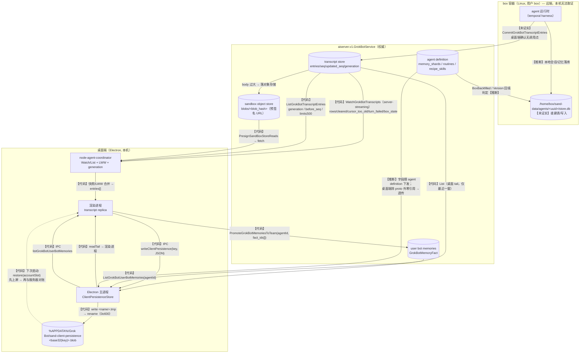

# WS5｜Grok Bot 记忆持久化与跨端同步链路

- 目标程序：Grok Bot 桌面端（内部代号 `sand`，SpaceXAI，Electron），版本 **0.63.0**（`app/package.json: version`，`%APPDATA%\Grok Bot\desktop-status.json: appVersion`）
- 代码基线：`.tmp-grok-bot/app`（`app.asar` 解包）
- 数据基线：`%APPDATA%\Grok Bot\sand-client-persistence`（本机真实账户 `google-oauth2|user_01M09YMBRJX2XZFDBW1983GX9Z`）
- 本文只覆盖**存储与同步链路**；上下文组装顺序由 WS2 负责。

---

## 0. 一句话结论

Grok Bot 0.63.0 的本地持久化是**一套自研的、明文的、文件粒度的 KV 存储**（`%APPDATA%\Grok Bot\sand-client-persistence\`，文件名 = base32(key)），它是**渲染进程状态的缓存副本**而非权威存储；权威副本在**服务端**（`aiserver.v1.GrokBotService` 的 `ListGrokBotTranscriptEntries` / `WatchGrokBotTranscripts`），超大的行体存在**沙箱对象存储**（`blobs/<blob_hash>`，走预签名 URL）。同步用 **generation（单调世代）+ seq（服务端分配的行号）+ updated_seq（行级 LWW 时钟）+ deletes[]（墓碑）** 四件套；桌面端**只读不写** transcript（`CommitGrokBotTranscriptEntries` 在全部发行包中**没有任何调用点**），写入方是 box 侧运行时。真正意义上的"记忆单元"在 0.63.0 里是 **`GrokBotMemoryFact`（fact_id/text/learned_at_ms）**，只有 `ListGrokBotUserBotMemories` 与 `PromoteGrokBotMemoriesToTeam` 两个 RPC；**简报里提到的 `PutGrokBotMemoryShard` / `ListGrokBotMemoryShards` 在 0.63.0 中不存在**（详见 §6.3）。

**数据时效性警告**：Grok Bot 进程全程在运行（`desktop-status.json: pid=65552, startedAtMs=1790819338184`），`sand-client-persistence` 下的文件在观测期间**持续被改写**（实测 09:50→09:55 之间条目从 166 涨到 174）。本文所有【数据】均标注了快照时刻，**不要当成静止值**。

---

## 1. 可复现的解码脚本与运行结果

脚本全部放在 `.tmp-grok-bot/scripts/`，对 `%APPDATA%\Grok Bot` **只读**（只调用 `readdirSync` / `statSync` / `readFileSync`，无任何写/删路径）。

| 脚本 | 作用 |
|---|---|
| `decode-persistence.mjs` | 文件名 → base32 解码 → key；含 `base32Decode/base32Encode` 两个可复用导出函数 |
| `analyze-persistence.mjs` | 全量 key 的顶层结构；`--full <子串>` dump 原值 |
| `analyze-transcripts.mjs` | 每个 replica 的 entries/seq/kinds/字段集/时间范围 |
| `ws5-gaps.mjs` | seq 空洞统计 |
| `ws5-snapshot.mjs` | 冻结快照（key + size + mtime + entries），输出 `ws5-out/snapshot.{json,md}` |
| `ws5-keylen.mjs` | key 字节数 vs 文件名字符数（验证 `.blob`/`.kblob` 阈值） |
| `ws5-ctx.mjs <file\|dir> <pattern>` | 压缩单行 bundle 的上下文检索（**`grep` 工具在这些 1MB 单行文件上会漏报**，见 §9 的工具备注） |
| `ws5-extract.mjs` | 把 bundle 的字符区间导出成可读文本到 `ws5-out/` |
| `ws5-proto.mjs` / `ws5-types.mjs` / `ws5-sub.mjs` / `ws5-services.mjs` / `ws5-rpcaudit.mjs` | 抽取 protobuf-ts 消息描述符 / 服务方法名 |
| `ws5-slices.mjs` | 枚举客户端 persistence 的全部 slice 定义 |
| `ws5-anchors.mjs` | 为本文所有引用的 `文件:行:列` 生成锚点 |
| `ws5-callsites.mjs` | 统计关键 RPC 的实际调用点 |
| `ws5-ls-scan.mjs` | 只读扫描 Chromium `Local Storage/leveldb` 里是否还有遗留 key |

### 1.1 运行结果（key 解码）

```
$ node .tmp-grok-bot/scripts/decode-persistence.mjs
# dir: C:\Users\<user>\AppData\Roaming\Grok Bot\sand-client-persistence
# files: 18, total bytes: 100052
# base32 alphabet: abcdefghijklmnopqrstuvwxyz234567 (RFC4648 lowercased, unpadded)

-      24  <DECODE-ERROR: bad base32 char "." in ".migrated-from-local-storage">
V      50  sand.client.slice.account.google-oauth2%7Cuser_01M09YMBRJX2XZFDBW1983GX9Z.bot-templates.export-policy
V     154  sand.client.slice.account.google-oauth2%7Cuser_01M09YMBRJX2XZFDBW1983GX9Z.connection.last-host-capabilities
V    9185  sand.client.slice.account.google-oauth2%7Cuser_01M09YMBRJX2XZFDBW1983GX9Z.roster.last-roster
...
# round-trip check (encode(decode(stem)) === stem): .migrated-from-local-storage
```

`round-trip check` 只有 `.migrated-from-local-storage` 一项失败——它不是 key 文件而是迁移标记（§2.3）。

> 注意：上面这次运行里目录共 18 个文件（17 个 `.blob` + 1 个标记）；下一节 §1.2 的快照里是 17 个 `.blob`。两次运行之间 `composer-drafts` 先增后删（§3.5），文件集合在观测期内是变化的，**不要跨小节直接对比文件数**。

### 1.2 冻结快照（2026-10-01T01:55:35Z，即本地 09:55:35）

```
$ node .tmp-grok-bot/scripts/ws5-snapshot.mjs
snapshot 2026-10-01T01:55:35.558Z  files=17  bytes=107906
TOTAL transcript entries: 174 across 7 replicas
marker: {"name":".migrated-from-local-storage","size":24,"mtime":"2026-09-11T12:16:33.876Z",
         "content":"2026-09-11T12:16:33.874Z"}
```

---

## 2. 本地持久化格式

### 2.1 目录与写入者【代码】

```
%APPDATA%\Grok Bot\sand-client-persistence
```

路径由 Electron 主进程写死：

```js
var am = z9e(path.join(app.getPath("userData"), "sand-client-persistence"),
             () => ze.getActiveAccountScope(), {...})
```

- 证据：`dist/electron-main/main-app.cjs:412:50074`（定位锚点 `var am=z9e(`）；`"sand-client-persistence"` 字面量在 `main-app.cjs:412:50129`。
- 写入者是 **Electron 主进程**（`FG` 类，§2.3），渲染进程只能通过 IPC 间接读写。

### 2.2 文件名规则：**整个文件名就是 base32(key)，没有额外前缀**【代码】

关键常量（`main-app.cjs:402:71870`，锚点 `QG="sand.",xer=8*1024*1024`）：

```js
QG  = "sand."                                  // key 命名空间前缀（硬约束）
xer = 8*1024*1024                              // 单 key 值上限 8 MiB
Mer = 256*1024*1024                            // 整个 store 上限 256 MiB
rte = "abcdefghijklmnopqrstuvwxyz234567"       // base32 字符表
nte = ".blob"                                  // 普通值文件后缀
E9e = ".kblob"                                 // 摘要帧值文件后缀
Ber = 240                                      // 文件名长度阈值
tte = ".migrated-from-local-storage"           // 迁移标记文件名
m9e = ".tmp"                                   // 原子写临时后缀
Per = [10, 50, 250]                            // rename 重试退避(ms)
Oer = new Set(["EPERM","EBUSY","EACCES"])      // 视为可重试的 errno
```

**base32 变体**（`function C9e`，编码；`function Uer`，解码，`main-app.cjs:402:72250` / `main-app.cjs:404:299`）：

- 字符表：`abcdefghijklmnopqrstuvwxyz234567`，即 **RFC4648 标准字母表的小写形式**；
- **无填充**（不写 `=`），**MSB-first**，尾部不足 5 bit 时左移补零；
- 解码端做三重校验：`(n & (1<<o)-1) !== 0` → 拒绝（**非零尾比特即判非法**）；`new TextDecoder("utf-8",{fatal:true})` → 非法 UTF-8 判非法；结果必须 `startsWith("sand.")`。

因此**文件名 = `base32(UTF8(key)) + ".blob"`，前缀就是 key 自身的第一段 `sand.client.slice.`**。本机实测：最短 key 27 B / 文件名 49 字符，最长 key 130 B / 文件名 213 字符，**全部 ≤ 240 字符**（`ws5-keylen.mjs`）。

> ⚠️ **纠正共享背景里"Chromium localStorage 前缀 + base32 编码的 key"的说法**：0.63.0 的文件名里**没有任何 Chromium 前缀**，`base32Decode(filename)` 得到的字符串第一个字节就是 `s`（"sand."），且 `base32Encode(decoded) === filename` 全部 round-trip 通过。Chromium localStorage 只是**一次性迁移源**（§2.6），不是当前格式的一部分。

### 2.3 `.blob` / `.kblob` / 无扩展名文件的区别【代码】

`blobName(key)`（`main-app.cjs:404:1048` 附近的 `FG` 类内，锚点 `blobName(t){let r=g9e(t,this.files.digest)`）。下面对**反混淆后的等价代码**（保留原字符串字面量；原文 `UG` = `new TextEncoder()`）：

```js
function Ler(key){ return `${C9e(UTF8.encode(key))}${nte}` }        // <base32(key)>.blob
function b9e(key,digest){ return `${C9e(digest(UTF8.encode(key)))}${E9e}` } // <base32(sha256(key))>.kblob
function g9e(key,digest){
  if(!key.startsWith("sand.")) return null;
  const r = Ler(key);
  return r.length <= 240 ? {kind:"encoded-key", name:r}
                         : {kind:"digest-framed", name:b9e(key,digest)};
}
```

| 形态 | 触发条件 | 文件内容 |
|---|---|---|
| `<base32(key)>.blob` | `len(<base32(key)>.blob) <= 240` ⇔ **key ≤ 146 字节** | 裸值（此处即 `{"schemaVersion":N,"value":...}`） |
| `<base32(sha256(key))>.kblob` | 文件名超长 ⇔ **key ≥ 147 字节** | `"<key>"\n<裸值>`（首行是 JSON 字符串形式的原 key；读取时校验 key 一致，防止摘要碰撞） |
| `<name>.tmp` | 写入过程中的中间文件 | 写完立即 `rename` 成最终名；**启动时 `ledger()` 会把残留 `.tmp` 直接删掉**（`startup-scrub`） |
| `.migrated-from-local-storage` | 一次性迁移标记 | `new Date().toISOString()`。本机实际内容 `2026-09-11T12:16:33.874Z`（24 B） |

因为本机所有 key 都 ≤ 130 字节，目录里**只有 `.blob`，没有任何 `.kblob`**。目录里唯一的非 `.blob` 文件就是那个迁移标记。

**原子性与并发**【代码】（`FG` 类，`main-app.cjs:404:1048`）：
- 所有操作串行化在一条 Promise 链上（`run(t){ this.chain = this.chain.then(t,t) ... }`），不会并发写同一目录；
- 写路径：`writeFile(<name>.tmp, ...)` → `rename(<name>.tmp, <name>)`，`rename` 遇到 `EPERM/EBUSY/EACCES` 按 `[10,50,250] ms` 退避重试 3 次（Windows 上文件被占用时的常见问题）；
- 写文件权限 `mode: 384`（= `0o600`，仅属主可读写）；
- 启动枚举时会清理 `.tmp` 残留；对无法解析的文件名/内容**静默跳过**（不报错、不删除）。

### 2.4 值是否加密：**不加密，是明文 UTF-8 JSON**【代码】+【数据】

判断依据（三重）：

1. 文件系统适配层就是裸 UTF-8 读写：
   `readTextFile: c=>fs.promises.readFile(c,"utf8")`，`writeTextFile: async(c,d)=>{ await fs.promises.writeFile(c,d,{encoding:"utf8",mode:384}) }`
   —— `main-app.cjs:404:14189`。
2. 值由渲染进程直接 `JSON.stringify({schemaVersion, value})` 后写入（`index.eager-app-B5P3neeI.js` 内 `writeKey(t,n,s){const r={schemaVersion:t.schemaVersion,value:s},o=JSON.stringify(r); ... this.port.write(n,o)}`），读取端 `JSON.parse`。
3. 【数据】本机 17 个值**全部** `JSON.parse` 成功，且能直接打印出中文正文（例如 `roster.last-roster` 里的 agent 描述、`transcript.replicas.*` 里的对话内容）。

**对照**：同一个应用在别的存储上**是会用加密的**——账户密钥走 Electron `safeStorage`：
`safeStorage.encryptString(r).toString("base64")`（`main-app.cjs:153:192734`）。
所以"client-persistence 明文"是**有意选择**，不是能力缺失。它只靠 `0o600` 文件权限 + 目录在用户 profile 下做保护。

**能否解出**：能，且不需要任何密钥。§3 的全部字段都是这样解出来的。

### 2.5 key 命名空间与 slice 注册表【代码】

key 生成规则（`index.eager-app-B5P3neeI.js:8:55562`，锚点 `Xo="sand.client.slice.",Er="account"`）：

```js
const Xo="sand.client.slice.", Er="account";
function Ok(e){ return encodeURIComponent(e).replaceAll(".","%2E") }   // 账户槽编码
function is(def, slot){
  return def.accountSensitive
    ? `${Xo}${Er}.${Ok(slot)}.${def.slice}`     // sand.client.slice.account.<slot>.<slice>
    : `${Xo}${def.slice}`;                      // sand.client.slice.<slice>
}
```

- `%7C` 就是 `encodeURIComponent("|")`：账户槽 `google-oauth2|user_01M09...` 里的 `|` 被转义，所以 key 里出现 `%7C`。
- `.` 被替换成 `%2E`，防止"点"污染层级。
- Map 型 slice 的 key 再拼 `.<encodeURIComponent(subKey)>`；`transcript.replicas` 就是 Map 型，`subKey = agentId`。

**全部 23 个 slice 定义**【代码】（`ws5-slices.mjs`，全部位于 `renderer/assets/index.eager-app-B5P3neeI.js` 与 `index-C0KKXNsc.js`）：

| slice | schemaVer | scope | accountSensitive | 本机是否存在 |
|---|---|---|---|---|
| `ui-layout` | 3 | client-persisted | 否 | ✅ |
| `first-run.device-onboarded` | 1 | client-persisted | 否 | ✅ |
| `client-meta.account-slot` | 1 | client-persisted | 否 | ✅ |
| `cloud-agent-open-target` | 1 | client-persisted | 否 | ❌ |
| `voice-settings` | 1 | client-persisted | 否 | ❌ |
| `roster.last-roster` | 4 | **host-durable** | 是 | ✅ |
| `roster.agent-avatars` | 1 | client-persisted | 是 | ❌ |
| `selection.last-agent` | 1 | client-persisted | 是 | ✅ |
| `sidebar.last-sections` | 1 | **host-durable** | 是 | ✅ |
| `ui-agent-refs` | 1 | client-persisted | 是 | ✅ |
| `send-journal` | 3 | client-persisted | 是 | ✅ |
| `composer-drafts` | 1 | client-persisted | 是 | ✅（观测期间被清掉，见 §3.5） |
| `bot-templates.export-policy` | 1 | **host-durable** | 是 | ✅ |
| `bot-templates.deleted-shares` | 1 | client-persisted | 是 | ❌ |
| `cloud-agents.infos` | 1 | **host-durable** | 是 | ❌ |
| `usage-warning.dismissal` | 1 | client-persisted | 是 | ❌ |
| `voice-memos` | 4 | client-persisted | 是 | ❌ |
| `voice-memo-speed` | 1 | client-persisted | 是 | ❌ |
| `voice-call.rated-calls` | 1 | client-persisted | 是 | ❌ |
| `voice-call.post-call-prompt` | 1 | client-persisted | 是 | ❌ |
| `agent-creations` | 1 | client-persisted | 是 | ❌ |
| `connection.last-host-capabilities` | 1 | **host-durable** | 是 | ✅ |
| `transcript.replicas` | 1 | **host-durable** | 是 | ✅ |

**关于 `scope` 的三点澄清**（避免误读）：

1. 共 **6 个 `host-durable`**：`transcript.replicas`、`connection.last-host-capabilities`、`bot-templates.export-policy`、`cloud-agents.infos`、`roster.last-roster`、`sidebar.last-sections`；其余 17 个是 `client-persisted`。
2. **`scope` 在 0.63.0 的 bundle 里没有发现任何读取点**：对全 bundle 检索 `host-durable` 只命中这 6 处定义，**没有任何以该字面量为比较对象的 `===`/`!==`/`includes` 分支**（`ws5-ctx.mjs` 全文计数：eager-app = 5，index-C0KKXNsc = 1，与定义数一致）。所以它目前只能被当作**声明性元数据**；不排除存在 `def.scope` 形式的间接读取（**未证实**）。
3. **真正决定"是否随账户槽批量预载"的是 `stage()` 的 include/exclude，而不是 `scope`**：
   ```js
   stage(t){ return this.port.stage({
     include: t==null ? ["sand."] : ["sand.", `sand.client.slice.account.${Ok(t)}.`],
     exclude: ["sand.client.slice.account.",
               ...(t==null ? [] : [`sand.client.slice.account.${Ok(t)}.transcript.replicas.`])]
   })}
   ```
   → 账户槽已知时，批量预载**排除且仅排除 `transcript.replicas`**；连 `roster.last-roster`、`sidebar.last-sections` 这些 `host-durable` 也照常被预载。所以本节表格里的 `host-durable` **不能**被解读成"不预载"。

### 2.6 一次性迁移：从 Chromium localStorage 搬过来【代码】+【数据】

- 主进程 IPC：`hasMigratedClientPersistence()` / `migrateClientPersistence({entries})`（`main-app.cjs:376:37689` 与 `dist/electron-preload/preload.cjs` 同名白名单）。
- 迁移实现：`if(await this.hasCompletedOneShotMigration()) return true; for(const n of t){...writeBlob...} await this.writeMigrationMarker()`；遇到 `ClientPersistenceCapError`（超 8 MiB/256 MiB）**跳过该条继续**，其它错误则整体失败且不写标记（下次启动重试）。
- 标记文件即 §2.3 的 `.migrated-from-local-storage`。
- 【数据】`ws5-ls-scan.mjs` 扫描 `%APPDATA%\Grok Bot\Local Storage\leveldb`：**已找不到任何 `sand.client.slice.` 字符串**（`000003.log` 仅 87 B，`LOCK` 被运行中的应用占用无法读）。→ 迁移确实已发生并把旧数据清空。标记时间戳 `2026-09-11T12:16:33.874Z` 与本机最早一批 `.blob` 的 mtime（`2026-09-11T12:17:16Z` 起）吻合。

---

## 3.【数据】真实数据盘点

### 3.1 全量 key 清单（快照 2026-10-01T01:55:35Z，17 个值 + 1 个标记）

| # | key（去掉 `sand.client.slice.` 与账户槽前缀） | 作用域 | schemaVer | 字节 | mtime (UTC) |
|---|---|---|---|---|---|
| 1 | `transcript.replicas.db2f7e9d-8b17-493e-9c6f-907055ac7c41` | account | 1 | 29294 | 01:49:03.335 |
| 2 | `transcript.replicas.bd530ad7-ef2c-4ce2-ab77-4f5ab45b7d06` | account | 1 | 27340 | 01:49:03.330 |
| 3 | `transcript.replicas.d4c37f88-ec66-4cd4-b925-1db2e0b10f26` | account | 1 | 19246 | 01:49:03.336 |
| 4 | `transcript.replicas.1d2a1a9f-40cf-4533-b7d5-0bc977f5133e` | account | 1 | 9808 | 01:49:03.332 |
| 5 | `transcript.replicas.ab2c2a47-aeb1-4020-94c7-52e851c6a211` | account | 1 | 9348 | 01:53:22.172 |
| 6 | `roster.last-roster` | account | 4 | 9321 | 01:53:20.642 |
| 7 | `transcript.replicas.801c18df-74c9-44c2-91a2-0dda09b643ce` | account | 1 | 1230 | 01:49:03.334 |
| 8 | `transcript.replicas.50ba98ed-28dc-46bc-9d98-56950e97d669` | account | 1 | 1202 | 01:49:03.333 |
| 9 | `ui-agent-refs` | account | 1 | 286 | 01:51:18.400 |
| 10 | `sidebar.last-sections` | account | 1 | 240 | 09-11 12:17:16 |
| 11 | `connection.last-host-capabilities` | account | 1 | 154 | 09-11 12:17:17 |
| 12 | `ui-layout` | **global** | 3 | 146 | 01:51:22.379 |
| 13 | `selection.last-agent` | account | 1 | 78 | 01:51:23.670 |
| 14 | `client-meta.account-slot` | **global** | 1 | 75 | 01:48:23.106 |
| 15 | `bot-templates.export-policy` | account | 1 | 50 | 01:49:01.081 |
| 16 | `first-run.device-onboarded` | **global** | 1 | 46 | 01:48:58.964 |
| 17 | `send-journal` | account | 3 | 42 | 01:52:55.610 |
| — | `.migrated-from-local-storage` | — | — | 24 | 09-11 12:16:33 |

合计 107,906 字节；其中 **7 个 transcript replica 占 97,468 字节（90.3%）**（29,294+27,340+19,246+9,808+9,348+1,230+1,202）。

**与旧文档（v0.47.0）的差异——必须显式指出**：

| 项目 | 旧文档（v0.47.0 时期） | 本次实测（0.63.0） |
|---|---|---|
| transcript 副本数 | 4 份 | **7 份** |
| 「绿毛仔」条目数 | 46 条 | **61 条**（且带 16 个 seq 空洞，见 §3.3） |
| key 前缀 | 描述为"Chromium localStorage 前缀 + base32" | **无 Chromium 前缀**，整文件名 = base32(key)（§2.2） |
| 记忆 shard RPC | `PutGrokBotMemoryShard` / `ListGrokBotMemoryShards` | **不存在**；只有 `ListGrokBotUserBotMemories` / `PromoteGrokBotMemoriesToTeam`（§6.3） |

（副本数与条目数差异不排除"期间又用了产品"这一因素：这些 agent 的最后活动时间在 2026-09-11～09-12，而本机数据在 09-11 12:16 才从 localStorage 迁移过来，所以更可能是本地缓存窗口本身在 0.63.0 变大了。）

### 3.2 每类 key 的结构（真实字段名）

```
ui-layout                      {"schemaVersion":3,"value":{"sidebar":{"expandedWidth":280,"isCollapsed":false},
                                                        "infoPane":{"isOpen":false,"width":320,"overviewTab":"overview"}}}
first-run.device-onboarded     {"schemaVersion":1,"value":{"onboarded":true}}
client-meta.account-slot       {"schemaVersion":1,"value":"google-oauth2|user_01M09YMBRJX2XZFDBW1983GX9Z"}
selection.last-agent           {"schemaVersion":1,"value":{"agentId":"ab2c2a47-...-c6a211"}}
bot-templates.export-policy    {"schemaVersion":1,"value":{"exportPolicy":"all"}}
connection.last-host-capabilities
                               {"schemaVersion":1,"value":{"capabilities":["orderedReplicasV1","sendAcceptanceV1",
                                   "voiceSettingsV1","botTemplateJsonShareV1","botTemplateVisibilityV1"]}}
send-journal                   {"schemaVersion":3,"value":{"records":[]}}
ui-agent-refs                  {"schemaVersion":1,"value":{"pinnedAgentIds":[...],"collapsedSectionIds":[],
                                   "mentionRecents":[{"category":"assistants","id":"d4c37f88-..."}],
                                   "emojiRecents":[],"infoPaneTabs":{"1d2a1a9f-...":"overview"}}}
sidebar.last-sections          {"schemaVersion":1,"value":{"sections":[{"id":"section-mtv7uqla-1","name":"产品维护组",
                                   "agentIds":["db2f7e9d-...","d4c37f88-..."]},{"id":"__agents__","name":"Unassigned","agentIds":[]}]}}
```

> `connection.last-host-capabilities` 里的 **`orderedReplicasV1`** 与 **`sendAcceptanceV1`** 是 host（box）能力握手位——前者对应"有序副本"（seq/updated_seq 语义），后者对应用户消息的"发送受理回执"。**这两个字符串在桌面端 bundle 里搜不到**（只存在于数据里），说明能力判定由 box/服务端给出、桌面端仅缓存，具体校验点**未证实**。

### 3.3 `transcript.replicas.<agentUuid>` 明细（7 个，快照 2026-10-01T01:55:35Z）

```
$ node .tmp-grok-bot/scripts/analyze-transcripts.mjs
# snapshot at 2026-10-01T01:50:49.856Z   (replicas: 7)     ← 更早一次运行：166 条
```

| agentUuid | 名字（来自 roster） | 字节 | entries | seq 范围 | seq 空洞 | epochHint | acceptedSequenceHint | value 字段 |
|---|---|---|---|---|---|---|---|---|
| `db2f7e9d-…-907055ac7c41` | 绿毛仔 | 29294 | **61** | 1..77 | 4, 8, 12, 15, 18, 21, 24, 28, 31, 35, 39, 48, 54, 58, 64, 68（缺 16） | `null` | `null` | entries, epochHint, acceptedSequenceHint, persistedAt |
| `bd530ad7-…-4f5ab45b7d06` | 拼死拼活组（群） | 27340 | **49** | 1..49 | 无 | `null` | `null` | 同上 |
| `d4c37f88-…-1db2e0b10f26` | 前端熬夜仔 | 19246 | **34** | 1..39 | 7, 10, 15, 23, 28（缺 5） | `null` | `null` | 同上 |
| `1d2a1a9f-…-0bc977f5133e` | Luma Pages | 9808 | **12** | 1..17 | 2, 6, 10, 13, 16（缺 5） | `null` | `null` | 同上 |
| `ab2c2a47-…-52e851c6a211` | Grok Bot（主 bot） | 9348 | **14** | 1..14 | 无 | `"568e2886-6d1a-45f6-8d01-82910c29a9ca:0"` | **11** | 同上 |
| `801c18df-…-0dda09b643ce` | 偷感十足仔 | 1230 | **2** | 1..2 | 无 | `null` | `null` | 同上 |
| `50ba98ed-…-56950e97d669` | 优化到起飞仔 | 1202 | **2** | 1..2 | 无 | `null` | `null` | 同上 |

**7 个 replica ↔ roster 里 7 个 agent，一一对应，没有多余也没有缺失**（含 1 个群聊 agent `bd530ad7`，roster 中 `isGroup:true`）。

`value` 的 JSON 形态（以主 bot 为例，节选——省略了 seq 2/3 与 5/6 的行；`acceptedSequenceHint:3` 与 `persistedAt` 取自更早那次"6 条"读取）：

```json
{"schemaVersion":1,"value":{
  "entries":[
    {"kind":"send-message","id":"tbs0","message":{"type":"text","content":"Hey! I'm Grok Bot. I'm new here."},"timestampMs":1790819356218,"seq":1},
    {"kind":"message","id":"t0u","role":"user","content":"用中文",
     "richText":"{\"type\":\"doc\",\"content\":[{\"type\":\"paragraph\",...}]}",
     "isStreaming":false,"timestampMs":1790819369361,
     "clientNonce":"c556cfb9-eaa9-4a98-a21f-d32cab8486c1",
     "requestId":"ef21cc16-fbae-4ce4-a144-d3f24926bfa4","seq":4}
  ],
  "epochHint":"568e2886-6d1a-45f6-8d01-82910c29a9ca:0",
  "acceptedSequenceHint":3,
  "persistedAt":1790819380322}}
```

**entry 字段 schema（真实观测到的字段集，7 个副本汇总）**：

| 出现的字段集（×次数） | 【推断】含义 |
|---|---|
| `id,kind,seq,timestampMs,message` + (`requestId`) + (`author`) + (`reactions`) + (`respondedValue`) + (`widgetSkipped`/`widgetDismissed`) | bot/成员发言；`kind:"send-message"`，`message.type` 有 `text` 等；同一 id 可能被**编辑**（`updated_seq` 生效）故出现 `respondedValue`/`reactions` |
| `clientNonce,content,id,isStreaming,kind,role,seq,timestampMs,richText` + (`requestId`) + (`images`) + (`fromAgent`) + (`toAgent`) | 用户/agent 消息；`kind:"message"` |
| `batchId,byteSize,clientNonce,file_name,file_path,height,id,kind,seq,timestampMs,width` | `kind:"user-attachment"`（本机 8 条） |

`seq` 在同一 replica 内**单调递增且唯一**，但不保证连续（§3.3 空洞）。**本地 `entries[]` 里没有 `session_id` 字段** —— 这是关键结论，见 §4.5。

### 3.4 `roster.last-roster`（schemaVersion **4**，7 行，9321 B）

每行的真实字段名：

```
id, name, description, title, avatarShape, avatarColor, avatarVersion, avatarPhoto,
createdAt, updatedAt, path, lastEntry{kind,text}, lastMessageId, newestEntryId,
hasUnread, unreadCount, lastViewedAt, lastActivityAt, awaitingUserResponse,
notificationsEnabled, notifyOnUpdatesEnabled, isHiddenFromSidebar,
voiceId, voiceSpeed, voiceLanguage, origin, harness, isGroup, memberIds[]
```

四条关键点：

1. **`path` 就是 box 侧路径**：`"/home/box/sand-data/agents/<uuid>/store.db"`（7 个 agent 各一条，与 `id` 严格对应）。这是本地文件里**唯一**出现 `store.db` 的地方。
2. `harness: "temporal"`（7 个 agent 全部）——与 `GrokBotService` 里的 `GrokBotRoomMemberTurnDispatch.NOT_TEMPORAL` / `TEMPORAL_UNAVAILABLE` 呼应。
3. `newestEntryId` 与本地 replica 的最后一条 id 一致（例：主 bot `newestEntryId:"t1s2"`，本地 replica 最后一条 id 也是 `t1s2`）——这是**本地缓存与 roster 元数据对账**的一条现成线索。
4. 群聊 agent：`isGroup:true`，`memberIds:["db2f7e9d…","d4c37f88…","50ba98ed…","801c18df…"]`。

### 3.5 `composer-drafts`：一个被观测到的"生成又消失"

09:50 首次盘点时存在 `…composer-drafts.ab2c2a47-…-c2a211`（339 B，`value:{draft,draftId,contentId,recovery}`）；09:55 快照时**该 key 已不存在**（草稿被消费/清空后 `removeSub`）。这从数据侧印证了 §2.3 描述的"删除即直接删文件、无墓碑、无版本"的 KV 语义。

### 3.6 数据漂移：同一秒内多个 replica 被重写

快照显示 **6 个 replica 的 mtime 都精确落在 `01:49:03.33x`**（应用启动后 5 秒内），且此时 `epochHint`/`acceptedSequenceHint` 被写成 `null`。结合代码里 `restoredSeed` 的构造（`epochHint:null, acceptedSequenceHint:null, persistedAt:..., source:"server-tail"`，`index-C0KKXNsc.js:38`），可判定：**启动时这 6 个 agent 的本地副本是"服务端 tail 种子"（无本地 epoch），被重新落盘了一次**。唯一保留真实 epoch 的是当前正在用的主 bot 会话。

---

## 4. 同步/一致性语义

### 4.1 四个版本维度

**标量宽度（已核实）**：protobuf-ts 的 `$()` 紧凑描述符里第 3 段数字是 `ScalarType`，其取值在本 bundle 内有明确定义（`proto.cjs:3:13039`）：
`DOUBLE=1, FLOAT=2, INT64=3, UINT64=4, INT32=5, FIXED64=6, FIXED32=7, BOOL=8, STRING=9, BYTES=12, UINT32=13`。
据此读出：**`seq`/`updated_seq`/`before_seq` 是 `uint64`（JS 侧为 bigint），`generation`/`version`/`limit`/各种 `*_count` 是 `uint32`（JS 侧为 number），`*_at_ms` 是 `int64`，`body` 是 `bytes`**。
代码侧完全自洽：游标用 `BigInt(0)`、`beforeSeq: seq + BigInt(1)`，而桌面读回时做 `seq: Number(b.seq)` 降级为 number；`generation` 则全程用 `===` 做 number 比较。

| 维度 | 类型 | 定义位置 | 语义 |
|---|---|---|---|
| **`generation`** | **uint32** | `CommitGrokBotTranscriptEntriesRequest.generation`、`ListGrokBotTranscriptEntriesResponse.generation`、`GrokBotTranscriptWatchRows.generation`、`WatchCleared.new_generation`、`WatchCursorTooOld.generation` | **单个 (agent,session) 的复制世代**。整条 transcript 被重置（清空/重建）时 generation 递增。`0` = "未指定/尚未学习"。 |
| **`seq`** | **uint64** | `GrokBotTranscriptEntry.seq`、`…EntryDelete.seq`、`List…Request.before_seq` | **服务端分配的行号**，单调、唯一；删除后不回收，所以会有空洞。 |
| **`updated_seq`** | **uint64** | `GrokBotTranscriptEntry.updated_seq`、`…EntryDelete.updated_seq`、`GrokBotTranscriptCursor.after_updated_seq` | **行级 LWW 时钟**。编辑/删除同一 `seq` 会得到更大的 `updated_seq`。 |
| **`entry_id`** | string? | `GrokBotTranscriptEntry.entry_id`、`…EntryDelete.entry_id` | 稳定行 id（如 `t0u`/`t1s2`），用于把"同一行的新版本"与"新行"区分开。 |

Proto 原文（`dist/electron-main/proto.cjs:4:808449` 等，锚点见 §9）：

```
GrokBotTranscriptEntry      | 1 seq 4 | 2 entry_kind 9 | 3 body 12? | 4 blob_hash 9? | 5 updated_seq 4 | 6 entry_id 9? | 7 body_omitted 8
GrokBotTranscriptEntryDelete| 1 seq 4 | 2 updated_seq 4 | 3 entry_id 9?
GrokBotTranscriptEntryRejection | 1 seq 4 | 2 current_updated_seq 4
GrokBotTranscriptCursor     | 1 agent_id 9 | 2 generation 13 | 3 after_updated_seq 4 | 4 session_id 9
```

`body` 有三种投递形态【代码】（`node-agent-coordinator/main.cjs:41`，`function zJ(t){return t.blobHash!=null?"blob":t.bodyOmitted?"omitted":"none"}`）：

1. `body` 内联（小行）；
2. `blob_hash` → 行体存在**沙箱对象存储**，路径 `blobs/<blob_hash>`，用 `PresignSandBoxStoreReads` 换预签名 URL 再 `fetch`；
3. `body_omitted` → 客户端用 `list({generation, beforeSeq: seq+1, limit:1})` **回捞单行**（`node-agent-coordinator/main.cjs:41:423646`，锚点 `beforeSeq:Ee+BigInt(1),limit:1`）。

### 4.2 generation 的收敛规则（冲突处理核心）【代码】

`node-agent-coordinator/main.cjs:41:422757`（锚点 `w===0?!0:m.generation===0`），反混淆后：

```js
function applyGeneration(state, incoming, opts = {}) {
  if (incoming === 0) return true;                      // 0 = "未指定"，不参与比较
  if (state.generation === 0) { state.generation = incoming; return true; }   // 首次学习
  if (incoming === state.generation) return true;       // 同代，正常
  if (incoming < state.generation && opts.authoritative !== true) return false;  // 旧代一律拒绝
  if (state.counter > 0) emit({type:"cleared", agentId: state.agentId, ordered: ...});
  setGeneration(state, incoming);                       // 换代：清空本地行缓存
  return true;
}
```

**结论**：generation 是**单调的**；低代数据只有在被标记 `authoritative`（即来自 `cleared` / `cursorTooOld` 这两种服务端帧）时才被接受。换代时会发出 `cleared` 事件、清空本地行缓存并重置游标（`epochBump+=1; counter=0; rows.clear(); streamAckUpdatedSeq=0n; windowFloorSeq=0n; maxLiveSeq=0n; pendingBodies.clear()`）。

### 4.3 `deletes[]` 与 LWW 合并【代码】

`CommitGrokBotTranscriptEntriesRequest = {agent_id, generation, entries[], deletes[], session_id}`（proto.cjs:4:851883）。
`CommitGrokBotTranscriptEntriesResponse = {committed_count, deleted_count, rejections[]}`，`rejections[i] = {seq, current_updated_seq}` —— **服务端明确回传"这条我拒了，我现在的 updated_seq 是多少"**，这是乐观并发的标准形态。

客户端合并（`node-agent-coordinator/main.cjs:41:419224`，锚点 `function jJ(t,e)`）：

```js
function merge(entries, deletes) {
  const rows = [...entries.map(r=>({kind:"entry",row:r})),
                ...deletes.map(r=>({kind:"delete",row:r}))];
  return rows.sort((a,b)=> cmp(a.row.updatedSeq, b.row.updatedSeq));   // 升序，按 updated_seq 依次应用
}
```

删除应用（`de=(m,w)=>…`，同文件）：

```js
const cur = state.rows.get(w.seq);
if (cur != null && cur.updatedSeq >= w.updatedSeq) return;   // 墓碑比本地旧 → 忽略
emit({type:"removed", id: entryId ?? cur?.id, seq, agentId});
state.rows.set(w.seq, {updatedSeq: w.updatedSeq, id: null}); // 留墓碑
```

**结论**：`deletes[]` 不是"整代清空"，而是**按 `seq` 打墓碑、按 `updated_seq` 做 LWW**；墓碑本身留在内存行缓存里（`id:null`），因此"删除一条 → 旧版本回放"不会复活它。

### 4.4 `before_seq` 与分页【代码】

`ListGrokBotTranscriptEntriesRequest = {agent_id, generation?, before_seq?, limit, session_id, unread_boundary_ms?}`
`ListGrokBotTranscriptEntriesResponse = {entries[], generation, cloud_agent_peer_ids[], cloud_agent_peer_ids_known, unread_anchor?}`

- 客户端**总是多要 1 条**（`limit: limit+1`）来判断 `hasMore`（`Ev(t,e)=>{kept:t.length>e?t.slice(0,e):t, hasMore:t.length>e}`）。
- `nextBeforeSeq` = 本页最小 `seq`（`Av()` 里 `nextBeforeSeq: a.seq`）；下一页用 `before_seq = nextBeforeSeq` 往前翻。
- **桌面主进程的 tail 读**（`main-app.cjs:406:30902`）：
  `listGrokBotTranscriptEntries({agentId, limit: u+1, sessionId: sessionId ?? "", unreadBoundaryMs?}, {timeoutMs: 15000})`，其中 `u = clamp(limit, 1, 500)`（`krr=500`，`x6e=15000`，`main-app.cjs:406:29512`）。**它不传 `generation`，也不传 `before_seq`** —— 桌面只拉"最新一窗"，历史翻页由 coordinator 负责。
- **coordinator 的分页**（`me=async(m,w)=>…`）：`limit = clamp(w.limit, 1, hv)`，`generation` 仅在非 0 时携带，`beforeSeq` 仅在给出时携带。

### 4.5 本地 replica 的键与控制面：**agentId，不含 session**【代码】+【数据】

- 服务端协议**处处带 `session_id`**：`GrokBotAgentSessionKind = UNSPECIFIED=0|MAIN=1|SLACK_DM=2|SLACK_THREAD=3|DM=4|GROUP=5`（`proto.cjs:4`），`GrokBotAgentDefinitionSession = {session_id, kind, created_at_ms, updated_at_ms, last_activity_at_ms?, box_key}`。
- coordinator 的内存状态**按 (agent, session) 分开**：
  ```js
  var xr = "";                                     // 主会话哨兵（空串）
  function Vt(s){ return s==null||s.length===0 ? xr : s }
  function Bt(agentId, sessionId){ const r=Vt(sessionId); return r===xr ? agentId : `${agentId}\0${r}` }
  ```
  证据：`node-agent-coordinator/main.cjs:39:26022`（锚点 `xr=""`）、`node-agent-coordinator/main.cjs:41:418787`（锚点 `function Bt(t,e)`）。→ 主会话用 `agentId`，其它会话用 `agentId\0sessionId`。
- **但落盘时 subKey 只有 agentId**：
  `const MS={slice:"transcript.replicas",schemaVersion:1,scope:"host-durable"}; const e=t.registry.registerMap(MS); … e.readSub({accountSlot, subKey:S}) / e.writeSub({accountSlot, subKey:S, value:T})`，调用方传的就是 `agentId`（`index-C0KKXNsc.js:38:421169`，锚点 `function zDe(t){const e=t.registry.registerMap(MS)`）。
- 【数据】佐证：7 个文件名后缀恰好是 roster 的 7 个 agent `id`，**没有 `:` 或 `\0` 之类的 session 维度**；`value` 里也没有 `sessionId` 字段（§3.3 `value` 字段集只有 `entries,epochHint,acceptedSequenceHint,persistedAt,(cloudAgentPeerIds),(precedingTimestampMs),(unreadAnchor)`）。

**结论**：**磁盘上的 transcript 副本是"每 agent 一份"，只保存该 agent 最近活跃会话的尾部窗口**；多会话（Slack DM / Slack thread / DM / GROUP）只有在内存里才分开。这是一条明确的架构约束，也是潜在的数据覆盖风险点（两个会话同时活跃时，落盘互相覆盖）。

### 4.6 `epochHint` / `acceptedSequenceHint`【代码】+【数据】

持久化记录构造（`index-C0KKXNsc.js:38`，`x=S=>{ … T={entries:_, epochHint:w.epoch, acceptedSequenceHint:w.acceptedSequence, persistedAt:N, …} }`）：

- `epochHint`：副本"saved epoch"字符串。本机实测格式 `"568e2886-6d1a-45f6-8d01-82910c29a9ca:0"`（`<uuid>:<n>`）。**读取时只做类型校验**（`RDe`：`epochHint!==null && typeof!="string"` → 整条记录判 corrupt），**恢复时会与当前 epoch 比对，不一致则走全量重同步**——比对点本身**未证实**（未定位到比较代码）。
- `acceptedSequenceHint`：**已被服务端受理到的最大 seq**。主 bot 副本里 `14` 条 entries 但 `acceptedSequenceHint: 11`；更早一次观测是 6 条 / `acceptedSequenceHint: 3`。**它严格小于最大 seq**，说明"展示的行"与"已确认的行"是两件事（【推断】尾部若干条是本地乐观插入、尚未被 ack）。
- 6 个 `null`：`restoredSeed`（服务端 tail 种子）的构造就是 `epochHint:null, acceptedSequenceHint:null`。

### 4.7 Watch（推送）通道与"断线/冲突"处理【代码】

`WatchGrokBotTranscripts` 是 **server-streaming**，`GrokBotTranscriptWatchFrame` 是 11 选一（`proto.cjs:4:851173`）：`connected | rows | cleared | cursor_too_old | heartbeat | agent_state | computer_actions | agent_state_changed | turn_failed | roster_changed | box_state`。

| 帧 | 字段 | 客户端动作 |
|---|---|---|
| `rows` | `agent_id, generation, entries[], deletes[], replay, session_id` | 走 §4.3 的 LWW 合并；`replay:true` 表示这是断线重放 |
| `cleared` | `agent_id, new_generation, session_id` | `applyGeneration(…, {authoritative:true})` → 换代清空 |
| `cursor_too_old` | `agent_id, generation, session_id` | **同上 + 强制 `needsRehydrate=true`**，随后整段重拉（`node-agent-coordinator/main.cjs:41:431984`，锚点 `cursorTooOld`） |
| `turn_failed` | `agent_id, session_id, turn_id, code, summary, failed_at_ms, error_details?, account?` | 上报失败 tray；`GrokBotTurnFailureCode = INTERNAL|TIMEOUT|USAGE_LIMIT|RATE_LIMIT|TEAM_POLICY_UNAVAILABLE|UNPAID_INVOICE` |
| `box_state` | `state(GrokBotBoxState), snapshot` | `GrokBotBoxState = {run_state, recreate_in_flight, image_update_available?, host_version?, host_update_available?, disk_pressure, updated_at_ms}`；`SandBoxRunState = ABSENT|HIBERNATED|RUNNING|STARTING`，`GrokBotBoxDiskPressureLevel = NONE|SOFT|HARD` |
| `heartbeat` / `connected` | `server_time_ms` / `stream_id, server_time_ms, absolute_lifetime_ms` | 无业务动作 |

**Watch 游标**（`As=()=>…`）：`{agentId, generation, afterUpdatedSeq, sessionId?}`；取"最近触碰的 `x_` 个 agent 状态"（按 `lastTouchedAt` 排序）；`needsRehydrate` 时 `afterUpdatedSeq` 归零。**空闲状态会被驱逐**（`Gt()`：超过 `vJ` 未触碰且不在前 `x_` 名内则删除并 `epochBump+=1`）。

**断线恢复路径**：
1. 后端探活：向 `${baseUrl}/aiserver.v1.GrokBotService/WatchGrokBotTranscripts` 发一次请求，用状态判定函数 `i_` 把结果映射成 `down`/`up`，捕获到超时/网络类错误也判 `down`（`node-agent-coordinator/main.cjs:41:408420`，锚点见 §9）。**`i_` 具体判定哪些 HTTP 状态码未解析（未证实）**。
2. 重连退避：`{name:"server-transcript-tail-retry", mode:"until-signal", initialDelayMs,maxDelayMs}`；错误分类集合 `DDe = {"refused","timeout","http_5xx","dns","network"}` 触发覆盖式重试（`ODe=[1000,2000,4000,8000,16000]`）。
3. 重连后：`needsRehydrate=true` → 重新 `list` 整段 tail → 重新建立 watch 游标。
4. **本地副本先上屏**：`restore` 时先用磁盘副本渲染（`isShowingRestoredTranscript`），再与服务器对账；对账失败才切到 `resyncing`。

### 4.8 本地是"缓存副本"还是"权威存储"？

**是缓存副本，且是只读缓存。** 四条依据：

1. `CommitGrokBotTranscriptEntries` 在**所有发行 bundle 里都没有调用点**（`ws5-callsites.mjs`：`.commitGrokBotTranscriptEntries(` → `(no call site)`）；只有生成的 client 描述符里存在 `commitGrokBotTranscriptEntries:{name:"CommitGrokBotTranscriptEntries",…}`。桌面端不写服务端 transcript。
2. 桌面端对 transcript 的唯一写路径是"写本地 blob"，且 slice 名就叫 `transcript.replicas`（replica = 副本），持久化记录带 `persistedAt`、`epochHint`、`acceptedSequenceHint` 这些**对账元数据**。
3. 每次恢复都要按 `generation` / `epochHint` 与服务器对齐（§4.2、§4.6），不一致就丢弃本地内容重拉。
4. 本地窗口由"最近 200 条 / 768 KiB / 7 天"**强裁剪**（§8.2），不可能承载完整历史。

**用户消息的"权威性"是另一条链路**：`send-journal` 才是本地唯一"必须送达"的持久化队列（§5），它有重试策略与 ack 协议。

### 4.9 关键调用点一览（`文件:行:列`）

| 环节 | 位置 |
|---|---|
| 桌面 tail 读（`List`，无 generation/before_seq） | `electron-main/main-app.cjs:406:30902` |
| 桌面预设 15 s 超时 / limit≤500 / blob 并发 8 / 前置 `blobs/` | `electron-main/main-app.cjs:406:29512` |
| 桌面 transcriptStore 装配（含特性开关） | `electron-main/main-app.cjs:412:67435`（锚点 `transcriptStore:B6e(`） |
| 桌面 transcript 读开关 | `electron-main/main-app.cjs:85:84787`（`sand_transcript_store_read`，客户端特性位） |
| coordinator `List` 分页调用 | `node-agent-coordinator/main.cjs:41`（锚点 `listGrokBotTranscriptEntries:{name:` 附近的 `me=async(m,w)`） |
| coordinator `Watch` 调用 | 同文件（锚点 `watchGrokBotTranscripts(`，唯一 1 处调用点） |
| coordinator 单行回捞 | `node-agent-coordinator/main.cjs:41:423646` |
| coordinator 本地 persistence key 生成 | `renderer/assets/index.eager-app-B5P3neeI.js:8:55562` |
| 主进程 store 构造 | `electron-main/main-app.cjs:412:50074` |
| IPC 白名单 | `electron-main/main-app.cjs:376:37689`、`electron-preload/preload.cjs`（`readClientPersistence`…`migrateClientPersistence`） |

---

## 5. 用户消息的可靠性链路：`send-journal`（补充"断线如何处理"）

虽然问题聚焦记忆，但"断线/冲突"在 Grok Bot 里**最关键的实现是 `send-journal`**，它决定了"离线时用户输入会不会丢"。

- slice 定义：`{slice:"send-journal", schemaVersion:3, scope:"client-persisted", accountSensitive:true}`，兼容 v1..v3（`zne(e)=Number.isInteger(e)&&e>=1&&e<=3`），并有 v2→v3 字段迁移 `Yne`（`prompt/richText` 从 `input` 回填）。锚点 `qv={slice:"send-journal",schemaVersion:3`。
- 记录形态（`Jne` 校验器反推）
  `{nonce, priorNonces?[], accountSlot, agentId, input{agentId,prompt,attachmentPaths[],attachmentNames[],richText?,replyToId?,isFork?,sessionId?,automationWriteProvenance?,initiator?}, draftRecovery, authoredThreadRootId?, consumedDraftId?, consumedDraftContentId?, attachments[{stagedPath, committedPath?, name}], createdAtMs, ackTimeoutStartedAtMs?, firstFlushAtMs?, phase, queuedAtMs?, failedAtMs?, awaitingHostDecision?}`
- **phase 状态机**：`prepared → queued → dispatching → accepted-awaiting-echo`（`Zne`）。`queued` 阶段允许附件只有 `stagedPath`（尚未 commit）。
- 重试策略：`{name:"send-transport-retry", maxAttempts:5, initialDelayMs:1000, maxDelayMs:30000, jitter:"equal"}`（锚点 `jv={name:"send-transport-retry"`）。
- **发送受理（ack）失败原因**（锚点 `No={nonceMismatch:"SAND-E0703"`）：
  `nonceMismatch(SAND-E0703)`、`capabilityUnavailable(SAND-E0704)`、`hostRejected(SAND-E0705)`、`superseded(SAND-E0706)`、`ackExpired(SAND-E0707)`。
  其中 `capabilityUnavailable` 与 host 能力位 `sendAcceptanceV1`（§3.2）字面对应——**这一对应关系是【推断】**，因为能力位字符串在桌面 bundle 中不存在。
- 观测量：`queued_offline`（离线入队）/`acked` / `failed` / `timeout`；命令侧有 `cancelQueued` / `deleteFailed` / `resendFailed` / `reconcileWithHost`。
- **恢复顺序**：账户槽恢复完成后会显式 `hn.reconcileWithHost()`（`hn` = send-journal），把本地记录与 host 对账（`renderer/assets/index-C0KKXNsc.js:38` 恢复链末尾，锚点 `await hn.restore(Dn)` 之后）。

---

## 6. box 侧 `store.db` 与记忆生命周期

### 6.1 `/home/box/sand-data/agents/<uuid>/store.db` 是谁写的？

**结论：本机发行包里没有任何代码创建或打开 `store.db`；该路径只作为服务端下发的元数据出现在本地 roster 缓存里。谁写它——【未证实】。**

证据链：

1. 【数据】`store.db` 只出现在 `roster.last-roster` 的 `path` 字段（§3.4）。
2. 【代码】对 `.tmp-grok-bot/app` 全量做子串检索，**`store.db` 零命中**（`ws5-ctx.mjs .tmp-grok-bot/app/dist "store.db" --files`）。
3. 【代码】桌面端确实知道 box 的目录布局，但只用来做 dev-box 容器操作：
   - `dist/local-exec-daemon/main.cjs:541:486`：`uye="/home/box"`、`cye="sand-data"`、`_7r=${uye}/${cye}`、`S7r=${uye}/agent-data`、`R6t="SAND_DATA_ROOT"`、`P6t="SAND_USER_DATA_DIR"`、`aye="--user-data-dir"`、`C6t=".grokbot"`；
   - `dist/electron-main/main.cjs:3:816`：`b="/home/box"`、`ut=${b}/${pe}`（`pe="sand-data"`）。
4. 【代码】唯一涉及 `sand-data` 的写操作是 **dev box 的 Docker 清理**：`wipeSandData()` → `box-reset wipe-data`，提示语就是 `"wiping sand-data and the durable box store"`（`main-app.cjs:365`）。
5. 【代码】`node:sqlite` 只被 `chrome-import-worker.cjs` / `local-exec-daemon` 用于 **Chrome cookie 导入**（读 Chrome 的 Cookies SQLite + 解析 bplist），与 box store 无关（`local-exec-daemon/main.cjs:543:5221`）。

**与本地 transcript 的关系（【推断】，依据是为数不多的名字与字段）**：`path` 指向"每个 agent 一个 SQLite"，而服务端 `GrokBotAgentDefinition` 把 `sessions` 与 `memory_shards` 并列挂在 agent 上——最合理的解释是 **box 侧 agent 运行时把该 agent 的会话/记忆写进自己的 `store.db`，再由 box 内的 runtime 通过 `CommitGrokBotTranscriptEntries` 提交到服务端**。这条链路中"box 写 store.db"这一段**没有本地证据**，明确标注为未证实。

**`box_backfilled` 的含义**：`GrokBotAgentDefinitionMemoryShard = {scope, scope_key, version, box_backfilled, updated_at_ms, folder{GrokBotMemoryFolder{profile,logs[]}}}`（`proto.cjs:4:993447` / `:4:784350`）。字段名字面即"该 shard 是否已回填到 box"。**在 0.63.0 的全部 bundle 里，`box_backfilled`/`memoryShards` 除 proto 定义外零引用**（`ws5-ctx.mjs … "boxBackfilled" --files` → 仅 3 个 proto 副本）→ 桌面端只是把它当**透传字段**，不参与判定。谁置位、何时回填——**未证实**。

### 6.2 `HOST_UNAVAILABLE` 与 box 可用性

- `HOST_UNAVAILABLE` 是枚举值 **3**，属于 `GrokBotRoomMemberTurnResultIntake`：
  `UNSPECIFIED=0 | ACCEPTED=1 | UNKNOWN_NONCE=2 | HOST_UNAVAILABLE=3`（`proto.cjs:4:778659`）。
- 相邻枚举给出了完整语境：
  - `GrokBotRoomMemberTurnDispatch = UNSPECIFIED|ACCEPTED|DUPLICATE|NOT_TEMPORAL|TARGET_NOT_FOUND|TEMPORAL_UNAVAILABLE`
  - `GrokBotRoomMemberTurnOutcome = UNSPECIFIED|SENT|PASS|SKIPPED|TIMEOUT|CANCELLED|ERROR`
- 即：群聊/房间成员的一轮 turn 派发由 **temporal harness** 承接；派发可能因 `TEMPORAL_UNAVAILABLE` / `TARGET_NOT_FOUND` 失败，**结果回执（intake）可能因 `HOST_UNAVAILABLE` 被拒**——也就是"派发时 box 在，回执时 box 不在了"这类竞态。
- 本机数据佐证：7 个 agent 的 roster `harness` 全为 `"temporal"`。客户端另有一个特性位 `grok_bot_temporal_harness`，其客户端默认值为 **false**（`main-app.cjs:85`）；**它与 roster 里 `harness:"temporal"` 的关系未证实**（一个是客户端特性位，一个是服务端下发的 agent 属性，不能互相推断）。
- **无法从本机判定 box 在线/离线**：没有任何持久化的 box 健康状态文件；`box_state` 帧只在内存中流转。**未证实**：box 不可用时发送路径的完整降级行为。

### 6.3 记忆 shard RPC 的名称更正（重要）

任务简报里的 `PutGrokBotMemoryShard` / `ListGrokBotMemoryShards` / `GrokBotAgentDefinitionMemoryShard`：

- `GrokBotAgentDefinitionMemoryShard` ✅ 存在（随 `GrokBotAgentDefinition.memory_shards` 下发）。
- `PutGrokBotMemoryShard` / `ListGrokBotMemoryShards` ❌ **不存在**。`ws5-rpcaudit.mjs` 对 `aiserver.v1.GrokBotService` 的 **304 个方法**做全量正则过滤：

```
memory-ish = ["ListGrokBotUserBotMemories","PromoteGrokBotMemoriesToTeam"]
transcript-ish = ["CommitGrokBotTranscriptEntries","ListGrokBotTranscriptEntries",
                  "WatchGrokBotTranscripts","AdminGetSandAgentTranscriptPage"]
skill-ish = ["ListGrokBotAgentSkills","AddGrokBotAgentSkill","UpdateGrokBotAgentSkill",
             "RemoveGrokBotAgentSkill","PublishGrokBotUserSkillsSnapshot","InvalidateGrokBotUserSkillsCache"]
automation/routine-ish = ["ListGrokBotAgentAutomations","ListGrokBotAccountAutomations",
                          "SetGrokBotAgentAutomationEnabled","DeleteGrokBotAgentAutomation"]
```

**0.63.0 的"记忆"是一等公民 fact，而不是 shard**：

```
GrokBotMemoryFact              | 1 fact_id 9 | 2 text 9 | 3 learned_at_ms 3        (proto.cjs:4:894215)
ListGrokBotUserBotMemoriesRequest   | 1 agent_id 9
ListGrokBotUserBotMemoriesResponse  | 1 memories #0*                          (proto.cjs:4:894966)
PromoteGrokBotMemoriesToTeamRequest | 1 agent_id 9 | 2 fact_ids 9*
PromoteGrokBotMemoriesToTeamResponse| 1 created #0* | 2 already_in_team #0* | 3 kept_private_count 13
```

调用侧（`main-app.cjs:369:24053` / `:369:24153`）：

```js
listUserBotMemories: async (agentId) =>
  (await rpc.listGrokBotUserBotMemories({agentId}, {timeoutMs})).memories.map(c6),
promoteMemoriesToTeam: async (agentId, factIds) => {
  const a = await rpc.promoteGrokBotMemoriesToTeam({agentId, factIds:[...factIds]}, {timeoutMs});
  return {created: a.created.map(c6), alreadyInTeam: a.alreadyInTeam.map(c6),
          keptPrivateCount: a.keptPrivateCount};
}
function c6(e){ return {factId:e.factId, text:e.text, learnedAtMs:Number(e.learnedAtMs)} }
```

记忆相关的**唯一**特性位是 `sand_memory_dreaming`（`main-app.cjs:85:82526`，`{client:true, default:false}`）——"记忆做梦"（离线整理/巩固）在 0.63.0 **默认关闭**。

### 6.4 `version` 字段的用途

`GrokBotAgentDefinitionMemoryShard.version` 是 **uint32**（描述符里是 `13`，与 `keep_private_count`/`limit` 同类；见 §4.1 的标量宽度核实），与 `updated_at_ms`（int64）并列。基于同类设计的旁证：

- 服务端存储用的是**内容/版本号做乐观并发**：`PresignSandBoxStoreWrites` 家族有 `CommitSandBoxStoreManifest`、`AdminListSandBoxStoreManifestVersions`、`PreconditionFailed` 等错误码（`SandBoxStoreMultipartOperationFailureCode = PRECONDITION_FAILED|UPLOAD_NOT_FOUND|INVALID_PARTS|CHECKSUM_MISMATCH|TRANSIENT|INTERNAL|RESTART_REQUIRED`），说明对象存储是**带清单版本 + 前置条件**的。
- `box_backfilled` 与 `version` 成对出现，典型语义是"box 侧当前是 version N，服务端是 N+1 → 需要回填"。

**判定**：`version` **用于乐观并发/回填判定的可能性高，但不构成回溯（历史版本）语义** —— 【推断】，未证实（桌面端零引用，无法从本机验证）。

---

## 7. 一条记忆从写入到被另一个会话读到：存储链路图

> 图例：`【代码】`=本机 bundle 有直接实现证据；`【推断】`=依据字段名/枚举/数据形态推断；`【未证实】`=无证据。



**链路分阶段解释**：

1. **写入（box → 服务端）**【未证实】：只能确认"桌面端不提交"。`CommitGrokBotTranscriptEntries` 的唯一可能调用者在 box 内部运行时（本机 asar 不含）。
2. **服务端权威化**【代码】：`seq` 由服务端分配，`updated_seq` 由服务端维护，`generation` 由服务端推动。行体超限落 `blobs/<hash>`。
3. **推送到桌面**【代码】：`WatchGrokBotTranscripts` 长连接推送 `rows`（含 `replay` 重放标记）/`cleared`/`cursor_too_old`；桌面侧按 §4.3 做 LWW 合并，遇到 `cursor_too_old` 就整段重拉。
4. **拉取补洞**【代码】：`List…before_seq` 分页 + `body_omitted` 单行回捞 + `PresignSandBoxStoreReads` 取大 body。
5. **本地落盘**【代码】：渲染进程把尾部窗口（≤200 条 / ≤768 KiB）交给主进程，序列化 `{"schemaVersion":1,"value":{entries,epochHint,acceptedSequenceHint,persistedAt,…}}`，写 `<base32(key)>.blob`。
6. **另一个会话读到**【代码】：新会话启动时按 §4.5 的恢复链恢复——**但磁盘键只有 agentId，没有 session 维度**，所以严格说"另一个会话读到的是同一个 agent 的最后一份副本"，而不是"该会话自己的副本"。跨设备/跨会话的**正确性**由服务器保证，本地副本只是首屏加速。
7. **记忆 fact**（另一条线）【代码】：`ListGrokBotUserBotMemories(agentId)` 读、`PromoteGrokBotMemoriesToTeam(agentId, factIds[])` 提升为团队记忆；`sand_memory_dreaming` 默认关闭。**记忆 shard 的 `version`/`box_backfilled` 在桌面端是透传字段**【代码】+【未证实】。

---

## 8. 清理与容量策略

### 8.1 Store 级（`FG`）【代码】

| 机制 | 参数 | 行为 |
|---|---|---|
| 单 key 上限 | `maxValueBytes = 8 MiB` | 超限抛 `ClientPersistenceCapError`（`"value exceeds the per-key size cap"`） |
| 全 store 上限 | `maxTotalBytes = 256 MiB` | 超限抛 `ClientPersistenceCapError`（`"store exceeds its total size cap"`）；**不做 LRU 淘汰，直接失败** |
| `.tmp` 清理 | 启动枚举时 | 残留 `<name>.tmp` 一律删除（`startup-scrub`） |
| 损坏/外来文件 | 启动枚举时 | 解码失败、不以 `sand.` 开头、尾比特非零、非 UTF-8 → **静默忽略**（保留在磁盘上，不删） |
| 摘要碰撞 | `ClientPersistenceKeyCollisionError` | 同一 `.kblob` 名下发现不同 key → 报错拒绝 |
| 账户注销 | `invalidateAccountSlot(slot)` / `invalidateAllAccountSlots()` | 批量 `listKeys(prefix)` + 逐个 `remove` |
| 退出刷盘 | `will-quit` + 2000 ms 截止 | `sand-client-persistence-quit` 策略（`main-app.cjs:412:85270`） |

### 8.2 Slice 级保留策略【代码】

| slice | 上限/保留 | 依据 |
|---|---|---|
| `transcript.replicas` | **每 agent 最多 200 条 entries**；**每条记录 ≤ 768 KiB**；**整个账户最多保留 24 个副本**；**persistedAt 超过 7 天即视为过期并删除**；写盘去抖 2000 ms | `ADe=200, NDe=768*1024, zS=24, $S=10080*60*1e3, IDe={name:"transcript-persist-flush",ttlMs:2e3}`（`index-C0KKXNsc.js:38:419255`） |
| `cloud-agents.infos` | **最多 200 条**；**每条 ≤ 8 KiB**；**7 天 TTL**；去抖 2000 ms | `JX=200, eZ=8*1024, kv=10080*60*1e3`（`index.eager-app-B5P3neeI.js`） |
| `voice-memos` | 每个 agent 的两个 memo map 分别按 **100** 条（spokenSends，`Rh`）与 **64** 条（replies，`lM`）裁剪 | `eM=100, tM=64`（同文件，`Th={slice:"voice-memos",schemaVersion:4}` 紧邻） |
| 其余 slice | 无显式上限（受 store 级 8 MiB / 256 MiB 约束） | — |

**`transcript.replicas` 的裁剪算法**（`EDe`，`index-C0KKXNsc.js:38:420368`）：**从数组末尾（最新）往前**累加 `JSON.stringify(entry).length`，直到达到 200 条或 768 KiB，然后从前面切掉；被切掉的边界时间戳记入 `precedingTimestampMs`。这解释了为什么本机最大的 replica 只有 29 KB 而对话看上去很长。

**副本回收（GC）**（`zDe` 内的写路径）：
1. `u.size + (u.has(S)?0:1) > 24` → 先对"未知大小"的 key 逐一 `readSub` 探测；
2. 删除所有 `now - persistedAt > 7 天` 的副本；
3. 仍超 24 时，循环删除 `persistedAt` 最小的副本直到回到 24。→ **LRU（按持久化时间）驱逐**。
4. 内容未变则跳过写盘：`OS(T)` 对除 `persistedAt` 外的记录做哈希，`P !== f.get(S)` 才写。

### 8.3 服务端/对象存储侧【代码（仅接口）】

`SandBoxStore*` 家族（304 个方法里有 12 个，去重后：`PresignSandBoxStoreWrites` / `CompleteSandBoxStoreMultipartWrites` / `CommitSandBoxStoreManifest` / `AbortSandBoxStoreMultipartWrites` / `PresignSandBoxStoreReads` / `StatSandBoxStoreObject` / `ListSandBoxStoreObjects` / `AdminGetSandBoxStoreStatus` / `AdminSnapshotSandBoxStore` / `AdminListSandBoxStoreManifestVersions` / `AdminDeleteSandBoxStoreManifest` / `AdminRestoreSandBoxStoreSnapshot`，完整输出见 `ws5-rpcaudit.mjs`）表明服务端有一个**带清单（manifest）版本 + 分片上传 + 前置条件**的对象存储。
→ 有**快照/恢复/清单版本**能力，但**具体的保留条数与配额【未证实】**（客户端不控制）。

### 8.4 磁盘增长现状

| 指标 | 实测（2026-10-01T01:55:35Z） |
|---|---|
| `sand-client-persistence` 总大小 | **107,906 B（≈105 KiB）** |
| 值文件数 | 17 |
| transcript replica 占比 | 97,468 B（90.3%） |
| 单文件最大 | 29,294 B（绿毛仔） |
| 相对上限（256 MiB） | **0.04%** |

---

## 9. 证据索引

**说明**：`dist/**/*.cjs` 与 `dist/renderer/assets/*.js` 是**压缩单行**产物（`main-app.cjs` 单行最长 195,147 字符，`proto.cjs` 单行 1,063,253 字符）。因此"行:列"里的**行号常常是 4 或 38/41 这类没区分度的值**；为可复现，每条都给出**定位锚点**（在该文件里做子串检索即可命中）。锚点可用
`node .tmp-grok-bot/scripts/ws5-ctx.mjs <file> "<锚点>" --before 600 --after 900` 复现，或直接跑 `node .tmp-grok-bot/scripts/ws5-anchors.mjs` 一次性打印全部锚点。

> ⚠️ **工具备注**：本仓库的 `grep` 工具在这些单行大文件上会**漏报**（例：`grep` 工具对 `sand-client-persistence` 报 "No matches found"，而 `ws5-ctx.mjs` 在同一文件同一次会话里命中）。本工作区的检索结论一律以 `ws5-ctx.mjs`（Node 子串检索）为准。

| 结论 | 位置 | 定位锚点 |
|---|---|---|
| 持久化常量（命名空间/上限/base32 表/后缀/阈值/重试） | `electron-main/main-app.cjs:402:71870` | `QG="sand.",xer=8*1024*1024` |
| base32 编码 | `electron-main/main-app.cjs:402:72250` | `function C9e(e){let t="",r=0,n=0;` |
| base32 解码 + 严格校验（尾比特/UTF-8/`sand.`） | `electron-main/main-app.cjs:404:299` | `function Uer(e){if(!e.endsWith(nte))` |
| `.blob` 名生成 | `electron-main/main-app.cjs:404:248` | `function Ler(e){return` |
| `.kblob` 名生成 + 240 阈值分派 | `electron-main/main-app.cjs:402:72380` | `function b9e(e,t){return`（同段含 `function g9e`） |
| `.kblob` 内容 = `"key"\n value` | `electron-main/main-app.cjs:404` | `function Ner(e,t,r){return e.kind==="encoded-key"?r:` |
| 原子写 + 重试 | `electron-main/main-app.cjs:404:1048` | `FG=class{constructor(t,r,n={})` |
| 8 MiB / 256 MiB 上限 | `electron-main/main-app.cjs:404:1148` | `maxTotalBytes` |
| UTF-8 读写 + 0o600 | `electron-main/main-app.cjs:404:14189` | `writeTextFile:async(c,d)=>{` |
| 迁移 + 标记 | `electron-main/main-app.cjs:404:5845` | `migrateFromLocalStorage(t){return this.run` |
| store 目录 = userData/sand-client-persistence | `electron-main/main-app.cjs:412:50074` | `var am=z9e(` |
| 退出刷盘（2 s 截止） | `electron-main/main-app.cjs:412:85270` | `sand-client-persistence-quit` |
| IPC 白名单 | `electron-main/main-app.cjs:376:37689` | `readClientPersistence:({key:r})` |
| 桌面 tail 读（List） | `electron-main/main-app.cjs:406:30902` | `listGrokBotTranscriptEntries({agentId:l.agentId` |
| 15 s / limit 500 / blob 并发 8 / `blobs/` | `electron-main/main-app.cjs:406:29512` | `x6e=15e3,krr=500,wrr=8,Mte="blobs/"` |
| transcript 读特性开关 | `electron-main/main-app.cjs:85:84787` | `sand_transcript_store_read` |
| transcriptStore 装配 | `electron-main/main-app.cjs:412:67435` | `transcriptStore:B6e(` |
| 记忆 RPC 调用侧 | `electron-main/main-app.cjs:369:24053` / `:369:24153` | `listUserBotMemories:async` / `promoteMemoriesToTeam:async` |
| `sand_memory_dreaming` 默认 false | `electron-main/main-app.cjs:85:82526` | `sand_memory_dreaming` |
| `safeStorage` 加密对照（说明本 store 是"有意不加密"） | `electron-main/main-app.cjs:153:192734` | `safeStorage.encryptString` |
| `CommitGrokBotTranscriptEntriesRequest` | `electron-main/proto.cjs:4:851883` | `CommitGrokBotTranscriptEntriesRequest\|1 agent_id 9` |
| 行体 / 墓碑 / 拒绝 | `electron-main/proto.cjs:4:808449` / `:4:808914` / `:4:852819` | `GrokBotTranscriptEntry\|1 seq 4` … |
| Watch 帧与 11 个分支 | `electron-main/proto.cjs:4:851173` | `GrokBotTranscriptWatchFrame\|1 connected` |
| Watch rows / cleared / cursor_too_old | `electron-main/proto.cjs:4:810787` / `:4:811265` / `:4:811702` | 同名描述符 |
| Watch 游标 | `electron-main/proto.cjs:4:809368` | `GrokBotTranscriptCursor\|1 agent_id 9` |
| `GrokBotAgentDefinitionMemoryShard` | `electron-main/proto.cjs:4:993447` | `GrokBotAgentDefinitionMemoryShard\|1 scope 9` |
| `GrokBotMemoryFolder` / `GrokBotMemoryFact` | `electron-main/proto.cjs:4:784350` / `:4:894215` | `GrokBotMemoryFolder\|1 profile 9` / `GrokBotMemoryFact\|1 fact_id 9` |
| 记忆 RPC schema | `electron-main/proto.cjs:4:894966` / `:4:895790` | `ListGrokBotUserBotMemoriesResponse\|1 memories #0*` / `PromoteGrokBotMemoriesToTeamResponse\|1 created #0*` |
| `HOST_UNAVAILABLE` 枚举 | `electron-main/proto.cjs:4:778659` | `GrokBotRoomMemberTurnResultIntake` |
| `SandBoxRunState` / 磁盘压力 | `electron-main/proto.cjs:4:710502`（枚举段）/ `:4:772910` | `SandBoxRunState` / `GrokBotBoxDiskPressureLevel` |
| `GrokBotBoxState` / `WatchBoxState` | `electron-main/proto.cjs:4:828457` / `:4:828951` | `GrokBotBoxState\|1 run_state #0` / `GrokBotTranscriptWatchBoxState\|1 state #0` |
| `GrokBotAgentDefinitionSession`（含 box_key） | `electron-main/proto.cjs:4:992300` | `GrokBotAgentDefinitionSession\|1 session_id 9` |
| generation 收敛规则 | `node-agent-coordinator/main.cjs:41:422757` | `w===0?!0:m.generation===0` |
| entries/deletes 按 updated_seq 合并 | `node-agent-coordinator/main.cjs:41:419224` | `function jJ(t,e){let r=[...t.map` |
| 主会话哨兵 `xr=""` | `node-agent-coordinator/main.cjs:39:26022` | `xr=""` |
| 状态键 `agentId` / `agentId\0sessionId` | `node-agent-coordinator/main.cjs:41:418787` | `function Bt(t,e){let r=Vt(e)` |
| 单行回捞（body_omitted） | `node-agent-coordinator/main.cjs:41:423646` | `beforeSeq:Ee+BigInt(1),limit:1` |
| `cursor_too_old` 处理 | `node-agent-coordinator/main.cjs:41:431984` | `cursorTooOld` |
| 后端探活路径 | `node-agent-coordinator/main.cjs:41:408420` | ``rJ=`${gg.typeName}`` |
| List/Watch 服务方法 | `node-agent-coordinator/main.cjs:41:349154` | `listGrokBotTranscriptEntries:{name:` |
| `Commit` 无调用点 | `node-agent-coordinator/main.cjs:41`（仅描述符） | `commitGrokBotTranscriptEntries:{name:`（`ws5-callsites.mjs` 验证） |
| box 路径常量 | `local-exec-daemon/main.cjs:541:486`；`electron-main/main.cjs:3:816` | `uye="/home/box"`；``ut=`${b}/${pe}` `` |
| slice key 生成 | `renderer/assets/index.eager-app-B5P3neeI.js:8:55562` | `Xo="sand.client.slice.",Er="account"` |
| `stage()` 的 include/exclude（**只排除 `transcript.replicas`**） | `renderer/assets/index.eager-app-B5P3neeI.js`（`stage(t){return this.port.stage(`，与 `Xo`/`ZP` 同段，锚点 `Xo="sand.client.slice.",Er="account"` 后约 6.4 KB） | `stage(t){return this.port.stage(` |
| 6 个 `host-durable` slice 的定义（`roster.last-roster` / `sidebar.last-sections` / `bot-templates.export-policy` / `cloud-agents.infos` 均在 eager-app） | `renderer/assets/index.eager-app-B5P3neeI.js`（全文件 5 处）、`renderer/assets/index-C0KKXNsc.js:38:419176`（1 处） | `scope:"host-durable"`（`node .tmp-grok-bot/scripts/ws5-slices.mjs` 一次性列出） |
| `send-journal` 定义 / 重试 / ack 原因 | `renderer/…/index.eager-app-B5P3neeI.js:148:203371` / `:148:202742` / `:3:200468` | `qv={slice:"send-journal",schemaVersion:3` / `jv={name:"send-transport-retry"` / `No={nonceMismatch:"SAND-E0703"` |
| 账户槽恢复顺序（stage→各 slice→host capabilities） | `renderer/assets/index-C0KKXNsc.js:38:478212`（`await i.stage(Dn)` 起） | `await i.stage(Dn)` / `await Pe.restore(Dn` / `await hn.restore(Dn)` |
| `transcript.replicas` 定义与全部保留参数 | `renderer/assets/index-C0KKXNsc.js:38:419176` / `:38:419255` | `transcript.replicas",schemaVersion:1,scope:"host-durable"` / `ADe=200,NDe=768*1024,zS=24` |
| 尾部窗口裁剪算法 | `renderer/assets/index-C0KKXNsc.js:38:420368` | `function EDe(t,e=null){let n=0,s=0` |
| 副本管理/GC（24 份、7 天、去抖） | `renderer/assets/index-C0KKXNsc.js:38:421169` | `function zDe(t){const e=t.registry.registerMap(MS)` |
| 持久化记录校验器 | `renderer/assets/index-C0KKXNsc.js:38:419518` | `function RDe(t){if(!Mi(t)` |
| 条目 kind 校验器（7 种 kind） | `renderer/assets/index-C0KKXNsc.js:15:393953` | `"tool-call"` |
| `connection.last-host-capabilities` 定义 | `renderer/…/index.eager-app-B5P3neeI.js:148:56560` | `V2={slice:"connection.last-host-capabilities"` |
| 旧 localStorage 已空 | 【数据】`ws5-ls-scan.mjs` | — |

---

## 10. 未证实清单（明确不编造）

1. **box 侧 `store.db` 的创建者、schema、表结构**：本机 asar 内 `store.db` 零命中，仅有 `/home/box/sand-data` 常量与 roster 里的路径字符串。**schema 一概未知**。
2. **谁调用 `CommitGrokBotTranscriptEntries`**：桌面端确认无调用点；推测是 box 内运行时，但无证据。
3. **`box_backfilled` 的置位时机与语义细节**（是"已回填"还是"待回填"）；字段在桌面端零引用。
4. **`GrokBotAgentDefinitionMemoryShard.version` 是否用于乐观并发**：只有间接旁证（对象存储有 manifest 版本与 `PRECONDITION_FAILED`），无直接代码证据；回溯（历史版本）语义**无证据支持**。
5. **`epochHint` 的构造点与"不一致即重同步"的比较代码**：只验证了格式 `<uuid>:<n>`、类型校验、以及 `restoredSeed` 下为 `null`。
6. **本地 replica 出现 seq 空洞的确切原因**：可以确认 seq 由服务端分配且不保证连续、本地 `entries[]` 可能缺行；代码中确有"行体无法解析就 `continue`"的丢弃路径（`je` 返回 null → `He+=1`；`Fe` 未解析的行不进入快照），但**无法逐条证明本机 16 个空洞都由此产生**。
7. **`connection.last-host-capabilities` 里 `orderedReplicasV1` / `sendAcceptanceV1` 的校验点**：这两个字符串在桌面 bundle 中不存在。
8. **box 在线/离线状态是否有本地持久化**：无任何本地文件承载 box 健康状态；`box_state` 仅在内存与 watch 流中流转。`HOST_UNAVAILABLE` 之后的降级路径未证实。
9. **服务端对象存储（`SandBoxStore*`）的保留策略/配额**：客户端只有接口，无策略。
10. **多会话（SLACK_DM/SLACK_THREAD/DM/GROUP）在同一 agent 下的落盘行为**：可以确定磁盘键只有 agentId，但"两个会话同时活跃时哪些行会被覆盖/丢失"未做实验验证。
11. **`acceptedSequenceHint` 的推进条件**（哪条 ack 才算 accepted）：只有数值观测（14 条 entries / accepted=11；6 条 / accepted=3）。
12. **`GrokBotMemoryFact` 的写入方**：只有读（List）与提升（Promote）两个 RPC，**没有**"写一条 fact"的 RPC 出现在 304 个方法里 —— fact 的生成（以及 `sand_memory_dreaming` 打开后的行为）在服务端/box，未证实。

---

## 11. 与旧文档数字的显式对照（复述，避免误引用）

| 项目 | 旧文档（v0.47.0） | 本次实测（0.63.0，2026-10-01T01:55:35Z） | 差异结论 |
|---|---|---|---|
| transcript 副本份数 | 4 | **7** | **不一致**（+3） |
| 绿毛仔 entries | 46 | **61**（seq 1..77，16 个空洞） | **不一致**（+15） |
| 「Chromium localStorage 前缀」 | 有前缀 | **无前缀**，整文件名 = base32(key) | **旧描述不适用于 0.63.0** |
| `roster.last-roster` schemaVersion | 未提 | **4** | — |
| `PutGrokBotMemoryShard`/`ListGrokBotMemoryShards` | 存在 | **不存在**（改为 `ListGrokBotUserBotMemories`/`PromoteGrokBotMemoriesToTeam`） | **旧描述不适用于 0.63.0** |
| `GrokBotAgentSessionKind` | 无 `GROUP` | **含 `GROUP=5`** | 0.63.0 新增（含群聊 agent，本机 `bd530ad7` 即 `isGroup:true`） |

> 免责：副本数与条目数的增长也可能包含"期间又用了产品"的因素；本节只陈述两次观测的数值差，不主张唯一归因。
