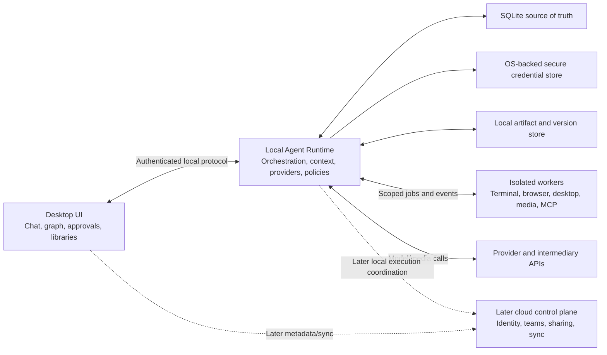
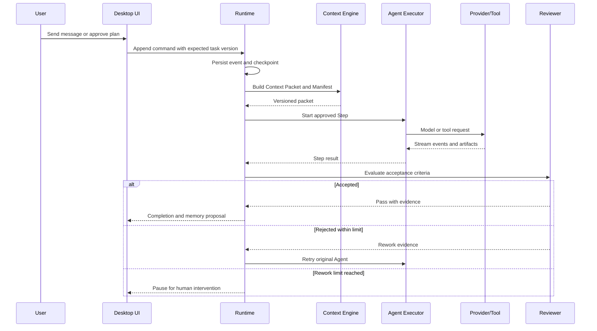

# SYNC-THINK Product and System Design

> Status: approved product/system design; implementation has not started  
> Date: 2026-07-11  
> Target: Windows closed beta for 5-20 invited users  
> Working product name: SYNC-THINK  
> Specification language: English for stable cross-tool handoff; user-facing collaboration remains Simplified Chinese

## 0. How to use this document

This file is the source of truth for the clarified product requirement. A new developer or AI conversation should read this file completely before proposing architecture or implementation work.

Decision labels used below:

- **Locked**: explicitly confirmed in the requirements dialogue. Do not reopen without a new requirement.
- **Provisional**: sufficient for planning, but must be validated during a design or technical spike.
- **Later**: part of the long-term product, intentionally excluded from the first closed beta.

Recommended next workflow:

1. Run `/zno-init` using this document as the requirement source.
2. Create the project documentation scaffold without changing approved product decisions.
3. Resolve only the technical spikes listed in section 24.
4. Produce an implementation plan by milestone.
5. Implement with test-first behavior for runtime, state, permissions, adapters, and recovery.

## 1. Executive summary

SYNC-THINK is a local-first, user-controlled, multi-model Agent desktop workspace. It lets a user combine different providers, intermediary API gateways, API keys, models, Agents, Skills, MCP tools, local files, browser control, and desktop automation inside one continuous task.

The product is not a generic multi-model chat shell and not a system that independently searches for a supposedly best model. The user owns model selection and delegation. The system owns reliable execution, context continuity, permission enforcement, traceability, recovery, and reusable orchestration.

The first principle is:

> Context continuity is more important than automation. A user must be able to move work between models and Agents without restating the task, while still seeing exactly what context was transferred.

The default experience is Codex-like multi-turn chat with one Agent. A task can progressively expand into assisted or autonomous multi-Agent execution without leaving the task or losing the conversation.

## 2. Problem statement

### 2.1 Current pain

The target user commonly has:

- multiple API keys and intermediary gateways;
- different model availability under each key or group;
- GPT-like models for planning or coding;
- Claude-like models configured separately, sometimes through CC Switch or a CLI;
- image models available only through another key or endpoint;
- repeated manual switching between clients and provider configurations;
- repeated copying of prompts, decisions, files, and intermediate outputs;
- no durable task-level context shared across models;
- no reliable way to let the user assign models to specialized Agents and keep that assignment stable.

### 2.2 Product opportunity

Existing categories solve only parts of the problem:

- configuration switchers activate one profile but do not orchestrate a task;
- API gateways normalize requests but do not own end-user context and artifacts;
- workflow builders can automate calls but do not provide a Codex-like local desktop workspace;
- multi-provider chat clients often focus on model switching or comparison rather than durable user-controlled Agent collaboration.

SYNC-THINK combines a desktop conversation workspace with a durable local Agent Runtime.

## 3. Product principles

1. **Context continuity first (Locked).** The application owns canonical task state. No model session is the source of truth.
2. **User-controlled routing (Locked).** The user assigns models to Agents. The system does not silently substitute a different model.
3. **Progressive orchestration (Locked).** Start with one-Agent conversation, then expand to collaboration or automation only when needed.
4. **Local-first execution (Locked).** Model calls, secrets, task state, and tools run locally in the first release.
5. **Inspectable behavior (Locked).** Every context packet, model selection, key-group choice, tool action, approval, artifact, and memory change is traceable.
6. **Secure by default (Locked).** Tool access is scoped. Outside explicit full access, a fixed set of high-risk actions requires a human.
7. **Portable definitions (Locked).** Agent, Skill, workflow, and policy definitions are versioned and can later be shared without sharing credentials.
8. **No cost-driven model substitution (Locked).** Usage is recorded, but the system does not choose cheaper models unless the user explicitly configures such a rule.
9. **One calm primary experience (Locked).** Chat is primary. Graphs, traces, approvals, and context details expand on demand.
10. **Distinctive but functional design (Locked).** Motion and visual identity must explain state and handoffs rather than decorate the interface.

## 4. Target users and positioning

### 4.1 Initial audience

The product is intended for broad multi-model power users rather than one narrow industry. The first beta targets 5-20 invited Windows users who already use multiple models or endpoints and are willing to configure their own providers.

### 4.2 Product type

The first version is a **general orchestration platform**, not an all-knowing general assistant.

- The runtime is domain-neutral.
- Users create or import specialized Agents, Skills, and workflows.
- The system executes user-defined delegation reliably.
- Domain-specific quality comes from explicit acceptance criteria, reviewer Agents, tools, and reusable workflows.

### 4.3 Core jobs to be done

- Continue one task across different models without restating context.
- Keep an Agent bound to a chosen model until the user changes it.
- Start with an exploratory conversation and later delegate execution.
- Combine text, code, image generation, browser actions, and desktop actions.
- Reuse Agent and Skill definitions across tasks and, later, across a team.
- Inspect and intervene in model and tool execution at any time.

## 5. Core product concepts

### 5.1 Local workspace and task hierarchy

The primary hierarchy is:

```text
Local folder / Workspace
  -> Task
    -> Conversation thread(s)
    -> Run(s)
      -> Step(s)
      -> Artifact version(s)
```

Rules:

- A user first selects or adds a local folder.
- Tasks are visibly nested under that folder in the left navigation.
- A task may reference other tasks only when the user explicitly grants or creates that reference.
- A task can contain ordinary multi-turn chat without ever creating a multi-Agent Run.
- Runs and artifacts remain attached to the task that created them.

### 5.2 Participation modes

Every task can switch between these modes without creating a new conversation:

1. **Conversation mode (default).** One Agent participates in multi-turn chat. Other Agents join only when the user calls them.
2. **Collaboration mode.** The current Agent proposes a plan, Agent assignments, model bindings, and approval gates. The user confirms or edits the plan before execution.
3. **Automatic mode.** An approved workflow continues within configured permissions, retry limits, fallback chains, and acceptance gates until completion or a real blocker.

The user can move up or down between modes at any time.

### 5.3 Agent model binding

An Agent has a persistent default model binding. It remains active until the user changes it.

Model resolution precedence is:

1. explicit model selected for the current Run;
2. workflow-node override;
3. Agent persistent default;
4. the Agent's user-configured fallback chain.

Rules:

- A Run override affects only that Run unless the user explicitly saves it as the new default.
- The system never selects an unconfigured replacement model.
- If no fallback is configured, a model timeout, rate limit, authentication failure, or availability failure pauses execution.
- A user can choose a pause-on-failure policy or configure a fallback chain independently for each Agent.

### 5.4 Credential group selection

An Agent normally binds to a model plus a credential group, not necessarily one exact key.

- The runtime may select a usable credential only from the chosen group and only when that credential supports the chosen model.
- The user can pin an Agent or Run to one exact credential.
- When pinned, the runtime cannot switch to another key in the group.
- Credential selection is operational routing; it does not authorize model substitution.

### 5.5 Quality and completion

A multi-Agent task should define visible acceptance criteria before autonomous execution.

- A user may create a dedicated reviewer Agent and bind it to a chosen model.
- A reviewer can be configured as a completion gate.
- On rejection, the review evidence returns to the original execution Agent.
- Automatic rework stops at a configured maximum iteration count.
- After the limit, the task pauses for human intervention.
- Workflows may replace the default behavior with immediate pause or reassignment to a configured backup Agent.

## 6. Core end-to-end user journey

The closed beta must support this complete scenario:

1. The user adds two intermediary providers manually or imports approved CC Switch profiles.
2. The application imports provider names, base URLs, credential groups, model IDs, and capability metadata with explicit user confirmation.
3. The user creates four Agents: planner, executor/designer, image generator, and reviewer.
4. Each Agent receives a persistent model, credential group, optional fallback chain, memory scope, Skill allowlist, tool permissions, and acceptance role.
5. The user opens a local folder and creates a task.
6. The user has a normal multi-turn conversation with the planner Agent.
7. The planner proposes an execution plan. The user edits or confirms it.
8. The runtime creates a Run, prepares context packets, and starts the approved Agents.
9. Agents can work sequentially or in parallel using isolated artifact snapshots.
10. The image Agent receives a structured media request and invokes the user-selected image model.
11. The reviewer checks the result against task acceptance criteria and requests rework when needed.
12. The user sees all messages, context transfers, model calls, credential-group choices, tool actions, approvals, artifacts, and review evidence.
13. The user can pause, intervene, hide or show the trace panel, return to conversation mode, or resume later.
14. The user never needs to restate the original goal, constraints, decisions, or file references.

## 7. Provider, model, and authentication requirements

### 7.1 First-release protocols

The first release natively supports:

- OpenAI-compatible Responses API;
- OpenAI-compatible Chat Completions API;
- OpenAI-compatible Images API;
- Anthropic-compatible Messages API.

The adapter boundary must allow later Gemini, Ollama, local models, media APIs, and third-party adapters.

### 7.2 Model discovery and capability metadata

When a provider is added:

1. The runtime attempts to read the provider's model list.
2. The user can add model IDs manually when discovery is unavailable or incomplete.
3. Optional capability probes test text, vision, tool calling, image generation, and other declared abilities.
4. Probe results are suggestions, never immutable facts.
5. The user confirms or edits the capability tags.

Capability metadata must include protocol requirements and known limits where available.

### 7.3 Intermediary gateways and CC Switch

The first release supports both:

- manual `Base URL + API Key + protocol` setup;
- explicit, user-approved CC Switch configuration import.

Import rules:

- SYNC-THINK does not require CC Switch to remain active after import.
- The importer is versioned and isolated from the core provider model.
- The user previews imported providers, groups, models, and secrets before saving.
- Imported secrets move into SYNC-THINK's secure local credential abstraction.
- Unsupported or ambiguous fields are reported rather than guessed.
- No secret values appear in application logs or exported diagnostics.

### 7.4 Subscription sign-in and CLI bridges (Later)

The API-first beta does not depend on consumer subscription sign-in.

Later connection order is:

1. official provider OAuth where third-party delegated access is supported;
2. official local CLI, Agent SDK, or app-server bridge using the user's installed authenticated tool;
3. API key or enterprise proxy as the stable fallback.

The product must not extract private tokens, browser cookies, or undocumented authentication files. A local CLI bridge may indirectly use a configured intermediary provider if the CLI officially supports that configuration, but it is not a substitute for direct provider import.

## 8. Agent definition

Every Agent definition is versioned and contains:

- stable ID, name, description, visual identity, and role;
- developer/system instructions;
- expected input and output contract;
- primary model and credential group;
- optional exact credential pin;
- fallback model chain and failure policy;
- memory scope: task, project, or global;
- installed Skill allowlist;
- MCP server and tool allowlist;
- file, command, browser, desktop, and network permissions;
- approval policy;
- reviewer or acceptance-gate behavior;
- default artifact handling rules.

Historical Runs always reference the exact Agent version that was used. Editing an Agent does not rewrite Run history.

## 9. Skill and MCP model

### 9.1 Skill scopes

Skills can exist in:

- the user's personal library;
- a project's library;
- an Agent's explicit allowlist;
- a temporary attachment for one task or Run.

Installing a Skill does not make it available to every Agent.

### 9.2 Skill import

The first release prioritizes compatibility with existing `SKILL.md` directory structures.

Import produces an internal normalized Manifest containing:

- name, description, and version;
- source and integrity information;
- instructions and references;
- tool and MCP dependencies;
- local runtime dependencies;
- declared permissions;
- compatibility requirements;
- files and scripts included in the package.

Arbitrary scripts are not silently executed during import. A Skill that needs execution must declare it and pass the relevant permission and dependency checks.

### 9.3 MCP

- Local and remote MCP Servers are supported.
- Each server, tool, Agent, and project has an explicit authorization relationship.
- Tool schemas are added only to context packets for Agents allowed to use them.
- MCP process output is size-limited, timed out, audited, and treated as untrusted content.
- A Skill version that adds new tools or permissions requires a new approval.

## 10. Context continuity and memory

### 10.1 Context layers

The context model has three layers:

1. full current-task context;
2. structured project memory and project artifacts;
3. a small set of user-level preferences.

Cross-project or cross-task content is included only through an explicit reference or permission.

### 10.2 Context packet

Every model call receives a generated Context Packet containing only the relevant subset of:

- task goal and current status;
- constraints and acceptance criteria;
- approved decisions;
- current Run and Step information;
- relevant project memory;
- explicit cross-task references;
- Agent instructions and output contract;
- allowed Skills and tool schemas;
- relevant message excerpts;
- file excerpts and artifact versions;
- review evidence and unresolved issues.

The runtime cannot transfer a model's hidden reasoning. It transfers application-owned facts and evidence.

### 10.3 Context Manifest

Every Context Packet produces a user-inspectable Manifest that records:

- included sources;
- excluded sources;
- summaries or compressed sections;
- token estimates and truncation decisions;
- cross-task references;
- Agent, Skill, and policy versions;
- evidence used for long-term memory.

The user can inspect and amend the packet before a sensitive or high-impact Run.

### 10.4 Long-term memory

Raw conversations and events are archived but do not automatically become durable facts.

At task milestones, an Agent creates a structured Memory Change containing:

- additions;
- modifications;
- deprecations;
- evidence references;
- target scope;
- confidence or unresolved ambiguity.

The project policy decides whether changes require user approval or can be automatically approved. Every version remains reversible.

## 11. Core data model

| Entity | Responsibility |
|---|---|
| `Workspace` | Local folder boundary, project settings, policies, members later |
| `Task` | Goal, state, acceptance criteria, references, task-level context |
| `Thread` | Ordered multi-turn messages inside a task |
| `Run` | One approved execution plan and its lifecycle |
| `Step` | Executable unit, dependency edges, Agent version, state, retries |
| `Artifact` | Logical output such as file, image, document, or video |
| `ArtifactVersion` | Immutable snapshot, source Step, status, merge ancestry |
| `Event` | Append-only execution fact and audit record |
| `MemoryChange` | Proposed structured update to durable memory |
| `Provider` | Protocol and base URL definition |
| `CredentialGroup` | Named collection of credentials and model availability |
| `CredentialRef` | Secure-store reference; never plaintext application data |
| `Model` | Provider model ID, capabilities, protocol requirements, limits |
| `AgentVersion` | Immutable executable Agent configuration |
| `SkillVersion` | Immutable normalized Skill Manifest |
| `McpServer` | MCP connection and trust configuration |
| `Policy` | Permission and approval rules |
| `WorkflowVersion` | Nodes, edges, model overrides, gates, and error behavior |
| `AcceptanceGate` | Reviewer, test, human, or rule-based completion requirement |

Definitions and history are versioned. Search indexes and future vector indexes are derived data, not the source of truth.

## 12. Orchestration and Run lifecycle

The durable Run state machine includes:

```text
Conversation
  -> PlanDraft
  -> AwaitingPlanApproval
  -> Queued
  -> Running
  -> AwaitingToolApproval (optional, repeatable)
  -> Reviewing
  -> Revising (optional, bounded)
  -> Completed
```

Terminal or exceptional states include `Paused`, `Blocked`, `Failed`, and `Cancelled`.

Rules:

- Any state can be paused or cancelled when the current external operation permits it.
- A paused task can return to conversation mode.
- Automatic mode skips only approvals that the active policy explicitly allows it to skip.
- Plans are immutable once a Run starts; edits create a new plan revision with an auditable diff.
- Step IDs remain stable across retries and recovery.

### 12.1 Parallel work and artifacts

- Mergeable artifacts use isolated snapshots and an explicit merge Step.
- Merge conflicts pause for the coordinator or user.
- Non-mergeable artifacts use a single writer.
- Multiple image/video candidates remain separate versions until selected.
- No last-write-wins behavior is allowed for concurrent Agent outputs.

### 12.2 Image and future media pipeline

An image-only model is a generation capability rather than a full conversational planner.

Default flow:

1. The conversation Agent converts task context into a structured media request.
2. The generation Agent invokes the exact user-bound media model.
3. The artifact store records prompt, parameters, provider, model, source context, and output.
4. A vision/reviewer Agent checks the output against acceptance criteria.
5. Rework produces another artifact version rather than overwriting the previous output.

Video and audio later use the same contract with asynchronous job IDs, progress, cancellation, provider-specific parameter schemas, and media-aware review.

## 13. Permissions and approvals

### 13.1 User-selectable modes

The canonical product labels are fixed:

- **请求批准** (`request`): read-only inspection runs automatically; protected writes, commands, and external actions pause for the user.
- **替我审批** (`delegate`): a designated approval Agent evaluates protected actions; non-delegable sensitive actions fall back to the user.
- **完全访问** (`full`): every currently available action runs without an approval prompt, including the seven sensitive categories below. Runtime still records the action for audit.
- **自定义** (`custom`): per-tool, per-directory, per-command, per-site, and per-action rules.

Policies can be scoped to user, Workspace, Agent, workflow, Task, or one Run. A Run policy overrides a Task policy, and a Task policy overrides broader Agent, Workspace, and user defaults. Once `full` is the final effective mode, legacy per-action request/delegate rules do not reintroduce approval. Capability ceilings and resource boundaries still determine which actions are available.

### 13.2 Sensitive action categories

These require the user in request, delegate, and custom modes. Full access executes them directly and keeps audit metadata:

- accessing or creating a new secret;
- payments or purchases;
- public publishing;
- sending external messages as the user;
- changing identity or permission policy;
- irreversible deletion;
- exporting sensitive data outside the approved boundary.

## 14. Tools and execution workers

The long-running Runtime starts isolated workers on demand for:

- authorized file operations;
- terminal commands and tests;
- Git operations;
- browser automation through Playwright;
- Windows desktop automation through a UI Automation worker;
- image and media processing;
- local CLI and SDK bridges;
- local MCP Server processes.

Worker rules:

- receive a minimal capability token and scoped working directory;
- never receive unrelated credentials;
- enforce timeout, cancellation, output, and resource limits;
- stream events to the Runtime;
- write artifacts through the artifact service rather than arbitrary shared paths when possible;
- can crash or be terminated without corrupting the main task state.

Future platform workers implement the same interface using macOS Accessibility and Linux AT-SPI.

## 15. Desktop information architecture

### 15.1 First-release pages

1. **First launch**: local data directory, folder selection, permissions, theme.
2. **Provider and model center**: providers, CC Switch import, credential groups, models, probes, compatibility.
3. **Main workspace**: folder/task tree, complete chat, participation modes, context rail, collapsible trace.
4. **Execution graph**: dependencies, parallel Steps, Agent/model overrides, gates, revisions.
5. **Context inspector**: Context Packet and Manifest editing.
6. **Agent editor**: instructions, model, key group, fallback, memory, Skills, tools, permissions, review.
7. **Skill and MCP center**: import, versions, dependencies, permissions, bindings, server status.
8. **Approval center**: plan, tools, memory, exports, and human-only actions.
9. **Artifact and version view**: candidates, diff, merge, selection, rollback.
10. **Diagnostics and settings**: Runtime, adapters, logs, theme, data export, updater.

### 15.2 Main workspace layout (Locked)

- Left navigation starts with local folders/Workspaces.
- Tasks are nested beneath the folder in which they execute.
- The center shows the complete scrollable conversation history.
- Default message layout places user messages on the right and Agent messages on the left.
- A user setting can switch to a single-column reading layout.
- The right Run trace is visible by default, can be collapsed or restored, and remembers the Workspace preference.
- Collapsing the trace does not pause or stop a Run.
- Conversation mode is the default primary surface.
- Execution plans appear inside the conversation and can expand into the graph view.

### 15.3 Theme and visual direction

- The product provides complete light and complete dark themes.
- Default theme follows the operating system.
- A split dark-sidebar/light-canvas theme was explicitly rejected.
- The current V3 layout is a provisional interaction baseline, not final visual art.
- The final design must remain calm and work-focused while achieving a distinctive brand identity.
- The context rail is the single signature element linking messages, Agent handoffs, artifacts, and trace events.
- Agent colors are accents and never the only status indicator.
- Cards use restrained radii and are reserved for real framed objects, not every section.

### 15.4 Motion and accessibility

- Motion explains Agent handoff, context transfer, mode change, approval pause, or artifact creation.
- Typical UI transitions target 150-300ms.
- No ambient decorative animation, gradient orbs, bokeh, or layout-shifting hover effects.
- The UI respects reduced-motion settings.
- Keyboard navigation, visible focus, screen reader names, contrast, zoom, and high-DPI Windows layouts are required.
- The final UI needs separate visual review in both themes and at multiple Windows scaling factors.

## 16. Selected application architecture

The selected architecture is a desktop UI plus a local Agent Runtime. They are two long-lived product processes; high-risk tools use short-lived worker processes.



Architectural rules:

- UI restart does not terminate active Runs.
- The Runtime can eventually be reused by a CLI or team-managed local runner.
- The first release is a modular monolith, not microservices.
- The later cloud control plane does not sit in the model request path by default.
- Member API keys are not stored by the team cloud service.

## 17. Selected technology direction

### 17.1 Selected stack (Locked for planning)

- Desktop shell: Electron.
- UI: React + TypeScript.
- Runtime: independent Node.js/TypeScript process.
- Durable run state: XState representation plus persisted events/checkpoints.
- Source of truth: SQLite.
- Local text search: SQLite FTS.
- UI-to-Runtime boundary: Electron main-process bridge and authenticated local named-pipe protocol.
- Browser automation: Playwright worker.
- Windows desktop control: isolated UI Automation worker.
- MCP: official TypeScript SDK with Runtime-side authorization.
- Provider integration: explicit OpenAI-compatible and Anthropic-compatible adapters.

The exact SQLite driver, component library, secure-store implementation, updater, and Windows UI Automation library remain technical-spike decisions. They must not change the product boundaries in this document.

### 17.2 Rejected alternatives

- Tauri was not selected for the first release because Rust + web UI + Node sidecar increases single-developer integration cost without accelerating model/tool work.
- WinUI 3 was not selected because it creates a high-cost migration path for macOS/Linux.
- Forking a generic multi-model chat client was not selected because the durable Agent Runtime and permission model are core, not an add-on.
- A single-process desktop architecture was not selected because long Runs, MCP, browser, and desktop control need isolation from UI lifecycle.

## 18. Runtime data flow



## 19. Security model

- Electron Renderer has no direct Node access.
- Context isolation and a strict Content Security Policy are mandatory.
- Runtime transport is accessible only to the current OS user and validates installation identity.
- Secrets never enter Renderer state, prompts, logs, diagnostics, or team sync.
- Paths are canonicalized and verified against authorized roots before file access.
- Terminal commands, websites, MCP tools, desktop actions, and exports use separate policy checks.
- Web pages, files, messages, and tool outputs are untrusted data and cannot promote themselves to higher-priority instructions.
- Skill and MCP version changes expose permission diffs.
- Every model change, approval, tool call, memory change, artifact, and credential reference is audited.
- Sensitive actions in section 13.2 cannot be delegated in request, delegate, or custom mode. Explicit full access executes them without prompting and preserves audit metadata.

## 20. Error handling and recovery

1. Persist the intent/event before invoking an external side effect.
2. Give every Run and Step a stable ID and idempotency marker.
3. Checkpoint after each externally observable transition.
4. Retry only classified transient failures and only within configured limits.
5. Do not retry authentication, protocol incompatibility, permission denial, or acceptance rejection as network errors.
6. A UI crash leaves the Runtime running.
7. A Runtime restart reconstructs Run state from events and checkpoints.
8. A Worker crash fails only its Step and marks partial artifacts incomplete.
9. Context overflow creates a visible compression proposal; goals, decisions, and acceptance criteria are protected from silent removal.
10. Database migration creates a backup first; failure rolls back and opens a read-only diagnostic mode.
11. Provider errors are normalized into actionable categories while preserving raw provider evidence in a secret-scrubbed diagnostic record.

## 21. Roadmap

The estimate assumes one developer working with substantial daily availability.

### Phase 0: technical validation, 2-3 weeks

- Electron/Runtime/named-pipe/SQLite skeleton.
- Fake provider, streaming message, checkpoint, restart recovery.
- Windows credential encryption spike.
- Playwright and UI Automation spikes.
- V3 layout validation and visual-system refinement.

### Phase 1: multi-model conversation Alpha, 6-8 weeks

- Local folders, tasks, complete conversation history.
- Provider, gateway, credential group, models, probes.
- OpenAI-compatible and Anthropic-compatible streaming.
- Agent binding, override precedence, fallback chains, memory scope.
- Context Packets, Manifests, cross-task references, memory proposals.
- Complete light/dark themes and collapsible trace.

### Phase 2: multi-Agent orchestration Alpha, 6-8 weeks

- Participation modes and plan approval.
- Durable graph, dependencies, parallel snapshots, pause/resume.
- Acceptance gates, reviewer Agent, bounded rework.
- Agent editor, Skill import, Skill scopes, MCP authorization.
- Approval policies and human-only gates.
- Artifact versions, comparison, merge, and rollback.

### Phase 3: Windows closed beta, 6-9 weeks

- File, terminal, Git, browser, and Windows desktop workers.
- Image generation and visual review pipeline.
- Manual gateways and CC Switch import.
- Diagnostics, crash recovery, installer, signing, and updates.
- Visual polish, motion, accessibility, performance, and beta operations.
- 5-20 invited users.

Expected time to the closed beta is approximately 20-28 weeks. This is a planning estimate, not a release promise.

## 22. Later product roadmap

### 22.1 More media and providers

- native Gemini adapter;
- Ollama and local-model adapters;
- third-party Adapter SDK;
- video, audio, speech, and other asynchronous generation capabilities;
- provider capability packs and compatibility tests.

### 22.2 Subscription and installed-tool connections

- official OAuth per provider when available;
- Codex programmatic/app-server or CLI bridge through official interfaces;
- Claude official Agent SDK/CLI bridge where supported;
- local connector health, version, permission, and capability discovery;
- no undocumented token extraction.

### 22.3 Cross-platform

- macOS desktop shell validation and Accessibility worker;
- Linux packaging and AT-SPI worker;
- platform-specific credential store and update implementation behind stable interfaces.

### 22.4 Encrypted sync

- opt-in sync only;
- begin with definitions and artifact metadata;
- end-to-end encryption for selected content;
- explicit conflict handling and device revocation;
- no automatic secret sync in the first sync release.

### 22.5 Team stages

**Team A: shared asset library**

- identity, organization, Workspace, invitations, RBAC;
- Agent, Skill, workflow, and policy sharing;
- versions, ownership, review, and audit;
- definitions only; no creator credentials are shared.

**Team B: shared projects and tasks**

- shared task context and artifacts;
- access control, version history, audit, and conflict handling;
- local Runtime remains the execution owner unless a hosted runner is explicitly introduced later.

**Team C: live collaboration**

- multiple humans in one task;
- shared approvals, pauses, interventions, and comments;
- presence, concurrency, and role-based control;
- clear attribution for every human and Agent action.

### 22.6 Marketplace

- signed Agent/Skill packages;
- trusted publisher identity;
- dependency and permission review;
- compatibility and update channels;
- private team catalog before a public marketplace.

## 23. Testing and acceptance

### 23.1 Test layers

- Unit: state machines, permissions, context compilation, routing, fallback chains.
- Contract: provider streaming, tools, images, rate limits, malformed responses.
- Integration: SQLite, named pipes, credentials, Skill/MCP, checkpoints.
- End-to-end: folder -> chat -> plan -> Agents -> review -> artifact.
- Failure/chaos: terminate UI, Runtime, Worker, provider, and network.
- Security: path traversal, command injection, prompt injection, MCP privilege escalation, secret leakage.
- Visual: light/dark, long conversations, trace open/closed, high DPI, Windows scaling.
- Accessibility: keyboard, focus, screen readers, contrast, reduced motion.
- Model quality: fixed evaluation tasks, rule checks, independent reviewer, human sampling.

### 23.2 Closed-beta acceptance criteria

1. One task can use at least two providers and three models without requiring the user to restate context.
2. Agent defaults, Run overrides, credential groups, exact pins, and fallbacks follow the approved precedence.
3. Every model call has an inspectable Context Manifest.
4. Every tool, approval, artifact, and reviewer decision is traceable.
5. Restarting the app restores active work without repeating completed side effects.
6. No plaintext API key appears in the database, logs, diagnostics, prompts, or exports.
7. Unauthorized tools and human-only actions have no bypass path.
8. The main workspace supports local-folder task grouping, complete chat history, right/left messages, single-column option, complete light/dark themes, and collapsible trace.
9. Provider and protocol limitations are visible and actionable.
10. All automated tests, build, type check, visual regression, installer, and upgrade verification pass.
11. Five to twenty invited users complete the core journey without data loss or a high-severity permission defect.
12. Known limitations and recovery instructions are available in diagnostics.

## 24. Required technical spikes

These are implementation questions, not unresolved product requirements:

1. Select the exact SQLite driver and migration framework compatible with Electron packaging.
2. Select the Windows secure-store implementation and define secret migration/backup behavior.
3. Validate named-pipe protocol, event streaming, authentication, and Runtime version negotiation.
4. Select and validate the Windows UI Automation library and fallback strategy.
5. Define the supported `SKILL.md` compatibility subset and build a conformance fixture set.
6. Reverse-engineer only the documented/stable CC Switch configuration surfaces allowed for import; define version detection and safe failure.
7. Build a provider compatibility fixture matrix for Responses, Chat Completions, Messages, Images, and gateway quirks.
8. Validate XState persistence boundaries and DAG scheduling behavior under crash recovery.
9. Select the React component primitives, icon system, and token architecture without compromising the custom design direction.
10. Validate signing, updater, crash-reporting privacy, and internal-beta distribution on Windows.

## 25. Explicit non-goals for the closed beta

- consumer subscription login;
- unofficial credential or cookie extraction;
- macOS or Linux distribution;
- cloud execution;
- multi-user team space;
- real-time collaboration;
- public marketplace;
- automatic global search for the best or cheapest model;
- arbitrary unreviewed Skill script execution;
- silent cross-project memory sharing;
- guaranteed support for every OpenAI-compatible intermediary implementation;
- video or audio generation in the first beta.

## 26. Primary risks and mitigations

| Risk | Mitigation |
|---|---|
| Scope is large for one developer | Enforce the milestone boundaries and vertical acceptance scenarios |
| Gateway protocols are inconsistent | Contract fixtures, explicit adapters, capability confirmation, visible compatibility |
| Context summaries become incorrect | Preserve sources, version Memory Changes, expose Manifests, allow rollback |
| Agent loops run indefinitely | Bounded retries/rework, explicit state machine, user pause and cancellation |
| Tools or MCP exceed authority | Runtime-side policy checks, scoped workers, human-only gates, audit |
| Electron process compromise exposes data | Renderer isolation, strict bridge, secure store, no secrets in UI state |
| Desktop automation is fragile | Accessibility-first UI Automation, observable workers, fallback/manual recovery |
| Product becomes another chat client | Keep context continuity, durable execution, artifacts, approvals, and recovery as core acceptance |
| Visual design remains generic | Treat V3 as structural only; run a dedicated brand, motion, and visual QA phase |
| Subscription integrations are unavailable | API-first value remains complete; use only official OAuth/SDK/CLI paths later |

## 27. Handoff instructions for another conversation

Use this prompt with the file:

```text
请先完整阅读 `docs/superpowers/specs/2026-07-11-sync-think-product-design.md`，再开始回复。

所有标记为 Locked 的内容都是已经确认的需求。不要让我重新解释原始问题，也不要重新讨论已经批准的决定。必须保持第一原则：上下文连续性与用户控制模型调度。

项目已经完成价值评估及产品/系统设计，但尚未开始实现。请继续执行 `/zno-init`，创建项目所需文档，只解决第 24 节列出的技术验证项，然后按里程碑制定实施计划。在项目工作流要求的需求和技术决策得到确认前，不要开始实现。
```

## 28. Approved decision summary

- Build the product: **DO**.
- Independent desktop application, not a modification of Codex or Claude.
- API-first beta; official subscription/CLI bridges later.
- General user-controlled orchestration platform, not universal automatic model search.
- Context continuity is the primary value.
- Default multi-turn chat; collaboration and automatic modes are optional within the same task.
- Agent model binding persists until the user changes it.
- Credential group routing is allowed; model substitution is not.
- Explicit cross-task access and layered memory.
- User, project, Agent, and task Skill scopes with Agent allowlists.
- `SKILL.md` import and MCP support.
- File, terminal, browser, and Windows desktop control in the beta path.
- Configurable approvals with a non-bypassable human-only list.
- Windows first; 5-20 invited users.
- Local-first secrets, context, artifacts, and execution.
- Electron + React/TypeScript + independent Node/TypeScript Runtime.
- SQLite source of truth, durable state/checkpoints, isolated workers.
- Complete light and dark themes.
- Left navigation starts from local folders; tasks are nested under them.
- Complete scrollable chat, user right/Agent left by default, single-column option.
- Right Run trace is collapsible.
- V3 is the provisional structural UI baseline; final visual art is still a dedicated refinement task.
- Team, cross-platform, sync, subscription, video/audio, and marketplace are later staged work.

## Appendix A. Visual companion artifacts

The requirements session created local visual prototypes under:

```text
.superpowers/brainstorm/52468-1783736044/content/
```

The most relevant files are:

- `architecture-options.html`: architecture alternatives;
- `system-architecture.html`: approved process/component boundaries;
- `context-data-model.html`: approved context and entity model;
- `agent-runtime-lifecycle.html`: approved Run and Agent behavior;
- `visual-directions.html`: initial visual directions;
- `main-workspace-v3.html`: latest accepted structural interaction baseline.

Earlier dark/split-material screens are exploration artifacts and are not approved visual direction.
