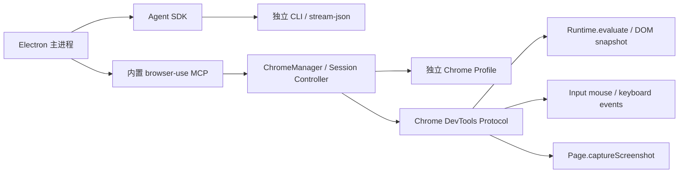
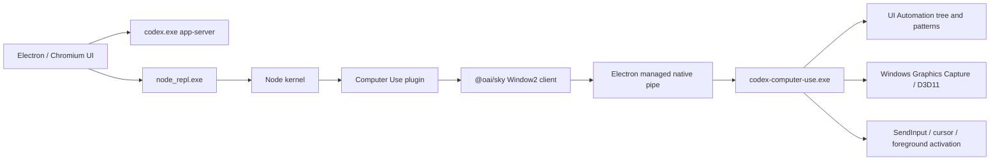

# Windows UI Automation Worker 技术 Spike

日期：2026-07-31
状态：**方案已于 2026-07-31 确认；DesktopWorker P0.1-P0.10 已实现，真实 WPF 冷重启人工接管 E2E 2/2 通过，P0 已收口**

## 1. 背景与决策门槛

Phase 3 的下一项是 Windows UI Automation Worker 与人工接管回退。产品设计已经锁定“Windows UI Automation Worker”这一架构方向，但具体接入库仍属于必须经过 Spike 和用户确认的技术选型。

现有 `TD-007` 将“自研 Worker + `koffi` 调 UIA COM”写成方向级推荐，`packages/workers/src/desktop/desktop-worker.ts` 也提前写了该方向；本轮重新按当前 Node 20、独立 Runtime、Windows x64、打包和可取消要求验证具体驱动，不把旧注释视为跳过选型门槛的依据。

## 2. P0 能力边界

### 2.1 进入 P0

1. 列出可见顶层窗口，并按 PID、窗口句柄或明确标题绑定目标应用。
2. 在有深度、节点数和输出字节上限的前提下读取 UIA 控件树。
3. 以 `automationId` 优先，辅以 `name + controlType` 定位元素；歧义时失败，不猜测点击。
4. 读取 Name、Value/Text、AutomationId、ControlType、ProcessId、Enabled、Offscreen 和 Bounds。
5. 最小语义动作：SetFocus、InvokePattern、ValuePattern.SetValue；不支持语义 Pattern 时进入人工接管，不默认退化成坐标点击。
6. 每个动作绑定 exact app/window/element 快照、capability token、超时、取消信号、输出限幅和 durable command fence。
7. UIA 不可用、目标提权、窗口消失、选择器歧义、Pattern 不支持、超时或 Worker 崩溃时，转 durable `waiting_user` 人工接管。

### 2.2 不进入 P0

- 通用视觉识别或 OCR 定位。
- 任意坐标鼠标、拖拽、触摸、手写笔和全局键盘宏。
- 绕过 Windows 完整性级别、UIPI、锁屏、安全桌面或 UAC 提示。
- 自动操作密码框、支付、发布、删除、系统设置等敏感动作；这些动作必须经过现有审批策略，必要时只允许人工接管。
- 跨平台抽象的 macOS Accessibility / Linux AT-SPI 实现。

## 3. 本机 Spike 环境

| 项目         | 结果                                                                                           |
| ------------ | ---------------------------------------------------------------------------------------------- |
| 操作系统     | Windows x64                                                                                    |
| 项目 Runtime | Node 20（`.nvmrc`）；本机验证 Node 20.20.2                                                     |
| Desktop      | Electron 33.2.1                                                                                |
| .NET         | SDK/Desktop Runtime 8.0.422 / 8.0.28                                                           |
| Rust / MSVC  | 本机未安装，因此不把 Rust/C++ 新工具链列为 P0 推荐                                             |
| Spike 目录   | `C:\Users\zhuzhenyu\AppData\Local\Temp\sync-think-uia-spike-558ba230a6e3429da6ee161ccac8b35c\` |

Spike 使用一个临时 WPF fixture，包含 `InputText`、`ApplyButton` 和 `ResultText`，用于验证真实控件树、SetValue、Invoke 和读取结果。所有实验文件位于临时目录，没有修改 workspace 依赖或 lockfile。

## 4. 方案与实测

### 方案 A：独立 Node Worker + `koffi` 直接调用 UIA COM

**目的**：保持 Runtime/Worker 技术栈为 Node + TypeScript，只引入小型 N-API FFI，并在短生命周期 Worker 进程内封装 UIA COM。

**实测结果**：

- 临时安装 `koffi 3.1.4`；x64 `node_modules` 实测约 2.65 MB。
- Node 20.20.2 下成功调用 `CoInitializeEx -> CoCreateInstance(CUIAutomation) -> IUIAutomation.GetRootElement`。
- 三次 Node 进程内 COM 初始化与 RootElement 获取约 12.2-12.9 ms。
- Node 20 的 N-API 9 环境可直接加载当前预编译包，没有引入 Electron ABI 重编译。
- Spike 只验证了 COM ABI、对象创建和 RootElement 边界；完整 UIA Element/Condition/Pattern 包装仍需正式 TDD 实现。

**优点**：

- 与现有独立 Node Runtime、WorkerToken、AbortSignal、输出限幅和进程隔离直接对齐。
- 依赖和安装体积最小，不要求用户安装第二运行时。
- UIA 调用可以放进可强制终止的短生命周期 Worker；COM 卡死不会阻塞主 Runtime。
- P0 只包装需要的 UIA 接口，暴露面可控。

**缺点与风险**：

- 必须正确维护 COM vtable、GUID、HRESULT、BSTR、VARIANT、SAFEARRAY、引用计数和 Pattern 接口，工程复杂度最高。
- ABI 声明错误可能导致 Worker 原生崩溃；必须依靠进程隔离、fixture、真实应用矩阵和内存/句柄回归降低风险。
- `koffi` 是第三方 FFI；正式打包必须验证 win-x64 预编译资产、ASAR/unpack 和离线安装。

**性能/成本/维护**：运行开销最低；实现与测试成本中高；长期只维护一套 TypeScript/Node 构建链，但要维护自有 UIA COM 薄封装。

### 方案 B：自研 .NET UIAutomationClient Sidecar

**目的**：使用微软托管的 `System.Windows.Automation` API，在独立 sidecar 中通过 JSONL/stdio 向 Node Runtime 提供 UIA 能力。

**实测结果**：

- 真实 WPF fixture 的 inspect、ValuePattern.SetValue、InvokePattern、结果读取全部通过。
- framework-dependent 发布为 5 个文件、约 179.6 KB，但目标机器必须已有匹配的 .NET Desktop Runtime。
- self-contained + single-file compression 发布仍为 6 个文件、约 76.1 MB，其中主 EXE 约 67.9 MB。
- framework-dependent inspect 墙钟约 162-252 ms；self-contained 约 271-291 ms。常驻 JSONL sidecar 可以摊薄启动时间。

**优点**：

- UIA 类型、Pattern 和属性由托管 API 封装，实现最快、类型安全最好，内存与 COM 引用管理风险明显低于手写 vtable。
- sidecar 天然可被 Runtime 超时终止，语言运行时崩溃与主 Runtime 隔离。
- 建立复杂 TreeWalker、CacheRequest、事件订阅和文本 Pattern 更容易。

**缺点与风险**：

- 新增第二套语言、构建、测试、发布和安全更新链路。
- framework-dependent 依赖目标机运行时；self-contained 会显著增加安装包体积。
- 当前本机仅验证 .NET 8；若采用还需重新确认目标版本、支持周期、签名、单文件发布和闭测机兼容性。

**性能/成本/维护**：运行性能足够；首期实现成本最低；分发体积和长期双工具链维护成本最高。

### 方案 C：直接集成 Microsoft `@microsoft/winappcli` UI 命令

**目的**：复用微软现成 CLI 的 inspect/search/get-value/set-value/invoke/screenshot/wait-for 等能力，Runtime 直接启动其原生 `winapp.exe`。

**实测结果**：

- npm 版本 `0.5.0`；包 README 明确标记为 Public Preview / experimental。
- npm tarball 约 30.2 MB；仅 win-x64 两个原生二进制约 34.6 MB，npm 包还同时携带 arm64 资产。
- 真实 WPF fixture 的 inspect、set-value、invoke、get-value 全部通过。
- 四个独立命令墙钟分别约 230 ms、245 ms、196 ms、163 ms。
- npm Node wrapper 会再 spawn 原生 EXE，API 当前没有项目所需的 AbortSignal/精准进程树取消合同；若采用必须绕过 wrapper 或另做 supervisor。
- CLI 默认显示遥测声明；产品集成必须显式关闭遥测并复核隐私边界。

**优点**：能力覆盖最完整，最短时间可得到可用的 inspect/action 工具；微软维护；输出已支持 JSON。

**缺点与风险**：Public Preview 的 CLI/JSON 合同可能变化；包体积大；功能面远超 P0；遥测、升级和 wrapper 子进程生命周期需要额外治理。它更适合作为开发期对照工具和兼容性 oracle，不适合作为闭测核心执行驱动。

**性能/成本/维护**：原型成本最低；运行性能可接受；版本漂移、分发和隐私治理成本偏高。

## 5. 对比结论

| 维度               | A. Koffi + UIA COM                  | B. .NET Sidecar                                        | C. WinAppCLI                            |
| ------------------ | ----------------------------------- | ------------------------------------------------------ | --------------------------------------- |
| Node 20 / 当前架构 | **最佳**                            | 需第二工具链                                           | 可 spawn，但 wrapper 不满足现有取消合同 |
| 已验证能力         | COM + RootElement                   | **完整最小 inspect/action**                            | **完整最小 inspect/action**             |
| 生产新增体积       | **约 2.65 MB**                      | 约 0.18 MB + 外部 Runtime，或约 76.1 MB self-contained | x64 原生约 34.6 MB，完整 npm 包更大     |
| 类型/内存安全      | 最低，靠隔离与测试                  | **最高**                                               | 中等，内部实现不可控                    |
| 首期开发速度       | 中                                  | **快**                                                 | 最快                                    |
| 取消/超时          | 放进短生命周期 Node Worker 后可强杀 | sidecar 可强杀                                         | 需绕过或补强 Node wrapper               |
| API 稳定性         | UIA COM 稳定；FFI 声明自维护        | 托管 UIA 稳定；.NET 版本需维护                         | **Public Preview，风险最高**            |
| 长期维护           | 单工具链 + 自有 ABI 层              | 双工具链 + 运行时更新                                  | 跟随外部 CLI 变化                       |

## 6. NewMax 1.1.9 逆向参考

### 6.1 取证范围与证据边界

本轮对本机安装的 NewMax 1.1.9 做了只读静态与运行态交叉分析，包括 Electron 进程树、主进程命令行、ASAR 文件表与主进程 bundle、原生依赖、应用日志，以及浏览器工具实现。分析没有操作其用户会话，也没有把日志中的用户内容、令牌或完整配置写入本文。

结论需要严格区分：

| 证据级别   | 结论                                                                                                                                                                                                                  |
| ---------- | --------------------------------------------------------------------------------------------------------------------------------------------------------------------------------------------------------------------- |
| 已确认事实 | NewMax 是 Electron 应用；主进程以 stream-json stdin/stdout 驱动 Agent SDK 随附的独立 CLI；内置 `browser-use` MCP 工具；浏览器自动化基于独立 Chrome Profile、Chrome DevTools Protocol（CDP）和部分 Playwright CDP 连接 |
| 强证据推断 | 进程加载 `UIAutomationCore.dll` 更可能是 Electron/Chromium accessibility 基础设施所致；`uiohook-napi` 用于全局语音快捷键，而不是通用桌面自动化驱动                                                                    |
| 当前未确认 | NewMax 的几个本机监听端口分别承担什么职责；是否存在未触发、运行时下载的桌面自动化插件；工具 Promise 超时后底层 CDP 命令是否也被真正中止                                                                               |

### 6.2 已确认的自动化架构



Chrome 以 `--remote-debugging-port`、`--user-data-dir`、`--no-first-run` 等参数启动。工具实现直接调用 `Page.navigate`、`Runtime.evaluate`、`Page.captureScreenshot`、`Input.dispatchMouseEvent`、`Input.dispatchKeyEvent`、`Page.bringToFront` 和 `Emulation.setDeviceMetricsOverride` 等 CDP 方法。

内置 MCP 工具覆盖 profile、打开、DOM 元素点击、坐标点击、输入、按键、滚动、脚本执行、截图、文件保存、多标签页、关闭、人工接管和 workflow 复用。Agent SDK 通过 `mcpServers` 和明确的 `allowedTools` 列表注入这些工具，并使用 `AbortController`、最大步骤数和工具级超时约束执行。

其浏览器提示词明确采用结构优先策略：

1. 读取页面优先使用 DOM snapshot / `browser_eval`。
2. 点击优先使用 CSS selector / `browser_click_element`。
3. 只有需要视觉判断时才截图。
4. 坐标点击只是最后手段。
5. 每次动作后等待页面稳定，再截图并重建 DOM snapshot，形成“感知 → 动作 → 再感知”闭环。

### 6.3 人工接管模型

NewMax 的 `browser_pause_for_human` 是本轮最值得参考的部分。它把 CAPTCHA、登录凭据、OTP/2FA、人工输入和支付确认等真正阻塞的场景切换为显式人工接管：

1. 会话记录 `awaitingHuman` 状态和用户说明。
2. 保持 Chrome、Profile 和当前标签页存活，不执行后续点击，也不关闭浏览器。
3. 通过 CDP 向页面注入“完成，继续”入口，并以 `Runtime.addBinding` / `Runtime.bindingCalled` 接收完成信号。
4. 页面导航后重新注入接管 UI。
5. 用户完成后清理 binding/listener，再显式恢复 Agent。
6. session flush/close 遇到 `awaitingHuman` 时抑制资源清理，避免把用户正在处理的目标关闭。

这与 SYNC-THINK 已实现的 durable `waiting_user` / Continue / Cancel 方向一致，但 NewMax 主要把状态保存在浏览器会话和进程内；SYNC-THINK 仍应保留 durable command、冷重启恢复和 exact revision fence。

### 6.4 未发现 Windows UIA 驱动

NewMax 1.1.9 的应用依赖包含 Agent SDK、MCP SDK、`playwright-core`、`uiohook-napi`、SQLite 和 PTY 等，但没有发现 Koffi、`ffi-napi`、`winax`、`edge-js`、RobotJS、Nut.js、.NET UIA sidecar 或独立 native desktop automation helper。

在主 bundle、preload、提取后的 `out`、原生模块和运行日志中，也没有发现 `IUIAutomation`、`AutomationElement`、`InvokePattern`、`ValuePattern`、`CoCreateInstance` 或 `System.Windows.Automation` 的应用调用链。虽然 NewMax/Electron 进程加载了 `OLEACC.dll` 和 `UIAutomationCore.dll`，但仅凭模块加载不能证明应用在使用 UIA；结合 Chromium accessibility 的常见行为和上述负面证据，更合理的解释是浏览器/渲染进程的可访问性基础设施。

因此，本轮逆向结论是：

> **NewMax 1.1.9 已确认的自动化主链是 Browser MCP + 独立 Chrome Profile + CDP/DOM，而不是 Windows UIA。它不能作为放弃 DesktopWorker UIA 的依据，也没有推翻方案 A 的技术推荐。**

### 6.5 对 SYNC-THINK 的可借鉴项

建议吸收以下架构模式：

1. **Worker/tool server 边界**：模型只看到小而明确的语义工具，不直接接触底层驱动细节。
2. **结构优先**：浏览器选择 DOM/selector-first；DesktopWorker 对应采用 UIA element/selector-first。
3. **动作后重新感知**：每次 invoke/set-value 后重新 inspect，不能假设旧元素引用仍有效。
4. **显式 session 状态**：记录目标 app/window、selector、步骤、接管状态和恢复入口。
5. **工具级超时与整体取消**：每个工具有 wall-clock timeout，Agent/Worker 有 AbortSignal 和 hard kill 边界。
6. **人工接管时保持目标存活**：进入 `waiting_user` 后不得清理目标窗口或重放已经完成的外部动作。
7. **接管完成显式恢复**：用户的 Continue 是新的、可审计的状态转换，不靠轮询猜测。
8. **步骤与截图关联**：记录 action、目标 revision 和受限的前后状态；截图只在必要时采集并执行隐私治理。
9. **Workflow 分类复用**：未来可把成功路径区分为 `linear` 与 `dynamic`；动态 UI 保留更多重新 inspect 步骤。

不建议照搬：

1. `bypassPermissions` / dangerous skip permissions。
2. 把坐标点击作为桌面自动化的通用回退。
3. 只依赖进程内 session 状态，缺少 durable command fence。
4. 未绑定 exact app/window/element revision 就执行动作。
5. 默认把全量 DOM、截图或敏感页面内容回灌给模型。
6. 只让 Promise 超时而不保证底层工作终止；DesktopWorker 仍需进程级 hard timeout。

### 6.6 对当前选型的影响

NewMax 与本 Spike 解决的是两个不同层面：NewMax 已确认的是浏览器 DOM/CDP 自动化，本 Spike 要解决的是 Windows 原生桌面控件的 UIA 自动化。可复用的是 Worker 边界、结构优先、动作后再感知、超时取消和人工接管状态机，而不是具体驱动。

因此当前建议保持不变：P0 使用独立短生命周期 Node DesktopWorker Host + Koffi + UIA COM；selector 以 `automationId` 优先，再使用 `name + controlType`；UIA 失败直接进入 durable `waiting_user`，不默认退化到坐标点击。Workflow 学习与视觉/坐标回退留到后续里程碑，不混入 UIA P0。

## 7. Codex Desktop 逆向参考

### 7.1 UIA 是什么

UIA 是 Microsoft UI Automation，是 Windows 自带的可访问性与界面自动化框架。目标应用作为 Provider 把界面暴露成元素树，自动化程序作为 Client 查询属性并调用控件支持的 Pattern：

- 元素类型：Window、Button、Edit、MenuItem、Tab、ListItem 等。
- 常用属性：Name、AutomationId、ControlType、ProcessId、Enabled、Offscreen、Bounds。
- 常用 Pattern：InvokePattern、ValuePattern、TextPattern、SelectionPattern、ExpandCollapsePattern、ScrollPattern。

它与坐标自动化的区别是：坐标方案表达“点击窗口中的 `(x, y)`”，UIA 方案表达“找到 `AutomationId=SaveButton` 的 Button，并调用 Invoke”。UIA 因而更适合 selector-first、可审计和动作前重新校验，但仍受目标应用暴露质量、Windows 完整性级别、UIPI/UAC 和安全桌面约束；画布、游戏、远程桌面和部分自绘控件通常仍需要截图或人工接管。

### 7.2 取证范围与证据边界

本轮对本机 Microsoft Store/MSIX 版 Codex Desktop 做了只读静态与运行态交叉分析，范围包括官方手册、本机进程树、MSIX 安装资源、Computer Use 插件、`@oai/sky` Windows runtime、Node transport 和原生 helper 的 PE imports/字符串。没有操作当前 Codex 用户会话，也没有记录令牌、Cookie 或完整用户配置。

本机被分析的主要版本与组件：

| 组件                    | 本机版本或形态                                                   |
| ----------------------- | ---------------------------------------------------------------- |
| MSIX                    | `OpenAI.Codex_26.721.11231.0_x64__2p2nqsd0c76g0`                 |
| Electron app package    | `openai-codex-electron` `26.721.81911`                           |
| Electron                | `42.3.0`                                                         |
| App Server              | `resources/codex.exe ... app-server --analytics-default-enabled` |
| Computer Use JS runtime | `resources/cua_node`，Node `24.14.0`，`@oai/sky` `0.5.2`         |
| Windows helper          | `@oai/sky/bin/windows/codex-computer-use.exe`                    |

结论分级如下：

| 证据级别   | 结论                                                                                                                                                                                                                     |
| ---------- | ------------------------------------------------------------------------------------------------------------------------------------------------------------------------------------------------------------------------ |
| 已确认事实 | Codex Desktop 使用 Electron/Chromium UI、独立 `codex.exe app-server`、`node_repl`、Computer Use 插件、`@oai/sky` 和 Windows 原生 helper；helper 明确导入并调用 UIA、Windows Graphics Capture/D3D11 和 SendInput 相关 API |
| 强证据推断 | Electron 主进程负责 privileged `node_repl`、native pipe、应用级批准和工具元数据；原生 helper 负责窗口状态、UIA 树、截图、输入注入与 stale-state 防护                                                                     |
| 当前未确认 | helper 内部 Rust/C++ 的具体模块划分、UIA 缓存策略的全部细节、所有 Pattern 的完整映射和生产遥测字段；这些不能只凭压缩 bundle 与二进制字符串断言                                                                           |

### 7.3 官方公开架构与本机进程链

官方 Codex App Server 文档把 App Server 定义为 Codex 客户端使用的双向 JSON-RPC API，并公开 `thread`、`turn`、`item` 等原语；stdio 模式使用逐行 JSON 消息。本机进程树与该模型一致：



本机还出现独立的 `codex.exe app-server --listen stdio://` 子进程，说明桌面 UI、App Server 和 code-mode/node runtime 之间通过明确进程边界协作，而不是把所有能力放进 Electron renderer。

### 7.4 Computer Use 工具调用链

Bundled Computer Use 插件的 `SKILL.md` 直接声明它使用 SendInput、UI Automation 和 Windows.Graphics.Capture；入口 `scripts/computer-use-client.mjs` 要求从受信任的 `node_repl` 初始化，禁止业务代码直接 import `@oai/sky`、直接 spawn helper 或自行实现 helper 协议，因为应用批准和用户中断处理依赖包装层。

插件暴露的 Window2 API 包括：

- 发现与绑定：`list_apps`、`list_windows`、`get_window`、`launch_app`、`activate_window`。
- 观察：`get_window_state`，同时返回 `window`、accessibility state 和可选 screenshots。
- 语义/输入动作：`click`、`set_value`、`perform_secondary_action`、`press_key`、`type_text`、`scroll`、`drag`。

accessibility state 包含格式化元素树、focused element、selected text/elements 和 document text；动作既可以引用最新树中的 `element_index`，也可以引用最新截图的 `screenshotId + window-relative coordinates`。这证明 Codex 不是“纯坐标机器人”，而是结构与视觉并行的混合系统。

Windows wrapper 通过命名管道连接 native service，使用 4-byte 长度前缀的 JSON frame；底层 `@oai/sky` 也保留了启动 helper 并通过 JSON/stdio 请求的方法。请求具有 id、method、params，包装层还处理 `requestComputerUseApproval`，并通过 privileged `node_repl` 的 elicitation UI 把批准结果返回 native 侧。

### 7.5 UIA、截图与输入的直接证据

对 `codex-computer-use.exe` 的 PE imports 与可读字符串检查得到三条独立证据链：

1. **UIA/COM**：导入 `uiautomationcore.dll`、`ole32.dll`、`oleaut32.dll`；存在创建 UIAutomation、获取 UIA root、创建 UIA cache request、读取/设置 Value、RangeValue、ScrollPattern、ExpandCollapsePattern 和 secondary action 等错误路径文本。
2. **截图**：存在 `Windows.Graphics.Capture.GraphicsCaptureItem`、`Direct3D11CaptureFramePool`、`CreateCaptureSession`、`StartCapture`、`TryGetNextFrame`、D3D11 和 DXGI 相关符号，说明窗口截图基于 Windows Graphics Capture，而不是只截整个桌面后裁剪。
3. **输入与前台控制**：导入 `SendInput`、`SetCursorPos`、`SetForegroundWindow`、`AttachThreadInput` 等 API，提供 UIA Pattern 不足时的键鼠和坐标通道。

因此 Codex Windows Computer Use 的已确认实现可以概括为：

```text
UIA accessibility tree + UIA semantic actions
+ Windows Graphics Capture window screenshots
+ SendInput coordinate/keyboard fallback
```

这与 NewMax 有本质差异：NewMax 的结构层是浏览器 DOM/CDP；Codex 的结构层是 Windows UIA，因而 Codex 更接近 SYNC-THINK DesktopWorker 的直接参考对象。

### 7.6 状态围栏、审批和用户中断

插件 guidance 要求严格执行“观察 → 停止并检查 → 只做一个动作 → 立即刷新”：

1. 必须从 `list_apps` / `list_windows` 返回值中选择唯一 Window，不允许猜测或手工拼出 window 对象。
2. `element_index`、`screenshotId` 和坐标只对产生它们的那次 observation 有效。
3. 动作前清空旧 state；动作后立即重新 `get_window_state`。
4. 重试、交错操作、窗口变化或人工输入后必须重新观察。

helper 还存在 `snapshotRevision`、`accessibilityRevision` 和 `screenshotId` 检查，以及以下失败语义：窗口或 bounds 已变化、未知 screenshotId、坐标动作前没有最新 state、检测到用户输入、高完整性目标限制 UIA。也就是说 Codex 会拒绝在陈旧状态上继续，而不是尽力猜测。

批准分为两层：

- 应用级批准：首次使用目标 app 时，通过 `requestComputerUseApproval` 和 Codex elicitation UI 请求允许。
- 动作级确认：删除、安装、外部提交、金融交易、传输敏感数据等动作按 Computer Use confirmation policy 在动作发生前确认；部分动作要求用户直接接管。

该模型对 SYNC-THINK 的关键价值不是复制具体确认分类，而是把 app capability、敏感动作审批、用户中断、snapshot revision 和 durable command fence 组合成同一条执行链。

### 7.7 对 SYNC-THINK 的借鉴

应直接吸收：

1. **独立 helper/Worker 进程**：UIA、截图和输入注入不进入 Electron renderer 或 Runtime 主线程。
2. **父进程绑定与 hard kill**：helper 随父进程退出；单工具 timeout 后必须能终止底层工作，而不只是 reject Promise。
3. **显式 Window identity**：动作使用 discovery 返回的 Window 对象，不以模糊标题作为长期身份。
4. **统一 state snapshot**：一次 inspect 同时产生 window identity、accessibility tree、可选 screenshot 和 revision。
5. **短生命周期元素引用**：element index/selector resolution 只对最新 accessibility revision 有效。
6. **stale-state 拒绝**：窗口、bounds、revision 或 screenshot 不匹配时返回可分类错误并重新 inspect。
7. **用户中断围栏**：检测到用户手动输入后停止自动执行，转入可审计的恢复流程。
8. **结构优先、视觉受控回退**：UIA Pattern 优先；截图/坐标需要独立 capability、最新 screenshotId 和更严格审批。
9. **高完整性明确失败**：不绕过 UAC/UIPI；提示重新以匹配权限运行或进入人工接管。
10. **应用级与动作级批准分离**：允许控制某 app，不等于允许任意敏感动作。

不应在当前 P0 一次性照搬：

- OCR/Tesseract、全量视觉 grounding 和任意坐标/拖拽。
- Appshots、录制、Chronicle 或 workflow 学习系统。
- 完整覆盖所有 UIA Pattern 和 canvas/3D 场景。
- 为追求与 Codex 一致而立即自研大型 Rust/C++ helper。

### 7.8 对当前选型的影响

Codex 证明“独立 native helper + UIA + WGC + SendInput + revision/user-interruption fence”是成熟的 Windows Computer Use 架构，而不是证明 P0 必须立即采用同样规模的原生实现。

当前推荐仍可从方案 A 起步：独立短生命周期 Node DesktopWorker Host + Koffi + UIA COM；但 schema 必须从第一版加入 `WindowIdentity`、`snapshotRevision`、`accessibilityRevision`、短生命周期 element reference、stale-state error 和 user-interruption fence。WGC、OCR 和坐标 fallback 留到后续里程碑。

如果 P0 很快暴露 BSTR/VARIANT/SAFEARRAY、COM apartment、事件缓存或打包稳定性成本过高，应优先切换为小型 .NET/native sidecar。Codex 的取证结果强化的是“进程隔离和协议边界”，而不是对 Koffi 的长期承诺。

## 8. 推荐方案

推荐 **方案 A：`koffi + UIA COM`，但必须运行在独立、短生命周期的 DesktopWorker Host 进程中，不得在主 Runtime 线程内直接执行 UIA**。

理由：

1. 已在项目要求的 Node 20 上完成真实 COM 创建与 RootElement 验证，消除了“能否加载并调用 UIA COM”的首要风险。
2. 依赖体积远小于 .NET self-contained 和 WinAppCLI，不新增第二运行时及构建语言。
3. 现有 WorkerToken、beforeStart fence、AbortSignal、hard timeout、输出限幅和子进程 supervisor 可以直接复用。
4. 原生崩溃和不可取消 COM 调用通过 Worker 进程边界隔离；正式实现不追求把 FFI 做成进程内安全库。
5. 与早期 TD-007 的方向一致，但本次把“主 Runtime 内调用”收紧为“独立 Worker Host 内调用”。

保留 **方案 B** 作为降级替代：如果 P0 TDD 期间 BSTR/VARIANT/Pattern 包装或打包稳定性无法在限定时间内通过，则停止扩大 Koffi 封装，切换为 .NET sidecar，而不是继续堆叠不安全 ABI 代码。

方案 C 仅作为开发期 fixture/oracle，用于对照控件树和真实应用兼容性，不进入生产依赖。

## 9. 选型确认后的 P0 实施顺序

1. TDD 定义 DesktopWorker command/schema、selector、capability 和错误分类。
2. 新建独立 DesktopWorker Host；先实现 spawn/handshake/timeout/abort/output cap/crash isolation。
3. 实现最小 Koffi COM RAII 层：COM apartment、HRESULT、Release、BSTR、VARIANT、SAFEARRAY 和句柄审计。
4. 实现 window discovery、bounded inspect 和 exact selector resolution。
5. 实现 read、focus、InvokePattern、ValuePattern.SetValue；无 Pattern 时失败并给出 handoff reason。
6. 接入 Runtime durable command、敏感动作审批与 exact revision fence。
7. 复用 Browser P0.5 的 durable `waiting_user` / Continue / Cancel 模式，桌面接管不重放已经完成的外部动作。
8. 运行 WPF/Win32/Electron 三类真实 smoke、Worker kill/timeout、Runtime/Desktop 冷重启和打包 smoke。

## 10. 用户确认与 P0.1 实施结果

用户于 2026-07-31 确认采用：

> **方案 A：独立短生命周期 Node DesktopWorker Host + `koffi` 调用 Windows UIA COM；方案 B .NET sidecar 作为触发式降级方案；WinAppCLI 仅作开发对照工具。**

确认后已完成 P0.1：

1. 固定生产依赖 `koffi@3.1.4`，新增独立 Node Host 与版本化 JSONL/stdio 单请求协议。
2. Host 已具备 ready/response 握手、父 PID 监控、durable beforeStart fence、realpath capability root、AbortSignal、硬超时/进程树终止和输出限幅。
3. contract 已包含 exact `DesktopWindowIdentity`、`snapshotRevision`、`accessibilityRevision`、短生命周期 `elementIndex` 及后续 P0 动作 schema。
4. 真实 Koffi 驱动已完成 `CoInitializeEx -> CoCreateInstance(CUIAutomation) -> GetRootElement -> Release -> CoUninitialize`；本机编译产物已在项目 managed Node 20.20.2/N-API 9 上运行，probe 返回 `rootAvailable=true`；系统 Node 24.14.1/N-API 10 也通过。
5. 未实现动作稳定返回 `desktop.action-unsupported`；原生未知异常被清洗为固定 `desktop.uia-unavailable`，不会把 native detail 直接透传给 Runtime/Renderer。
6. Desktop 定向 20/20、Workers 全量 82 passed / 3 skipped，typecheck、lint、build、Prettier 与 `git diff --check` 通过。

P0.1 不包含窗口发现、完整控件树、selector resolution、read/focus/Invoke/SetValue、用户输入检测、Runtime durable command 或 Desktop 人工接管接线；这些仍按第 9 节顺序继续实施。

## 11. 官方参考

- [OpenAI Codex App Server](https://developers.openai.com/codex/app-server/)
- [OpenAI Codex Computer Use](https://learn.chatgpt.com/codex/computer-use)
- [Microsoft UI Automation entry point](https://learn.microsoft.com/en-us/windows/win32/winauto/entry-uiauto-win32)
- [UI Automation threading issues](https://learn.microsoft.com/en-us/dotnet/framework/ui-automation/ui-automation-threading-issues)
- [UI Automation security overview](https://learn.microsoft.com/en-us/dotnet/framework/ui-automation/ui-automation-security-overview)
- [Koffi documentation](https://koffi.dev/)
- [Microsoft WinAppCLI](https://github.com/microsoft/WinAppCli)
- [.NET single-file deployment](https://learn.microsoft.com/en-us/dotnet/core/deploying/single-file/overview)

## 12. P0.2 实施结果：窗口发现与 bounded inspect

2026-07-31 已完成 P0.2：

1. `list-windows` 使用 Win32 枚举可见、非 cloaked、带标题的顶层窗口，返回 exact PID、固定十六进制 HWND 和 title，并以 256 个窗口为硬上限。
2. `inspect-window` 在 UIA COM MTA 中通过 `ElementFromHandle` 获取 exact 根元素，使用 Control View TreeWalker 有界遍历。
3. 每个元素读取 Name、AutomationId、ControlType、ProcessId、Enabled、Offscreen、Bounds，并探测 Invoke/Value Pattern；BSTR、Pattern、Element、Walker 与 Automation 引用均在短生命周期 Host 内释放。
4. inspect 前后重复执行 HWND/PID/可选 title fence；失配返回 `desktop.window-stale`。
5. 树限制仍为默认 `12 / 2000 / 256 KiB`、硬上限 `32 / 10000 / 1 MiB`；任一限制触发后返回 `truncated=true`。
6. revisions 使用确定性 SHA-256：`desktop-a11y-v1:<hash>` 绑定规范化元素树，`desktop-snapshot-v1:<hash>` 绑定窗口 identity、根 Bounds 与 accessibility revision。
7. managed Node 20.20.2 compiled Host 已真实验证：枚举 33 个窗口；对 exact ChatGPT 窗口 bounded inspect 返回真实 Bounds；错误 title 返回 `desktop.window-stale`。
8. 自动化基线为 Workers `86 passed / 3 skipped`，typecheck、lint、build、Prettier 与 `git diff --check` 通过。

P0.2 完成不代表完整 DesktopWorker P0 完成。下一切片为 exact selector resolution，之后才进入 read/focus/Invoke/SetValue 与 Runtime durable handoff。

## 13. P0.3 实施结果：exact selector resolution

2026-07-31 已完成 P0.3：

1. 新增 `resolve-selector` Host action。输入绑定 exact window、`snapshotRevision`、`accessibilityRevision`、selector 和可选 tree limits；输出为 `element-resolved`。
2. selector 有且只有两种精确模式：`automationId` 优先并可附加 `controlType`，或在 AutomationId 缺失时使用 `name + controlType`。匹配为大小写敏感的 exact equality，不执行模糊搜索或策略降级。
3. 每次 resolution 重新执行 bounded inspect，使用与原 snapshot 相同的 limits 复算双 revision；任一 revision 不一致返回 `desktop.snapshot-stale`。
4. 零匹配返回 `desktop.selector-not-found`，多匹配返回 `desktop.selector-ambiguous`，Host 不选择“第一个看起来合适”的元素。
5. 唯一匹配返回 exact `DesktopElementTarget`：window identity、双 revision 与 `elementIndex`，同时返回对应元素快照用于审计。
6. managed Node 20.20.2 compiled Host 已对 WPF fixture 完成真实三段 smoke：枚举 exact 窗口、inspect 12 个非截断节点、将 `automationId=ApplyButton` 唯一解析为 `elementIndex=4` 和 Invoke-capable Button。
7. 自动化基线更新为 Workers `92 passed / 3 skipped`，Shared/Workers typecheck、Workers lint/build、Prettier 与 `git diff --check` 通过。

P0.3 完成后，下一切片是带同一 revision/elementIndex fence 的 read、SetFocus、InvokePattern 与 ValuePattern.SetValue；UIA Pattern 不支持时必须失败并进入后续 durable handoff，而不是退化到坐标输入。

## 14. P0.4 实施结果：最小 UIA 语义动作

2026-07-31 已完成 P0.4 Host 最小语义动作：

1. 新增 `read-element`、`focus-element`、`invoke-element`、`set-value`；输入必须携带 exact `DesktopElementTarget`，并可携带与 inspect/resolve 相同的 bounded tree limits。
2. 每次动作在同一 COM apartment 中重新 bounded inspect exact window，只保留对应 `elementIndex` 的短生命周期原生 element lease；Driver 复算并校验双 revision 后才执行方法。
3. `read-element` 优先读取 Value Pattern 的 CurrentValue；缺少 Value Pattern 时返回 fenced 元素的 Name/Text。若两者都不存在，则返回 `desktop.pattern-unsupported`。
4. `focus-element` 使用 `IUIAutomationElement::SetFocus`；`invoke-element` 使用 `IUIAutomationInvokePattern::Invoke`；`set-value` 先读取 `CurrentIsReadOnly`，再调用 `IUIAutomationValuePattern::SetValue`。SetValue 正文只通过 Host JSONL stdin 传递。
5. disabled、offscreen、Pattern 不支持、Value 只读和原生调用失败均返回稳定、清洗后的错误码；不使用 SendInput、剪贴板、OCR、任意坐标点击或模糊回退。
6. lease 在 `finally` 中释放目标 Element、Pattern、Walker、Automation、BSTR 并执行 `CoUninitialize`；Host 不跨请求保存 COM element 指针。
7. managed Node `20.20.2` compiled Host 已对 WPF fixture 完成真实 smoke：读取 `InputText=initial`、SetFocus、SetValue 为 `p04-smoke`、读回新值、Invoke `ApplyButton`，最终读取 `ResultText=applied:p04-smoke`。每个动作前均重新 inspect/resolve，树保持 12 个节点且未截断。
8. 自动化基线更新为 Workers `97 passed / 3 skipped`，Shared/Workers typecheck、Workers lint/build、目标文件 Prettier 与 `git diff --check` 通过。

P0.4 完成不代表完整 DesktopWorker P0 完成。后续先通过 P0.5 把语义动作接入可选 Runtime capability，再进入 durable command、用户输入中断 fence、`waiting_user` 人工接管与 Continue/Cancel 恢复。

## 15. P0.5 实施结果：内置 Computer Use 插件与 Runtime capability gate

2026-07-31 已完成 P0.5 可选能力接线：

1. 新增内置插件注册表，插件 ID 为 `computer-use`，设置键为 `plugin.computer-use`；默认关闭，复用现有 `app_setting`，不新增数据库表。
2. 架构固定为 `Computer Use plugin → Runtime Desktop Capability Adapter → IsolatedDesktopWorker → short-lived Desktop Host → Windows UIA COM`。插件只控制暴露，不复制 UIA 引擎。
3. Runtime 启用后向 Provider 暴露七个 `desktop_*` 工具：list windows、inspect window、resolve selector、read element、focus element、invoke element、set value；提示词要求 `list → inspect → resolve → immediate action`，UI 变化后必须重新 inspect/resolve。
4. 禁用时不暴露 schema、不注入 prompt，并在 Worker 构造前返回 `desktop.capability-disabled`；因此不会启动 Desktop Host。Runtime 在 schema、allowlist 与 dispatch 三处检查最新设置，覆盖 late disable 和旧 checkpoint。
5. 权限模式不负责启用插件。`ask` 下读取类动作自动执行，focus/invoke/set-value 进入审批；`workspace` 与 `full-access` 下普通桌面动作自动执行。`full-access` 不会自动开启 Computer Use。
6. 设置页已提供持久 Toggle、加载状态、保存失败回滚和语义说明；Renderer 通过 `@sync-think/protocol/plugins` browser-safe 子路径导入运行时常量。
7. 自动化验证：Protocol 55 passed；Runtime Desktop/chat/plugin 定向 54 passed；Desktop SettingsPage 4 passed；Shared/Protocol/Workers/Runtime/Desktop typecheck、Runtime/Desktop lint、Runtime/Desktop build 通过。

P0.5 完成后，模型已经可以在显式启用插件时调用受限 UIA 语义工具，但调用仍属于当前聊天工具循环，不具备 durable Desktop command 和人工接管恢复。下一切片为持久 command/intent、用户输入中断 fence、持久 `waiting_user`、Continue/Cancel、敏感/高风险动作分类，以及真实 Desktop + Runtime + Renderer 闭环。

## 16. P0.6 实施结果：durable command 与用户输入中断 fence

2026-07-31 已完成 P0.6 执行安全边界：

1. 新增 `0031_desktop_command` 与 `SqliteDesktopStore`。Runtime 在 Worker 副作用前持久 reserve command/intent，并用 request digest + idempotency key 拒绝同键异参。
2. command 状态包括 requested、approved、running、completed、failed、waiting_user。completed 返回持久结果且不二次调用 Worker；failed 不自动重试；重启发现未知 running 时转 `waiting_user` + `desktop.command-inspection-required`。
3. `RuntimeDesktopController` 在 reserve 前重复检查 Computer Use capability，因此 late-disable 不新增 command，也不会构造 Worker、加载输入监控或启动 Host。Worker 与 native reader 均延迟创建。
4. focus/invoke/set-value 在开始前读取 Windows `GetLastInputInfo` tick，并在执行期间默认每 40ms 轮询。tick 改变会触发 linked AbortController，由既有进程树终止机制硬停止 Host，并把 command 标记为 `waiting_user` + `desktop.user-input-detected`。
5. list/inspect/resolve/read 属于 observation，不启用输入监控。非 Windows、User32 不可用或读取失败时，mutating action 以 `desktop.input-monitor-unavailable` fail-closed。
6. `GetLastInputInfo` 是 Runtime/Workers 内的窄范围只读 User32 边界，只读取最近输入时间戳，不模拟键鼠输入。UIA COM 仍只存在于短生命周期 Desktop Host，不进入 Renderer 或主 Runtime 线程。
7. `desktop_set_value` 的 durable args/event 仅保存 `valueLength` 和 SHA-256 `valueDigest`；明文 value 只留在执行内存并通过 JSONL stdin 进入 Host。
8. 自动化验证：Storage migration/store 55 passed；Workers Desktop 定向 30 passed；Runtime Desktop/chat 定向 62 passed；Shared/Storage/Workers/Runtime/Desktop typecheck、Shared/Storage/Workers/Runtime lint、Runtime/Desktop build 与 diff 检查通过。

P0.6 提供了 durable command 和 interrupt-to-`waiting_user` 基础，但尚未提供 Renderer 等待卡片与 Continue/Cancel resolution。下一切片完成等待态投影、人工继续/取消、高风险动作分级和真实 WPF fixture + Runtime + Desktop 闭环。

## 17. P0.7 实施结果：持久 waiting_user 安全投影

2026-08-01 已完成 P0.7 Renderer 可观察闭环：

1. Storage/Runtime 可按 workspace/run 查询持久 `waiting_user`，并映射 taskId；排序使用 `updated_at DESC, created_at DESC, id ASC`。
2. Renderer 仅接收 command/workspace/task/run、tool/action、窗口标题/appId/PID、reason/errorCode/status 和时间；value、digest、native handle、target identity、owner 与 revision/index 不进入投影。
3. Runtime 在等待状态持久化后发布 `desktop.command.waiting_user`。事件只作为重查提示；ChatView 始终重新读取 durable list，并使用 generation fence、reconnect 刷新和失败重试。
4. Desktop 等待卡片区分用户输入中断、重启检查和一般关注状态，明确系统没有自动重放未知 UIA 副作用。

## 18. P0.8 实施结果：waiting_user Continue/Cancel resolution

2026-08-01 已完成 P0.8 持久 resolution：

1. Protocol 新增 `desktop.command.continue` / `desktop.command.cancel`、typed payload/response 与默认 Feature negotiation；等待摘要声明 `canContinue/canCancel`。
2. Continue 只确认用户已人工处理：Storage 将 `waiting_user` 原子终结为 `completed`，结果记录 `resolution: user-confirmed` 与 source timestamp；不重新执行 Host/Worker，不重放原 Invoke/SetValue，也不重新提交已丢弃的敏感正文。
3. Cancel 将 `waiting_user` 原子终结为 `failed`，错误为 `desktop.command-cancelled`，`failureClass` 为 `acceptance`。
4. 两种请求都携带卡片当前 `updatedAt` 作为 `expectedUpdatedAt`。记录已变化时返回 `desktop.command-conflict`；正确重复请求返回 `replayed: true`，时间戳保持单调。
5. Runtime 严格拒绝非毫秒 UTC ISO timestamp 和多余字段；持久更新后发布 `desktop.command.continued/cancelled`，payload 继续遵守安全投影边界。
6. Main/Preload/Renderer 已接线两个动作。请求进行中同时锁定按钮；成功或失败都重新查询 durable waiting list，lifecycle event 只触发重查。
7. 自动化覆盖 Storage 状态转移/幂等/冲突、真实 Runtime command 管道/严格验证/事件脱敏，以及 Renderer 栅栏提交、busy lock、冲突刷新和事件重查。Storage、Protocol、Runtime、Desktop 全量测试通过，Desktop 为 107 文件 / 750 项；相关 build/typecheck/lint 通过，根仓 build 11/11 与 diff check 通过。
8. 隐藏控制台重启 Runtime/Desktop 后，pipe/database/hello 正常，两侧 stderr 为空，无 orchestration recovery 异常，Electron 窗口可响应；日志位于 `D:\tmp\sync-think-restart-20260801-143907`。

P0.8 仍不代表完整 DesktopWorker P0 收口。下一切片先完成动作风险分级与审批策略，再使用真实 WPF fixture 验证用户输入中断、Runtime/Desktop 冷重启、等待卡片恢复、Continue 和 Cancel 全路径。

## 19. P0.9 实施结果：动作风险分级与 Runtime 审批策略

2026-08-01 已完成 P0.9 审批边界：

1. Desktop 动作统一分类为 `observe`、`display`、`sensitive`、`human-only`、`prohibited`；分类上下文不足时 fail-closed。
2. 审批矩阵固定为：observe 在 ask/workspace/full-access 自动执行；display 仅 ask 审批；sensitive 与 human-only 在三种模式都审批；prohibited 始终阻止。`full-access` 只跳过可信、已解析普通 display 动作的审批。
3. Runtime 在成功 selector resolution 后短期缓存最多 512 项 `DesktopElementTarget → DesktopElementSnapshot` 元数据。缓存不持久化，冷重启后失效；未解析 invoke/set-value 因此维持 sensitive。
4. Windows UIA `CurrentIsPassword` 通过 vtable index 35 读取，并进入元素快照及 accessibility revision。密码字段 read/set-value 归为 `human-only / access-or-create-secret`；删除、支付、发布、外发、权限变更、越界导出等归入对应 human-only action。
5. `RuntimeDesktopController` 在 durable reserve 与 Worker 执行前重新强制风险和审批凭据。缺少审批时不 reserve command、不调用 Worker；prohibited 直接阻止。
6. `tool.approval_requested` 与 `desktop.command.started` 只携带安全摘要，不泄漏明文 value、valueDigest、nativeWindowHandle、snapshot/accessibility revision、elementIndex、targetIdentity 或 ownerId。
7. 集成测试覆盖 full-access 下未解析 sensitive 的 deny、密码字段 human-only 的 approve、普通已解析 display 自动执行，以及审批后用户输入中断 fence。Runtime 定向 4 文件 / 72 项、Workers 定向 2 文件 / 18 项、Workers 全量 100 passed / 3 skipped、Runtime 全量与 Desktop 107 文件 / 750 项通过；typecheck、lint、根仓 build 11/11 和 diff check 通过。

P0.9 仍不代表完整 DesktopWorker P0 收口。下一切片使用真实 WPF fixture 验证用户输入中断、Runtime/Desktop 冷重启、waiting card 恢复以及 Continue/Cancel 全路径；Runtime 冷重启后必须重新 inspect/resolve，不继承旧 selector trust。

## 20. P0.10 实施结果：真实 WPF 冷重启人工接管 E2E

2026-08-01 已完成 DesktopWorker P0 正式收口：

1. 仓库新增可独立构建的 WPF handoff fixture；正式命令 `pnpm selftest:desktop-handoff` 在临时 artifacts 目录构建 fixture，并支持 Continue、Cancel、All 三种运行方式。
2. E2E 使用真实 Electron 聊天 UI 和本地 OpenAI-compatible Provider，依次调用窗口枚举、bounded inspect、exact selector resolution 与 `desktop_set_value`；最终动作通过 UIA `ValuePattern.SetValue` 修改 `InputText`。
3. WPF `TextChanged` handler 在记录 started 后阻塞。测试通过 User32 Shift down/up 改变 `GetLastInputInfo`，验证 mutating action 被中断并持久化为 `waiting_user / desktop.user-input-detected`。
4. 第一轮 Desktop/managed Runtime 完全关闭后启动第二轮，等待卡从 SQLite 恢复。Continue 产生 `completed / user-confirmed`；Cancel 产生 `failed / desktop.command-cancelled / acceptance`。
5. 两条路径都断言 fixture `invocationCount = 1`、`completedCount = 1`，证明原 UIA SetValue 在用户输入后虽可能完成，但冷重启和用户 resolution 都不重放；Provider 请求同样不重放。
6. Controller 冷重启测试证明 selector trust 仅存在于当前 Runtime 内存。新 Controller 即使复用同一 SQLite，也必须把旧 mutating target 视为元数据不可用并重新要求审批；审批前不 reserve command。
7. `desktop.command.started`、`desktop.command.waiting_user` 和 Renderer 卡片继续只使用安全投影，不包含输入值、native handle、snapshot/accessibility revision、elementIndex、targetIdentity 或 ownerId。
8. 最终基线：正式 handoff E2E 2/2；Workers 100 passed / 3 skipped；Runtime 398 tests；Desktop 750 tests；根仓串行测试 20/20；typecheck、lint、build 11/11、WPF Release build 和 diff check 全部通过。

至此 DesktopWorker P0.1-P0.10 完成。后续能力扩展继续保持：Computer Use 插件默认关闭；full-access 不自动启用插件；sensitive/human-only 不因 full-access 免审批；Runtime 冷重启后重新 inspect/resolve；未知 UIA 副作用不自动重放。
