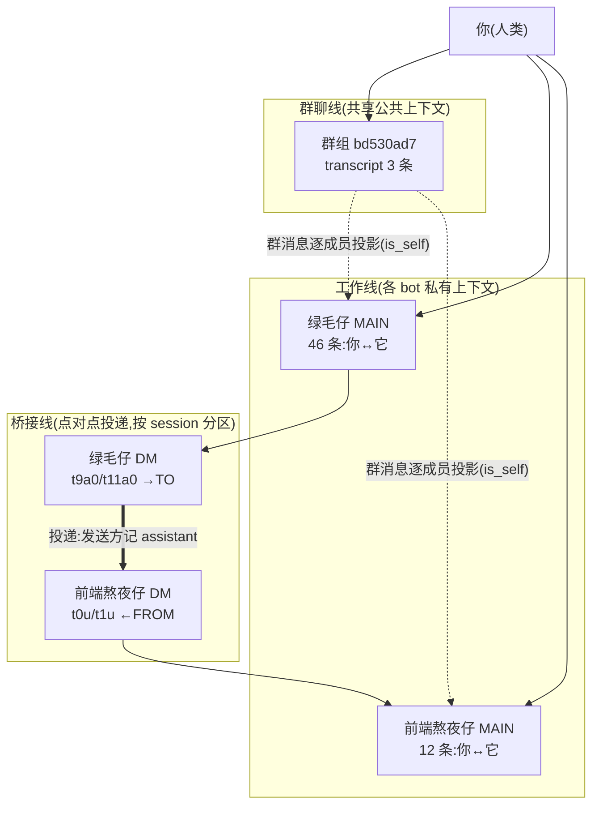

# Grok Bot 上下文模型调研:群聊上下文 ≠ bot 的工作上下文

> 调研对象:本机安装的 Grok Bot(`D:\tools\grok bot`,Electron 应用,内部代号 `sand`)
> 方法:解包 `app.asar` 读实现代码(proto 协议 + 各运行时模块),再用本机真实数据
> (`%APPDATA%\Grok Bot\`)反向印证
> 结论日期:2026-09-10

---

## 0. 一句话结论

**你的判断是对的。群聊上下文是"共享的公共上下文",bot 干活时用的是自己独立的上下文,两者是分开的两份东西,靠显式消息投递桥接。**

而且这个分离比"两套上下文"更彻底:

- **群聊自己没有会话记录。** 群组是一个"agent 实体",它只有一份消息流;**谁在群里说了什么,不会写进说话者自己的工作记录里**。
- **每个 bot 的 `MAIN` 会话才是你的私人对话;和群友的往来另有一条独立的 `DM` 会话线。** 三者在数据里是分区的。
- **跨成员的消息是"投递"过去当成一条 user 消息**,不是共享一份内存。

---

## 1. 数据结构:三条独立的上下文线

协议里 session 的种类是固定的枚举(见 `local-exec-daemon/main.cjs`):

```
GROK_BOT_AGENT_SESSION_KIND_UNSPECIFIED = 0
GROK_BOT_AGENT_SESSION_KIND_MAIN        = 1   // 你单独点开某个 bot 的那个对话
GROK_BOT_AGENT_SESSION_KIND_DM          = 2   // bot ↔ bot 的点对点
GROK_BOT_AGENT_SESSION_KIND_SLACK_DM    = 3
GROK_BOT_AGENT_SESSION_KIND_SLACK_THREAD= 4
```

**枚举里没有 "ROOM" / "GROUP"。** 群聊不是一个工作会话——这一点是整套设计的核心。

每个 agent 的会话列表长这样(`GrokBotAgentDefinition.sessions[]`):

```
GrokBotAgentDefinitionSession
  1  session_id        : string
  2  kind              : string          // MAIN / DM / SLACK_*
  3  created_at_ms     : int64
  4  updated_at_ms     : int64
  5  last_activity_at_ms : int64
  6  box_key           : string          // 落在共享电脑上的哪块目录
```

而 transcript 是**按 session 分区存储、按 session 查询**的:

```
CommitGrokBotTranscriptEntriesRequest
  1  agent_id    : string
  2  generation  : uint32
  3  entries[]   : GrokBotTranscriptEntry
  4  deletes[]   : GrokBotTranscriptEntryDelete
  5  session_id  : string        // ← 写哪个会话

ListGrokBotTranscriptEntriesRequest
  1  agent_id    : string
  2  generation  : uint32
  3  before_seq  : uint64
  4  limit       : uint32
  5  session_id  : string        // ← 读哪个会话
```

**本机实证**:4 份 transcript 副本彼此独立(按 agent uuid 分文件),群组的 transcript 与任何成员的 transcript 都不是同一份:

| 文件 uuid | 是谁 | entries |
|---|---|---|
| `bd530ad7-…` | 群组「拼死拼活组」 | **3** |
| `db2f7e9d-…` | 绿毛仔 | 46 |
| `d4c37f88-…` | 前端熬夜仔 | 12 |
| `1d2a1a9f-…` | Luma Pages | 12 |

存储 key 本身就是 `…transcript.replicas.<uuid>`,是**副本(replica)**语义——本地只是各 agent 各自会话的一份缓存镜像。

---

## 2. 最硬的证据:群聊发言不进入发言者自己的工作记录

绿毛仔的 transcript 一共 46 条,从头到尾是**你单独和它聊的内容**:

```
[t0u]  user       你现在说一下你的云电脑配置
[t3u]  user       你有子代理这种吗？
[t8u]  user       你先创建一个新的，叫做前端熬夜仔…
[t9u]  user       然后我希望你们可以合作作业，如果有前端的任务你可以交给他
[t9a0] assistant  toAgent=前端熬夜仔   「你好。用户希望我们协作…交接约定…」
[t10u] user       fromAgent=前端熬夜仔  「收到。前端页面相关任务按我这边流程来…」
[t14u] user       那你拉一个组，叫拼死拼活组…
[t14s1]           「拼死拼活组」建好了…
```

**注意:绿毛仔去建了「拼死拼活组」,但它在群里说的那两句话——**

> 「拼死拼活组就是咱俩一起扛工程活的。我这边接需求、协调进度；前端页面改版…交给 @前端熬夜仔」

**——在绿毛仔自己的这 46 条记录里根本不存在。**

它只存在于**群组的 transcript**(3 条)里:

```
群组 bd530ad7 transcript:
[t0u]  user   你们好，现在拼死拼活组正式成立了，我们的目的是什么有谁能告诉我？
[t0s0]         (绿毛仔)     拼死拼活组就是咱俩一起扛工程活的…交给 @前端熬夜仔…
[t0s1]         (前端熬夜仔) 对，我这边专扛前端页面：改、照搬、新做都行…
```

**所以群聊和私聊是两条完全平行的线,内容互不写入。** 这直接回答你的问题:bot 工作时**不是**在用群聊的上下文。

---

## 3. 跨 bot 往来:投递 + 按成员投影,而非共享

群聊消息怎么"互通",协议写得很清楚:

```
RequestGrokBotRoomMemberTurnRequest
  1  nonce             : string
  2  room              : GrokBotRoomMemberTurnRoom   // {id, name, description}
  3  member_agent_id   : string                      // 这一轮推给谁
  4  peers[]           : GrokBotRoomMemberTurnPeer   // 同房间其他成员 {id,name,description}
  5  new_messages[]    : GrokBotRoomMemberTurnMessage
```

```
GrokBotRoomMemberTurnMessage
  1  speaker_kind  : enum { UNSPECIFIED | HUMAN | AGENT }
  2  speaker_name  : string
  3  is_self       : bool        // ← 关键
  4  text          : string
  5  reply_to      : ReplyTarget  (optional)
```

两个要点:

1. **推给某个成员的是 `new_messages[]`(增量),不是全量历史。** 群聊 turn 请求里**根本没有该成员自己的工作上下文/记忆的字段**——成员拿到的就只有"房间信息 + 同僚名单 + 新增的群消息"。
2. **`is_self` 说明消息是按成员逐份投影的。** 同一条群消息,对说话者标 `is_self=true`,对别人标 `false`。不是共享一个内存对象,而是给每个人渲染一份自己的视角。

turn 的生命周期(全部来自协议枚举):

```
RequestGrokBotRoomMemberTurn  →  成员作答
DeliverGrokBotRoomMemberTurnResult(outcome, messages[])
   outcome : SENT | PASS | SKIPPED | TIMEOUT | CANCELLED | ERROR
   intake  : ACCEPTED | UNKNOWN_NONCE | HOST_UNAVAILABLE
```

- `PASS` = 成员明确"这轮我不说",防群里全员抢答。
- `HOST_UNAVAILABLE` = turn 要派到"运行该成员的那台 host"上执行,host 不在就失败。

**编排在服务端。** `RequestGrokBotRoomMemberTurn*` / `Deliver*` 在客户端主进程和协调器里都搜不到调用点;协调器里有 `GROK_BOT_TEMPORAL_HARNESS_MODE_OFF|SHADOW|LIVE|BOX`,说明走 **Temporal 持久化工作流**在服务端做调度。客户端只是收投递、跑 turn、交结果。

---

## 4. 那"传送"的是什么:显式搬运,带元数据投毒式标注

跨 bot 的消息在**接收方**的 transcript 里长这样(前端熬夜仔):

```
[t0u]  user        FROM=绿毛仔        你好。用户希望我们协作…交接约定…
[t0a0] assistant   TO=绿毛仔          收到。前端页面相关任务按我这边流程来…
[t1u]  user        FROM=绿毛仔        用户把前端改版交给你主导…【项目】本地路径…【要改的点】1. 2. 3…【附图】三张截图…
[t1a0] assistant   TO=绿毛仔          收到，我先按流程给用户复述视觉方案…
```

而在**发送方**绿毛仔那边,同一句话是:

```
[t9a0] assistant   toAgent=前端熬夜仔   「你好。用户希望我们协作…」
[t11a0] assistant  toAgent=前端熬夜仔   「用户把前端改版交给你主导…」 images=[…]
```

**同一句话:发送方记 `assistant`,接收方记 `user`。** 这是"投递"语义的实锤——它不是把 A 的记忆给 B 看,而是把 A 的输出**作为一条新消息追加进 B 的对话**,于是对 B 就是"别人对我说的话"。

而且 `t11u` 类型是 **`user-attachment`**,`t11a0` 带 `images=[...]`,说明**截图这类附件也被一并打包搬运**——绿毛仔把需求、路径、要改的点、三张截图整体转给了前端熬夜仔。

这印证了 Luma Pages 在自己对话里的自述(它不知道这是被记录的,回答的是你的提问):

> 「分工靠「车道」,不是全员共享一份大脑。…跨边的事我会带着事件名、日期场地、必填字段、是否可公开这些要点去对,**不会把整段闲聊原样扔过去**。」

---

## 5. 记忆/技能/插件:全是 per-agent,不共享

`GrokBotAgentDefinition` 里这些字段**都挂在单个 agent 上**,不是账号级共享:

```
GrokBotAgentDefinition
  4  template_imports[] : …
  5  memory_shards[]    : GrokBotAgentDefinitionMemoryShard {scope, scope_key, version, box_backfilled, folder{profile}}
  6  routines[]         : GrokBotAgentAutomation {automation_id, record_json}
  7  recipe_skills[]    : GrokBotAgentDefinitionSkill {id, description, content}
  8  mcp_settings       : GrokBotUserMcpSettings
  9  mcp_servers[]      : GrokBotAgentDefinitionMcpServer {id, name, type, scope, plugin_id}
```

配套 RPC:`ListGrokBotMemoryShards` / `PutGrokBotMemoryShard`(记忆分片按 agent 存取)。
注:`GrokBotAgentDefinitionMemoryShard.scope` / `scope_key` 这两个字段**决定了记忆能不能跨 agent 读取**——这是本次调研未完全证实的点之一(见 §7)。

---

## 6. 真正共享的是"电脑",不是"大脑"

所有 agent 在共享 box 上按 uuid 分目录:

```
/home/box/sand-data/agents/db2f7e9d-…/store.db   ← 绿毛仔
/home/box/sand-data/agents/d4c37f88-…/store.db   ← 前端熬夜仔
/home/box/sand-data/agents/bd530ad7-…/store.db   ← 拼死拼活组(群组也是"agent")
/home/box/sand-data/agents/1d2a1a9f-…/store.db   ← Luma Pages
```

- 共享:文件系统、桌面、浏览器、登录态(`preload-vnc.cjs` + `IssueGrokBotUserComputerCredential` + `GrokBotSessionBox*` 系列)。
- 不共享:对话、记忆、技能、插件——上面每一项都是 per-agent。
- 附:绿毛仔自述它的 box 是 Debian 13 / 8 核 Xeon / 16G 内存 / 126G 盘——**一台机子,按 agent 分目录,不是每个 bot 一台机**。

另外 `GrokBotAgentDefinition` 同时有 `room_members[]` 和 `member_of_rooms[]`,是**双向**的群组成员关系表——所以 bot 能真去查"我在不在某个组里"。你那条记录里,绿毛仔答「我现在不在任何组里」然后才建组,就是因为这个查询当时为空。

---

## 7. 用一张图总结上下文流向



---

## 8. 回答你的原问题

> "他们工作的时候的上下文是直接用的群聊的上下文嘛?"

**不是。** 三层分开:

| 问题 | 答案 | 依据 |
|---|---|---|
| 群聊上下文 = bot 工作上下文? | **不是,两份独立存储** | 群组 transcript 3 条 vs 绿毛仔 46 条,内容不互写 |
| 群聊里 bot 发言,进它自己的工作记录吗? | **不进** | 绿毛仔在群里那两句话不在它 46 条里 |
| bot 之间怎么互通? | **显式投递一条消息** | `toAgent` 发送方记 assistant / `fromAgent` 接收方记 user,逐字一致 |
| 传的是什么? | **发送方决定内容的窄带摘要 + 附件** | 绿毛仔打包需求/路径/截图;Luma 自述"不扔整段闲聊" |
| 那共享什么? | **只共享电脑(文件/屏幕/登录态)** | 同 box 按 uuid 分目录;记忆/技能/插件全 per-agent |
| 谁在编排? | **服务端 Temporal 工作流** | 客户端无调用点;有 `TEMPORAL_HARNESS_MODE` |

**这是一个刻意的设计取舍**:共享记忆会带来上下文污染、责任不清、成本失控;而"隔离上下文 + 显式窄带搬运 + 人类看见全部",让每条跨 bot 消息都落在接收方 transcript 里、可回溯。**共享的是电脑,不是大脑。**

---

## 9. 尚未完全证实的点(诚实标注)

1. **`is_self` 由谁设置**:协议字段确认存在,但客户端侧只看到 proto 定义,没找到渲染侧读取它的代码——推测由服务端调度时按成员投影设置。
2. **`scope` / `scope_key` 能否跨 agent**:`GrokBotAgentDefinitionMemoryShard` 有这两个字段,理论上留了"某个 scope 下的记忆可被多 agent 引用"的口子,但没验证到实际共享路径。这可能是"唯一可能的共享上下文"入口。
3. **`PASS` 由谁判定**:是模型自己决定不发言,还是 host 侧按规则过滤,未确认。
4. **群聊 turn 的历史窗口**:`new_messages[]` 是增量,但没确认服务端是否还额外注入了"本房间更早历史"或"该成员工作摘要"——从字段上看是没有,但不能 100% 排除服务端隐式拼接。
5. **`DM` session 与 `MAIN` session 的物理落盘差异**:本机 `sand-client-persistence` 只缓存了 4 份 `transcript.replicas.<uuid>`(看起来是每个 agent 一份),没有按 session_id 再拆文件——推测本地缓存做了聚合,真正的分 session 存储在 box 上的 `store.db` 里(本次未能读取 box,因为那是远端云主机)。

---

## 附录:证据索引

| 结论 | 证据位置 |
|---|---|
| session kind 枚举(无 ROOM) | `local-exec-daemon/main.cjs` `GROK_BOT_AGENT_SESSION_KIND_*` |
| transcript 按 session 分区 | `electron-main/proto.cjs` `List/CommitGrokBotTranscriptEntriesRequest.session_id` |
| 群聊 turn 只推增量 | `proto.cjs` `RequestGrokBotRoomMemberTurnRequest` 字段 1-5 |
| is_self / speaker_kind | `proto.cjs` `GrokBotRoomMemberTurnMessage` + `SpeakerKind` 枚举 |
| turn 结果枚举 | `proto.cjs` `GrokBotRoomMemberTurnOutcome` / `ResultIntake` |
| Temporal 编排 | `node-agent-coordinator/main.cjs` `GROK_BOT_TEMPORAL_HARNESS_MODE_*` |
| 群组 transcript 仅 3 条 | 本机 `transcript.replicas.bd530ad7-…` |
| 绿毛仔工作记录 46 条、无群聊发言 | 本机 `transcript.replicas.db2f7e9d-…` |
| 跨 bot 投递 from/toAgent | 本机 `transcript.replicas.d4c37f88-…` 的 `t0u/t0a0/t1u/t1a0` |
| 记忆/技能 per-agent | `proto.cjs` `GrokBotAgentDefinition` 字段 5/7/9 |

> 解包产物体积约 37MB,位于 `.tmp-grok-bot/`,纯临时文件,可随时删除。
