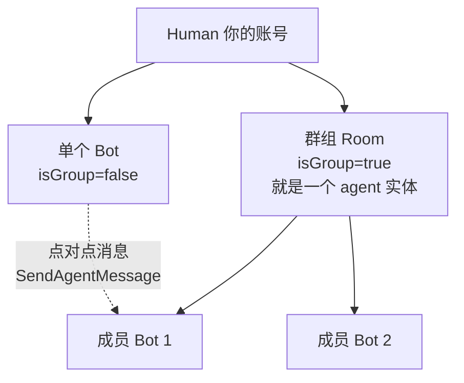
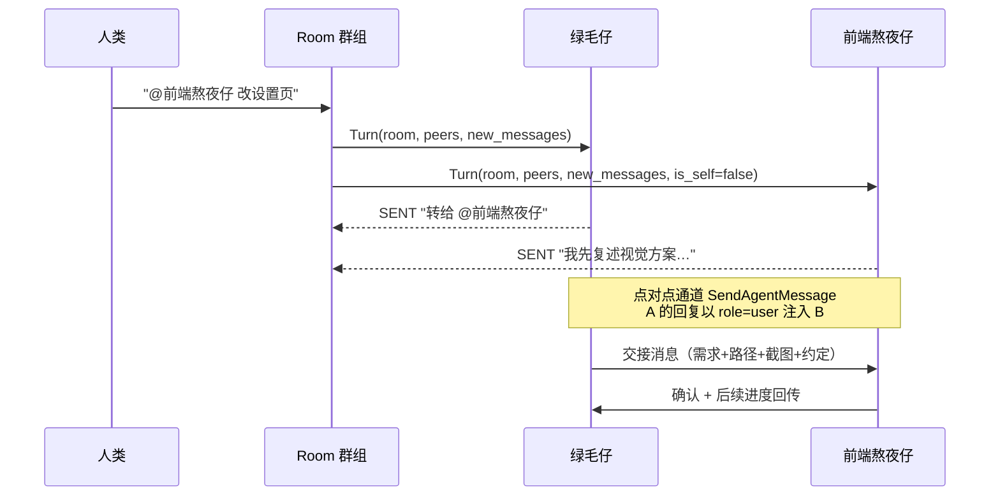
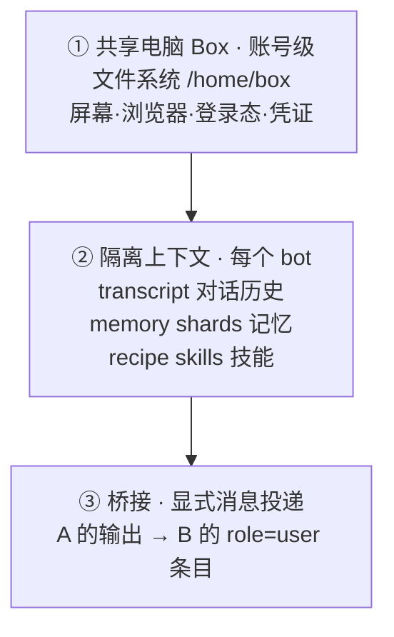

# Grok Bot 群聊、消息互通与上下文共享机制调研

> 调研方式：**逆向本机安装的桌面客户端 + 读取本地真实账户数据**，非文档推测。
> 调研对象：`D:\tools\grok bot\Grok Bot.exe`（内部产品名 `sand`，版本 `0.47.0`，作者 `SpaceXAI`，主页 `cursor.com`）
> 调研日期：2026-09-10
> 证据等级：`【代码】` = 从二进制/打包产物中提取；`【数据】` = 从本机账户持久化数据中读取；`【推断】` = 基于前两者的合理推论

---

## 0. 调研方法（可复现）

| 步骤 | 操作 |
|---|---|
| 1 | 解析桌面快捷方式 → 定位安装目录 `D:\tools\grok bot` |
| 2 | 确认是 Electron 应用，主逻辑在 `resources/app.asar`（34 MB） |
| 3 | `npx @electron/asar extract app.asar` 解包，得到完整 JS 源码（仅压缩，未加密） |
| 4 | 从 `dist/electron-main/proto.cjs` 提取 **5677 个 protobuf 消息类型**与全部 RPC 方法名 |
| 5 | 从 `%APPDATA%\Grok Bot\sand-client-persistence\` 解码本地持久化数据（文件名用 **base32** 编码 key） |
| 6 | 用**本机真实账户的群聊记录**反向印证代码结论 |

关键文件：
- `dist/electron-main/proto.cjs`（3.8 MB，全量 API 协议定义）
- `dist/node-agent-coordinator/main.cjs`（623 KB，**agent 协调器**，独立进程）
- `dist/renderer/assets/index-BhQ89Enc.js`（3.5 MB，前端主包）
- `dist/electron-preload/preload-vnc.cjs`（VNC 预加载，印证共享云桌面）
- `%APPDATA%\Grok Bot\sand-client-persistence\*.blob`（本地状态）

---

## 1. 一句话结论

**Grok Bot 的"群聊"不是给多个 bot 开一个聊天室，而是把"群"本身变成了一个一等 agent 实体。**

它复用一套 agent 抽象：`agent` 表里既有 `isGroup:false` 的单个 bot，也有 `isGroup:true` 的群组。群组有自己的 `id`、自己的 transcript、自己的 `memberIds`。人类往群里发一条消息，服务端**逐成员派发"轮次"（turn）**，成员各自在自己的上下文里作答，可以选择**发言（SENT）**或**不发言（PASS）**，结果再汇总回群里。

**上下文不是共享的**。共享的是**电脑**（文件、屏幕、登录态），不是**大脑**（对话历史、记忆）。每个 bot 有独立的 transcript；bot 之间靠**把对方的回复作为一条 `role=user` 消息注入自己的对话**来实现"互通"。这是整套设计的核心取舍。

---

## 2. 总体架构：三种协作实体

**【代码】** 创建群组的 API 参数直接暴露了模型（`chunk-*.js` / `proto.cjs`）：

```js
createGroup: h().args({
  name, description,
  memberAgentIds: string[],
  creationRoute: { kind: "box" } | { kind: "temporal", scope }
})
```



三种协作形态，对应三套不同机制：

| 形态 | 实现 | 说明 |
|---|---|---|
| **单 bot 对话** | 一个 agent 一个 transcript | 最基础 |
| **bot 点对点** | `SendGrokBotAgentMessage(from_agent_id → to_agent_id)` | 独立通道，不走群聊 |
| **群聊 Room** | Room 是 agent，成员是它的 `memberAgentIds` | 走**轮次编排**，非共享消息表 |

**【代码】两种 harness（运行底座）**：`creationRoute.kind` 只有 `box` 和 `temporal` 两种。`temporal` 是 Temporal 持久化工作流（服务端编排），`box` 是本地/共享电脑执行。这解释了为什么 bot 的响应能跨会话、跨重启持续。

---

## 3. 群聊机制（Room）

### 3.1 数据模型

**【数据】** 你本机 `roster.last-roster` 里的真实群组记录：

```json
{
  "id": "bd530ad7-ef2c-4ce2-ab77-4f5ab45b7d06",
  "name": "拼死拼活组",
  "isGroup": true,
  "memberIds": [
    "db2f7e9d-8b17-493e-9c6f-907055ac7c41",  // 绿毛仔
    "d4c37f88-ec66-4cd4-b925-1db2e0b10f26"   // 前端熬夜仔
  ],
  "path": "/home/box/sand-data/agents/bd530ad7-.../store.db",
  "lastEntry": { "kind": "text", "text": "对，我这边专扛前端页面…", "authorId": "d4c37f88-…" }
}
```

**群组和单个 bot 在同一个 `rows` 数组里，结构完全一致**，唯一区别是 `isGroup` 和 `memberIds`。群组也有 `path`、`lastEntry`、`unreadCount`、`awaitingUserResponse` —— 它就是一个"能聚合多个 bot 的 agent"。

**【代码】** 群组关系是**双向**的（`GrokBotAgentDefinition`）：

```
room_members[]    → 我作为群主，我的成员有谁
member_of_rooms[] → 我作为成员，我加入了哪些群
```

这让你账号里任何 bot 都能回答"我在哪些组里"—— 你的绿毛仔被问到时**真的去查了**并回答"我现在不在任何组里"（`t13s1`），随后建组（`t14s1`）。

### 3.2 成员管理

| RPC | 作用 |
|---|---|
| `CreateGrokBotRoom(agent_id, name, description, member_agent_ids[])` | 建群 |
| `SetGrokBotRoomMembers(agent_id, member_agent_ids[])` | 增删成员 |

**【代码】** UI 侧有硬约束：**移成员时若 `memberIds.length <= 1` 直接拒绝**（群不能只剩 0 个成员）。

### 3.3 @ 提及：UI 层完整实现

**【代码】** 前端用的是 **TipTap + `@tiptap/extension-mention`**，`package.json` 里明确依赖。实现细节：

```
mention 字符: "@"                     （默认 char）
候选来源: getMentionMembers           → t.memberIds.flatMap(...)   ← 就是群成员
"@所有人": isEveryone / keyword ["everyone","all"]
降级行为: 非群聊时 getMentionMembers → getNoMentionMembers
         （非群聊里 @ 的是技能、工具、MCP、PR，不是 agent）
```

关键代码片段（`index-BhQ89Enc.js`）：

```js
// 候选成员 = 当前群组 agent 的 memberIds 逐个展开
function uwt(t, e, n, s) {
  return t == null ? [] : e
    ? t.memberIds.flatMap(r => { const a = s.get(r); return a != null ? [a] : [] })
    : n.filter(r => r.id === t.id ? false : r.isGroup ? r.memberIds.includes(t.id) : true)
}
```

`@` 插入的是带 `{ id: agentId, label: agentName }` 的 mention 节点，渲染用 `sand-mention` 样式类，有独立的 `sand-mention-menu` 下拉框。

**"@所有人"** 用 `people-3` 图标，单个 bot 用 `person` 图标。

### 3.4 @ 到底是不是路由？

这是你的核心问题，必须精确回答：

- **【UI/语义层：已证实】** `@` 把消息**寻址**到具体 agent（mention 节点带 agent id），并把消息标记为"对某成员说"。
- **【行为实证：已证实】** 你的群聊记录里，绿毛仔发言 **`@前端熬夜仔`** 后，**被 @ 的前端熬夜仔紧接着就发言了**：

  ```
  t0s0 绿毛仔:  "…前端页面改版、照搬、新做交给 @前端熬夜仔，它先复述视觉、你点头再动手。"
  t0s1 前端熬夜仔: "对，我这边专扛前端页面：改、照搬、新做都行。…"   ← 被 @ 者接话
  ```

  注意这里 @ 是 **bot 自己发起的**——bot 之间用 `@` 指认接手人。

- **【服务端编排层：证据不足】** `RequestGrokBotRoomMemberTurnRequest` 由服务端下发 `member_agent_id`，本地协议里**没有看到"解析 @ 文本 → 决定派发给谁"**的逻辑。@ 的解析更可能发生在服务端（agent 侧把自己的判断作为 turn 结果上报）。

**结论**：`@` 是**寻址与协作信号**（谁该接这个活），并确实驱动了"被 @ 者发言"的行为；但把 @ 当作客户端硬路由规则是**不准确**的——派发权在服务端的轮次编排。

### 3.5 成员的四种触发规则

**【代码】** 协调器里存在一套**触发配置** schema（`node-agent-coordinator/main.cjs:40`）：

```js
k({ kind: "mention" })                              // 被 @ 时触发
k({ kind: "keyword", keyword: string })             // 命中关键词时触发
k({ kind: "message" })                              // 任意消息都触发
k({ kind: "reaction", emoji: string })              // 被表情回应时触发
```

同时有开关 `harnessMayCollect`。**这直接证实了：@ 是一种正式的触发规则，但只是四种之一。** 这解释了为什么群聊里 bot 不会全部抢答——每个成员可以配不同的触发条件。

---

## 4. 消息互通机制

### 4.1 协议全貌（核心）

**【代码】** 群聊走一套**轮次（Turn）编排协议**，而不是共享消息表：

```
① 服务端 → 成员：   RequestGrokBotRoomMemberTurnRequest
                     nonce                 幂等令牌
                     room {id,name,description}
                     member_agent_id       派给谁
                     peers[]               其他成员（id/name/description）
                     new_messages[]        新增消息（见下）
                     is_winding_down       是否收尾
                     deadline_ms           截止时间
                     parent_request_id     链路追踪
                     root_parent_request_id

② 成员 → 服务端：   DeliverGrokBotRoomMemberTurnResultRequest
                     room_id, nonce, member_agent_id
                     outcome               结果枚举
                     messages[]            产出的消息
                     error

③ 服务端回执：      TurnResultIntake = ACCEPTED | UNKNOWN_NONCE | HOST_UNAVAILABLE
```

**投递的消息长这样**（`GrokBotRoomMemberTurnMessage`）：

```
speaker_kind : HUMAN=1 | AGENT=2     区分人还是 bot
speaker_name : string                发言者名字
is_self      : bool                  ★ 这条是不是"我自己"说的
text         : string
reply_to     : ReplyTarget           引用回复
```

**`is_self` 是理解整套设计的钥匙**：同一条群聊消息，发给不同成员时 `is_self` 不同。绿毛仔看到的 `is_self=true` 的消息，前端熬夜仔看到的是 `is_self=false`。**消息是逐成员投影的，不存在一份共享的消息对象。**

**成员可以不发言**（`TurnOutcome` 枚举）：

```
SENT=1 | PASS=2 | SKIPPED=3 | TIMEOUT=4 | CANCELLED=5 | ERROR=6
```

`PASS` 是正式的"本轮我不说话"—— 这是防止多个 bot 在群里抢话的关键机制。

**成员不需要每次真跑一遍**（`TurnDispatch`）：`ACCEPTED | DUPLICATE | TARGET_NOT_FOUND | TEMPORAL_UNAVAILABLE | ...`，配合 `nonce` 做幂等去重。

### 4.2 Bot 间点对点通道

**【代码】** 群聊之外还有独立的一对一通道：

```
SendGrokBotAgentMessageRequest
    from_agent_id → to_agent_id
    message_id, text, sent_at_ms
Response: delivery, target_agent_id, target_name, workflow_id
```

**这是 bot 之间直接发消息的真正实现。** 你的账号里有完整实例。

### 4.3 真实时序（来自你的账户数据）

这是最有价值的实证。以下全部是 `%APPDATA%\Grok Bot\sand-client-persistence` 里的真实记录。

**场景 A：你让绿毛仔把前端活转交出去**

```
[绿毛仔的 transcript]  d4c37f88 / db2f7e9d
  t9u  role=user       "然后我希望你们可以合作作业，如果有前端的任务你可以交给他"
  t9s0 send-message    "记下了：前端相关我会转给「前端熬夜仔」。我先跟它对一下交接方式。"
  t9a0 role=assistant  "你好。用户希望我们协作：凡是前端页面相关任务…绿毛仔会转交给你主导。
                        交接约定：1. 我会把需求、仓库/路径、参考图或链接、约束一并转给你…"
  t10u role=user       "收到。前端页面相关任务按我这边流程来：先澄清 → 复述视觉目标 → 用户同意后再改。你转需求过来就行。"
```

```
[前端熬夜仔的 transcript] bd530ad7 / d4c37f88
  t0u  role=user       "你好。用户希望我们协作：凡是前端页面相关任务…绿毛仔会转交给你主导。
                        交接约定：1. 我会把需求、仓库/路径、参考图或链接、约束一并转给你…"
  t0a0 role=assistant  "收到。前端页面相关任务按我这边流程来：先澄清 → 复述视觉目标 → 用户同意后再改。"
```

**同一条消息（逐字一致）：**
- 在**发送方**绿毛仔的记录里是 `role=assistant`（我自己说的话）
- 在**接收方**前端熬夜仔的记录里是 `role=user`（别人对我说的话）
- 前端熬夜仔的回复反向注入绿毛仔，同样变成 `role=user`（`t10u`）

**场景 B：任务转交后各自与人类对齐**

```
[绿毛仔]
  t11u role=user       "现在我有个前端的页面改写，D:\projects\MYSELF\SYNC-THINK…你设计一下"
  t11a0 role=assistant "用户把前端改版交给你主导。按你的流程：先澄清/复述视觉目标，等用户同意后再改代码。
                        【项目】本地路径：D:\projects\MYSELF\SYNC-THINK（用户本机 CHINAMI-RSDC6IH 已连接）…
                        【要改的点】1. 「从服务商拉取模型列表」和「测试连接」…
                        【协作要求】…完成后把方案要点和结果同步回我，方便我在这边跟进。"
  t11s1 send-message   "需求和图已经丢给「前端熬夜仔」了。接下来去它那边看视觉方案复述…
                        有进度我也会在这边同步。"
```

**绿毛仔真的把项目路径、要改的点、截图、协作要求打包转交了**——这就是它自己描述的"我不会把整段闲聊原样扔过去，只带要点"。而且它提示你"去它那边看方案"：**转交后由前端熬夜仔与人类直接对话，绿毛仔只做进度同步**。

### 4.4 完整消息流图



---

## 5. 上下文共享机制（关键：不共享大脑，只共享电脑）

### 5.1 三层模型



**只有第 ① 层是真共享，第 ② 层是真隔离，第 ③ 层是显式、可控的搬运。**

### 5.2 共享层：同一个盒子

**【代码】**
- `GrokBotSessionBox` / `AdminListGrokBotSessionBoxes` / `IssueGrokBotUserComputerCredential` / `OpenGrokBotUserComputerRequest`
- 预加载脚本 `preload-vnc.cjs`（共享云桌面）
- RPC 里有 `ReportGrokBotClientPresence`、`ListGrokBotUserComputers`

**【数据】** 你的账号证实：绿毛仔自述的云电脑是 **Debian 13 (trixie)、8 核 Xeon、16 GB 内存、126 GB 磁盘、1280×800 桌面**——**一台持久化的 Linux 云主机**。所有 bot 共用它。

**【数据】路径证据**：roster 里每个 agent 的 `path` 都是
```
/home/box/sand-data/agents/<uuid>/store.db
```
同一个 `/home/box` 根下，按 agent uuid 分目录。**文件系统共享、存储分目录**——物理上就在同一台机器。

**这就是"协作零摩擦"的真正底座**：bot 不需要同步文件、不需要传凭证，因为大家本来就在同一台机器上，用同一份登录态。代价是 bot 之间**没有安全边界**（这一点在上一份文档调研官方文档时也得到印证）。

### 5.3 隔离层：每个 bot 自己的上下文

**【代码】** `GrokBotAgentDefinition` 里这些字段**全部是 per-agent 的**：

```
memory_shards[]    记忆分片（PutGrokBotMemoryShard / agent_id）
recipe_skills[]    技能（id / description / content）
routines[]         例行任务
mcp_servers[]      MCP 配置
sessions[]         会话
```

**【数据】** transcript 按 agent 分文件存储，key 为：
```
sand.client.slice.account.google-oauth2|user_01M09YMBRJX2XZFDBW1983GX9Z.transcript.replicas.<agentUuid>
```

你账号里有 **4 个独立的 transcript 副本**，对应 4 个实体（3 个 bot + 1 个群组）。**每个实体各自一份完整对话历史，互不可见。**

**【数据】插件与技能不共享**：绿毛仔的记录里，Gmail 插件报 `[Gmail](grokbot://app/v1/plugin/add?id=45893410) 已经装好了`，这是**绿毛仔自己的插件**。`GrokBotPluginScope { agent_id, session_kind }` 也说明插件是**按 agent 作用域**的。技能有 `publishSkill({agentId, workflowId, teamId})` 和"发布到团队"的路径（需要 Cursor team），即**默认私有、可显式发布共享**。

### 5.4 桥接层：消息注入

**这是"上下文共享"的真正答案：不共享，而是显式搬运。**

机制（【数据】实证 +【代码】协议）：

1. Bot A 通过 `SendGrokBotAgentMessage`（或群聊 turn 产出）发出消息
2. 服务端/协调器把这条消息**作为一条新的对话条目，追加进 Bot B 的 transcript**
3. 该条目在 B 的视角里是 **`role=user`**（"别人对我说的话"）
4. B 正常走自己的推理，产出回复
5. B 的回复再被追加回 A 的 transcript，同样以 `role=user` 出现

**【数据】最硬的证据**：绿毛仔 transcript 的 `t10u`（`role=user`）与前端熬夜仔 transcript 的 `t0a0`（`role=assistant`）是**同一段话的收发两面**，逐字一致。

**这带来三个直接后果：**

| 后果 | 说明 |
|---|---|
| **收发不对称** | 同一句话，发送方记为 `assistant`，接收方记为 `user` |
| **信息损失可控** | 发什么由发送方决定（绿毛仔只打包"要点"，没扔整段闲聊） |
| **人类在环** | 群聊里人类的消息对所有成员都是 `role=user`，人类天然是信息中枢 |

### 5.5 群聊如何突破隔离

群组 agent 是一个**投影/编排层**：

```
Room 的 transcript 里：人类消息 + 各成员发言的汇总
成员的 transcript 里：人类消息 + 其他成员的发言（is_self=false）
```

**【数据】** 你群组 `bd530ad7` 的 transcript 只有 3 条——人类提问 + 两个成员的回复。而每个成员的 transcript 里，对方的话也都在（`is_self=false`）。**群聊通过"把同一批消息按 is_self 投影给每个成员"实现了共享对话的观感，但底层仍是各自独立的上下文。**

**这就是为什么 bot 能回答"我在哪个组"、"谁负责什么"**——它知道 `peers[]`（其他成员的名字+职责描述）。

### 5.6 上下文隔离的正反两面

**【数据】** 前端熬夜仔被问"你不是一个团队嘛？"时回答：

> 「我就是一个 bot：Luma Pages，专管 Luma 活动页。旁边通常还会有一个 Notion 文档 bot，咱俩配对——简报在 Notion，页面在 Luma，**我这边不负责整支营销团队**。」

Luma Pages 被问"怎么知道什么该传给谁"时回答（**这是最有洞察力的一段**）：

> 「**分工靠「车道」，不是全员共享一份大脑。**…什么该传给谁，看任务落在哪条线：改页面/报名表 → 我做；改文档结构、会议纪要、任务板 → Notion bot。**跨边的事我会带着事件名、日期场地、必填字段、是否可公开这些要点去对，不会把整段闲聊原样扔过去。**」

**这完全对应了代码层的 `SendAgentMessage(from → to, text)` 语义**：显式、窄带、由发送方决定内容的搬运。**bot 自己清楚上下文是隔离的，所以主动做信息压缩。**

---

## 6. 两个 harness 与 Turn 的执行位置

**【代码】** `TurnResultIntake = ACCEPTED | UNKNOWN_NONCE | HOST_UNAVAILABLE`

`HOST_UNAVAILABLE` 揭示了关键一环：**turn 要派发到"运行该成员的 host"上执行**。结合 `TurnDispatch = TARGET_NOT_FOUND | TEMPORAL_UNAVAILABLE`：

- **编排在服务端**（Temporal 持久化工作流）
- **执行在 host/box**（共享电脑或用户本机）
- **状态通过 `nonce` + `parent_request_id` 保证幂等与可追踪**

**【代码】** 本地 `node-agent-coordinator/main.cjs` 是一个**独立进程**，内含完整的 Room/Turn 协议实现。它的角色是：在用户侧维护 agent 运行时状态，与服务端编排对接。

**【代码】** 本地还有 `local-exec-daemon/main.cjs`（3.5 MB）和 `local-exec-daemon` 对 `/home/box/sand-data` 的引用——**用户本机也能作为执行 host**。这解释了你的数据里出现的 `用户本机 CHINAMI-RSDC6IH 已连接` 和"每次会走你这边的本地授权"。

---

## 7. 关键设计取舍（可迁移的洞察）

### 7.1 用"群组即 agent"复用抽象
不新增"聊天室"概念，而是让群组继承 agent 的一切（id、transcript、unread、路径）。代价是群组也需要 `store.db` 和 transcript；收益是 UI、路由、持久化、通知全部零改动复用。

### 7.2 隔离上下文 + 显式搬运，而非共享记忆
**这是与"多智能体共享黑板"完全相反的选择。** 共享记忆看似强大，实际会导致：上下文污染、责任不清、成本不可控、难以调试。Grok Bot 选择让每个 bot 只看自己的历史，跨 bot 交流必须**显式、窄带、可审计**地投递一条消息——这条消息会出现在接收方的 transcript 里，人类可回溯。

### 7.3 共享电脑是协作的底座，但也是最大的安全取舍
文件、屏幕、登录态全共享 → bot 之间协作零摩擦；代价是 **bot 之间无安全边界**，且 bot 永远不超过所属人的权限（官方文档亦如此表述）。这是一个明确用安全换效率的决策。

### 7.4 `PASS` 与四种触发规则：让群聊不吵
成员可以在轮次里 `PASS`，且触发规则可配 `mention / keyword / message / reaction`。这两者结合，避免了"多 agent 群里全员抢答"这一常见失败模式。

### 7.5 人类是天然的信息中枢
群聊里人类消息对所有成员都是 `role=user`；成员之间则要显式投递。**结果：人类看得见一切，bot 只看得见自己该看的。** 这比"让 agent 互相发消息自组织"更容易监督和调试——与上一轮官方文档调研中"卡住就 Blocked + ping 人类"的结论一致。

---

## 8. 证据索引

| 结论 | 证据位置 |
|---|---|
| 产品名 sand / spacexai / cursor 技术栈 | `app/package.json` |
| Room 是 agent（`isGroup` / `memberIds`） | `index-BhQ89Enc.js:34,41,74,87`；本地 `roster.last-roster` |
| `memberIds.flatMap` 生成 @ 候选 | `index-BhQ89Enc.js:74`（`uwt` 函数） |
| @ 字符与「@所有人」 | `chunk-prompt-editor-*.js:106,142`；`index-BhQ89Enc.js:70` |
| 四种触发规则 | `node-agent-coordinator/main.cjs:40` |
| Turn 协议三件套 | `proto.cjs:39`（`os`/`as`/`is`/`ls`/`ds`） |
| `SpeakerKind = HUMAN \| AGENT` | `proto.cjs:39` |
| TurnOutcome 含 `PASS` | `proto.cjs:39` |
| `TurnResultIntake` 含 `HOST_UNAVAILABLE` | `proto.cjs:39` |
| `SendGrokBotAgentMessage(from → to)` | `proto.cjs` RPC 表 |
| 双向群组关系 `room_members` / `member_of_rooms` | `proto.cjs:39`（`GrokBotAgentDefinition`） |
| memory_shards / recipe_skills 为 per-agent | `proto.cjs`（`GrokBotAgentDefinition`） |
| `/home/box/sand-data/agents/<uuid>/store.db` | 本地 roster 各 row 的 `path` |
| 消息收发不对称（assistant ↔ user 逐字一致） | 本地 transcript `db2f7e9d` 的 `t9a0`/`t10u` 与 `d4c37f88` 的 `t0u`/`t0a0` |
| 云电脑配置（Debian 13 / 8 核 / 16 GB） | 本地 transcript `db2f7e9d` 的 `t0s1` |
| "车道而非共享大脑"的设计哲学 | 本地 transcript `1d2a1a9f` 的 `t3s0` |

---

## 9. 未完全确认的点（诚实标注）

1. **`@` 的服务端解析**：客户端看不到"解析 @ 文本决定派发对象"的逻辑。@ 在客户端确定为**寻址信息 + 触发规则**，但派发决策在服务端，本地无法证实其硬规则。
2. **`PASS` 的判定方**：不确定是成员 agent 自己决定 PASS，还是服务端根据触发规则预先过滤。从 `TurnOutcome` 由成员上报来看，更可能是**成员自主决定**。
3. **群组 transcript 与成员 transcript 的同步细节**：只看到结果形态（双方都有对方的发言，`is_self` 相反），未见同步实现代码（在服务端）。
4. **记忆的 `scope`/`scope_key` 语义**：`GrokBotAgentDefinitionMemoryShard` 有 `scope`、`scope_key`、`box_backfilled` 字段，推测支持 agent 级 / 团队级记忆，但枚举值未提取到。

---

*本报告基于对 `<workspace>/.tmp-grok-bot/` 解包产物与 `%APPDATA%\Grok Bot\sand-client-persistence\` 本地数据的只读分析。解包目录为临时产物，可安全删除。*
